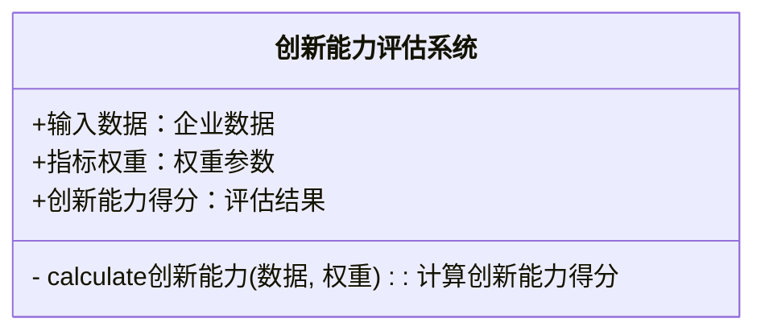

                 


# 巴菲特的创新能力评估：如何在快速变化的市场中保持领先

## 关键词：创新能力评估, 巴菲特, 投资策略, 创新评估, 市场变化

## 摘要：  
本文探讨了巴菲特的创新能力评估方法，分析了如何在快速变化的市场中保持领先。通过介绍创新评估的核心概念、算法原理、系统架构及实战案例，本文为投资者和企业管理者提供了实用的策略和工具，帮助他们在瞬息万变的市场中捕捉机会，提升创新能力，实现持续增长。

---

## 第一部分: 创新能力评估的背景与重要性

### 第1章: 创新能力评估的重要性

#### 1.1 创新能力评估的背景与意义

##### 1.1.1 创新能力评估的背景
在当前全球经济环境下，市场变化速度前所未有。企业若想在竞争中立于不败之地，创新能力是关键。创新能力评估不仅是企业决策的重要依据，也是投资者评估企业潜力的核心指标。  

##### 1.1.2 创新能力评估的重要性
创新是企业发展的核心驱动力。创新能力评估能够帮助企业识别自身的优势与不足，优化资源配置，提升竞争力。对于投资者而言，创新能力评估是发现高潜力投资标的的重要工具。  

##### 1.1.3 创新能力评估的边界与外延
创新能力评估的边界包括企业的技术、产品、管理等多个方面。外延则延伸至企业文化的塑造、市场适应能力的提升等。  

#### 1.2 巴菲特的创新理念与投资策略

##### 1.2.1 巴菲特的投资哲学
巴菲特的投资哲学强调长期价值，注重企业的内在价值和竞争优势。他认为，企业创新能力是决定其长期价值的关键因素之一。  

##### 1.2.2 巴菲特的创新评估标准
巴菲特的创新评估标准包括企业的技术领先性、产品差异化能力、管理团队的创新能力等。  

##### 1.2.3 巴菲特创新理念的核心要素
- 技术创新：企业是否拥有核心技术优势。  
- 产品创新：产品是否具有差异化竞争力。  
- 管理创新：管理团队是否具备创新能力。  

---

### 第2章: 创新与投资的关系

#### 2.1 创新在投资中的作用

##### 2.1.1 创新对投资回报的影响
创新能力强的企业往往能够在市场中占据领先地位，从而为投资者带来超额回报。  

##### 2.1.2 创新能力与企业竞争优势
创新能力是企业在市场竞争中保持优势的核心因素。  

##### 2.1.3 创新驱动的市场机会
创新能够为企业创造新的市场机会，进而为投资者带来新的投资机会。  

#### 2.2 快速变化市场中的投资策略

##### 2.2.1 市场变化对企业创新的影响
市场变化迫使企业不断创新，以适应新的市场需求和技术趋势。  

##### 2.2.2 投资者如何识别创新机会
投资者需要关注企业的创新能力、技术研发投入、产品迭代速度等指标，以识别创新机会。  

##### 2.2.3 创新能力评估的市场应用场景
创新能力评估在企业估值、投资决策、风险管理等方面具有广泛的应用。  

---

## 第二部分: 创新能力评估的核心概念

### 第3章: 创新能力评估的核心概念

#### 3.1 创新能力评估的定义与特点

##### 3.1.1 创新能力评估的定义
创新能力评估是对企业在技术创新、产品创新、管理创新等方面的能力进行系统性评估的过程。  

##### 3.1.2 创新能力评估的核心特点
- 综合性：涵盖技术、产品、管理等多个方面。  
- 动态性：根据市场变化实时更新评估结果。  
- 可量化：通过量化指标衡量创新能力的强弱。  

#### 3.2 创新能力评估的框架与模型

##### 3.2.1 创新能力评估的主要框架
- 技术创新评估：包括研发投入、技术专利数量等。  
- 产品创新评估：包括产品生命周期、市场反馈等。  
- 管理创新评估：包括组织架构、管理团队能力等。  

##### 3.2.2 创新能力评估的数学模型
$$ 创新能力 = \alpha \cdot 技术创新 + \beta \cdot 产品创新 + \gamma \cdot 管理创新 $$  

##### 3.2.3 创新能力评估的指标体系
| 指标类别 | 指标名称 | 指标描述 |
|----------|----------|----------|
| 技术创新 | 技术研发投入占比 | 研发投入占总收入的比例 |
| 产品创新 | 产品生命周期 | 产品的市场寿命 |
| 管理创新 | 管理团队创新能力 | 管理团队的创新能力评分 |

#### 3.3 创新能力评估的流程

##### 3.3.1 创新能力评估的步骤
1. 收集企业相关数据。  
2. 确定评估指标。  
3. 计算各项指标的权重。  
4. 综合评估结果。  

---

## 第三部分: 创新能力评估的算法原理

### 第4章: 创新能力评估算法的实现

#### 4.1 创新能力评估算法概述

##### 4.1.1 算法的基本原理
创新能力评估算法通过量化指标，计算企业创新能力的综合得分。  

##### 4.1.2 算法的核心步骤
1. 数据收集与预处理。  
2. 指标权重分配。  
3. 综合计算创新能力得分。  

#### 4.2 创新能力评估算法的数学模型

##### 4.2.1 创新能力评估的数学公式
$$ 创新能力得分 = \sum_{i=1}^{n} w_i \cdot x_i $$  
其中，$w_i$ 为第 $i$ 个指标的权重，$x_i$ 为第 $i$ 个指标的得分。  

#### 4.3 创新能力评估算法的实现

##### 4.3.1 创新能力评估算法的Python实现

```python
def calculate创新能力_score(factors, weights):
    return sum(w * f for w, f in zip(weights, factors))

# 示例数据
factors = [0.8, 0.6, 0.7]
weights = [0.4, 0.3, 0.3]

score = calculate创新能力_score(factors, weights)
print("创新能力得分：", score)
```

---

## 第四部分: 系统分析与架构设计方案

### 第5章: 系统分析与架构设计

#### 5.1 系统功能设计

##### 5.1.1 领域模型Mermaid类图



#### 5.2 系统架构设计

##### 5.2.1 系统架构Mermaid图


---

## 第五部分: 项目实战

### 第6章: 项目实战

#### 6.1 环境安装

##### 6.1.1 环境要求
- Python 3.8 或更高版本。  
- 安装必要的库，如`pandas`、`numpy`。  

#### 6.2 系统核心实现源代码

##### 6.2.1 创新能力评估核心代码

```python
import pandas as pd
import numpy as np

def calculate创新能力_score(factors, weights):
    return np.dot(factors, weights)

# 示例数据
factors = pd.Series([0.8, 0.6, 0.7], index=['技术创新', '产品创新', '管理创新'])
weights = pd.Series([0.4, 0.3, 0.3], index=['技术创新', '产品创新', '管理创新'])

score = calculate创新能力_score(factors, weights)
print("创新能力得分：", score)
```

---

## 第六部分: 最佳实践与总结

### 第7章: 最佳实践与总结

#### 7.1 最佳实践

##### 7.1.1 创新能力评估的关键点
- 数据的准确性和完整性。  
- 指标的合理性和可量化性。  
- 权重的科学性。  

#### 7.1.2 注意事项
- 定期更新评估指标和权重。  
- 结合市场变化动态调整评估策略。  

#### 7.1.3 拓展阅读
- 巴菲特投资策略的相关书籍。  
- 创新能力评估的最新研究文献。  

---

## 作者：AI天才研究院 & 禅与计算机程序设计艺术

---

希望这篇文章能够帮助读者理解巴菲特的创新能力评估方法，并在快速变化的市场中保持领先地位。

