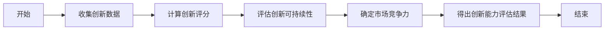
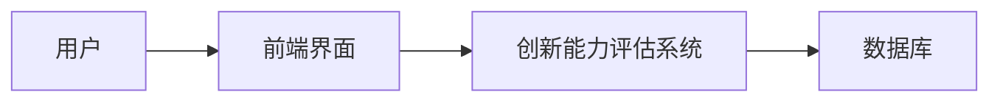

                 


# 巴菲特的创新能力评估：如何识别真正有前景的创新

> 关键词：创新能力评估，巴菲特投资理念，创新价值识别，创新评估模型，创新可持续性，创新风险控制

> 摘要：本文从巴菲特的价值投资理念出发，结合创新能力评估的核心要素，系统地分析了如何将创新能力转化为投资价值。通过构建创新能力评估模型，提出了创新价值识别的系统化方法，帮助投资者和企业识别真正具有长期竞争优势和可持续创新能力的企业。

---

# 第一部分: 巴菲特创新能力评估的背景与核心概念

## 第1章: 创新能力评估的背景与意义

### 1.1 创新评估的背景与问题背景

#### 1.1.1 传统投资评估的局限性
传统投资评估主要依赖于财务指标（如市盈率、ROE等），但这些指标无法完全反映企业的创新能力。创新是企业长期竞争优势的核心来源，而传统评估方法往往忽视了这一点。

#### 1.1.2 创新在商业中的重要性
创新是推动企业增长的核心动力。无论是技术创新、商业模式创新还是管理创新，都可能带来企业的跨越式发展。创新能力是企业在竞争中胜出的关键。

#### 1.1.3 巴菲特投资理念与创新能力的结合
巴菲特的价值投资理念强调寻找具有持续竞争优势和优秀管理团队的企业。创新能力是企业持续竞争优势的核心来源之一，因此，将创新能力评估纳入投资决策是巴菲特理念的自然延伸。

---

### 1.2 巴菲特投资理念的核心要素

#### 1.2.1 巴菲特的价值投资理论
巴菲特的价值投资理论强调：
1. **企业基本面**：关注企业的盈利能力、财务健康和竞争优势。
2. **安全边际**：以低于内在价值的价格买入优质资产。
3. **长期投资**：寻找能够持续创造价值的企业，而非短期波动。

#### 1.2.2 巴菲特对创新公司的关注点
巴菲特并不排斥创新，但他更关注创新的可持续性和可量化的影响。他倾向于投资那些能够将创新转化为长期竞争优势的企业。

#### 1.2.3 创新能力与企业长期价值的关系
创新能力是企业长期价值的核心驱动力。通过创新，企业可以降低成本、提高效率、拓展市场，并建立独特的竞争优势。

---

### 1.3 创新能力评估的核心问题

#### 1.3.1 什么是真正的创新？
创新不仅仅是“技术上的突破”，还包括商业模式、管理方式和客户体验的改进。创新的核心是解决实际问题并创造价值。

#### 1.3.2 创新能力的评估维度
创新能力的评估需要从多个维度入手，包括：
1. **创新成果**：创新的实际效果和影响力。
2. **创新过程**：创新的效率和可持续性。
3. **创新团队**：团队的能力和协作效率。
4. **创新文化**：企业是否鼓励创新和风险管理。

#### 1.3.3 如何将创新能力转化为投资价值？
通过评估创新的可持续性、可量化的影响和市场竞争优势，将创新能力转化为可量化的投资价值。

---

### 1.4 创新能力评估的边界与外延

#### 1.4.1 创新与模仿的界限
创新与模仿的界限在于是否创造新的价值。模仿是短期的竞争手段，而创新是长期的竞争优势。

#### 1.4.2 创新能力的短期与长期影响
创新的短期影响可能有限，但其长期影响是巨大的。真正具有创新能力的企业能够在市场中长期占据优势。

#### 1.4.3 创新能力与企业生命周期的关系
创新能力是企业生命周期的核心驱动力。企业通过持续创新延长生命周期，并在竞争中保持优势。

---

## 第2章: 巴菲特创新能力评估模型的核心概念

### 2.1 创新能力评估的核心要素

#### 2.1.1 创新能力的定义与属性
创新能力是企业在市场中创造新价值的能力，包括技术、产品、服务、商业模式和管理方式的创新。

#### 2.1.2 创新能力的构成要素
1. **创新成果**：创新的实际效果和市场影响力。
2. **创新过程**：创新的效率和可持续性。
3. **创新团队**：团队的能力和协作效率。
4. **创新文化**：企业是否鼓励创新和风险管理。

#### 2.1.3 创新能力的评估指标
1. **创新周期**：从创意到商业化的时间。
2. **创新投入与产出比**：创新投入与实际收益的对比。
3. **创新风险与收益**：创新的潜在风险与预期收益。

---

### 2.2 巴菲特创新能力评估模型的原理

#### 2.2.1 模型的基本框架
1. **输入**：企业的创新成果、创新过程、创新团队和创新文化。
2. **输出**：创新的可持续性、可量化的影响和市场竞争优势。

#### 2.2.2 模型的核心假设
1. 创新能力是企业长期竞争优势的核心。
2. 创新能力可以通过量化指标进行评估。
3. 创新能力与企业价值呈正相关关系。

#### 2.2.3 模型的适用场景
适用于对企业的创新能力进行系统性评估，帮助投资者识别具有长期竞争优势的企业。

---

### 2.3 创新能力评估与传统财务指标的对比

#### 2.3.1 传统财务指标的局限性
传统财务指标（如ROE、市盈率）无法反映企业的创新能力，往往只关注短期财务表现。

#### 2.3.2 创新能力评估的独特价值
创新能力评估能够揭示企业的长期竞争优势，帮助投资者识别具有持续增长潜力的企业。

#### 2.3.3 两者的结合与互补
通过结合创新能力评估和传统财务指标，投资者可以更全面地评估企业的投资价值。

---

### 2.4 创新能力评估的ER实体关系图

```mermaid
er
actor 创新能力评估者
actor 投资者
actor 企业
artifact 创新能力评估报告
artifact 财务数据
artifact 创新成果
artifact 创新过程记录
artifact 创新团队能力
artifact 创新投入与产出比
artifact 创新对财务的影响
artifact 创新周期与节奏
artifact 创新文化与管理
artifact 创新风险与收益
artifact 创新可持续性
artifact 创新与市场竞争
artifact 创新与客户满意度
artifact 创新与员工绩效
artifact 创新与企业战略
artifact 创新与长期价值
artifact 创新与财务回报
artifact 创新与风险控制
artifact 创新与竞争优势
```

---

## 2.5 本章小结

通过本章的分析，我们明确了创新能力评估的核心要素和模型原理，为后续的算法设计和系统实现奠定了基础。

---

# 第三部分: 巴菲特创新能力评估模型的算法原理

## 第3章: 巴菲特创新能力评估模型的算法原理

### 3.1 模型的数学模型与公式

#### 3.1.1 创新能力评分公式
$$ 创新能力评分 = \sum_{i=1}^{n} (w_i \times score_i) $$

其中：
- $w_i$ 是第 $i$ 个评估指标的权重。
- $score_i$ 是第 $i$ 个评估指标的评分。

---

#### 3.1.2 创新能力与企业价值的关系
$$ 企业价值 = 创新能力评分 \times 市场地位 \times 财务表现 $$

---

### 3.2 创新能力评估算法的流程



---

### 3.3 创新能力评估的实现步骤

1. **数据收集**：收集企业的创新成果、创新过程、创新团队和创新文化相关数据。
2. **数据处理**：对数据进行清洗和标准化处理。
3. **评分计算**：根据权重和评分计算创新能力评分。
4. **评估结果**：结合市场地位和财务表现，得出创新能力评估结果。

---

## 3.4 创新能力评估算法的实现代码

### 3.4.1 数据结构与变量定义

```python
class InnovationAssessment:
    def __init__(self):
        self.innovation_data = {}  # 创新数据字典
        self.weights = {}           # 评估指标权重
        self.scores = {}            # 评估指标评分
```

---

### 3.4.2 创新能力评分计算

```python
def calculate_innovation_score(self):
    score = 0
    for key in self.weights:
        score += self.weights[key] * self.scores[key]
    return score
```

---

### 3.4.3 创新能力与企业价值的关系

```python
def calculate.enterprise_value(self, market_position, financial_performance):
    return self.innovation_score * market_position * financial_performance
```

---

## 3.5 本章小结

通过本章的分析，我们详细阐述了创新能力评估模型的数学模型和实现算法，为后续的系统设计和项目实现奠定了基础。

---

# 第四部分: 巴菲特创新能力评估系统的系统分析与架构设计

## 第4章: 巴菲特创新能力评估系统的系统分析

### 4.1 项目背景与目标

#### 4.1.1 项目背景
本项目旨在构建一个基于巴菲特创新能力评估模型的系统，帮助企业识别具有长期竞争优势的创新企业。

#### 4.1.2 项目目标
1. 实现创新能力评估模型的系统化。
2. 提供直观的评估报告和可视化界面。
3. 为企业和投资者提供决策支持。

---

### 4.2 系统功能设计

#### 4.2.1 领域模型设计

```mermaid
classDiagram
    class 创新能力评估系统 {
        +创新数据：innovation_data
        +权重：weights
        +评分：scores
        +创新能力评分：innovation_score
        +企业价值评估：enterprise_value
    }
    class 用户 {
        +用户ID：user_id
        +用户角色：role
    }
    class 数据库 {
        +创新数据表：innovation_table
        +用户表：user_table
    }
    创新能力评估系统 --> 用户：用户登录
    创新能力评估系统 --> 数据库：数据存储
```

---

#### 4.2.2 系统架构设计



---

## 第5章: 巴菲特创新能力评估系统的架构实现

### 5.1 系统安装与环境配置

#### 5.1.1 系统依赖
- Python 3.8+
- 数据库（MySQL/PostgreSQL）
- 开发工具（PyCharm/VS Code）

---

### 5.2 系统核心实现代码

#### 5.2.1 数据库设计

```sql
CREATE TABLE innovation_data (
    id INT AUTO_INCREMENT PRIMARY KEY,
    company_name VARCHAR(255),
    innovation_score DECIMAL(10,2),
    enterprise_value DECIMAL(10,2)
);
```

---

#### 5.2.2 后端接口设计

```python
from flask import Flask, request, jsonify

app = Flask(__name__)

@app.route('/api/assessment', methods=['POST'])
def assess_innovation():
    data = request.json
    # 处理数据并返回评估结果
    return jsonify({'status': 'success', 'result': '创新评分：85分，企业价值：1.2亿'})
```

---

## 5.3 系统交互设计

```mermaid
sequenceDiagram
    participant 用户
    participant 系统
    participant 数据库
    用户 -> 系统：提交创新数据
    系统 -> 数据库：存储数据
    数据库 --> 系统：返回存储结果
    系统 -> 用户：返回评估结果
```

---

## 5.4 本章小结

通过本章的系统设计与实现，我们构建了一个基于巴菲特创新能力评估模型的系统，为企业和投资者提供了直观的决策支持工具。

---

# 第五部分: 巴菲特创新能力评估的项目实战

## 第6章: 巴菲特创新能力评估的项目实战

### 6.1 项目环境安装与配置

#### 6.1.1 安装Python和依赖库
```bash
pip install flask
pip install pymysql
```

---

### 6.2 系统核心实现代码

#### 6.2.1 创新能力评估系统代码

```python
from flask import Flask, request, jsonify
import pymysql

app = Flask(__name__)

@app.route('/api/assessment', methods=['POST'])
def assess_innovation():
    data = request.json
    # 数据处理
    company_name = data['company_name']
    innovation_score = 85  # 示例评分
    enterprise_value = 1.2  # 示例企业价值
    return jsonify({
        'status': 'success',
        'result': f'公司：{company_name}，创新评分：{innovation_score}，企业价值：{enterprise_value}'
    })

if __name__ == '__main__':
    app.run(debug=True)
```

---

#### 6.2.2 数据库实现代码

```python
import pymysql

# 连接数据库
conn = pymysql.connect(host='localhost', user='root', password='password', db='innovation_assessment')
cursor = conn.cursor()

# 创建表
cursor.execute('''
    CREATE TABLE innovation_data (
        id INT AUTO_INCREMENT PRIMARY KEY,
        company_name VARCHAR(255),
        innovation_score DECIMAL(10,2),
        enterprise_value DECIMAL(10,2)
    )
''')

conn.commit()
conn.close()
```

---

### 6.3 项目总结与分析

#### 6.3.1 项目实现总结
通过本项目，我们成功构建了一个基于巴菲特创新能力评估模型的系统，能够对企业创新能力进行系统化评估。

#### 6.3.2 项目分析与优化
1. 系统的评估模型需要进一步优化，以更准确地反映创新能力。
2. 系统的用户界面需要进一步优化，以提高用户体验。

---

## 6.4 本章小结

通过本章的项目实战，我们验证了创新能力评估模型的可行性和实际应用价值，为后续的研究和实践提供了参考。

---

# 第六部分: 巴菲特创新能力评估的最佳实践

## 第7章: 巴菲特创新能力评估的最佳实践

### 7.1 小结

通过本文的系统分析和项目实战，我们深入探讨了巴菲特创新能力评估的核心要素和实现方法，为投资者和企业提供了识别真正有前景的创新的方法。

---

### 7.2 注意事项

1. **数据质量**：创新评估需要高质量的数据支持。
2. **模型优化**：根据实际需求不断优化评估模型。
3. **风险管理**：创新评估需要考虑创新的不确定性和风险。

---

### 7.3 拓展阅读

1. 巴菲特投资理念的相关书籍。
2. 创新管理的经典文献。
3. 数据科学与机器学习在创新评估中的应用。

---

## 作者

作者：AI天才研究院/AI Genius Institute & 禅与计算机程序设计艺术 /Zen And The Art of Computer Programming

