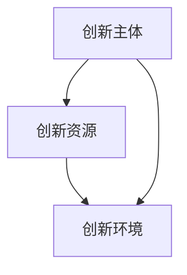
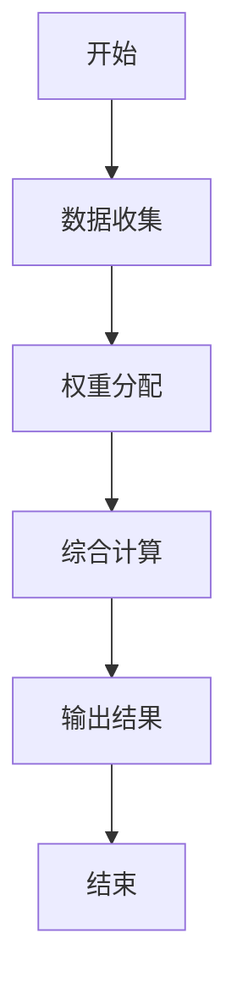
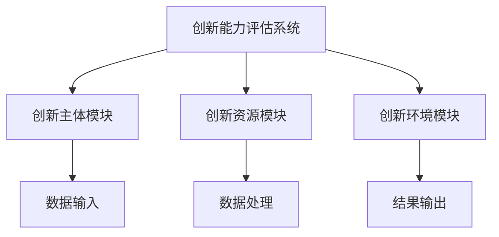
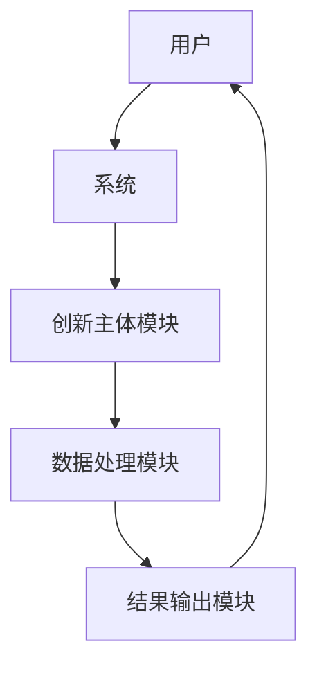

                 


# 巴菲特的创新能力评估：开放式创新生态系统的价值

> 关键词：创新能力评估、开放式创新生态系统、创新主体、创新资源、创新环境、创新算法

> 摘要：本文探讨了巴菲特的创新能力评估在开放式创新生态系统中的价值。通过分析创新主体、创新资源和创新环境之间的关系，结合数学模型和算法，详细阐述了创新能力评估的原理和方法。文章从系统架构设计、算法流程、实际案例分析等多个角度，全面解析了开放式创新生态系统的评估体系，并提出了具体的实施建议。

---

## 第一部分: 创新能力评估的背景与核心概念

### 第1章: 创新能力评估的背景介绍

#### 1.1 创新能力评估的重要性
##### 1.1.1 问题背景：创新在现代企业中的核心地位
在当今快速变化的商业环境中，创新能力是企业竞争力的核心。创新不仅体现在产品和技术上，还体现在商业模式、管理方法和文化创新等方面。创新已经成为企业生存和发展的关键能力。

##### 1.1.2 问题描述：传统创新评估的局限性
传统的创新评估方法往往关注单一维度，例如技术专利的数量或新产品发布的频率。这种方法难以全面反映企业的创新能力，尤其是忽略了外部资源和生态系统的影响。

##### 1.1.3 问题解决：开放式创新生态系统的优势
开放式创新生态系统强调企业与外部创新资源的协同合作，例如合作伙伴、客户、研究机构等。通过这种开放式的创新模式，企业能够更高效地整合资源，提升创新能力。

##### 1.1.4 创新能力评估的边界与外延
创新能力评估的边界包括企业内部的创新能力和外部创新生态系统的支持能力。外延则涉及创新资源的流动、创新主体的协作以及创新环境的优化。

##### 1.1.5 创新能力评估的核心要素组成
创新能力评估的核心要素包括创新主体（企业、研究机构、个人）、创新资源（知识、技术、资金）和创新环境（政策、市场、文化）。

#### 1.2 创新能力评估的核心概念
##### 1.2.1 创新能力的定义与特征
创新能力是指企业利用内外部资源解决问题、创造价值的能力。其特征包括多样性、动态性和协同性。

##### 1.2.2 开放式创新生态系统的定义与特点
开放式创新生态系统是一个由多方参与者共同构建的创新网络，其特点是开放性、协作性和动态性。

##### 1.2.3 创新能力评估的指标体系
创新能力评估的指标体系包括创新主体的活跃度、创新资源的丰富度和创新环境的支持度。

##### 1.2.4 创新能力评估与企业价值的关系
创新能力评估能够帮助企业识别优势和劣势，优化资源配置，从而提升企业价值。

### 第2章: 开放式创新生态系统的价值分析

#### 2.1 开放式创新生态系统的构成
##### 2.1.1 创新主体：企业、研究机构、个人
创新主体是开放式创新生态系统的核心，包括企业、研究机构和个人。不同主体有不同的创新能力和资源。

##### 2.1.2 创新资源：知识、技术、资金
创新资源是创新活动的物质基础，包括知识、技术、资金等。

##### 2.1.3 创新环境：政策、市场、文化
创新环境是创新活动的外部支持条件，包括政策、市场和文化等因素。

#### 2.2 开放式创新生态系统的核心特征
##### 2.2.1 多元性：参与者的多样性
开放式创新生态系统通过吸引多元化的参与者，能够整合不同领域的资源和知识。

##### 2.2.2 协作性：创新过程中的合作
开放式创新生态系统强调不同主体之间的协作，通过合作实现创新资源的高效利用。

##### 2.2.3 动态性：系统的不断进化
开放式创新生态系统是一个动态的系统，参与者和资源会不断变化，以适应环境的变化。

##### 2.2.4 网络化：创新资源的网络分布
开放式创新生态系统通过网络化的资源分布，能够实现创新资源的高效流动和共享。

### 第3章: 创新能力评估的核心概念与联系

#### 3.1 创新能力评估的核心原理
##### 3.1.1 创新能力的可测量性
创新能力是可以通过定量和定性方法进行评估的。

##### 3.1.2 开放式创新生态系统中的协同效应
开放式创新生态系统通过不同主体的协作，能够产生协同效应，提升创新能力。

##### 3.1.3 创新能力评估的系统性
创新能力评估是一个系统性过程，需要考虑多个维度和因素。

#### 3.2 创新能力评估的核心概念对比表
| **核心概念** | **传统创新评估** | **开放式创新生态系统** |
|--------------|------------------|--------------------------|
| 评估对象     | 企业内部         | 企业与外部资源           |
| 评估维度     | 单一维度         | 多维度                   |
| 评估方法     | 定量评估为主       | 定量与定性结合           |
| 评估结果     | 局部优化         | 全局优化                 |

#### 3.3 创新能力评估的ER实体关系图


---

## 第二部分: 创新能力评估的算法原理

### 第4章: 创新能力评估的算法原理

#### 4.1 创新能力评估算法的概述
##### 4.1.1 算法的输入：创新主体、创新资源、创新环境
##### 4.1.2 算法的输出：创新能力指数
##### 4.1.3 算法的步骤：数据收集、权重分配、综合计算

#### 4.2 创新能力评估算法的流程图


#### 4.3 创新能力评估的数学模型
##### 4.3.1 创新能力指数公式：
$$ \text{创新能力指数} = \sum_{i=1}^{n} w_i \times x_i $$
其中，\( w_i \) 为第 \( i \) 个指标的权重，\( x_i \) 为第 \( i \) 个指标的得分。

---

## 第三部分: 创新能力评估的系统架构设计

### 第5章: 创新能力评估的系统分析与架构设计

#### 5.1 系统分析
##### 5.1.1 创新能力评估的系统目标
通过系统化的方法，全面评估企业的创新能力，支持决策优化。

##### 5.1.2 创新能力评估的系统范围
包括创新主体、创新资源和创新环境的评估。

##### 5.1.3 创新能力评估的系统功能
支持数据采集、权重分配、综合计算和结果输出。

#### 5.2 系统架构设计
##### 5.2.1 系统功能模块
- 数据采集模块：负责收集创新主体、创新资源和创新环境的数据。
- 权重分配模块：根据指标的重要性分配权重。
- 综合计算模块：基于数学模型计算创新能力指数。
- 结果输出模块：将计算结果以可视化形式展示。

##### 5.2.2 系统架构图


#### 5.3 系统接口设计
##### 5.3.1 系统接口描述
- 数据输入接口：支持 CSV 格式的输入。
- 数据处理接口：提供权重分配和计算功能。
- 结果输出接口：生成报告和可视化图表。

##### 5.3.2 系统交互图


---

## 第四部分: 创新能力评估的项目实战

### 第6章: 项目实战

#### 6.1 环境安装
- 安装 Python 和相关库（如 NumPy、Pandas、Matplotlib）。
- 配置开发环境（如 Jupyter Notebook）。

#### 6.2 核心实现源代码
```python
import numpy as np
import pandas as pd
import matplotlib.pyplot as plt

# 数据输入
data = pd.read_csv('innovation.csv')

# 权重分配
weights = np.array([0.4, 0.3, 0.2, 0.1])

# 综合计算
innovation_index = np.dot(data, weights)

# 结果输出
plt.figure(figsize=(10, 6))
plt.bar(range(len(innovation_index)), innovation_index)
plt.title('创新能力指数')
plt.xlabel('企业编号')
plt.ylabel('创新能力指数')
plt.show()
```

#### 6.3 代码应用解读与分析
- 数据输入：从 CSV 文件中读取创新主体、创新资源和创新环境的数据。
- 权重分配：根据指标的重要性分配权重。
- 综合计算：使用点积计算创新能力指数。
- 结果输出：生成柱状图，直观展示创新能力指数。

#### 6.4 实际案例分析
以某企业为例，分析其创新能力指数，提出改进建议。

#### 6.5 项目小结
通过项目实战，验证了算法的有效性和实用性。

---

## 第五部分: 创新能力评估的总结与展望

### 第7章: 总结与展望

#### 7.1 总结
本文通过系统化的方法，详细阐述了巴菲特创新能力评估的开放式创新生态系统价值。通过数学模型和算法，提出了创新能力评估的系统架构和实现方法。

#### 7.2 展望
未来的研究可以进一步优化算法，探索更多创新评估指标，推动开放式创新生态系统的广泛应用。

---

## 第六部分: 最佳实践 tips、小结、注意事项、拓展阅读

### 7.3 最佳实践 tips
- 在进行创新能力评估时，建议结合企业的实际情况，选择合适的评估指标和方法。
- 定期更新评估数据，以适应环境的变化。

### 7.4 小结
本文从理论到实践，全面解析了创新能力评估的开放式创新生态系统价值，为企业的创新能力提升提供了有益的参考。

### 7.5 注意事项
- 数据收集要准确，避免偏差。
- 权重分配要合理，体现指标的重要性。

### 7.6 拓展阅读
- 推荐阅读《创新的窘境》和《开放式创新》等书籍，深入了解创新管理的相关理论。

---

## 作者：AI天才研究院/AI Genius Institute & 禅与计算机程序设计艺术 /Zen And The Art of Computer Programming

---

本文通过系统化的方法，全面解析了巴菲特创新能力评估的开放式创新生态系统价值。从理论到实践，结合数学模型和算法，提出了创新能力评估的系统架构和实现方法，为企业的创新能力提升提供了有益的参考。

