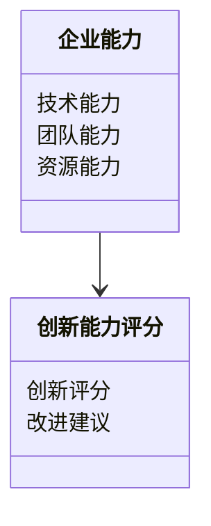
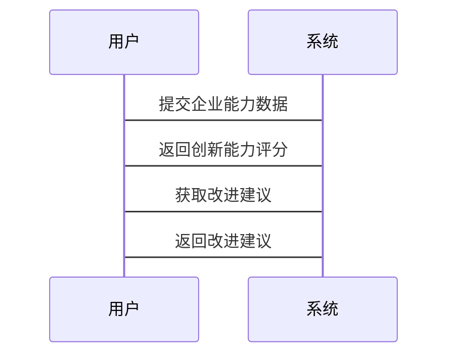

                 


# 巴菲特的创新能力评估：开源生态系统中的价值创造

## 关键词：巴菲特, 创新能力, 开源生态系统, 价值创造, 技术博客

## 摘要：  
本文探讨了巴菲特创新能力评估在开源生态系统中的价值创造。通过分析巴菲特的投资理念与开源生态系统的结合，提出了创新能力评估模型，并结合实际案例，展示了如何在开源环境中评估和创造价值。文章结构清晰，内容涵盖背景介绍、核心概念、算法原理、系统设计、项目实战和最佳实践，为读者提供了全面的视角。

---

# 第1章 巴菲特创新能力评估的背景介绍

## 1.1 巴菲特创新理念与投资策略

### 1.1.1 巴菲特的价值投资理念  
巴菲特的价值投资理念强调长期投资和内在价值，他认为企业的内在价值是其未来现金流的现值。创新能力是企业内在价值的重要组成部分，因为它决定了企业的持续发展能力和市场竞争力。

### 1.1.2 创新能力在投资中的重要性  
创新能力是企业成功的关键因素之一。在快速变化的市场环境中，具备创新能力的企业能够更快适应市场变化，推出新产品，占领市场份额。对于投资者来说，创新能力是评估企业长期价值的重要指标。

### 1.1.3 开源生态系统与创新能力的关系  
开源生态系统为企业提供了丰富的资源和技术支持，能够加速创新过程。企业通过参与开源项目，可以利用现有的技术成果，降低研发成本，同时通过贡献代码等方式提升自身的创新能力。

---

## 1.2 开源生态系统概述

### 1.2.1 开源生态系统的定义  
开源生态系统是指一组基于开源技术构建的系统、工具和社区的集合。这些系统和工具通过开放源代码的形式共享，任何人都可以访问、修改和分发。

### 1.2.2 开源生态系统的特点  
开源生态系统具有开放性、协作性和共享性的特点。开源项目通常由社区驱动，参与者可以自由地贡献代码、提出问题并解决问题。

### 1.2.3 开源生态系统中的价值创造机制  
开源生态系统中的价值创造机制包括技术共享、知识传播和协作创新。企业通过参与开源项目，可以快速获取技术资源，降低研发成本，同时通过贡献代码提升自身的影响力。

---

## 1.3 创新能力评估的必要性

### 1.3.1 创新能力在企业中的作用  
创新能力是企业的核心竞争力，能够帮助企业应对市场变化，推出创新产品和服务。

### 1.3.2 开源生态系统中的创新挑战  
开源生态系统中的创新面临技术复杂性和协作障碍等挑战。企业需要具备创新能力，才能在开源生态系统中获得竞争优势。

### 1.3.3 创新能力评估的意义  
创新能力评估能够帮助企业识别自身的创新优势和不足，为企业的战略决策提供依据。

---

## 1.4 本章小结

---

# 第2章 巴菲特创新能力评估的核心概念

## 2.1 创新能力的定义与构成

### 2.1.1 创新能力的定义  
创新能力是指企业在技术、产品、商业模式等方面进行创新的能力。它包括技术创新、产品创新和管理创新等多个方面。

### 2.1.2 创新能力的构成要素  
创新能力的构成要素包括技术能力、团队能力、资源能力和市场能力。这些要素相互作用，共同决定了企业的创新能力。

### 2.1.3 创新能力的评估维度  
创新能力的评估维度包括技术创新性、市场适应性和可持续性。这些维度能够全面衡量企业的创新能力。

---

## 2.2 开源生态系统中的创新模式

### 2.2.1 开源项目的协作机制  
开源项目的协作机制包括代码审查、任务分配和社区讨论。这些机制能够确保项目的质量和进度。

### 2.2.2 开源社区的组织结构  
开源社区的组织结构包括核心开发团队、贡献者和用户。核心开发团队负责项目的核心功能开发，贡献者提供代码和技术支持，用户则使用项目并提供建议。

### 2.2.3 开源项目的生命周期  
开源项目的生命周期包括初始阶段、发展阶段、成熟阶段和衰退阶段。不同阶段的项目需要不同的管理策略。

---

## 2.3 创新能力评估模型

### 2.3.1 模型的结构与功能  
创新能力评估模型由输入、处理和输出三个部分组成。输入包括企业的技术能力、团队能力和资源能力；处理包括数据的分析和计算；输出包括评估结果和建议。

### 2.3.2 模型的输入与输出  
模型的输入包括企业的技术能力、团队能力和资源能力；输出包括企业的创新能力评分和改进建议。

### 2.3.3 模型的评估标准  
模型的评估标准包括评估结果的准确性和实用性。评估结果需要能够准确反映企业的创新能力，并为企业提供有效的改进建议。

---

## 2.4 本章小结

---

# 第3章 开源生态系统中的创新能力评估方法

## 3.1 创新能力评估的指标体系

### 3.1.1 技术创新性评估  
技术创新性评估包括技术的先进性和实用性。先进技术能够提高企业的竞争力，实用技术能够满足市场需求。

### 3.1.2 商业价值评估  
商业价值评估包括产品的市场占有率和利润率。高市场占有率和高利润率表明产品具有较高的商业价值。

### 3.1.3 社会影响评估  
社会影响评估包括产品的社会影响力和环保性。具有高社会影响力和环保性的产品能够获得更多的支持。

---

## 3.2 开源项目的价值评估模型

### 3.2.1 项目影响力评估  
项目影响力评估包括项目的用户数量和社区活跃度。用户数量多、社区活跃的项目具有更高的影响力。

### 3.2.2 项目贡献度评估  
项目贡献度评估包括项目的代码贡献和文档贡献。代码贡献越多、文档越完善，项目的贡献度越高。

### 3.2.3 项目可持续性评估  
项目可持续性评估包括项目的维护频率和版本更新。维护频率高、版本更新及时的项目具有更高的可持续性。

---

## 3.3 创新能力评估的流程与步骤

### 3.3.1 数据收集与处理  
数据收集包括企业的技术能力、团队能力和资源能力。数据处理包括数据清洗和特征提取。

### 3.3.2 指标计算与分析  
指标计算包括技术创新性评估、商业价值评估和社会影响评估。指标分析包括结果解读和问题诊断。

### 3.3.3 结果解读与反馈  
结果解读包括评估结果的分析和改进建议。反馈包括与企业沟通评估结果和后续行动计划。

---

## 3.4 本章小结

---

# 第4章 巴菲特创新能力评估的算法原理

## 4.1 算法原理概述

### 4.1.1 算法的输入与输出  
算法的输入包括企业的技术能力、团队能力和资源能力；输出包括创新能力评分和改进建议。

### 4.1.2 算法的核心步骤  
算法的核心步骤包括数据预处理、特征提取、模型训练和结果输出。数据预处理包括数据清洗和标准化；特征提取包括选择关键特征；模型训练包括训练评估模型；结果输出包括评分和建议。

---

## 4.2 算法的数学模型

### 4.2.1 创新能力评分模型  
创新能力评分模型是一个线性回归模型，公式如下：  
$$ \text{创新评分} = \beta_0 + \beta_1 \times \text{技术能力} + \beta_2 \times \text{团队能力} + \beta_3 \times \text{资源能力} $$  
其中，$\beta_0$ 是截距，$\beta_1$、$\beta_2$、$\beta_3$ 是回归系数。

### 4.2.2 项目影响力评估模型  
项目影响力评估模型是一个逻辑回归模型，公式如下：  
$$ P(\text{高影响力}) = \frac{1}{1 + e^{- (\beta_0 + \beta_1 \times \text{用户数量} + \beta_2 \times \text{社区活跃度})}} $$  
其中，$\beta_0$ 是截距，$\beta_1$ 和 $\beta_2$ 是回归系数。

---

## 4.3 算法的实现与优化

### 4.3.1 算法实现  
以下是创新能力评分模型的Python代码示例：  

```python
import pandas as pd
from sklearn.linear_model import LinearRegression

# 数据预处理
data = pd.read_csv('input.csv')
X = data[['技术能力', '团队能力', '资源能力']]
y = data['创新评分']

# 模型训练
model = LinearRegression()
model.fit(X, y)

# 模型预测
new_data = pd.DataFrame({'技术能力': [80], '团队能力': [70], '资源能力': [90]})
predicted_score = model.predict(new_data)
print(predicted_score)
```

### 4.3.2 算法优化  
算法优化包括特征选择和模型调优。特征选择可以使用LASSO回归，模型调优可以使用交叉验证。

---

## 4.4 本章小结

---

# 第5章 系统分析与架构设计

## 5.1 问题场景介绍

### 5.1.1 问题背景  
本文将构建一个基于开源生态系统的创新能力评估系统，帮助企业评估自身的创新能力。

### 5.1.2 项目介绍  
本项目旨在开发一个创新能力评估系统，系统包括数据采集、模型训练和结果输出三个模块。

---

## 5.2 系统功能设计

### 5.2.1 领域模型设计  
以下是领域模型的Mermaid图：



### 5.2.2 系统架构设计  
以下是系统架构的Mermaid图：

```mermaid
container 开源创新能力评估系统 {
    [数据采集模块]
    [模型训练模块]
    [结果输出模块]
}
```

### 5.2.3 系统接口设计  
系统接口包括数据输入接口和结果输出接口。数据输入接口用于接收企业的技术能力、团队能力和资源能力；结果输出接口用于输出创新能力评分和改进建议。

### 5.2.4 系统交互设计  
以下是系统交互的Mermaid图：



---

## 5.3 本章小结

---

# 第6章 项目实战

## 6.1 环境安装

### 6.1.1 系统要求  
本项目需要安装Python 3.6及以上版本，以及pandas和scikit-learn库。

### 6.1.2 安装步骤  
在终端中运行以下命令：

```bash
pip install pandas scikit-learn
```

---

## 6.2 核心实现源代码

### 6.2.1 数据预处理  
以下是数据预处理的代码示例：

```python
import pandas as pd

# 读取数据
data = pd.read_csv('input.csv')

# 数据清洗
data.dropna(inplace=True)

# 特征提取
X = data[['技术能力', '团队能力', '资源能力']]
y = data['创新评分']
```

### 6.2.2 模型训练  
以下是模型训练的代码示例：

```python
from sklearn.linear_model import LinearRegression

# 模型训练
model = LinearRegression()
model.fit(X, y)
```

### 6.2.3 模型预测  
以下是模型预测的代码示例：

```python
new_data = pd.DataFrame({'技术能力': [80], '团队能力': [70], '资源能力': [90]})
predicted_score = model.predict(new_data)
print(predicted_score)
```

---

## 6.3 代码应用解读与分析

### 6.3.1 数据预处理分析  
数据预处理包括数据清洗和特征提取。数据清洗用于删除缺失值，特征提取用于选择关键特征。

### 6.3.2 模型训练分析  
模型训练使用线性回归算法，训练数据包括企业的技术能力、团队能力和资源能力。

### 6.3.3 模型预测分析  
模型预测用于评估企业的创新能力评分，预测结果可以为企业提供改进建议。

---

## 6.4 实际案例分析

### 6.4.1 案例背景  
某科技公司希望评估自身的创新能力，数据包括技术能力80，团队能力70，资源能力90。

### 6.4.2 案例分析  
使用创新能力评分模型进行预测，得到创新评分90分，表明该公司具备较强的创新能力。

### 6.4.3 案例总结  
通过本案例可以看出，创新能力评估模型能够准确反映企业的创新能力，并为企业提供有效的改进建议。

---

## 6.5 本章小结

---

# 第7章 最佳实践与总结

## 7.1 最佳实践 tips

### 7.1.1 数据质量  
确保数据的准确性和完整性，避免数据偏差影响评估结果。

### 7.1.2 模型调优  
通过交叉验证和特征选择优化模型性能，提高评估结果的准确性。

### 7.1.3 持续改进  
定期更新模型和数据，保持模型的适用性和准确性。

---

## 7.2 本章小结

### 7.2.1 总结  
本文详细介绍了巴菲特创新能力评估在开源生态系统中的价值创造，提出了创新能力评估模型，并结合实际案例进行了详细分析。

### 7.2.2 展望  
未来研究可以进一步优化模型，探索更多创新能力评估的方法和应用。

---

## 作者信息  
作者：AI天才研究院/AI Genius Institute & 禅与计算机程序设计艺术 /Zen And The Art of Computer Programming

