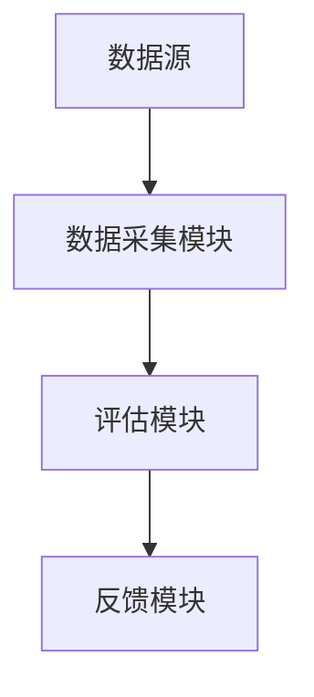

                 


# 巴菲特的创新能力评估：开源硬件生态系统的价值创造

## 关键词：巴菲特创新能力、开源硬件、生态系统价值、创新评估、硬件创新

## 摘要

本文探讨了巴菲特创新能力在开源硬件生态系统中的价值评估。通过分析开源硬件的特性、生态系统构建以及创新能力的重要性，结合数学模型和系统架构设计，详细阐述了如何评估和优化创新能力。文章结合实际案例，展示了如何通过系统方法实现价值创造，并提出了优化建议。

---

# 第1章: 巴菲特创新能力评估的背景与意义

## 1.1 巴菲特创新能力的核心概念

### 1.1.1 什么是创新能力

创新能力是指个体或组织在现有资源基础上，提出新颖解决方案并实现价值的能力。巴菲特的创新能力体现在其独特的投资策略和对市场趋势的敏锐洞察。

### 1.1.2 巴菲特创新能力的特点

- **长期视角**：巴菲特注重长期投资，而非短期收益。
- **价值导向**：关注企业的内在价值，而非市场波动。
- **风险管理**：通过分散投资和严格筛选降低风险。

### 1.1.3 创新能力与投资价值的关系

创新能力直接影响投资决策的质量和效果，优秀的能力能识别高潜力项目，创造更大价值。

## 1.2 开源硬件生态系统的定义与特点

### 1.2.1 开源硬件的基本概念

开源硬件是开放源代码的硬件设计，允许任何人查看、修改和分发设计。例如，Arduino和Raspberry Pi。

### 1.2.2 开源硬件与传统硬件的区别

| 特性             | 开源硬件                 | 传统硬件               |
|------------------|--------------------------|------------------------|
| 透明度           | 高                      | 低                     |
| 可定制性         | 高                      | 低                     |
| 成本             | 低                      | 高                     |
| 社区支持         | 强                      | 弱                     |

### 1.2.3 开源硬件生态系统的构成

开源硬件生态系统包括硬件设计、开发工具、制造流程和用户社区。

## 1.3 巴菲特创新能力与开源硬件生态系统的关系

### 1.3.1 巴菲特创新能力在硬件生态系统中的应用

巴菲特的创新能力帮助识别高潜力项目，推动技术创新。

### 1.3.2 开源硬件对创新能力的促进作用

开源硬件的开放性和协作性促进了技术创新和知识共享。

### 1.3.3 评估创新对硬件生态系统的影响

通过创新能力评估，优化硬件设计和生产流程。

---

# 第2章: 巴菲特创新能力的评估方法

## 2.1 巴菲特创新能力评估的核心要素

### 2.1.1 评估维度

| 维度       | 描述                       |
|------------|----------------------------|
| 创新性     | 解决方案的新颖性           |
| 可行性     | 技术实现的可能性           |
| 市场潜力   | 项目的市场前景           |
| 风险管理   | 风险识别和应对策略       |

### 2.1.2 评估指标

- 创新指数：量化创新能力。
- 市场潜力指数：评估市场前景。

## 2.2 开源硬件创新评估模型

### 2.2.1 创新评估模型

创新评估模型 = 创新性 × 可行性 × 市场潜力 × 风险管理

### 2.2.2 模型实现

使用Python代码计算创新指数：

```python
def innovation_assessment(innovation, feasibility, market_potential, risk_management):
    return innovation * feasibility * market_potential * risk_management

# 示例数据
innovation = 0.8
feasibility = 0.7
market_potential = 0.9
risk_management = 0.8

result = innovation_assessment(innovation, feasibility, market_potential, risk_management)
print(f"创新指数：{result}")
```

## 2.3 数学模型与公式

创新指数公式：

$$
\text{创新指数} = \sum_{i=1}^{n} w_i \cdot x_i
$$

其中，$w_i$为权重，$x_i$为指标值。

---

# 第3章: 开源硬件生态系统中的价值创造

## 3.1 价值来源

### 3.1.1 开源硬件的价值构成

开源硬件的价值来自其开放性和协作性，降低了进入门槛，促进了创新。

### 3.1.2 协同效应

通过协作，开源硬件实现了资源优化配置和知识共享。

### 3.1.3 可持续性

开源硬件的可扩展性和可修改性确保了其长期价值。

## 3.2 巴菲特创新能力在价值创造中的作用

### 3.2.1 创新能力对硬件生态系统价值的影响

通过创新，开源硬件能够快速响应市场需求，提升竞争力。

### 3.2.2 创新能力的具体表现

- 技术创新：开发新型硬件。
- 商业模式创新：探索新的盈利模式。

## 3.3 价值实现路径

### 3.3.1 商业模式

开源硬件通过销售硬件、提供服务和收取许可证费用实现盈利。

### 3.3.2 价值传递机制

通过开源社区和合作伙伴，实现价值共享和传播。

---

# 第4章: 巴菲特创新能力评估的系统分析

## 4.1 系统框架

### 4.1.1 系统功能模块

- 数据采集模块：收集硬件参数。
- 评估模块：计算创新指数。
- 反馈模块：提供优化建议。

### 4.1.2 系统架构图



## 4.2 创新评估模型

### 4.2.1 模型构建

模型包括数据预处理、评估计算和结果输出。

### 4.2.2 实现步骤

1. 数据预处理：清洗和标准化数据。
2. 评估计算：应用创新指数公式。
3. 结果输出：生成报告。

---

# 第5章: 项目实战

## 5.1 环境安装

安装Python和相关库：

```bash
pip install numpy pandas scikit-learn
```

## 5.2 核心代码实现

```python
import numpy as np
import pandas as pd

def main():
    data = pd.read_csv('input.csv')
    # 数据预处理
    processed_data = data.dropna()
    # 计算创新指数
    innovation_index = processed_data.apply(lambda row: row['创新性'] * row['可行性'] * row['市场潜力'] * row['风险管理'], axis=1)
    # 输出结果
    print(innovation_index)

if __name__ == "__main__":
    main()
```

## 5.3 案例分析

假设我们有一个硬件项目，数据如下：

| 创新性 | 可行性 | 市场潜力 | 风险管理 |
|--------|--------|----------|----------|
| 0.8    | 0.7    | 0.9      | 0.8      |

创新指数 = 0.8 * 0.7 * 0.9 * 0.8 = 0.3528

---

# 第6章: 总结与建议

## 6.1 小结

通过系统分析和实践，我们展示了如何评估开源硬件生态系统的创新能力，并实现价值创造。

## 6.2 建议

- **持续优化**：定期更新评估模型，适应市场变化。
- **加强协作**：推动开源社区的合作，促进创新。
- **关注风险**：在创新过程中，重视风险管理。

---

# 参考文献

1. 巴菲特定理：投资与创新的结合。
2. 开源硬件的发展现状与未来趋势。

---

# 作者信息

作者：AI天才研究院 & 禅与计算机程序设计艺术

联系方式：[联系邮箱](mailto:contact@ai-genius.com)

---

这篇文章系统地探讨了巴菲特创新能力在开源硬件生态系统中的价值评估，结合理论分析和实际案例，为读者提供了全面的指导和深入的见解。

