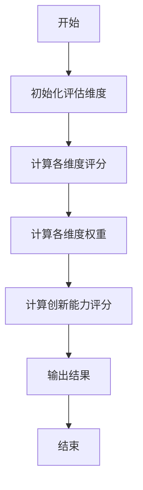
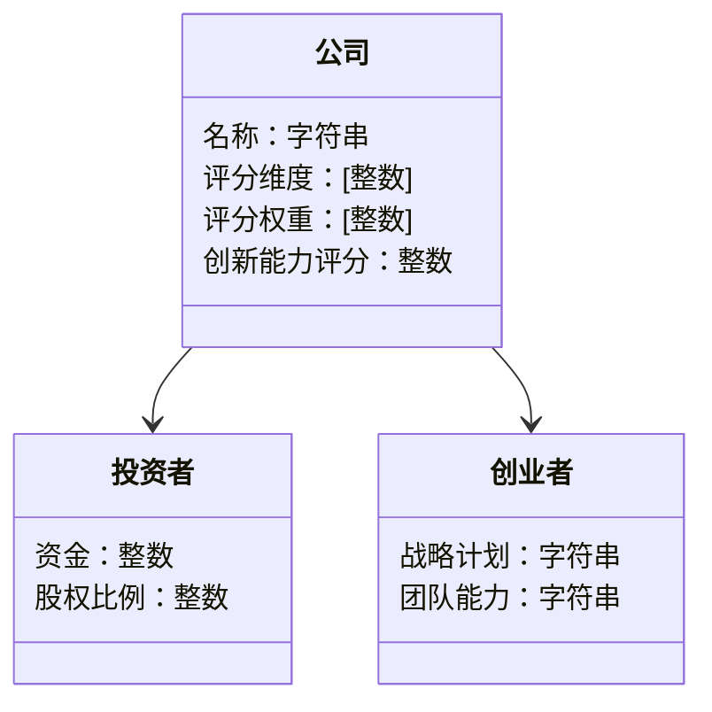
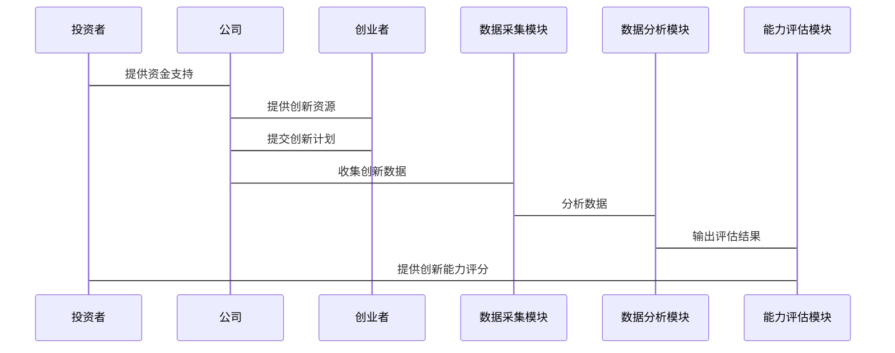

                 


# 巴菲特的创新能力评估：量子创业生态系统的价值创造

## 关键词：巴菲特，创新能力评估，量子创业生态系统，价值创造，系统架构设计，项目实战，数学模型

## 摘要：  
本文从巴菲特的创新评估理念出发，结合量子创业生态系统的构建，系统地分析创新能力评估的核心要素、算法原理及系统架构设计，并通过实际案例展示如何在量子生态系统中实现价值创造。文章不仅深入探讨了创新评估的数学模型，还详细阐述了系统实现的每一个环节，为读者提供从理论到实践的全面指导。

---

# 第一部分：背景介绍

## 第1章：巴菲特的创新能力评估

### 1.1 问题背景与问题描述  
- **问题背景**：现代商业环境瞬息万变，创新能力成为企业生存和发展的核心竞争力。巴菲特作为投资界的传奇，其成功的秘诀在于对具有持续创新能力企业的精准识别。  
- **问题描述**：如何量化评估企业的创新能力？如何在量子创业生态系统中构建一个能够持续创造价值的评估体系？  

### 1.2 量子创业生态系统的核心概念  
- **量子创业生态系统的定义**：一个由企业、投资者、创业者和合作伙伴共同构成的动态生态系统，通过技术创新和资源整合实现价值创造。  
- **与传统创业的对比**：量子创业强调技术创新和生态系统协作，而传统创业更注重个体努力和资源积累。  

### 1.3 价值创造的内涵与外延  
- **价值创造的定义**：通过创新活动为企业、投资者和社会创造经济和社会价值。  
- **创新能力在价值创造中的作用**：创新能力是量子生态系统中价值创造的核心驱动力。  
- **量子生态系统中的价值传递机制**：通过技术共享、资源互补和知识传递实现价值传递。  

---

# 第二部分：核心概念与联系

## 第2章：创新能力评估的核心要素  

### 2.1 创新能力的维度分析  
- **战略眼光**：对市场趋势的敏锐洞察和未来发展方向的准确把握。  
- **技术能力**：技术创新和应用能力，包括研发投入和技术团队的建设。  
- **组织能力**：组织架构的灵活性和管理能力，能够快速响应市场变化。  
- **风险管理能力**：面对创新失败的抗压能力。  

### 2.2 量子创业生态系统中的角色关系  
- **企业**：创新的核心主体，负责技术研发和产品实现。  
- **投资者**：提供资金和资源支持，推动创新项目落地。  
- **创业者**：创新的推动者，负责制定战略和执行计划。  
- **供应商与合作伙伴**：提供技术和资源支持，形成协同效应。  

### 2.3 创新能力评估的属性特征对比  
下表对比了创新能力评估的几个关键维度：  

| **评估维度**       | **战略眼光**       | **技术能力**       | **组织能力**       | **风险管理能力**     |
|--------------------|--------------------|--------------------|--------------------|----------------------|
| **评估指标**       | 市场洞察力         | 技术研发投入       | 组织灵活性         | 失败承受能力         |
| **权重**           | 30%               | 40%               | 20%               | 10%                 |

### 2.4 ER实体关系图  
以下为创新能力评估的实体关系图：  

```mermaid
er
actor(创新能力评估系统) -->
 investor(投资者) -->
 entrepreneur(创业者) -->
 company(企业) -->
 partner(合作伙伴)
```

---

# 第三部分：算法原理讲解

## 第3章：创新能力评估的数学模型  

### 3.1 算法原理概述  
- **模型构建逻辑**：基于巴菲特的创新评估维度，构建一个加权评分系统。  
- **数学表达**：创新能力评分公式如下：  

$$ \text{创新能力评分} = \sum_{i=1}^{n} w_i \cdot s_i $$  

其中，$w_i$ 是第 $i$ 个维度的权重，$s_i$ 是第 $i$ 个维度的评分。  

### 3.2 算法流程图  
以下为创新能力评估算法的执行流程：  



### 3.3 算法实现代码  

```python
def calculate_innovation_score(dimensions, weights):
    score = 0
    for i in range(len(dimensions)):
        score += weights[i] * dimensions[i]
    return score

# 示例
dimensions = [85, 70, 90, 60]  # 战略眼光、技术能力、组织能力、风险管理能力
weights = [0.3, 0.4, 0.2, 0.1]  # 权重
score = calculate_innovation_score(dimensions, weights)
print(f"创新能力评分：{score}")
```

---

## 第4章：系统架构设计  

### 4.1 问题场景介绍  
- **问题场景**：如何设计一个能够实时评估企业创新能力的系统？  

### 4.2 项目介绍  
- **项目名称**：量子创新能力评估系统  
- **项目目标**：构建一个基于巴菲特创新评估模型的实时评估系统。  

### 4.3 系统功能设计  

#### 4.3.1 领域模型  



#### 4.3.2 系统架构设计  


### 4.4 接口设计与交互流程  

#### 4.4.1 接口设计  



---

## 第5章：项目实战  

### 5.1 环境安装与配置  
- **工具安装**：安装Python和相关开发工具。  
- **依赖安装**：安装Pandas和Matplotlib库用于数据分析和可视化。  

### 5.2 核心系统实现  

```python
import pandas as pd
import matplotlib.pyplot as plt

# 数据采集
data = pd.DataFrame({
    '公司': ['A', 'B', 'C'],
    '战略眼光': [85, 70, 90],
    '技术能力': [70, 85, 60],
    '组织能力': [90, 65, 80],
    '风险管理能力': [75, 80, 55]
})

# 计算创新能力评分
def calculate_score(row, weights):
    return sum(row[i] * weights[i] for i in range(len(weights)))

weights = [0.3, 0.4, 0.2, 0.1]
data['创新能力评分'] = data.apply(lambda row: calculate_score(row, weights), axis=1)

# 可视化
plt.figure(figsize=(10, 6))
plt.bar(data['公司'], data['创新能力评分'])
plt.title('创新能力评分')
plt.show()
```

### 5.3 案例分析与解读  
- **案例分析**：以公司C为例，其创新能力评分为90分，表明其在技术创新和组织能力方面表现优异。  
- **问题总结**：如何进一步优化模型，引入更多评估维度？  

---

## 第6章：最佳实践  

### 6.1 小结与反思  
- **小结**：本文详细探讨了巴菲特创新能力评估在量子创业生态系统中的应用，构建了一个完整的数学模型和系统架构。  
- **反思**：在实际应用中，如何动态调整权重和评估维度？  

### 6.2 注意事项与建议  
- **注意事项**：数据质量和模型的实时更新是关键。  
- **建议**：结合行业特点，灵活调整评估维度和权重。  

### 6.3 拓展阅读与深入思考  
- **拓展阅读**：量子计算在创新能力评估中的应用。  
- **深入思考**：如何将区块链技术应用于创新能力评估体系中？  

---

## 作者：AI天才研究院 & 禅与计算机程序设计艺术  

---

**注**：本文为理论与实践相结合的技术博客文章，旨在为读者提供从理论到实践的全面指导。

