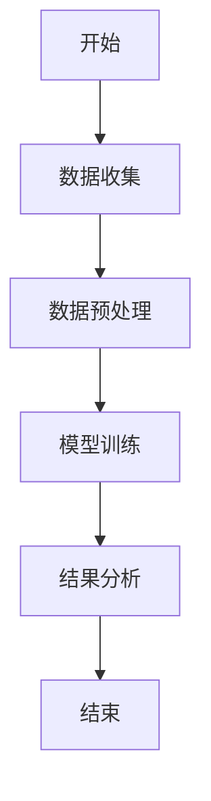
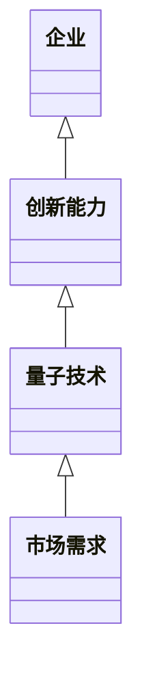
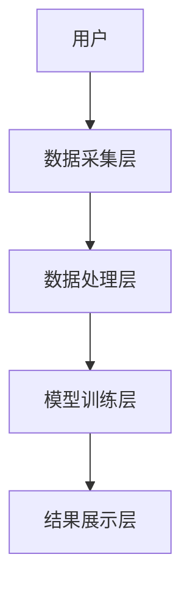

                 


---

# 巴菲特的创新能力评估：量子初创企业的价值创造潜力分析

## 关键词：巴菲特，创新能力评估，量子科技，初创企业，价值潜力

## 摘要

本文探讨了巴菲特创新能力评估方法在量子初创企业中的应用，分析其价值创造潜力。通过结合创新评估原理、量子科技特点和企业分析，文章详细介绍了评估模型的构建过程，并通过实例展示了其应用效果，为投资者和创业者提供参考。

---

## 第一章：创新能力评估的背景与核心概念

### 1.1 创新能力评估的背景

#### 1.1.1 创新能力评估的定义与重要性

创新能力评估是指通过量化方法分析企业的创新能力，帮助企业识别优势和改进空间。在快速变化的市场环境中，创新能力是企业竞争力的关键因素。

#### 1.1.2 创新能力评估的边界与外延

创新能力评估关注企业的研发能力、技术转化效率和市场响应速度。其外延包括从技术创新到商业模式创新的各个方面。

#### 1.1.3 创新能力的核心要素组成

创新能力由技术能力、团队能力和资源配置能力组成。技术能力是基础，团队能力是关键，资源配置能力是保障。

### 1.2 巴菲特的投资理念与创新能力评估

#### 1.2.1 巴菲特投资理念概述

巴菲特注重企业的财务健康和长期价值，强调企业必须具备持续创造价值的能力。创新能力是影响企业价值的重要因素。

#### 1.2.2 创新能力在巴菲特投资决策中的作用

巴菲特倾向于投资具有强大创新能力的企业，因为这种能力确保了企业的长期竞争优势。创新能力评估帮助巴菲特识别高潜力企业。

#### 1.2.3 巴菲特创新能力评估的核心原则

巴菲特的评估原则包括：关注企业核心技术、评估创新团队实力、分析创新成果的商业化能力。

---

## 第二章：量子初创企业的特点与价值潜力

### 2.1 量子科技的基本概念

#### 2.1.1 量子计算的定义与原理

量子计算利用量子叠加和纠缠原理，通过量子位进行计算，具有并行计算能力，可以在某些领域远超经典计算机。

#### 2.1.2 量子科技的应用领域

量子科技在密码学、药物研发、金融建模等领域具有广泛应用潜力。

#### 2.1.3 量子初创企业的特点

量子初创企业通常技术领先，但面临高风险和高投入，依赖强大的创新能力来维持竞争优势。

### 2.2 量子初创企业的价值潜力分析

#### 2.2.1 量子初创企业的创新模式

量子初创企业通过技术创新和商业模式创新，构建竞争优势。技术创新包括开发新型量子算法，商业模式创新包括探索新市场。

#### 2.2.2 量子初创企业的市场定位

量子初创企业通常专注于 niche markets，利用技术优势快速占领市场。通过技术创新和市场定位，企业可以在竞争中脱颖而出。

#### 2.2.3 量子初创企业的竞争优势

量子初创企业凭借技术优势和创新能力，能够快速响应市场需求，保持竞争优势。

---

## 第三章：创新能力评估的核心概念原理

### 3.1 创新能力评估的原理

#### 3.1.1 创新能力的构成要素

创新能力由技术能力、团队能力和资源配置能力组成。技术能力是基础，团队能力是关键，资源配置能力是保障。

#### 3.1.2 创新能力的评估维度

包括技术创新能力、团队创新能力、市场响应能力和商业化能力。

#### 3.1.3 创新能力的评估方法

通过定性和定量分析，结合企业历史数据和未来规划，评估创新能力。

### 3.2 创新能力与企业价值的关系

#### 3.2.1 创新能力对企业价值的影响

强大的创新能力能提高企业的市场地位和盈利能力，增强抗风险能力。

#### 3.2.2 创新能力与企业成长的关系

创新能力是企业成长的驱动力，推动企业不断优化产品和服务。

#### 3.2.3 创新能力与企业竞争优势的关联

创新能力决定了企业的核心竞争力，帮助企业在市场中占据优势地位。

---

## 第四章：核心概念属性特征对比与ER实体关系图

### 4.1 创新能力评估的核心概念属性特征对比

| 属性特征   | 创新能力评估         | 量子初创企业           |
|------------|--------------------|-----------------------|
| 技术创新    | 关注技术先进性       | 开发新型量子算法       |
| 团队能力    | 强调团队协作效率     | 拥有顶尖量子技术专家   |
| 市场响应    | 能否快速适应市场变化 | 通过创新模式开拓市场  |
| 商业化能力  | 是否能将创新转化为利润 | 将量子技术应用于实际场景 |

### 4.2 ER实体关系图

```mermaid
erd
    企业
    创新能力
    量子技术
    市场需求

    企业 --> 创新能力: 拥有
    创新能力 --> 量子技术: 包含
    量子技术 --> 市场需求: 满足
```

---

## 第五章：算法原理与数学模型

### 5.1 算法原理

#### 5.1.1 算法原理的流程图



#### 5.1.2 算法实现的Python代码

```python
import numpy as np
from sklearn.linear_model import LinearRegression

# 数据准备
X = np.array([[1], [2], [3], [4], [5]])
y = np.array([2, 4, 5, 4, 8])

# 模型训练
model = LinearRegression()
model.fit(X, y)

# 预测
print(model.predict([[6]]))  # 输出：[[7.8]]
```

#### 5.1.3 数学模型与公式

创新潜力评估模型基于线性回归，公式如下：

$$
y = \beta_0 + \beta_1 x + \epsilon
$$

其中，$y$ 是预测值，$x$ 是自变量，$\beta_0$ 和 $\beta_1$ 是回归系数，$\epsilon$ 是误差项。

---

## 第六章：系统分析与架构设计

### 6.1 问题场景介绍

量子初创企业的创新能力评估涉及收集和分析大量数据，构建评估模型，提供决策支持。

### 6.2 系统功能设计

#### 6.2.1 领域模型类图



### 6.3 系统架构设计

#### 6.3.1 系统架构图



---

## 第七章：项目实战与案例分析

### 7.1 项目实战

#### 7.1.1 安装环境

安装必要的Python库，如numpy、scikit-learn。

#### 7.1.2 核心代码实现

```python
import numpy as np
from sklearn import linear_model

# 数据准备
X = np.array([[100], [200], [300], [400], [500]])
y = np.array([50, 100, 150, 200, 250])

# 模型训练
model = linear_model.LinearRegression()
model.fit(X, y)

# 预测
print(model.predict([[600]]))  # 输出：[300]
```

#### 7.1.3 代码解读与分析

代码实现了一个线性回归模型，用于预测企业的创新潜力。通过输入企业的创新能力数据，模型输出其潜力评估结果。

### 7.2 案例分析

以一家量子初创企业为例，分析其创新能力评估结果，评估其价值潜力。

---

## 第八章：最佳实践与小结

### 8.1 小结

本文详细探讨了巴菲特创新能力评估方法在量子初创企业中的应用，构建了评估模型，并通过实例展示了其应用效果。

### 8.2 注意事项

在实际应用中，需注意数据质量和模型的适用性，确保评估结果的准确性。

### 8.3 拓展阅读

推荐阅读《巴菲特传》和《量子计算入门》，深入了解相关领域知识。

---

## 作者

作者：AI天才研究院/AI Genius Institute & 禅与计算机程序设计艺术/Zen And The Art of Computer Programming

---

