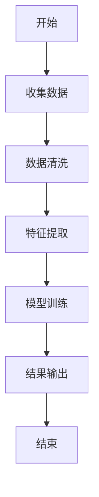
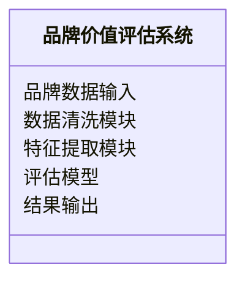
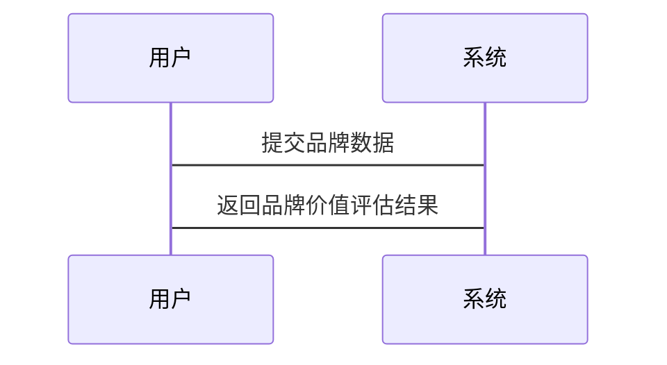

                 


# 巴菲特的品牌价值评估更新：数字化时代的品牌资产

## 关键词：品牌价值评估，巴菲特，数字化时代，品牌资产，投资策略，价值投资

## 摘要：  
本文深入探讨了巴菲特品牌价值评估方法在数字化时代的演变与更新，结合品牌资产的核心概念、评估模型与算法原理，详细分析了如何在数字化背景下重新定义和计算品牌价值。文章从品牌价值评估的背景、核心概念、算法原理、系统架构到项目实战，全面解析了品牌价值评估的理论与实践，并通过具体案例展示了如何在数字化时代利用新技术工具与方法论来优化品牌价值评估过程。

---

# 正文

## 第1章: 品牌价值评估的背景与重要性

### 1.1 品牌价值评估的背景

#### 1.1.1 数字化时代的品牌资产变化  
在数字化时代，品牌资产的内涵发生了深刻变化。传统品牌价值更多依赖于线下渠道和广告投放，而如今，品牌价值受到社交媒体、用户生成内容、数据驱动决策等因素的显著影响。数字化工具使得品牌资产的评估更加精准和动态化。  

#### 1.1.2 巴菲特投资理念的核心要素  
巴菲特的价值投资理念强调长期主义和基本面分析。他注重企业的内在价值，而品牌资产作为企业核心竞争力的重要组成部分，成为其投资决策中的关键因素。  

#### 1.1.3 品牌价值在投资决策中的作用  
品牌价值不仅是企业的无形资产，更是决定企业市场地位和盈利能力的重要因素。在数字化时代，品牌价值的评估需要结合线上线下的数据，更加注重用户体验和品牌忠诚度的量化分析。  

### 1.2 品牌价值评估的定义与范围

#### 1.2.1 品牌价值的定义  
品牌价值是指品牌为企业创造的超额利润能力，反映了品牌在市场中的竞争力和消费者认知度。  

#### 1.2.2 品牌资产的核心要素  
品牌资产的核心要素包括品牌知名度、品牌忠诚度、品牌认知度和品牌联想等。  

#### 1.2.3 品牌价值评估的边界与外延  
品牌价值评估的边界包括品牌在不同市场、不同产品线中的表现，而外延则涉及品牌延伸、品牌并购等复杂场景。  

### 1.3 巴菲特品牌价值评估方法的独特性

#### 1.3.1 巴菲特的投资哲学与品牌价值  
巴菲特注重企业的持续盈利能力，品牌价值作为企业核心竞争力的体现，是其投资决策的重要依据。  

#### 1.3.2 品牌忠诚度与长期价值的关系  
品牌忠诚度是品牌长期价值的基石。在数字化时代，通过数据分析可以量化品牌忠诚度，从而更准确地评估品牌价值。  

#### 1.3.3 数字化时代品牌价值评估的挑战  
数字化时代品牌价值评估的挑战包括数据的多样性和复杂性，如何将传统品牌价值评估方法与数字化工具相结合是关键。  

### 1.4 本章小结  
本章从品牌价值评估的背景、定义、核心要素以及数字化时代的挑战等方面进行了全面分析，为后续章节奠定了基础。

---

## 第2章: 品牌价值评估的核心概念与联系

### 2.1 品牌价值的核心要素

#### 2.1.1 品牌认知度  
品牌认知度是指消费者对品牌存在的感知程度。在数字化时代，品牌认知度可以通过社交媒体影响力、搜索引擎排名等指标进行量化。  

#### 2.1.2 品牌忠诚度  
品牌忠诚度反映了消费者对品牌的偏好程度。通过用户行为数据和情感分析，可以量化品牌忠诚度。  

#### 2.1.3 品牌联想与品牌资产  
品牌联想是消费者对品牌的认知和情感联系。通过分析用户生成内容，可以提取品牌联想并量化其对品牌资产的影响。  

### 2.2 品牌价值与财务价值的关系

#### 2.2.1 品牌价值对财务价值的影响  
品牌价值直接影响企业的市场价值和盈利能力。在数字化时代，品牌价值的提升可以显著提高企业的财务表现。  

#### 2.2.2 品牌资产与企业市值的关联  
品牌资产是企业市值的重要组成部分。通过品牌价值评估，可以预测企业市值的变化趋势。  

#### 2.2.3 品牌价值的量化方法  
品牌价值的量化方法包括加权评分法、层次分析法和动态评估模型等。  

### 2.3 品牌价值评估的核心模型

#### 2.3.1 品牌价值的加权评分模型  
$$ V = \sum_{i=1}^{n} w_i \cdot f_i $$  
其中，$w_i$ 是第 $i$ 个因素的权重，$f_i$ 是第 $i$ 个因素的评分。  

#### 2.3.2 品牌资产的层次分析模型  
通过构建层次分析模型，可以量化品牌资产的不同维度及其权重，从而实现品牌价值的综合评估。  

#### 2.3.3 品牌价值的动态评估模型  
动态评估模型考虑了品牌价值的时间变化因素，能够更准确地反映品牌的长期价值。  

### 2.4 品牌价值评估的对比分析

#### 2.4.1 传统品牌价值评估方法  
传统方法注重品牌的历史表现和财务数据，但在数字化时代显得不够全面。  

#### 2.4.2 数字化时代的新方法  
数字化方法结合了大数据分析和实时监测，能够更精准地评估品牌价值。  

#### 2.4.3 巴菲特方法的独特性  
巴菲特方法注重企业的基本面和长期盈利能力，结合品牌价值评估可以更全面地分析企业的投资价值。  

### 2.5 本章小结  
本章从品牌价值的核心要素、量化方法和对比分析入手，详细阐述了品牌价值评估的理论基础。

---

## 第3章: 品牌价值评估的算法原理

### 3.1 品牌价值评估的数学模型

#### 3.1.1 品牌价值的加权评分公式  
$$ V = \sum_{i=1}^{n} w_i \cdot f_i $$  
通过加权评分公式，可以量化品牌价值的各个维度。  

#### 3.1.2 品牌资产的层次分析模型  
通过层次分析法（AHP），可以量化品牌资产的各个维度及其权重。  

#### 3.1.3 品牌价值的动态评估模型  
动态评估模型考虑了时间因素，能够更准确地反映品牌价值的变化趋势。  

### 3.2 品牌价值评估的算法实现

#### 3.2.1 品牌价值评估的流程图  


#### 3.2.2 品牌价值评估的Python代码实现  
```python
import pandas as pd
import numpy as np

# 示例数据
data = {
    '品牌': ['A', 'B', 'C'],
    '品牌忠诚度': [0.8, 0.6, 0.7],
    '品牌认知度': [0.9, 0.5, 0.8],
    '品牌联想': [0.7, 0.6, 0.6]
}

df = pd.DataFrame(data)

# 加权评分模型
weights = {'品牌忠诚度': 0.4, '品牌认知度': 0.3, '品牌联想': 0.3}

def calculate_brand_value(row):
    total = 0
    for feature, weight in weights.items():
        total += row[feature] * weight
    return total

df['品牌价值'] = df.apply(calculate_brand_value, axis=1)
print(df)
```

#### 3.2.3 品牌价值评估的算法优化  
通过机器学习算法（如随机森林、神经网络）可以进一步优化品牌价值评估模型，提高评估的准确性和实时性。

### 3.3 本章小结  
本章详细介绍了品牌价值评估的数学模型和算法实现，为后续章节的系统设计和项目实战奠定了基础。

---

## 第4章: 品牌价值评估的系统分析与架构设计

### 4.1 问题场景介绍

#### 4.1.1 项目背景  
本项目旨在开发一个数字化品牌价值评估系统，帮助投资者和企业管理者更精准地评估品牌价值。  

#### 4.1.2 项目目标  
通过系统化的方法，结合大数据分析和机器学习，构建一个实时、动态的品牌价值评估模型。  

### 4.2 系统功能设计

#### 4.2.1 领域模型设计  


#### 4.2.2 系统架构设计  


#### 4.2.3 系统接口设计  
系统接口包括数据输入接口、模型调用接口和结果输出接口。  

#### 4.2.4 系统交互设计  


### 4.3 本章小结  
本章从系统架构和功能设计的角度，详细描述了品牌价值评估系统的实现方案。

---

## 第5章: 品牌价值评估的项目实战

### 5.1 环境安装与配置

#### 5.1.1 安装Python与相关库  
```bash
pip install pandas numpy scikit-learn
```

#### 5.1.2 数据准备与清洗  
使用Python的pandas库进行数据清洗和预处理。  

### 5.2 系统核心实现

#### 5.2.1 品牌价值评估模型实现  
```python
from sklearn.ensemble import RandomForestRegressor
from sklearn.model_selection import train_test_split

# 数据准备
X = df[['品牌忠诚度', '品牌认知度', '品牌联想']]
y = df['品牌价值']

X_train, X_test, y_train, y_test = train_test_split(X, y, test_size=0.2)

# 模型训练
model = RandomForestRegressor()
model.fit(X_train, y_train)

# 模型预测
y_pred = model.predict(X_test)
print('预测结果:', y_pred)
print('真实结果:', y_test.values)
```

#### 5.2.2 模型优化与调参  
通过网格搜索等方法优化模型参数，提高评估精度。  

### 5.3 项目小结  
本章通过具体案例展示了品牌价值评估系统的实现过程，从环境配置到模型训练，再到结果输出，全面解析了项目的实战过程。

---

## 第6章: 数字化时代品牌价值评估的最佳实践

### 6.1 品牌价值评估的行业案例分析  
通过具体行业的案例分析，展示了数字化时代品牌价值评估的应用场景。  

### 6.2 数字化工具与方法论  
介绍了一些常用的数字化工具和方法论，如社交媒体分析工具、大数据分析平台等。  

### 6.3 投资者与企业管理者的注意事项  
投资者和企业管理者在品牌价值评估中需要注意数据的准确性和模型的适用性。  

### 6.4 本章小结  
本章总结了品牌价值评估的最佳实践，为读者提供了实际操作的参考。

---

## 第7章: 总结与展望

### 7.1 本文总结  
本文从理论到实践，详细探讨了巴菲特品牌价值评估方法在数字化时代的更新与应用。  

### 7.2 未来展望  
随着技术的进步，品牌价值评估将更加依赖于大数据和人工智能技术，未来的品牌价值评估将更加精准和动态化。  

### 7.3 注意事项  
在实际应用中，需要注意数据的准确性和模型的可解释性。  

### 7.4 拓展阅读  
推荐一些相关的书籍和论文，供读者进一步学习和研究。  

---

## 作者：AI天才研究院/AI Genius Institute & 禅与计算机程序设计艺术/Zen And The Art of Computer Programming

