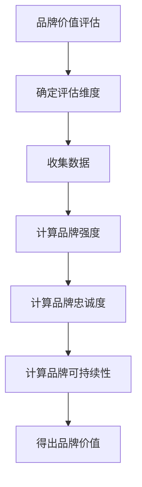
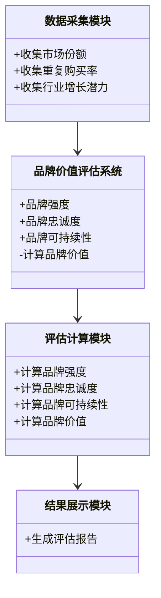
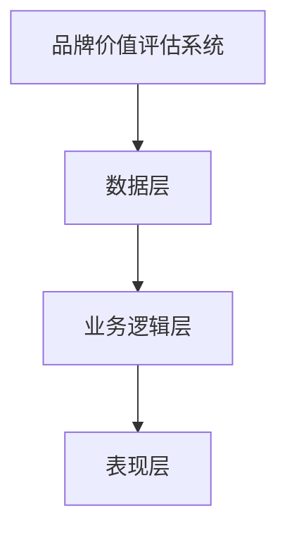

                 


# 巴菲特的品牌价值评估：无形资产的重要性

> **关键词**：巴菲特，品牌价值，无形资产，投资评估，品牌强度

> **摘要**：本文探讨了巴菲特在品牌价值评估中的独特视角，特别是无形资产的重要性。通过分析品牌强度、品牌忠诚度和品牌可持续性等核心维度，结合数学模型和实际案例，展示了如何从技术角度评估品牌价值。文章还详细介绍了系统设计与架构，提供了实际项目中的应用方法，帮助读者更好地理解和应用这些评估方法。

---

## 第一部分：品牌价值评估的背景与重要性

### 第1章：品牌价值评估的背景与重要性

#### 1.1 无形资产在企业价值中的地位

- **1.1.1 无形资产的定义与分类**
  - 无形资产是指企业拥有或控制的没有实物形态的长期资产，主要包括品牌、商誉、专利、商标、特许经营权等。
  - 无形资产可以分为内部无形资产和外部无形资产，内部无形资产如研发成果，外部无形资产如品牌和商誉。

- **1.1.2 无形资产对企业价值的影响**
  - 无形资产是企业核心竞争力的重要组成部分，直接影响企业的市场地位和盈利能力。
  - 在巴菲特的投资理念中，无形资产尤其是品牌价值是决定企业长期竞争优势的关键因素。

- **1.1.3 巴菲特对无形资产的重视**
  - 巴菲特认为，品牌的强弱决定了企业在市场中的生存能力和盈利能力。
  - 他特别关注那些具有强大品牌价值和持续竞争优势的企业，这些企业能够在市场中保持稳定的收益和增长。

#### 1.2 品牌价值的定义与特征

- **1.2.1 品牌价值的定义**
  - 品牌价值是指品牌在市场中所能创造的超额收益，反映了品牌在消费者心中的认知价值和忠诚度。
  - 品牌价值不仅仅是企业的资产之一，更是企业市场竞争力的核心体现。

- **1.2.2 品牌价值的核心要素**
  - **品牌强度**：品牌在市场上与其他竞争对手相比的优势程度。
  - **品牌忠诚度**：消费者对品牌的偏好程度和重复购买意愿。
  - **品牌可持续性**：品牌在未来市场中的长期发展潜力和稳定性。

- **1.2.3 品牌价值与企业价值的关系**
  - 品牌价值是企业整体价值的重要组成部分，特别是在那些品牌驱动型企业中，品牌价值占据了相当大的比重。
  - 巴菲特的投资策略中，品牌价值是评估企业长期盈利能力的关键因素之一。

#### 1.3 巴菲特投资理念中的品牌价值

- **1.3.1 巴菲特投资哲学概述**
  - 巴菲特的投资理念强调长期价值和内在价值，他倾向于投资那些具有强大护城河和持续竞争优势的企业。
  - 在他的投资框架中，品牌价值是评估企业内在价值的重要组成部分。

- **1.3.2 巴菲特对品牌价值的特殊关注**
  - 巴菲特认为，强大的品牌价值能够为企业带来持续的市场份额和定价能力，从而在竞争中占据优势。
  - 他特别关注那些具有强大品牌忠诚度和品牌强度的企业，这些企业能够在经济波动中保持稳定的表现。

- **1.3.3 品牌价值在巴菲特投资决策中的作用**
  - 品牌价值是巴菲特评估企业长期竞争优势的核心指标之一。
  - 他通过分析品牌强度、品牌忠诚度和品牌可持续性，来判断企业是否具有长期投资价值。

---

## 第二部分：巴菲特的品牌价值评估方法

### 第2章：巴菲特的品牌价值评估方法

#### 2.1 巴菲特的品牌价值评估框架

- **2.1.1 品牌强度的评估维度**
  - 品牌强度是衡量品牌在市场上与其他竞争对手相比的优势程度。
  - 评估品牌强度的关键维度包括市场份额、品牌认知度、产品差异化程度和品牌声誉。

- **2.1.2 品牌忠诚度的评估指标**
  - 品牌忠诚度反映了消费者对品牌的偏好程度和重复购买意愿。
  - 评估品牌忠诚度的指标包括客户保留率、重复购买率和品牌推荐度。

- **2.1.3 品牌可持续性评估标准**
  - 品牌可持续性是衡量品牌在未来市场中的发展潜力和稳定性。
  - 评估品牌可持续性的标准包括行业趋势、市场需求、竞争环境和企业创新能力。

#### 2.2 品牌价值的定量评估方法

- **2.2.1 品牌价值的公式与模型**
  - 品牌价值的计算公式为：$$品牌价值 = 品牌强度 \times 品牌忠诚度 \times 品牌可持续性$$
  - 通过将这三个维度进行量化评估，可以得出品牌的总体价值。

- **2.2.2 品牌价值与财务指标的关联**
  - 品牌价值与企业的销售收入、净利润率和市盈率等财务指标密切相关。
  - 通过分析这些财务指标，可以进一步验证品牌价值的合理性。

- **2.2.3 品牌价值的市场验证方法**
  - 品牌价值需要通过市场表现和竞争对手的比较来进行验证。
  - 通过分析企业的市场份额变化和股价表现，可以评估品牌价值的市场认可度。

#### 2.3 巴菲特的经典品牌价值评估案例

- **2.3.1 可口可乐的品牌价值评估**
  - 可口可乐是巴菲特投资的经典案例之一，其强大的品牌价值和市场地位是巴菲特选择投资的主要原因。
  - 可口可乐的品牌强度体现在其全球领先地位和广泛的市场覆盖。
  - 其品牌忠诚度和可持续性也得到了充分体现，长期稳定的收益能力使其成为巴菲特的优质投资标的。

- **2.3.2 保洁公司的品牌价值分析**
  - 保洁公司是另一个巴菲特关注的品牌价值企业，其强大的品牌影响力和市场地位是其品牌价值的核心。
  - 保洁公司的品牌强度和品牌忠诚度在其所处的行业具有显著优势，长期稳定的收益能力是巴菲特投资的重要考量。

- **2.3.3 其他巴菲特投资案例的启示**
  - 巴菲特的投资案例中，品牌价值始终是核心评估因素之一。
  - 通过分析这些案例，我们可以更好地理解品牌价值在企业整体价值中的重要性。

---

## 第三部分：品牌价值评估模型的数学分析

### 第3章：品牌价值评估模型的数学分析

#### 3.1 品牌价值评估的数学模型

- **3.1.1 品牌价值公式：$$品牌价值 = 品牌强度 \times 品牌忠诚度 \times 品牌可持续性$$**
  - 品牌强度：$$品牌强度 = \frac{市场份额}{行业平均市场份额} \times 100$$
  - 品牌忠诚度：$$品牌忠诚度 = \frac{重复购买率}{行业平均重复购买率} \times 100$$
  - 品牌可持续性：$$品牌可持续性 = \frac{行业增长潜力 + 竞争优势}{2}$$

- **3.1.2 品牌强度的计算方法**
  - 通过市场调研和数据分析，获取企业的市场份额和行业平均市场份额。
  - 计算品牌强度，评估企业在市场中的相对优势。

- **3.1.3 品牌忠诚度的量化指标**
  - 通过消费者调查和数据分析，获取企业的重复购买率和行业平均重复购买率。
  - 计算品牌忠诚度，评估消费者对品牌的偏好程度。

#### 3.2 品牌价值与财务指标的关系

- **3.2.1 品牌价值与销售收入的关系**
  - 品牌价值与销售收入呈正相关关系，强大的品牌价值能够为企业带来更高的销售收入。
  - $$销售收入 = 品牌价值 \times 销量$$

- **3.2.2 品牌价值与净利润率的关联**
  - 品牌价值与净利润率密切相关，强大的品牌价值能够提高企业的利润率。
  - $$净利润率 = \frac{净利润}{销售收入} \times 100$$

- **3.2.3 品牌价值与市盈率的互动**
  - 品牌价值影响企业的市盈率，强大的品牌价值通常会提高企业的市盈率。
  - $$市盈率 = \frac{股价}{每股收益}$$

#### 3.3 品牌价值评估的流程图



---

## 第四部分：系统分析与架构设计

### 第4章：系统分析与架构设计

#### 4.1 问题场景介绍

- **目标**：设计一个品牌价值评估系统，能够量化评估企业的品牌价值。
- **范围**：包括品牌强度、品牌忠诚度和品牌可持续性三个维度。
- **用户需求**：企业希望通过系统评估品牌价值，优化品牌管理策略。

#### 4.2 系统功能设计

- **领域模型**：品牌价值评估系统涉及的主要实体包括品牌、企业、市场和消费者。
- **功能模块**：
  - 数据采集模块：收集品牌相关数据。
  - 评估计算模块：计算品牌强度、品牌忠诚度和品牌可持续性。
  - 结果展示模块：生成品牌价值评估报告。



#### 4.3 系统架构设计

- **系统架构**：采用分层架构，包括数据层、业务逻辑层和表现层。
- **接口设计**：提供API接口，方便与其他系统集成。



---

## 第五部分：项目实战

### 第5章：项目实战

#### 5.1 环境安装

- **工具安装**：安装Python和相关库（如numpy、pandas、scikit-learn）。
- **数据准备**：收集相关品牌的数据，包括市场份额、重复购买率和行业增长潜力。

#### 5.2 核心代码实现

- **数据采集模块**：
  ```python
  import pandas as pd

  def collect_data():
      data = {
          '品牌': ['A', 'B', 'C'],
          '市场份额': [25, 30, 20],
          '重复购买率': [0.7, 0.6, 0.5],
          '行业增长潜力': [0.8, 0.7, 0.6]
      }
      return pd.DataFrame(data)
  ```

- **评估计算模块**：
  ```python
  def calculate_brand_value(data):
      data['品牌强度'] = (data['市场份额'] / data['市场份额'].mean()) * 100
      data['品牌忠诚度'] = (data['重复购买率'] / data['重复购买率'].mean()) * 100
      data['品牌可持续性'] = (data['行业增长潜力'] + 1) / 2
      data['品牌价值'] = data['品牌强度'] * data['品牌忠诚度'] * data['品牌可持续性']
      return data
  ```

- **结果展示模块**：
  ```python
  def display_results(data):
      print(data[['品牌', '品牌价值']])
  ```

#### 5.3 案例分析与项目总结

- **案例分析**：
  ```python
  data = collect_data()
  brand_value = calculate_brand_value(data)
  display_results(brand_value)
  ```

- **项目总结**：
  通过本项目，我们成功设计了一个品牌价值评估系统，能够量化评估企业的品牌价值。系统的核心在于准确的数据采集和科学的评估模型，确保评估结果的准确性和可靠性。

---

## 第六部分：总结与展望

### 第6章：总结与展望

#### 6.1 最佳实践 tips

- 确保数据的准确性和完整性。
- 选择合适的评估模型和工具。
- 定期更新和优化评估系统。

#### 6.2 小结

本文从技术角度探讨了巴菲特的品牌价值评估方法，特别是无形资产的重要性。通过数学模型和实际案例，展示了如何量化评估品牌价值，并设计了一个完整的品牌价值评估系统。

#### 6.3 注意事项

- 品牌价值评估需要结合企业的实际情况。
- 注意数据的可靠性和模型的适用性。
- 定期更新评估模型以适应市场变化。

#### 6.4 拓展阅读

- 建议读者进一步阅读巴菲特的投资哲学和品牌管理的相关书籍，深入了解品牌价值评估的理论和实践。

---

## 作者信息

作者：AI天才研究院/AI Genius Institute & 禅与计算机程序设计艺术/Zen And The Art of Computer Programming

