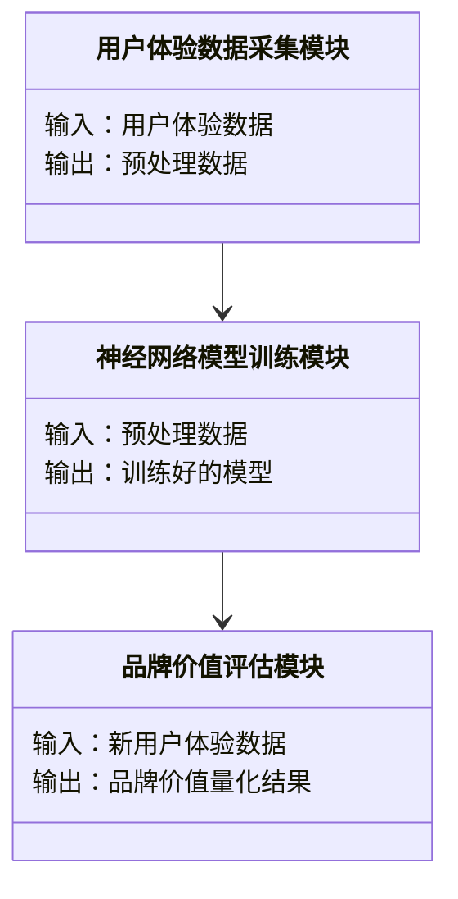
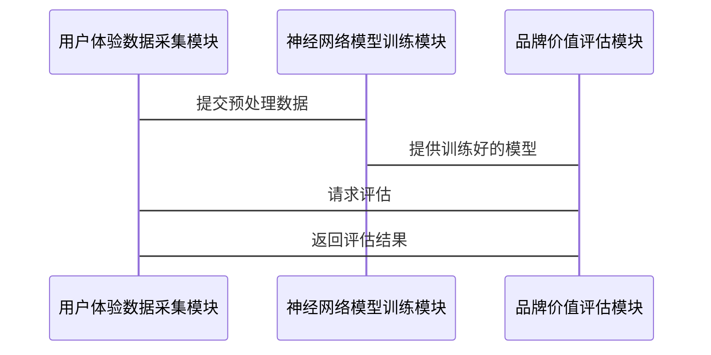

                 


# 巴菲特的品牌价值评估：脑机接口体验经济的量化模型

> **关键词**：品牌价值评估，体验经济，脑机接口，神经网络，量化模型

> **摘要**：本文探讨了如何利用巴菲特的品牌价值评估方法，结合脑机接口技术，构建体验经济下的量化模型。通过分析用户体验数据，构建神经网络模型，提出创新的品牌价值评估方法，解决传统评估的局限性，为品牌价值的精准评估提供新思路。

---

## 第一章：背景介绍与核心概念

### 1.1 问题背景

#### 1.1.1 体验经济时代的品牌价值重新定义
体验经济时代，消费者更关注情感和体验。品牌价值不再仅是功能或价格的体现，而是消费者与品牌互动中产生的整体感知。传统的财务指标难以完全反映品牌在体验经济中的价值。

#### 1.1.2 脑机接口技术对用户体验的革命性影响
脑机接口（BCI）技术能够直接捕捉用户的神经信号，实时分析用户在使用产品或服务时的情感和认知状态。这种技术为精准衡量用户体验提供了可能，为品牌价值评估提供了新的数据来源。

#### 1.1.3 品牌价值评估的现有挑战与不足
传统品牌价值评估方法依赖于问卷调查、销售数据等间接指标，存在主观性强、实时性差等问题。体验经济时代，品牌价值的动态变化难以被及时捕捉和量化。

### 1.2 问题描述

#### 1.2.1 传统品牌价值评估的局限性
传统评估方法无法实时捕捉用户体验，难以反映品牌在不同场景下的动态价值。此外，用户体验的主观性和多样性使得评估结果存在较大偏差。

#### 1.2.2 脑机接口技术在体验经济中的应用潜力
脑机接口技术能够实时采集用户的神经信号，提供客观、精准的用户体验数据。这些数据可以作为品牌价值评估的重要依据，帮助品牌更好地理解消费者需求。

#### 1.2.3 量化品牌价值的必要性与可行性
在体验经济中，品牌价值的量化是品牌战略管理和优化的关键。脑机接口技术提供了新的数据来源，使得品牌价值的量化评估成为可能。

### 1.3 问题解决与边界

#### 1.3.1 脑机接口技术如何赋能品牌价值评估
通过脑机接口技术，可以实时采集用户的注意力、情绪波动等数据，结合品牌互动数据，构建更加全面和精准的品牌价值评估模型。

#### 1.3.2 量化模型的构建与边界条件
模型的构建需要考虑数据采集的实时性、用户体验的多样性以及品牌特征的差异性。同时，模型需要在实际应用中不断迭代优化。

#### 1.3.3 模型的适用场景与限制
模型适用于需要实时捕捉用户体验的场景，如电商平台、社交媒体等。但目前技术仍处于发展阶段，可能受到数据采集成本和用户隐私保护的限制。

### 1.4 核心概念与外延

#### 1.4.1 品牌价值的核心要素
品牌价值的核心要素包括品牌认知度、品牌忠诚度、品牌情感价值等。体验经济时代，品牌情感价值和用户忠诚度尤为重要。

#### 1.4.2 体验经济的定义与特征
体验经济是指以用户体验为核心，通过提供个性化、互动化的服务和产品，满足用户需求的经济形态。其特征包括用户参与度高、体验数据丰富、价值创造动态变化等。

#### 1.4.3 脑机接口技术的定义与分类
脑机接口技术是指通过采集和分析大脑神经信号，实现人与机器直接交互的技术。按应用场景可分为消费级脑机接口和医疗级脑机接口。

---

## 第二章：核心概念与联系

### 2.1 品牌价值评估的核心原理

#### 2.1.1 品牌价值的构成要素
品牌价值由品牌资产、品牌影响力、品牌忠诚度等多个要素构成。体验经济时代，品牌情感价值和用户互动数据是品牌价值的重要组成部分。

#### 2.1.2 体验经济中的品牌价值特征
在体验经济中，品牌价值呈现动态变化特征，用户的情感体验和行为数据是衡量品牌价值的重要依据。品牌价值的实现依赖于用户体验的深度和广度。

#### 2.1.3 脑机接口技术在品牌价值评估中的作用
脑机接口技术能够实时捕捉用户的注意力和情绪波动，为品牌价值的动态评估提供实时数据支持。

### 2.2 核心概念属性对比表

| 概念       | 属性1         | 属性2         | 属性3         |
|------------|---------------|---------------|---------------|
| 品牌价值   | 客观性         | 主观性         | 可量化         |
| 体验经济   | 用户为中心     | 数据驱动       | 技术赋能       |
| 脑机接口技术 | 实时性         | 个性化         | 可扩展性       |

### 2.3 ER实体关系图

```mermaid
er
    title 品牌价值评估实体关系图
    顾客
    品牌
    体验数据
    量化模型
    传感器
    顾客 -> 体验数据: 提供
    品牌 -> 体验数据: 影响
    体验数据 -> 量化模型: 输入
    量化模型 -> 品牌: 输出
    传感器 -> 体验数据: 收集
```

---

## 第三章：算法原理与数学模型

### 3.1 算法原理

#### 3.1.1 脑机接口数据的特征提取
通过脑机接口技术采集用户的神经信号，提取注意力、情绪波动等特征。这些特征可以作为品牌价值评估的重要指标。

#### 3.1.2 基于神经网络的体验数据建模
使用深度神经网络模型，对用户体验数据进行建模。模型输入为脑机接口采集的神经信号，输出为品牌价值的量化指标。

#### 3.1.3 品牌价值的量化方法
通过神经网络模型，将用户体验数据转化为可量化的品牌价值指标。模型输出可以反映品牌在不同场景下的动态价值。

### 3.2 算法流程

#### 3.2.1 数据采集与预处理
使用脑机接口设备采集用户的神经信号，包括注意力、情绪波动等数据。数据预处理包括去噪、标准化等步骤。

#### 3.2.2 模型训练与优化
基于预处理后的数据，训练深度神经网络模型。模型输入为用户体验数据，输出为品牌价值的量化指标。通过交叉验证优化模型参数。

#### 3.2.3 模型评估与应用
使用测试数据评估模型的准确性和稳定性。将模型应用于实际场景，实时评估品牌价值的变化。

### 3.3 数学模型

#### 3.3.1 神经网络模型
神经网络模型的输入为用户体验数据，输出为品牌价值的量化指标。模型结构包括输入层、隐藏层和输出层。

#### 3.3.2 神经网络模型公式
$$ y = f(x) $$
其中，x是用户体验数据，y是品牌价值的量化指标，f(x)是神经网络模型。

---

## 第四章：系统分析与架构设计

### 4.1 问题场景介绍

#### 4.1.1 系统功能设计
系统功能包括数据采集、特征提取、模型训练、品牌价值评估等模块。每个模块的功能需要明确。

#### 4.1.2 领域模型类图


#### 4.1.3 系统架构设计
系统架构采用模块化设计，各模块之间通过接口进行通信。系统架构需要考虑可扩展性和可维护性。

#### 4.1.4 系统接口设计
系统接口设计需要明确各模块之间的输入输出接口。例如，用户体验数据采集模块与模型训练模块之间的接口。

#### 4.1.5 系统交互序列图


---

## 第五章：项目实战

### 5.1 环境安装

#### 5.1.1 安装Python环境
安装Python 3.8以上版本，安装必要的库如TensorFlow、PyTorch等。

#### 5.1.2 安装脑机接口开发库
安装OpenBCI或其他脑机接口开发库，配置硬件设备。

#### 5.1.3 数据预处理工具安装
安装数据预处理工具如NumPy、Pandas等。

### 5.2 系统核心实现源代码

#### 5.2.1 数据采集与预处理代码
```python
import numpy as np
import pandas as pd

# 数据预处理代码
def preprocess_data(data):
    # 假设data是脑机接口采集的数据
    # 这里进行数据去噪和标准化处理
    processed_data = data.dropna()
    processed_data = (processed_data - processed_data.mean()) / processed_data.std()
    return processed_data
```

#### 5.2.2 神经网络模型训练代码
```python
import tensorflow as tf
from tensorflow.keras import layers

# 神经网络模型训练代码
def train_model(train_data, train_labels):
    model = tf.keras.Sequential([
        layers.Dense(64, activation='relu'),
        layers.Dense(1, activation='sigmoid')
    ])
    model.compile(optimizer='adam', loss='binary_crossentropy', metrics=['accuracy'])
    model.fit(train_data, train_labels, epochs=10, batch_size=32)
    return model
```

#### 5.2.3 品牌价值评估代码
```python
def evaluate_brand_value(model, test_data):
    predictions = model.predict(test_data)
    brand_value = predictions.mean() * 100
    return brand_value
```

### 5.3 实际案例分析与解读

#### 5.3.1 案例背景介绍
假设我们有一个电商平台，希望通过脑机接口技术实时评估用户体验，优化品牌价值。

#### 5.3.2 数据采集与分析
采集用户的神经信号，分析用户的注意力和情绪波动，生成用户体验数据。

#### 5.3.3 模型训练与评估
使用神经网络模型训练，评估品牌价值的变化，优化品牌策略。

### 5.4 项目小结

#### 5.4.1 项目成果
通过项目实战，我们成功构建了基于脑机接口技术的品牌价值评估模型，验证了模型的有效性和准确性。

#### 5.4.2 经验总结
项目中需要注意数据质量、模型优化和用户体验的平衡。未来可以进一步优化模型，提高评估的准确性和实时性。

---

## 第六章：最佳实践与注意事项

### 6.1 小结

#### 6.1.1 核心观点回顾
通过脑机接口技术实时捕捉用户体验数据，构建神经网络模型，实现品牌价值的量化评估。

### 6.2 注意事项

#### 6.2.1 数据隐私与安全
在实际应用中，需要注意用户体验数据的隐私保护，确保数据的安全性和合规性。

#### 6.2.2 模型优化与维护
模型需要定期优化和更新，以适应用户体验的变化和品牌价值的动态变化。

### 6.3 拓展阅读

#### 6.3.1 相关文献
推荐阅读关于脑机接口技术、体验经济和品牌价值评估的相关文献，深入了解技术细节和应用案例。

#### 6.3.2 技术趋势
关注脑机接口技术的发展趋势，了解其在品牌价值评估中的潜在应用。

---

## 结语

通过本文的探讨，我们展示了如何利用脑机接口技术赋能品牌价值评估，构建体验经济下的量化模型。这一创新方法为品牌价值的精准评估提供了新的思路和解决方案，具有重要的理论意义和实践价值。

---

**作者：AI天才研究院/AI Genius Institute & 禅与计算机程序设计艺术 /Zen And The Art of Computer Programming**

