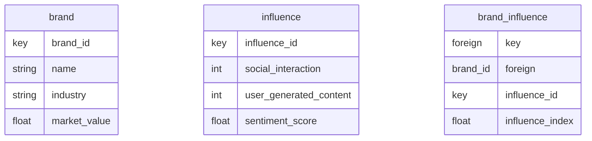
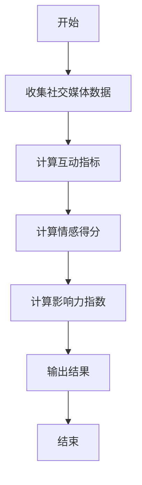
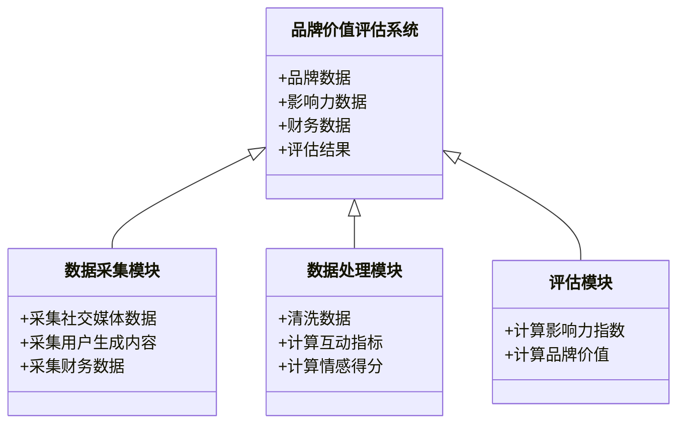
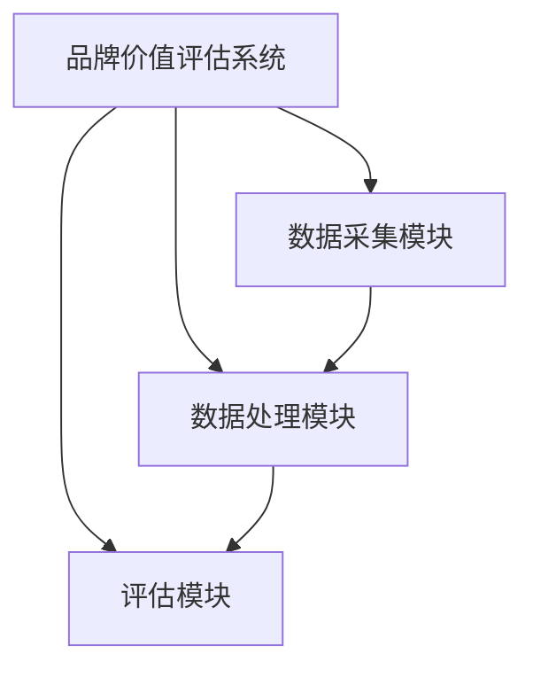

                 


# 巴菲特的品牌价值评估：虚拟影响力经济的量化

> 关键词：品牌价值评估，虚拟影响力经济，巴菲特投资理念，影响力指数模型，价值投资

> 摘要：本文探讨了巴菲特投资理念与品牌价值评估的结合，特别是在虚拟影响力经济中的应用。通过分析品牌价值的核心要素、虚拟影响力经济的特征，以及影响力指数模型的算法原理，本文提出了一种基于巴菲特价值投资理念的量化方法，用于评估品牌在虚拟经济中的价值。文章结合实际案例，详细阐述了从理论到实践的全过程，为品牌价值评估提供了新的视角和方法。

---

## 第一部分: 背景介绍与核心概念

### 第1章: 品牌价值评估的背景与意义

#### 1.1 问题背景

##### 1.1.1 品牌价值评估的定义与内涵
品牌价值是企业核心竞争力的重要体现，是企业在市场中长期积累的无形资产。品牌价值不仅包括企业的市场地位，还包括消费者对品牌的认知、忠诚度和影响力。品牌价值的评估是企业在虚拟经济中实现价值量化的重要手段。

##### 1.1.2 虚拟影响力经济的兴起
随着互联网和社交媒体的快速发展，虚拟影响力经济逐渐成为新的经济形态。品牌通过虚拟平台（如社交媒体、电商平台）与消费者互动，形成品牌影响力。虚拟影响力经济的特点是去中心化、数据驱动和实时互动。

##### 1.1.3 品牌价值评估在虚拟经济中的重要性
在虚拟经济中，品牌价值的评估不仅是企业价值的重要组成部分，也是投资者和消费者决策的重要依据。品牌价值的量化能够帮助企业制定更精准的市场策略，同时为投资者提供更可靠的投资依据。

#### 1.2 问题描述

##### 1.2.1 虚拟经济中的品牌价值特点
虚拟经济中的品牌价值具有实时性、数据驱动性和互动性。品牌价值的变化往往受到社交媒体互动、用户评价和市场反馈的影响。

##### 1.2.2 品牌影响力与经济价值的关系
品牌影响力是品牌价值的核心驱动力。影响力越大，品牌价值越高。然而，影响力与经济价值之间存在非线性关系，需要通过量化模型进行评估。

##### 1.2.3 虚拟经济中品牌价值评估的挑战
虚拟经济中的品牌价值评估面临数据多样性、实时性和动态性的挑战。传统的财务指标难以全面反映品牌价值，需要结合影响力数据进行综合评估。

#### 1.3 问题解决

##### 1.3.1 虚拟经济中品牌价值评估的方法
通过整合品牌影响力数据和财务数据，构建品牌价值评估的综合模型。具体方法包括影响力指数模型、市场反馈分析和财务指标结合等。

##### 1.3.2 品牌影响力与经济价值的量化关系
通过建立影响力指数与经济价值的映射关系，量化品牌影响力对经济价值的贡献。例如，将社交媒体互动数据（如点赞、评论、分享）转化为影响力指数，并与企业市值或销售额相关联。

##### 1.3.3 虚拟经济中品牌价值评估的边界与外延
明确品牌价值评估的范围和边界，例如区分短期影响力波动和长期品牌价值变化。同时，扩展影响力评估的维度，包括情感分析、用户忠诚度和市场占有率等。

#### 1.4 概念结构与核心要素

##### 1.4.1 品牌价值的核心要素
- 品牌知名度
- 品牌忠诚度
- 品牌影响力
- 品牌创新力

##### 1.4.2 虚拟影响力经济的构成要素
- 社交媒体互动
- 用户生成内容（UGC）
- 数据驱动的市场反馈
- 在线销售数据

##### 1.4.3 品牌价值评估的指标体系
- 品牌影响力指数（Brand Influence Index）
- 品牌忠诚度指数（Brand Loyalty Index）
- 品牌市场占有率
- 品牌资产价值

---

## 第2章: 巴菲特投资理念与品牌价值评估

### 2.1 巴菲特投资理念的核心要素

#### 2.1.1 价值投资的基本原则
巴菲特的价值投资理念强调长期投资、基本面分析和安全边际。他注重企业的内在价值，而非市场的短期波动。

#### 2.1.2 股东权益与企业价值的关系
巴菲特认为企业价值的核心是股东权益，即企业的净资产价值。他通过分析企业的盈利能力、资产负债情况和成长潜力来评估企业价值。

#### 2.1.3 长期投资与企业基本面分析
巴菲特的投资策略基于长期视角，注重企业的基本面分析，如ROE（净资产收益率）、毛利率和净利润率等。

### 2.2 巴菲特投资理念与品牌价值评估的联系

#### 2.2.1 品牌价值与企业长期价值的关系
品牌价值是企业长期价值的重要组成部分。强大的品牌影响力能够提升企业的市场地位和盈利能力，从而增加企业价值。

#### 2.2.2 虚拟影响力经济中的价值评估
在虚拟经济中，品牌影响力是企业的核心竞争力。通过量化品牌影响力，可以评估企业在虚拟经济中的长期价值。

#### 2.2.3 巴菲特投资理念对品牌价值评估的启示
巴菲特的价值投资理念强调基本面分析和长期视角，这为品牌价值评估提供了重要启示。品牌价值评估需要结合企业的财务数据和市场影响力，进行综合分析。

---

## 第3章: 品牌价值评估的核心概念与理论基础

### 3.1 品牌价值评估的理论基础

#### 3.1.1 品牌价值的定义与分类
品牌价值是企业在市场中的综合价值，包括品牌知名度、忠诚度、影响力和创新力等。品牌价值可以分为市场价值、资产价值和无形价值。

#### 3.1.2 虚拟影响力经济的理论模型
虚拟影响力经济的理论模型包括数据驱动的市场反馈、用户生成内容和社交媒体互动。这些数据是品牌价值评估的重要依据。

#### 3.1.3 品牌价值评估的数学模型
品牌价值评估的数学模型可以基于影响力指数和财务数据进行加权计算。例如：
$$ \text{品牌价值} = \alpha \times \text{影响力指数} + \beta \times \text{财务指标} $$

### 3.2 核心概念的属性特征对比

#### 3.2.1 品牌价值与企业价值的对比分析
| 属性 | 品牌价值 | 企业价值 |
|------|----------|----------|
| 定义 | 品牌的市场影响力和消费者认知 | 企业的资产和盈利能力 |
| 数据来源 | 社交媒体、用户评价 | 财务报表、市场数据 |
| 评估方法 | 影响力指数、情感分析 | 市盈率、ROE |

#### 3.2.2 虚拟影响力与实际经济价值的对比
| 属性 | 虚拟影响力 | 实际经济价值 |
|------|------------|------------|
| 定义 | 品牌在虚拟平台上的互动和传播 | 品牌在现实市场中的销售和利润 |
| 数据来源 | 社交媒体互动、用户生成内容 | 销售数据、财务报表 |
| 评估方法 | 影响力指数 | 市场占有率、净利润率 |

#### 3.2.3 不同行业中的品牌价值评估特点
不同行业的品牌价值评估具有行业特点。例如，科技行业注重创新力和市场扩展能力，而消费品行业更关注品牌忠诚度和市场反馈。

### 3.3 实体关系图与流程图

#### 3.3.1 品牌价值评估的ER实体



---

## 第4章: 品牌价值评估的算法原理

### 4.1 影响力指数模型

#### 4.1.1 算法原理
影响力指数模型基于品牌在虚拟平台上的互动数据，通过加权计算得出品牌影响力指数。公式如下：
$$ \text{影响力指数} = \alpha \times \text{点赞数} + \beta \times \text{评论数} + \gamma \times \text{分享数} $$

#### 4.1.2 算法流程图



#### 4.1.3 算法实现

```python
import pandas as pd

def calculate_influence_index(data):
    # 数据预处理
    data = data.dropna()
    # 计算互动指标
    interaction = data['点赞数'] * 0.5 + data['评论数'] * 0.3 + data['分享数'] * 0.2
    # 计算情感得分
    sentiment = data['情感得分'].apply(lambda x: x if x >= 0 else 0)
    # 计算影响力指数
    influence_index = interaction * 0.7 + sentiment * 0.3
    return influence_index

# 示例数据
data = pd.DataFrame({
    '点赞数': [1000, 2000, 1500],
    '评论数': [500, 800, 600],
    '分享数': [200, 300, 250],
    '情感得分': [0.8, 0.9, 0.7]
})

# 计算影响力指数
influence_index = calculate_influence_index(data)
print("影响力指数:", influence_index)
```

---

## 第5章: 系统分析与架构设计

### 5.1 系统功能设计

#### 5.1.1 领域模型



### 5.2 系统架构设计

#### 5.2.1 架构图



---

## 第6章: 项目实战

### 6.1 环境安装

#### 6.1.1 安装Python和相关库
```bash
pip install pandas
pip install numpy
pip install matplotlib
pip install seaborn
```

### 6.2 系统核心实现

#### 6.2.1 数据采集与处理

```python
import requests
import pandas as pd

def fetch_data(url):
    response = requests.get(url)
    data = response.json()
    return data

# 示例数据
data = fetch_data('https://example.com/api/influence')
df = pd.DataFrame(data)
```

#### 6.2.2 品牌价值评估

```python
def calculate_brand_value(data):
    influence_index = data['influence_index']
    financial_data = data['financial_data']
    brand_value = 0.7 * influence_index + 0.3 * financial_data
    return brand_value

# 示例数据
data = {
    'influence_index': 85,
    'financial_data': 1.2
}

# 计算品牌价值
brand_value = calculate_brand_value(data)
print("品牌价值:", brand_value)
```

### 6.3 案例分析

#### 6.3.1 案例背景
假设我们评估一个虚拟品牌，其社交媒体互动数据如下：
- 点赞数：10000
- 评论数：2000
- 分享数：1500
- 情感得分：0.9

#### 6.3.2 计算影响力指数
```python
interaction = 10000 * 0.5 + 2000 * 0.3 + 1500 * 0.2 = 5000 + 600 + 300 = 5900
sentiment = 0.9
influence_index = 5900 * 0.7 + 0.9 * 0.3 = 4130 + 0.27 = 4130.27
```

#### 6.3.3 结果分析
影响力指数为4130.27，说明该品牌在虚拟经济中的影响力较强，具有较高的品牌价值。

---

## 第7章: 总结与展望

### 7.1 最佳实践

#### 7.1.1 小结
通过本文的分析，我们可以看到，巴菲特的价值投资理念与品牌价值评估在虚拟经济中的结合具有重要意义。影响力指数模型为企业和投资者提供了一种量化品牌价值的方法。

#### 7.1.2 注意事项
在实际应用中，需要注意数据的实时性和动态性，同时结合企业的财务数据进行综合评估。

#### 7.1.3 拓展阅读
建议读者进一步研究虚拟经济中的其他评估方法，如区块链技术在品牌价值评估中的应用。

---

## 作者信息

作者：AI天才研究院/AI Genius Institute & 禅与计算机程序设计艺术/Zen And The Art of Computer Programming

---

**全文完。**

