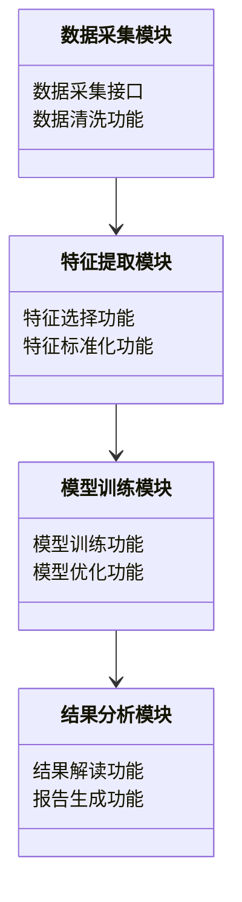
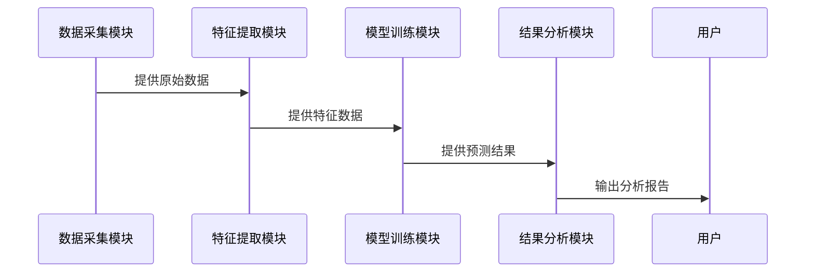

                 


# 巴菲特的品牌忠诚度分析：虚拟身份经济下的消费者行为

## 关键词：
- 巴菲特
- 品牌忠诚度
- 虚拟身份经济
- 消费者行为
- 机器学习
- 数据分析

## 摘要：
本文从巴菲特的投资理念出发，深入分析品牌忠诚度在虚拟身份经济下的消费者行为中的作用。通过结合现代数据分析和机器学习技术，探讨如何量化品牌忠诚度，预测消费者行为，并为企业制定精准的市场策略提供理论依据和实践指导。

---

# 第一部分：背景介绍

## 第1章：巴菲特的投资理念与品牌忠诚度分析

### 1.1 巴菲特的投资理念概述

#### 1.1.1 巴菲特的价值投资理论
巴菲特的价值投资理论强调长期投资、注重基本面分析和安全边际。他认为，投资的核心在于理解企业的内在价值，并通过长期持有优质资产实现财富增长。品牌忠诚度作为企业长期价值的重要组成部分，与巴菲特的投资理念高度契合。

#### 1.1.2 巴菲特对品牌忠诚度的重视
在巴菲特看来，品牌忠诚度是企业持续盈利能力的关键因素。消费者对品牌的忠诚不仅意味着重复购买，还可能带来更高的溢价支付能力和口碑传播效应。这种忠诚度是企业抵御市场竞争的重要壁垒。

#### 1.1.3 巴菲特投资理念的现代应用
随着虚拟身份经济的兴起，品牌忠诚度的内涵和外延发生了变化。消费者在虚拟空间中的行为数据为品牌忠诚度的分析提供了新的维度。巴菲特的投资理念需要结合现代技术手段，如大数据分析和人工智能，才能更好地指导投资实践。

### 1.2 品牌忠诚度的定义与特征

#### 1.2.1 品牌忠诚度的定义
品牌忠诚度是指消费者在面对多个品牌选择时，持续选择某一特定品牌的行为倾向。这种倾向可能源于品牌质量、情感认同、价格敏感度等多种因素。

#### 1.2.2 品牌忠诚度的分类
品牌忠诚度可分为行为忠诚和态度忠诚。行为忠诚是指消费者在实际购买中重复选择某一品牌，而态度忠诚则指消费者在情感上对品牌有强烈的认同感。两者的结合才能形成真正的品牌忠诚。

#### 1.2.3 品牌忠诚度的影响因素
影响品牌忠诚度的因素包括产品质量、品牌认知度、价格、服务体验、情感纽带等。在虚拟身份经济下，社交属性和数字互动也成为了重要影响因素。

### 1.3 虚拟身份经济的兴起

#### 1.3.1 虚拟身份的定义与特点
虚拟身份是指消费者在数字空间中通过社交媒体、电商平台等渠道建立的个人或品牌标识。虚拟身份具有可塑性、可追踪性和数据化的特点。

#### 1.3.2 虚拟身份经济的现状
随着互联网和移动支付的普及，虚拟身份经济迅速发展。消费者在虚拟空间中的行为数据为品牌分析提供了丰富的信息来源，同时也催生了新的商业模式。

#### 1.3.3 虚拟身份与消费者行为的关系
虚拟身份通过数据化和社交化的方式，强化了消费者与品牌之间的互动。消费者在虚拟空间中的行为不仅影响其个人决策，还可能通过数据传播影响其他消费者的购买行为。

## 第2章：品牌忠诚度分析的核心概念

### 2.1 品牌忠诚度的理论模型

#### 2.1.1 AIO模型
AIO模型（Attitude, Intention, and Objective）将品牌忠诚度分解为态度、意图和目标三个维度。该模型强调消费者对品牌的情感认同和行为倾向。

#### 2.1.2 生命周期模型
生命周期模型将品牌忠诚度分为认知、考虑、忠诚和拥护四个阶段。每个阶段对应不同的消费者行为和品牌互动方式。

#### 2.1.3 行为忠诚与态度忠诚
行为忠诚关注消费者实际的购买行为，而态度忠诚关注消费者的情感认同。两者的结合是品牌忠诚度的核心。

### 2.2 虚拟身份与品牌忠诚度的关系

#### 2.2.1 虚拟身份对品牌忠诚度的影响
虚拟身份通过数据化和社交化的方式，增强了消费者与品牌之间的互动。消费者在虚拟空间中的行为数据为品牌忠诚度的分析提供了新的维度。

#### 2.2.2 虚拟身份的社交属性与品牌忠诚度
虚拟身份的社交属性通过口碑传播、用户评价等方式，强化了消费者对品牌的认同感。社交网络中的品牌影响力对品牌忠诚度的提升具有重要作用。

#### 2.2.3 虚拟身份的经济价值与品牌忠诚度
虚拟身份的经济价值体现在数据变现和品牌推广方面。通过虚拟身份的经济价值，品牌可以更好地理解消费者需求，优化市场策略。

### 2.3 消费者行为分析的核心要素

#### 2.3.1 消费者决策过程
消费者决策过程包括问题识别、信息搜索、评估比较、购买决策和购后行为五个阶段。品牌忠诚度在每个阶段都起着重要作用。

#### 2.3.2 消费者认知与品牌记忆
消费者认知是指消费者对品牌的核心价值和特色的理解。品牌记忆则是消费者在长期接触中形成的对品牌的印象。

#### 2.3.3 消费者情感与品牌认同
消费者情感是品牌忠诚度的重要驱动力。消费者对品牌的认同感越强，品牌忠诚度越高。

---

# 第二部分：品牌忠诚度分析的算法原理

## 第3章：品牌忠诚度预测模型

### 3.1 品牌忠诚度预测的算法选择

#### 3.1.1 线性回归模型
线性回归模型通过建立因变量（品牌忠诚度）与自变量（消费者特征）之间的线性关系，预测品牌忠诚度。该模型简单易懂，但适用于变量关系较为线性的场景。

#### 3.1.2 支持向量机（SVM）
支持向量机是一种基于统计学习理论的分类算法，适用于高维数据的非线性分类问题。在品牌忠诚度预测中，SVM可以有效处理复杂的消费者行为模式。

#### 3.1.3 随机森林与决策树
随机森林是一种基于决策树的集成算法，具有高精度和强健性。在品牌忠诚度预测中，随机森林可以处理复杂的特征交互和非线性关系。

### 3.2 基于机器学习的品牌忠诚度预测

#### 3.2.1 数据预处理与特征提取
数据预处理包括数据清洗、特征选择和数据标准化。特征提取则需要根据消费者行为数据，提取关键特征变量。

#### 3.2.2 模型训练与优化
通过交叉验证和网格搜索，优化模型的超参数，提高预测精度。模型训练过程中，需要避免过拟合和欠拟合问题。

#### 3.2.3 模型评估与验证
通过准确率、召回率和F1分数等指标，评估模型的性能。验证过程需要使用独立的测试数据集，确保模型的泛化能力。

### 3.3 基于深度学习的品牌忠诚度分析

#### 3.3.1 神经网络模型
神经网络模型通过多层非线性变换，捕捉复杂的消费者行为模式。适用于高维和非线性的品牌忠诚度预测问题。

#### 3.3.2 卷积神经网络（CNN）
卷积神经网络适用于图像和序列数据的处理。在品牌忠诚度分析中，可以用于处理消费者行为的时间序列数据。

#### 3.3.3 循环神经网络（RNN）
循环神经网络适用于处理序列数据，能够捕捉消费者行为的时序特征。在品牌忠诚度预测中，RNN可以有效处理消费者行为的历史数据。

---

# 第三部分：系统架构与实现

## 第4章：系统架构设计

### 4.1 系统功能模块划分

#### 4.1.1 数据采集模块
数据采集模块负责从各种渠道获取消费者行为数据，包括社交媒体、电商平台和问卷调查等。

#### 4.1.2 特征提取模块
特征提取模块通过对原始数据进行特征工程，提取与品牌忠诚度相关的特征变量。

#### 4.1.3 模型训练模块
模型训练模块负责选择合适的算法，进行模型训练和优化，输出品牌忠诚度预测模型。

#### 4.1.4 结果分析模块
结果分析模块通过对模型输出进行解读，生成品牌忠诚度分析报告，并提供市场策略建议。

### 4.2 系统架构设计

#### 4.2.1 系统功能设计（领域模型Mermaid类图）


#### 4.2.2 系统架构设计（Mermaid架构图）
```mermaid
docker
    services {
        数据采集服务
        特征提取服务
        模型训练服务
        结果分析服务
    }
    networks {
        采集网络
        提取网络
        训练网络
        分析网络
    }
```

### 4.3 系统接口设计

#### 4.3.1 数据采集接口
数据采集接口负责从社交媒体、电商平台等渠道获取消费者行为数据。接口设计需要考虑数据格式、数据量和数据频率。

#### 4.3.2 模型调用接口
模型调用接口负责接收消费者特征数据，调用训练好的模型，输出品牌忠诚度预测结果。接口设计需要考虑性能和安全性。

### 4.4 系统交互设计（Mermaid序列图）



---

# 第四部分：项目实战

## 第5章：项目实战与案例分析

### 5.1 项目环境安装

#### 5.1.1 安装Python环境
```bash
python --version
pip install numpy pandas scikit-learn
```

#### 5.1.2 数据集获取
从公开数据集或企业内部数据中获取消费者行为数据，包括购买记录、社交媒体互动数据等。

### 5.2 系统核心实现源代码

#### 5.2.1 数据预处理代码
```python
import pandas as pd
from sklearn.preprocessing import StandardScaler

# 数据加载
data = pd.read_csv('consumer_behavior.csv')

# 数据清洗
data.dropna(inplace=True)
data = data.drop_duplicates()

# 特征选择
features = ['age', 'gender', 'purchase_frequency', 'customer_lifetime_value']
target = 'loyalty_score'

# 特征标准化
scaler = StandardScaler()
data_scaled = scaler.fit_transform(data[features])

print(data_scaled)
```

#### 5.2.2 模型训练代码
```python
from sklearn.ensemble import RandomForestClassifier
from sklearn.metrics import accuracy_score

# 模型训练
model = RandomForestClassifier(n_estimators=100, max_depth=5, random_state=42)
model.fit(data_scaled, data[target])

# 模型预测
predictions = model.predict(data_scaled)

# 模型评估
print("Accuracy:", accuracy_score(data[target], predictions))
```

### 5.3 代码应用解读与分析

#### 5.3.1 数据预处理解读
数据预处理是品牌忠诚度分析的基础。通过清洗和标准化数据，确保模型输入的数据质量。

#### 5.3.2 模型训练解读
随机森林模型通过集成学习，能够捕捉复杂的消费者行为模式。模型训练过程中，通过调整超参数，优化预测精度。

#### 5.3.3 模型评估解读
模型评估是品牌忠诚度分析的重要环节。通过准确率、召回率和F1分数等指标，评估模型的性能，并根据评估结果优化模型。

### 5.4 实际案例分析

#### 5.4.1 案例背景
某电商平台希望通过品牌忠诚度分析，优化会员营销策略。数据集包括用户的基本信息、购买记录和社交媒体互动数据。

#### 5.4.2 案例分析
通过随机森林模型，分析用户的品牌忠诚度。结果表明，高频购买用户和高客户 lifetime value 用户的品牌忠诚度较高。

#### 5.4.3 结果解读
品牌忠诚度高的用户具有较高的消费频率和客户 lifetime value。企业可以通过会员专属优惠、个性化推荐等策略，进一步提升品牌忠诚度。

### 5.5 项目小结

#### 5.5.1 项目总结
通过本项目，验证了随机森林模型在品牌忠诚度预测中的有效性。数据预处理和模型调优是影响预测精度的关键因素。

#### 5.5.2 项目意义
品牌忠诚度分析为企业制定精准的市场策略提供了数据支持。通过虚拟身份经济下的消费者行为分析，企业可以更好地理解消费者需求，优化品牌管理。

---

# 第五部分：结论与展望

## 第6章：结论与展望

### 6.1 全文总结
本文从巴菲特的投资理念出发，结合虚拟身份经济下的消费者行为分析，探讨了品牌忠诚度的量化方法。通过机器学习技术，提出了品牌忠诚度预测模型，并通过实战案例验证了模型的有效性。

### 6.2 未来研究方向

#### 6.2.1 更复杂的数据分析方法
未来可以探索更复杂的数据分析方法，如深度学习和强化学习，进一步提升品牌忠诚度预测的精度。

#### 6.2.2 虚拟身份经济的进一步研究
随着虚拟身份经济的不断发展，品牌忠诚度的内涵和外延将发生更多变化。未来需要进一步研究虚拟身份经济对消费者行为的影响。

#### 6.2.3 多模态数据的融合分析
未来可以通过多模态数据的融合分析，如文本、图像和视频数据，进一步提升品牌忠诚度分析的精度。

### 6.3 注意事项

#### 6.3.1 数据隐私与安全
在品牌忠诚度分析中，消费者数据的隐私与安全问题需要高度重视。企业需要遵守相关法律法规，确保数据的合法使用。

#### 6.3.2 模型的可解释性
品牌忠诚度预测模型的可解释性是企业决策的重要依据。未来需要进一步研究如何提升模型的可解释性，以便更好地指导市场策略。

### 6.4 拓展阅读

#### 6.4.1 推荐书籍
1. 《消费者行为学》
2. 《数据驱动的营销策略》
3. 《机器学习实战》

#### 6.4.2 推荐博客与文章
1. [Towards Data Science](https://towardsdatascience.com)
2. [Medium - Analytics Vidhya](https://medium.com/analytics-vidhya)

---

# 作者：AI天才研究院/AI Genius Institute & 禅与计算机程序设计艺术/Zen And The Art of Computer Programming

