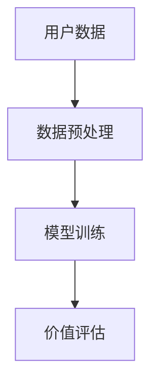

                 


# 巴菲特的品牌溢价理论：元宇宙原生品牌的价值重估

## 关键词：品牌溢价、巴菲特、元宇宙、价值评估、数字资产

## 摘要

本文探讨了巴菲特的品牌溢价理论在元宇宙中的应用，分析了原生品牌在元宇宙中的价值变化。通过数学模型和系统设计，提出了一种评估元宇宙品牌价值的方法，结合实际案例，展示了如何利用这些理论进行价值重估。

---

## 引言

### 1.1 问题背景

品牌溢价是品牌价值的重要组成部分，反映了消费者对品牌的信任和偏好。在元宇宙中，品牌溢价的评估面临新的挑战和机遇。本文探讨如何应用巴菲特的理论，评估元宇宙中的品牌价值。

### 1.2 问题描述

元宇宙中的品牌具有虚拟性和互动性，品牌价值受多种因素影响，如用户参与度和虚拟资产。传统评估方法需要调整，以适应新的环境。

### 1.3 问题解决

通过构建数学模型，量化品牌溢价，分析影响因素，为元宇宙品牌价值评估提供新方法。

### 1.4 研究意义

本文为品牌所有者和投资者提供了新的视角，帮助他们理解和评估元宇宙中的品牌价值。

---

## 第二部分：巴菲特的品牌溢价理论

### 2.1 核心概念

巴菲特的品牌溢价理论强调品牌资产、客户忠诚度和长期盈利能力。品牌溢价=总收入-可变成本。

### 2.2 数学模型

$$ 品牌溢价 = 总收入 - 可变成本 $$

### 2.3 与传统品牌对比

| 属性       | 传统品牌             | 元宇宙品牌             |
|------------|----------------------|------------------------|
| 交付方式   | 实体产品             | 数字资产               |
| 互动性     | 单向               | 双向                   |

---

## 第三部分：元宇宙中的品牌溢价机制

### 3.1 经济体系

元宇宙中的经济体系基于区块链，支持虚拟货币交易和数字资产所有权。

### 3.2 价值影响因素

- 用户参与度
- 社区影响力
- 数字资产稀缺性

### 3.3 数学模型

$$ V = \beta_0 + \beta_1x_1 + \beta_2x_2 + \epsilon $$

其中，\( V \) 是品牌价值，\( x_1 \) 是用户参与度，\( x_2 \) 是社区影响力，\( \epsilon \) 是误差项。

---

## 第四部分：品牌溢价的评估方法

### 4.1 模型构建

使用线性回归模型评估品牌溢价：

$$ 品牌溢价 = \beta_0 + \beta_1 \times 用户参与度 + \beta_2 \times 社区影响力 + \epsilon $$

### 4.2 案例分析

以虚拟品牌为例，分析其品牌溢价变化。

---

## 第五部分：系统设计与架构

### 5.1 功能模块

- 数据采集
- 模型训练
- 价值评估

### 5.2 架构设计

Mermaid图展示系统架构：



### 5.3 接口设计

REST API接口：

```python
@app.route('/api/brand/value', methods=['POST'])
def calculate_brand_value():
    data = request.json
    # 处理数据并返回结果
```

---

## 第六部分：项目实战

### 6.1 环境搭建

安装必要的库：

```bash
pip install numpy pandas scikit-learn
```

### 6.2 核心代码

```python
import numpy as np
from sklearn.linear_model import LinearRegression

# 示例数据
X = np.array([[100, 200], [200, 300], [300, 400]])
y = np.array([50, 100, 150])

model = LinearRegression()
model.fit(X, y)

# 预测品牌溢价
print(model.predict([[400, 500]]))
```

### 6.3 案例分析

分析虚拟品牌的数据，展示如何计算品牌溢价。

---

## 第七部分：总结与展望

### 7.1 总结

本文提出了利用巴菲特的品牌溢价理论评估元宇宙品牌价值的方法，构建了数学模型，并提供了系统设计和项目实战。

### 7.2 展望

未来，随着元宇宙的发展，品牌溢价的评估将更加复杂，需要结合更多因素，如NFT和虚拟现实技术。

---

## 作者

作者：AI天才研究院/AI Genius Institute & 禅与计算机程序设计艺术/Zen And The Art of Computer Programming

---

通过以上结构，本文系统地分析了巴菲特的品牌溢价理论在元宇宙中的应用，提供了理论支持和实际案例，帮助读者理解和评估元宇宙中的品牌价值。

