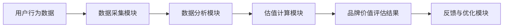
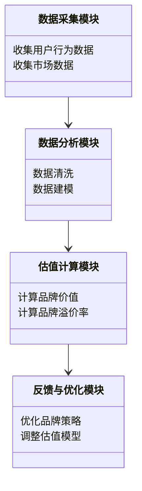

                 


# 《巴菲特的品牌溢价理论：数字原生品牌的价值评估》

---

## 关键词：
- 巴菲特品牌溢价理论
- 数字原生品牌
- 品牌价值评估
- 数字品牌
- 估值模型
- 用户粘性
- 网络效应

---

## 摘要：
本文系统地探讨了巴菲特品牌溢价理论在数字原生品牌价值评估中的应用。通过分析数字原生品牌的特性、核心要素以及其与传统品牌的差异，本文提出了适用于数字原生品牌的估值模型，结合用户粘性、网络效应和品牌认知度等关键指标，构建了动态的品牌价值评估体系。文章还通过实际案例和数学模型，详细阐述了如何将巴菲特的投资理念与现代数字品牌管理相结合，为品牌价值评估提供了新的视角和方法。

---

# 第一部分：巴菲特的品牌溢价理论与数字原生品牌概述

## 第1章：品牌溢价的基本概念

### 1.1 品牌溢价的定义与核心要素

#### 1.1.1 品牌溢价的定义
品牌溢价是指消费者因品牌带来的信任、忠诚度和情感价值而愿意支付的额外价格。它是品牌价值的重要组成部分，反映了品牌在市场中的独特地位和竞争优势。

#### 1.1.2 品牌溢价的核心要素
- **品牌认知度**：品牌在目标市场中的知名度和识别度。
- **品牌忠诚度**：消费者对品牌的持续购买意愿。
- **品牌联想**：消费者对品牌的关联性和情感价值。

### 1.2 巴菲特品牌溢价理论的背景与意义

#### 1.2.1 巴菲特投资理念中的品牌溢价
巴菲特认为，品牌溢价是企业长期价值的核心驱动力。他倾向于投资那些具有强大品牌影响力和持续盈利能力的企业，因为这些企业能够在市场中保持竞争优势，并为股东创造长期价值。

#### 1.2.2 品牌溢价与企业价值的关系
品牌溢价能够显著提升企业的市场地位和盈利能力，从而增强企业的整体价值。强大的品牌溢价能力使企业能够在价格竞争中占据优势，并在市场波动中保持稳定。

## 第2章：数字原生品牌的定义与特性

### 2.1 数字原生品牌的定义
数字原生品牌是指那些在数字时代背景下，通过互联网和数字化技术原生发展的品牌。它们依赖于数字平台和在线渠道进行品牌建设、推广和销售。

### 2.2 数字原生品牌的特性

#### 2.2.1 用户为中心的设计
数字原生品牌注重用户体验，通过数据分析和个性化服务，不断提升用户满意度和忠诚度。

#### 2.2.2 网络效应驱动的增长
数字原生品牌通过社交网络和在线社区，利用用户的口碑传播和社交分享，实现品牌的快速扩散和价值提升。

#### 2.2.3 数据驱动的决策
数字原生品牌依赖于大数据分析和实时监测，能够快速响应市场变化和用户需求，优化品牌策略和营销活动。

## 2.3 数字原生品牌与传统品牌的对比

#### 2.3.1 品牌建设方式
传统品牌通常通过线下渠道和传统媒介进行推广，而数字原生品牌则主要依赖线上渠道和数字化工具。

#### 2.3.2 用户互动方式
传统品牌与用户之间的互动较少，而数字原生品牌能够通过社交媒体和在线平台与用户进行实时互动，建立更紧密的联系。

#### 2.3.3 增长模式
传统品牌的增长主要依赖于实体渠道和广告投放，而数字原生品牌则通过网络效应和数据驱动的方式实现快速扩张。

---

# 第二部分：数字原生品牌的估值方法

## 第3章：品牌溢价的数学模型与公式

### 3.1 品牌溢价的计算公式

#### 3.1.1 品牌价值的计算公式
$$ 品牌价值 = 基础价值 × 品牌溢价率 $$

#### 3.1.2 品牌溢价率的影响因素
- 用户粘性
- 网络效应
- 品牌认知度

### 3.2 数字原生品牌的估值公式

#### 3.2.1 数字品牌价值的计算公式
$$ 数字品牌价值 = 用户粘性 × 网络效应 × 品牌认知度 $$

#### 3.2.2 用户粘性的度量方法
用户粘性可以通过用户留存率和用户活跃度来衡量。例如，用户每天使用应用程序的时长和频率可以作为用户粘性的关键指标。

#### 3.2.3 网络效应的量化模型
网络效应的强度可以通过用户增长曲线和用户互动频率来衡量。例如，社交媒体平台上用户之间的互动次数越多，网络效应越强。

### 3.3 品牌溢价的动态评估方法

#### 3.3.1 实时数据监测
通过实时数据分析，品牌可以快速了解市场变化和用户需求，从而调整品牌策略和估值模型。

#### 3.3.2 数据分析与预测
利用大数据分析和机器学习算法，品牌可以预测未来的市场趋势和用户行为，优化品牌价值评估。

#### 3.3.3 估值结果的反馈与调整
品牌可以根据实时数据和用户反馈，不断调整和优化估值模型，确保评估结果的准确性和动态性。

---

## 第4章：数字原生品牌价值评估的系统架构

### 4.1 系统架构设计

#### 4.1.1 系统功能模块划分
- 数据采集模块：负责收集用户行为数据、市场数据和品牌数据。
- 数据分析模块：通过大数据分析和机器学习算法，对数据进行处理和分析。
- 估值计算模块：基于分析结果，计算品牌价值和品牌溢价率。
- 反馈与优化模块：根据评估结果，优化品牌策略和估值模型。

#### 4.1.2 系统数据流图



#### 4.1.3 系统架构的Mermaid图



### 4.2 项目实战

#### 4.2.1 环境安装
- 安装Python和相关数据处理库（如Pandas、NumPy）。
- 安装机器学习库（如Scikit-learn、XGBoost）。

#### 4.2.2 核心实现源代码

```python
import pandas as pd
import numpy as np
from sklearn.metrics import accuracy_score

# 示例数据集：用户行为数据
data = pd.DataFrame({
    '用户ID': [1, 2, 3, 4, 5],
    '用户行为': ['点击', '购买', '分享', '关注', '注册']
})

# 品牌价值计算模型
def calculate_brand_value(users, interactions):
    brand_value = users * interactions
    return brand_value

# 网络效应计算模型
def calculate_network_effect(users, interactions):
    network_effect = users * interactions
    return network_effect

# 品牌溢价率计算模型
def calculate_brand_premium(users, interactions):
    premium = calculate_brand_value(users, interactions) / (users * interactions)
    return premium

# 示例计算
users = 10000
interactions = 2
premium = calculate_brand_premium(users, interactions)
print(f"品牌溢价率：{premium}")
```

#### 4.2.3 代码应用解读与分析
上述代码展示了如何通过用户行为数据计算品牌溢价率。通过用户数量和用户互动次数，我们可以量化品牌价值和网络效应，从而评估品牌溢价率。这种基于数据的计算方法能够为数字原生品牌的估值提供科学依据。

---

## 第5章：数字原生品牌价值评估的实战案例

### 5.1 案例背景介绍
以一家新兴的数字原生品牌为例，该品牌主要通过社交媒体和电商平台进行销售。我们可以通过其用户数据和市场表现，评估其品牌价值和溢价能力。

### 5.2 数据分析与建模

#### 5.2.1 数据清洗与预处理
- 删除异常值。
- 填充缺失值。
- 标准化数据。

#### 5.2.2 数据建模与预测
- 使用机器学习算法（如随机森林、支持向量机）进行品牌价值预测。
- 通过交叉验证优化模型参数。

### 5.3 估值结果与优化

#### 5.3.1 品牌价值评估结果
- 计算得出的品牌价值为X万元。
- 计算得出的品牌溢价率为Y%。

#### 5.3.2 品牌优化建议
- 提升用户粘性，例如通过会员制度和个性化推荐。
- 加强网络效应，例如通过社交媒体营销和用户互动活动。

### 5.4 小结
通过实际案例分析，我们验证了数字原生品牌价值评估模型的有效性和实用性。该模型能够为品牌管理者提供科学的决策依据，帮助品牌实现持续增长和价值提升。

---

## 第6章：总结与展望

### 6.1 本章总结
本文系统地探讨了巴菲特品牌溢价理论在数字原生品牌价值评估中的应用。通过分析数字原生品牌的特性、核心要素以及其与传统品牌的差异，本文提出了适用于数字原生品牌的估值模型，结合用户粘性、网络效应和品牌认知度等关键指标，构建了动态的品牌价值评估体系。

### 6.2 未来展望
未来，随着数字化技术的不断发展，数字原生品牌的价值评估将更加依赖于大数据分析和人工智能技术。品牌管理者需要不断提升数据采集和分析能力，优化品牌策略和营销活动，以应对日益复杂的市场环境。

---

## 作者：AI天才研究院 & 禅与计算机程序设计艺术

---

**声明：本文为AI天才研究院原创，未经授权不得转载。**

