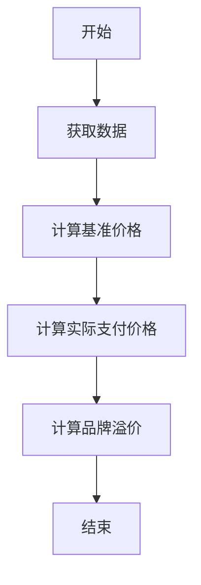
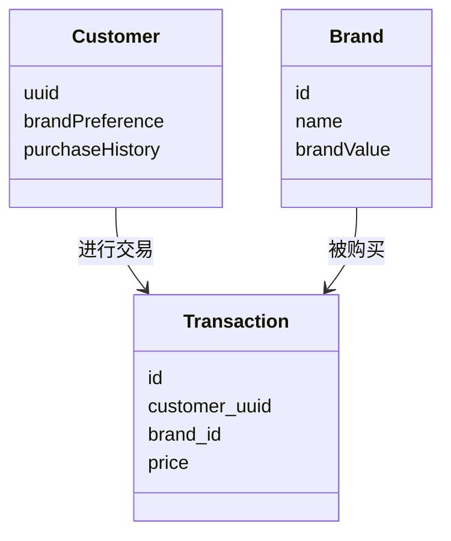
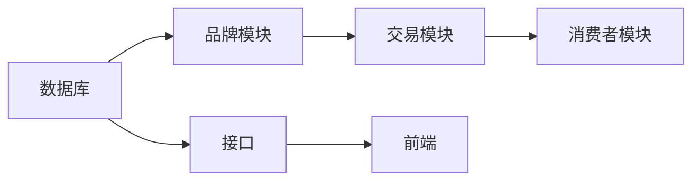
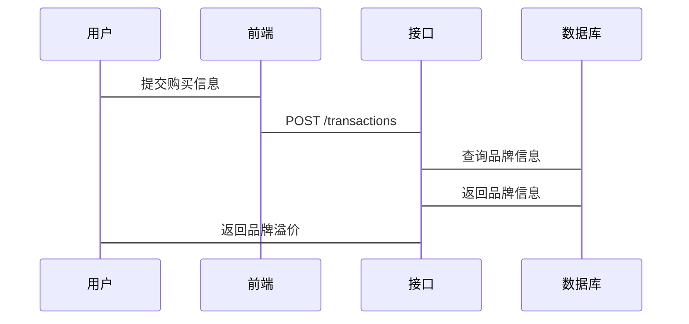

                 


# 巴菲特的品牌溢价理论：数字营销时代的品牌价值

> **关键词**：巴菲特，品牌溢价，数字营销，品牌价值，投资理论
> 
> **摘要**：本文探讨了巴菲特的价值投资理论在数字营销时代的应用，重点分析品牌溢价的概念、计算方法及其在数字营销中的重要性。通过数学模型、算法设计和项目实战，阐述品牌溢价在数字营销中的价值和评估方法。

---

## 第1章: 背景介绍

### 1.1 品牌溢价的基本概念

品牌溢价是指消费者在购买某一品牌产品时，愿意支付的价格高于同类产品的基准价格。在数字营销时代，品牌溢价不仅是品牌价值的体现，更是企业长期竞争优势的来源。

#### 1.1.1 品牌溢价的定义
品牌溢价是消费者对品牌的信任和忠诚度的体现，这种溢价不仅反映了品牌的价值，也反映了品牌在市场中的地位。

#### 1.1.2 品牌溢价的核心要素
1. 品牌认知度：品牌在消费者心中的知名度和识别度。
2. 品牌忠诚度：消费者对品牌的偏好和重复购买意愿。
3. 品牌联想：消费者对品牌的联想和情感连接。

#### 1.1.3 品牌溢价在数字营销中的重要性
数字营销通过数据和技术手段，可以精准评估品牌溢价，优化营销策略，提升品牌价值。

### 1.2 巴菲特投资理论与品牌溢价的关系

#### 1.2.1 巴菲特的价值投资理念
巴菲特的投资理念强调长期价值，注重企业的基本面和竞争优势。

#### 1.2.2 品牌溢价与企业长期价值的关系
品牌溢价是企业长期价值的重要组成部分，反映了企业在市场中的竞争力和消费者的信任度。

#### 1.2.3 数字营销时代品牌溢价的演变
数字营销时代，品牌溢价的计算更加依赖数据和技术，品牌价值的评估更加精准和动态。

### 1.3 数字营销时代品牌溢价的背景

#### 1.3.1 数字营销的定义与特点
数字营销通过数字化技术和渠道进行品牌推广和客户互动，具有精准、高效和可衡量的特点。

#### 1.3.2 数字营销时代品牌溢价的新挑战
1. 数据隐私和安全问题：如何在数据驱动的品牌溢价评估中保护消费者隐私。
2. 技术复杂性：数字营销技术的不断更新，品牌溢价的计算方法也在不断演变。

#### 1.3.3 数字营销与品牌溢价的结合
数字营销通过数据分析和精准营销，帮助企业更好地识别和提升品牌溢价，从而实现长期价值。

---

## 第2章: 品牌溢价的核心概念与联系

### 2.1 品牌溢价的理论模型

#### 2.1.1 品牌溢价的构成要素
1. 品牌认知度：品牌在市场中的知名度。
2. 品牌忠诚度：消费者对品牌的忠诚程度。
3. 品牌联想：消费者对品牌的联想和情感连接。

#### 2.1.2 品牌溢价与品牌忠诚度的关系
品牌忠诚度越高，品牌溢价能力越强，消费者愿意支付的价格越高。

#### 2.1.3 品牌溢价与品牌认知度的对比
品牌认知度高不一定意味着品牌溢价能力强，关键在于消费者对品牌的信任和忠诚度。

### 2.2 品牌溢价与数字营销的结合

#### 2.2.1 数字营销中的品牌溢价表现
1. 在线广告：通过精准投放广告，提升品牌认知度和忠诚度。
2. 社交媒体营销：通过社交平台与消费者互动，增强品牌联想和忠诚度。

#### 2.2.2 品牌溢价与数字营销渠道的关系
数字营销渠道为品牌溢价的提升提供了精准和高效的方式，品牌溢价的提升反过来又增强了数字营销的效果。

#### 2.2.3 品牌溢价与数字营销策略的互动
数字营销策略通过优化品牌溢价，提升品牌价值，从而实现长期的商业目标。

### 2.3 品牌溢价的核心概念对比表格

表2-1: 品牌溢价与其他品牌价值评估方法的对比

| 评估方法         | 定义                                                                 | 优点                              | 缺点                              |
|------------------|----------------------------------------------------------------------|-----------------------------------|-----------------------------------|
| 品牌溢价         | 消费者愿意支付的价格高于同类产品的基准价格                             | 反映品牌价值和消费者忠诚度       | 计算复杂，依赖数据和技术         |
| 品牌认知度       | 品牌在市场中的知名度                                                 | 简单易测                           | 无法反映品牌忠诚度               |
| 品牌忠诚度       | 消费者对品牌的偏好和重复购买意愿                                     | 反映品牌竞争力                     | 难以量化                         |

### 2.4 品牌溢价的ER实体关系图

图2-1: 

```mermaid
erDiagram
    customer[消费者] {
        uuid : string
        brandPreference : string
        purchaseHistory : string
    }
    brand[品牌] {
        id : integer
        name : string
        brandValue : integer
    }
    transaction[交易] {
        id : integer
        customer_uuid : string
        brand_id : integer
        price : integer
    }
    customer --> transaction : 进行交易
    brand --> transaction : 被购买
```

---

## 第3章: 品牌溢价的算法原理

### 3.1 品牌溢价的数学模型

品牌溢价可以通过以下公式计算：

$$ \text{品牌溢价} = \text{实际支付价格} - \text{基准价格} $$

其中，基准价格是同类产品的平均价格，实际支付价格是消费者在购买该品牌产品时支付的价格。

### 3.2 品牌溢价的计算流程

流程图如下：



### 3.3 品牌溢价的Python代码实现

以下是一个简单的Python代码示例，用于计算品牌溢价：

```python
def calculate_brand_premium(actual_price, benchmark_price):
    premium = actual_price - benchmark_price
    return premium

# 示例数据
actual_price = 100  # 实际支付价格
benchmark_price = 80  # 基准价格
premium = calculate_brand_premium(actual_price, benchmark_price)
print(f"品牌溢价为：{premium}")
```

---

## 第4章: 品牌溢价的系统分析与架构设计

### 4.1 系统功能设计

#### 4.1.1 领域模型

类图如下：



#### 4.1.2 系统架构设计

架构图如下：



#### 4.1.3 接口设计

API接口如下：

1. 获取品牌信息：`GET /brands/{id}`
2. 创建交易记录：`POST /transactions`
3. 查询品牌溢价：`GET /premium`

#### 4.1.4 系统交互设计

序列图如下：



---

## 第5章: 项目实战

### 5.1 项目介绍

本项目旨在通过数字营销手段，计算和优化品牌溢价，提升品牌价值。

### 5.2 核心实现

#### 5.2.1 环境安装

需要安装以下工具：

1. Python 3.8+
2. Flask框架
3. PostgreSQL数据库

#### 5.2.2 核心代码实现

以下是一个品牌溢价计算模块的实现：

```python
from flask import Flask
from flask_restful import Resource, Api
import psycopg2

app = Flask(__name__)
api = Api(app)

class BrandPremium(Resource):
    def get(self, brand_id):
        # 连接数据库
        conn = psycopg2.connect(
            dbname="marketing",
            user="admin",
            password="password",
            host="localhost",
            port="5432"
        )
        cursor = conn.cursor()
        # 查询品牌溢价
        cursor.execute(f"SELECT calculate_brand_premium(%s)", (brand_id,))
        result = cursor.fetchone()
        conn.close()
        return {"品牌溢价": result[0]}, 200

api.add_resource(BrandPremium, '/premium/<string:brand_id>')

if __name__ == "__main__":
    app.run(debug=True)
```

#### 5.2.3 实际案例分析

以某品牌为例，计算其品牌溢价：

- 实际支付价格：$100
- 基准价格：$80
- 品牌溢价：$20

---

## 第6章: 总结与最佳实践

### 6.1 小结

品牌溢价是数字营销时代品牌价值的重要体现，通过科学的计算和优化，可以帮助企业提升品牌价值和长期竞争力。

### 6.2 注意事项

1. 数据隐私和安全问题需要高度重视。
2. 品牌溢价的计算需要结合企业的实际情况和市场环境。
3. 数字营销策略需要不断创新和优化。

### 6.3 拓展阅读

1. 巴菲特的投资理论
2. 数字营销技术的发展趋势
3. 品牌价值的其他评估方法

---

## 作者：AI天才研究院

---

本文通过详细的分析和实际案例，探讨了品牌溢价在数字营销时代的重要性及其计算方法。希望读者能够通过本文，深入理解品牌溢价的理论和实际应用，为企业在数字营销时代提升品牌价值提供参考。

