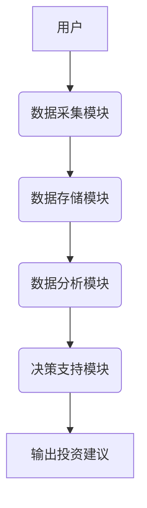
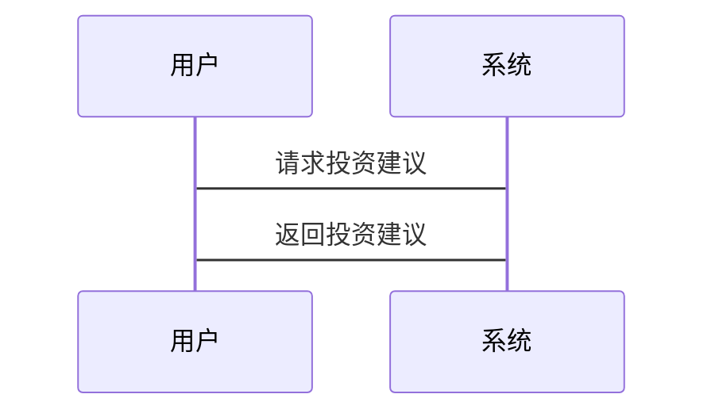

                 


# 巴菲特的宏观经济分析：全球化背景下的投资策略

**关键词**：巴菲特、宏观经济分析、全球化、投资策略、价值投资、资产配置、风险管理

**摘要**：本文深入探讨巴菲特的宏观经济分析方法，结合全球化背景，分析其投资策略的核心要素。通过价值投资理念、宏观经济框架、全球化影响、经典案例和数学模型的分析，揭示巴菲特的成功之道，并为投资者提供实战指导和最佳实践建议。

---

## 第一部分: 巴菲特的宏观投资哲学

### 第1章: 巴菲特投资哲学概述

#### 1.1 价值投资的定义与核心理念

##### 1.1.1 价值投资的定义
价值投资是一种投资策略，强调购买价格低于其内在价值的资产。巴菲特将其定义为“便宜货”。

##### 1.1.2 价值投资的核心理念
- **安全边际**：购买价格低于内在价值，以减少风险。
- **长期投资**：复利效应的重要性，长期持有优质资产。
- **企业基本面**：关注企业的财务状况、盈利能力和发展潜力。

##### 1.1.3 巴菲特对价值投资的贡献
通过长期实践，巴菲特证明了价值投资的有效性，特别是在宏观经济波动中。

#### 1.2 巴菲特的投资哲学

##### 1.2.1 长期投资与复利效应
巴菲特强调复利的力量，认为长期持有优质资产是实现财富增长的关键。

##### 1.2.2 安全边际的概念
安全边际确保在市场波动中，投资者不会因价格波动而蒙受损失。

##### 1.2.3 股市的投票机与称重机
股市反映短期情绪（投票机），但长期看，价格回归内在价值（称重机）。

#### 1.3 巴菲特投资哲学的演变

##### 1.3.1 初期投资理念的形成
早期受格雷厄姆影响，注重低估值股票。

##### 1.3.2 中期投资策略的调整
逐步转向长期投资，关注企业内在价值和竞争优势。

##### 1.3.3 现阶段投资哲学的总结
综合安全边际、长期复利和企业基本面分析。

---

## 第2章: 宏观经济分析的基本概念

### 2.1 宏观经济分析的定义

#### 2.1.1 宏观经济分析的范围
涵盖GDP、通货膨胀、利率、就业等宏观经济指标。

#### 2.1.2 宏观经济分析的重要性
帮助投资者理解经济趋势，做出明智的投资决策。

#### 2.1.3 宏观经济分析的核心指标
- GDP增长率
- 通货膨胀率
- 利率水平
- 失业率

### 2.2 宏观经济分析的框架

#### 2.2.1 宏观经济分析的步骤
1. 数据收集与整理
2. 指标分析
3. 经济周期判断
4. 投资策略调整

#### 2.2.2 宏观经济分析的工具
- 经济模型：如凯恩斯模型、 monetarist model
- 数据分析工具：Excel、Python、R

#### 2.2.3 宏观经济分析的误区
避免短期波动干扰，关注长期趋势。

### 2.3 巴菲特视角下的宏观经济分析

#### 2.3.1 巴菲特对宏观经济的独到见解
- 关注企业盈利能力和行业竞争优势。
- 通过宏观经济趋势判断企业前景。

#### 2.3.2 巴菲特宏观经济分析的核心要素
- 经济周期判断
- 行业分析
- 企业竞争优势

#### 2.3.3 巴菲特宏观经济分析的实践案例
分析2008年金融危机时的投资策略，选择具有强大竞争优势的企业。

---

## 第3章: 全球化背景下的投资策略

### 3.1 全球化对投资策略的影响

#### 3.1.1 全球化对经济的影响
- 促进跨国公司的发展
- 推动全球产业链的形成
- 增加国际资本流动

#### 3.1.2 全球化对投资机会的影响
- 开拓海外市场
- 投资跨国企业
- 利用全球资源优化配置

#### 3.1.3 全球化对投资风险的影响
- 增加地缘政治风险
- 加剧市场竞争
- 提高对全球经济波动的敏感性

### 3.2 巴菲特全球化投资策略的核心要素

#### 3.2.1 全球化视角下的资产配置
- 分散投资地域风险
- 选择具有全球竞争优势的企业

#### 3.2.2 跨国企业的竞争优势分析
- 全球市场份额
- 跨国运营能力
- 全球品牌影响力

#### 3.2.3 全球宏观经济趋势的判断
- 关注全球经济周期
- 分析主要经济体的政策
- 评估全球产业链的调整

### 3.3 巴菲特全球化投资策略的具体操作

#### 3.3.1 股票选择标准
- 高ROE（净资产收益率）
- 稳定的盈利增长
- 强大的竞争优势

#### 3.3.2 资产配置策略
- 长期持有优质资产
- 分散投资以降低风险
- 定期审视投资组合

#### 3.3.3 风险管理措施
- 设定止损点
- 定期评估宏观经济环境
- 保持充足的安全边际

---

## 第4章: 巴菲特的经典投资案例分析

### 4.1 可口可乐的投资案例

#### 4.1.1 投资背景
- 可口可乐的全球品牌影响力
- 稳定的现金流
- 强大的竞争优势

#### 4.1.2 投资决策过程
- 评估公司的财务状况
- 分析行业前景
- 判断公司的管理团队

#### 4.1.3 投资结果
- 长期持有带来丰厚回报
- 反映巴菲特的价值投资理念

### 4.2 苹果公司的投资案例

#### 4.2.1 投资背景
- 苹果的创新能力和市场领导地位
- 强大的现金流和盈利能力
- 全球化的业务布局

#### 4.2.2 投资决策过程
- 评估苹果的创新能力和市场地位
- 分析苹果的财务健康状况
- 判断苹果的管理团队和战略规划

#### 4.2.3 投资结果
- 成功投资案例，体现巴菲特对科技行业的理解
- 展示了巴菲特对创新和竞争优势的重视

---

## 第5章: 投资策略的数学模型与量化分析

### 5.1 资产定价模型

#### 5.1.1 CAPM模型
$$ E(R_i) = R_f + \beta_i (E(R_m) - R_f) $$

其中：
- $E(R_i)$ 是资产的预期回报率
- $R_f$ 是无风险利率
- $\beta_i$ 是资产的贝塔系数
- $E(R_m)$ 是市场预期回报率

#### 5.1.2 DCF模型
$$ V = \sum_{t=1}^{n} \frac{CF_t}{(1 + r)^t} + \frac{TV}{(1 + r)^n} $$

其中：
- $V$ 是企业价值
- $CF_t$ 是第t年的现金流
- $r$ 是折现率
- $TV$ 是终值

#### 5.1.3 市盈率与市净率分析
- 市盈率（P/E）= 市场价 / 每股收益
- 市净率（P/B）= 市场价 / 每股净资产

### 5.2 量化分析与投资决策

#### 5.2.1 数据采集与处理
使用Python爬取历史数据，清洗和预处理。

#### 5.2.2 模型实现
代码示例：
```python
import pandas as pd
import numpy as np

# 示例数据
data = pd.DataFrame({
    'Price': [100, 90, 80, 70, 60],
    'Earnings': [10, 9, 8, 7, 6]
})

# 计算市盈率
data['P/E'] = data['Price'] / data['Earnings']

print(data)
```

#### 5.2.3 结果分析
通过量化分析，识别低估股票，辅助投资决策。

---

## 第6章: 系统架构与投资决策系统设计

### 6.1 投资决策系统功能设计

#### 6.1.1 数据采集模块
- 采集宏观经济指标和企业财务数据

#### 6.1.2 数据分析模块
- 使用机器学习模型进行预测和分类

#### 6.1.3 决策支持模块
- 提供投资建议和风险评估

### 6.2 系统架构设计

#### 6.2.1 系统架构图


#### 6.2.2 接口设计
- 数据接口：REST API
- 用户接口：Web界面

#### 6.2.3 交互流程图


---

## 第7章: 项目实战与投资策略实现

### 7.1 环境搭建

#### 7.1.1 安装必要的工具
- Python 3.x
- Pandas, NumPy, Scikit-learn

#### 7.1.2 数据源获取
- 从Yahoo Finance获取股票数据

### 7.2 核心代码实现

#### 7.2.1 数据处理
```python
import pandas as pd
import yfinance as yf

# 下载股票数据
msft = yf.download('MSFT', start='2020-01-01', end='2023-12-31')

# 计算移动平均线
msft['MA_20'] = msft['Close'].rolling(20).mean()
```

#### 7.2.2 模型实现
```python
from sklearn.linear_model import LinearRegression

# 训练回归模型
model = LinearRegression()
model.fit(X_train, y_train)
```

### 7.3 实战案例分析

#### 7.3.1 案例分析
分析微软（MSFT）股票，计算技术指标，评估投资价值。

#### 7.3.2 代码应用解读
解释代码的功能和实现逻辑，展示如何通过代码辅助投资决策。

### 7.4 投资策略小结

#### 7.4.1 最佳实践
- 定期审视投资组合
- 保持充足的安全边际
- 长期投资，避免短期波动干扰

#### 7.4.2 风险管理
- 设定止损点
- 分散投资
- 定期评估宏观经济环境

---

## 第8章: 总结与展望

### 8.1 全文总结

#### 8.1.1 巴菲特投资哲学的核心要点
- 价值投资
- 宏观经济分析
- 长期投资

#### 8.1.2 全球化背景下的投资策略
- 资产配置
- 跨国企业分析
- 全球宏观经济趋势判断

### 8.2 未来展望

#### 8.2.1 新兴市场的投资机会
随着全球经济一体化，新兴市场将提供更多投资机会。

#### 8.2.2 数字化转型的影响
科技发展将改变投资方式和资产选择。

#### 8.2.3 可持续投资的趋势
ESG（环境、社会、治理）投资将越来越重要。

---

**作者：AI天才研究院 & 禅与计算机程序设计艺术**

