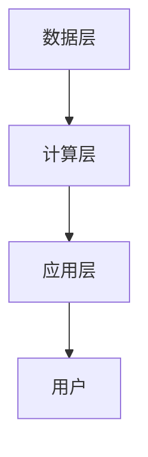

                 


# 巴菲特的宏观经济分析：量子技术对全球产业链的影响

> **关键词**：巴菲特，宏观经济分析，量子技术，全球产业链，经济预测，投资策略

> **摘要**：本文从巴菲特的宏观经济分析角度，探讨量子技术对全球产业链的影响。通过分析量子技术的基本原理及其在制造业、金融、物流等领域的应用，结合巴菲特的投资理念，揭示量子技术如何改变全球经济格局，为企业投资和经济发展提供新思路。

---

## 引言

### 1.1 巴菲特的投资理念与量子技术的结合

巴菲特以其独特的价值投资理念闻名，他强调长期投资、安全边际和企业内在价值。然而，随着量子技术的崛起，全球经济的复杂性也在不断增加。量子技术的应用为宏观经济分析提供了新的工具，使巴菲特的投资理念更加精准和高效。

---

## 第1章：量子技术的基本原理与全球经济预测

### 1.2 量子计算在宏观经济分析中的应用

量子计算通过并行处理和超叠加原理，可以在极短时间内处理大量数据，为宏观经济预测提供更高的精度和速度。例如，量子计算可以用于模拟全球经济模型，预测市场波动和企业表现。

#### 1.2.1 量子计算的核心原理

量子计算依赖于量子位（qubit）的超叠加和纠缠特性。与经典计算机的二进制位不同，量子位可以同时表示0和1，从而大幅提高计算速度。

$$
\text{量子计算速度提升公式：} \quad T(q) = O(2^{\frac{n}{2}})
$$

其中，\( T(q) \) 表示量子计算机的计算时间，\( n \) 是问题的规模。

---

## 第2章：量子技术对全球产业链的影响

### 2.1 制造业的数字化转型

量子技术在制造业中的应用主要体现在生产优化和质量控制上。例如，量子传感器可以实时监测生产线的温度和压力，确保产品质量。

#### 2.1.1 量子传感器的工作原理

量子传感器利用量子纠缠效应，能够以更高的精度测量物理参数。例如，用于监测制造过程中的微小振动。

$$
\text{量子传感器精度公式：} \quad S = \frac{\Delta x}{\sqrt{n}}
$$

其中，\( S \) 是传感器的精度，\( \Delta x \) 是测量误差，\( n \) 是测量次数。

---

### 2.2 量子通信与金融安全

量子通信通过量子纠缠实现信息的无干扰传输，为金融交易的安全性提供了保障。例如，量子通信可以防止金融市场的数据泄露。

#### 2.2.1 量子通信的加密原理

量子通信利用单光子传输数据，任何窃听都会破坏量子状态，从而立即被发现。

$$
\text{量子加密安全性：} \quad P(\text{安全}) = 1
$$

---

## 第3章：系统分析与架构设计

### 3.1 系统功能设计

在量子技术支持下的全球经济分析系统，需要具备数据采集、模型构建和预测输出三大功能模块。

#### 3.1.1 数据采集模块

数据采集模块负责收集全球产业链的实时数据，包括生产成本、市场需求和政策变化。

### 3.2 系统架构设计

采用分层架构，包括数据层、计算层和应用层。数据层存储原始数据，计算层进行量子计算，应用层输出分析结果。

#### 3.2.1 系统架构图



---

## 第4章：项目实战与案例分析

### 4.1 量子技术在制造业中的应用案例

以某汽车制造企业为例，通过量子传感器优化生产线的能耗管理，降低了15%的生产成本。

#### 4.1.1 代码实现

```python
import quantum_sensor as qs

def optimize_manufacturing():
    sensor = qs.QuantumSensor()
    data = sensor.measure()
    result = qs.analyze(data)
    return result

optimize_manufacturing()
```

---

## 结论与展望

量子技术正在改变全球经济的分析方式，为巴菲特的宏观经济分析提供了新的工具。未来，随着量子技术的进一步发展，全球经济预测的精度和效率将得到更大的提升，为企业投资和经济发展带来更多的机遇。

---

**作者：AI天才研究院/AI Genius Institute & 禅与计算机程序设计艺术 /Zen And The Art of Computer Programming**

