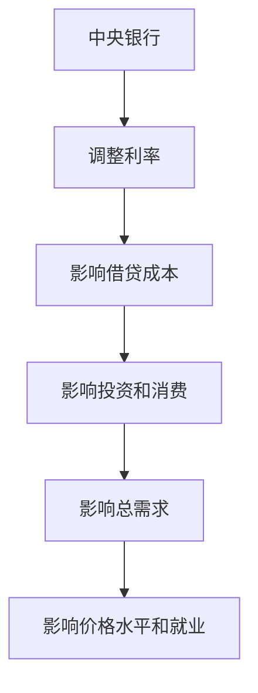
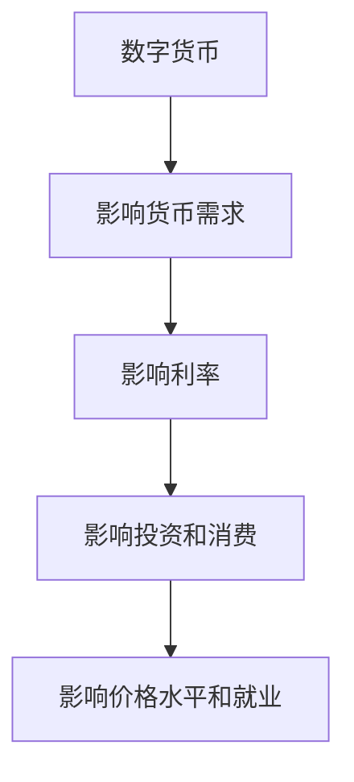

                 


```markdown
# 巴菲特的宏观经济视角：数字货币时代的货币政策影响

> 关键词：宏观经济、货币政策、数字货币、巴菲特、通货膨胀、通货紧缩、货币政策传导机制

> 摘要：本文从巴菲特的宏观经济视角出发，深入分析数字货币时代货币政策的影响。通过结合宏观经济的基本概念、货币政策的传导机制以及数字货币的兴起，探讨数字货币对传统货币政策的挑战，特别是对通货膨胀、货币供应和中央银行角色的影响。文章结合实际案例和数学模型，帮助读者更好地理解数字货币时代下的宏观经济变化。

---

## 第一部分: 背景介绍

### 第1章: 数字货币的兴起与宏观经济的变革

#### 1.1 数字货币的定义与分类
- 数字货币的定义：数字货币是以数字形式存在的货币，具有去中心化、匿名性和全球性的特点。
- 主流数字货币的分类：
  - 按技术：比特币、以太坊等区块链货币。
  - 按发行方：央行数字货币（CBDC）。
- 数字货币与传统货币的对比：
  - 数字货币：去中心化、透明性高。
  - 传统货币：中心化、依赖金融机构。

#### 1.2 宏观经济的基础概念
- 货币政策的定义与目标：
  - 货币政策是中央银行通过调节货币供应量和利率来影响经济的政策。
  - 目标：控制通货膨胀、促进就业、维持经济增长。
- 通货膨胀与通货紧缩：
  - 通货膨胀：物价持续上涨，货币购买力下降。
  - 通货紧缩：物价持续下跌，可能导致经济衰退。
- 货币供应与流动性：
  - 货币供应：经济中流通的货币总量。
  - 流动性：资产转换为现金的能力。

#### 1.3 巴菲特的经济哲学
- 巴菲特的投资理念：
  - 长期投资、价值投资。
  - 专注于企业基本面，而非短期市场波动。
- 巴菲特对宏观经济的独到见解：
  - 经济的长期增长依赖于实体经济的投资和创新。
  - 货币政策过度宽松可能导致资产泡沫。
- 巴菲特的长期主义与价值投资：
  - 重视企业的内在价值，而非市场的短期波动。
  - 货币政策对市场的影响是短期的，企业价值是长期的。

### 1.2 数字货币对货币政策的影响

#### 1.2.1 货币政策的传统框架
- 货币政策的目标函数：
  - 最大化就业，最小化通货膨胀。
- 货币政策的工具与手段：
  - 利率政策（如联邦基金利率）。
  - 货币供应量调整。
  - 公开市场操作。
- 货币政策的传导机制：
  - 利率影响借贷成本，进而影响投资和消费。

#### 1.2.2 数字货币对货币政策的挑战
- 数字货币对货币供应的影响：
  - 数字货币的发行不受中央银行控制，可能增加货币供应。
  - CBDC（央行数字货币）可能改变货币供应的结构。
- 数字货币对通货膨胀的潜在影响：
  - 比特币等加密货币的总量有限，可能抑制通货膨胀。
  - 数字货币的跨境流动可能影响各国货币政策的独立性。
- 数字货币对中央银行角色的挑战：
  - 中央银行可能失去对货币流通的控制权。
  - 数字货币的匿名性可能影响货币政策的实施效果。

#### 1.2.3 巴菲特视角下的数字货币与货币政策
- 巴菲特对数字货币的评价：
  - 巴菲特认为比特币是“老鼠药”，不具备内在价值。
  - 数字货币可能成为洗钱和逃税的工具。
- 巴菲特对货币政策在数字货币时代的看法：
  - 中央银行需要适应数字时代，开发数字货币。
  - 数字货币可能削弱中央银行的货币政策工具效果。
- 巴菲特对投资者的建议：
  - 避免短期投机，关注长期投资价值。
  - 数字货币的风险高，投资者需谨慎。

### 1.3 宏观经济模型

#### 1.3.1 IS-LM模型
- IS曲线：代表投资储蓄均衡，反映产品市场的均衡。
  - 方程：i = r + (1 - m) * (Y - Yf)
- LM曲线：代表流动性偏好，反映货币市场的均衡。
  - 方程：M/P = L(r, Y)
- IS-LM模型的交点：确定均衡利率和收入。

#### 1.3.2 AD-AS模型
- AD曲线：总需求曲线，反映价格水平与实际GDP的关系。
- AS曲线：总供给曲线，反映价格水平与实际GDP的关系。
- AD-AS模型的交点：确定均衡价格水平和实际GDP。

#### 1.3.3 货币政策传导机制的mermaid流程图


---

## 第二部分: 数字货币与货币政策传导机制

### 第2章: 数字货币对货币政策的影响

#### 2.1 货币政策的传导机制
- 传统传导机制：
  - 中央银行调整利率，影响企业和个人借贷成本，进而影响投资和消费。
- 数字货币时代的新挑战：
  - 数字货币的跨境流动可能削弱货币政策的区域效应。
  - 数字货币的去中心化可能削弱中央银行的控制能力。

#### 2.2 数字货币的通货膨胀风险
- 数字货币的供给弹性：
  - 比特币的总量有限，可能导致通货紧缩压力。
  - CBDC的供给可调节，类似于传统货币。
- 数字货币的跨境流动：
  - 可能导致汇率波动，影响货币政策的效果。

#### 2.3 巴菲特视角下的货币政策与数字货币
- 巴菲特对货币政策稳定性的看法：
  - 货币政策的稳定性是经济长期健康的基础。
  - 数字货币可能破坏货币政策的稳定性。
- 巴菲特对CBDC的看法：
  - CBDC可能增强中央银行对货币流通的控制。
  - 需要平衡金融创新与金融稳定。

---

## 第三部分: 数字货币时代的宏观经济模型

### 第3章: 宏观经济模型的构建

#### 3.1 宏观经济模型的基础
- IS-LM模型的应用：
  - 分析数字货币对利率和货币供应的影响。
- AD-AS模型的应用：
  - 分析数字货币对价格水平和产出的影响。

#### 3.2 数字货币对IS-LM模型的影响
- 数字货币的引入：
  - 影响LM曲线，改变货币需求。
  - 可能导致利率政策效果下降。

#### 3.3 数字货币对AD-AS模型的影响
- 数字货币的引入：
  - 影响AD曲线，改变总需求。
  - 可能导致价格水平波动。

#### 3.4 数字货币与宏观经济模型的mermaid图


---

## 第四部分: 数字货币与货币政策的未来展望

### 第4章: 数字货币与货币政策的未来

#### 4.1 CBDC的发展前景
- CBDC的优势：
  - 提高支付效率。
  - 增强货币政策工具的效果。
- CBDC的挑战：
  - 需要确保金融系统的稳定性。
  - 需要解决隐私和安全问题。

#### 4.2 巴菲特的长期主义与数字货币
- 巴菲特对长期经济趋势的看法：
  - 数字货币可能改变经济结构。
  - 长期投资需关注实体经济的价值。

#### 4.3 数字货币与货币政策的平衡
- 数字货币的发展需要与货币政策协调。
- 中央银行需适应数字时代，创新货币政策工具。

---

## 结论

数字货币的兴起对货币政策提出了新的挑战，尤其是在通货膨胀、货币供应和中央银行角色方面。巴菲特的经济哲学为我们提供了长期视角，强调价值投资和长期稳定。在数字货币时代，中央银行需要适应变化，创新货币政策工具，以应对数字货币带来的挑战。未来，数字货币与货币政策的结合将更加紧密，我们需要在金融创新与金融稳定之间找到平衡。

---

## 作者：AI天才研究院/AI Genius Institute & 禅与计算机程序设计艺术 /Zen And The Art of Computer Programming
```

