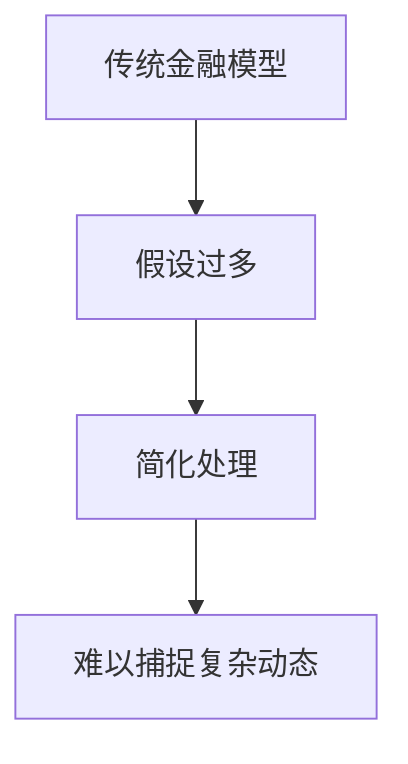
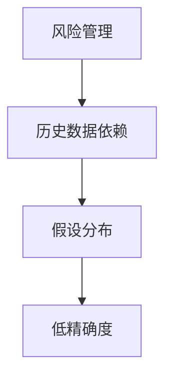
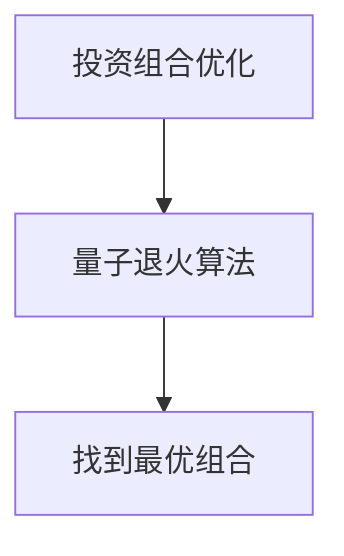
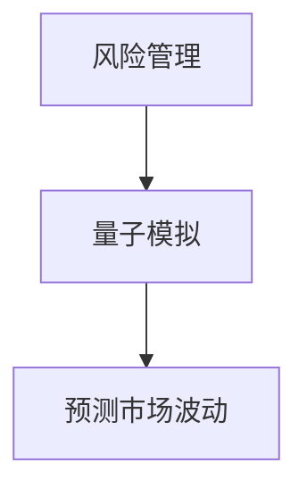
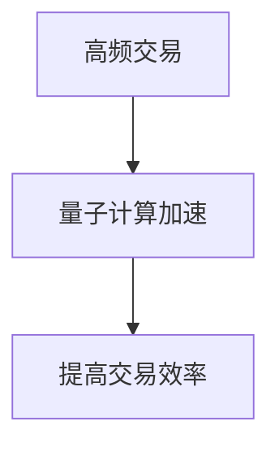
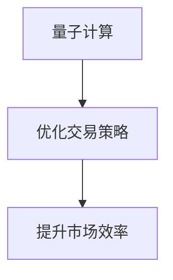
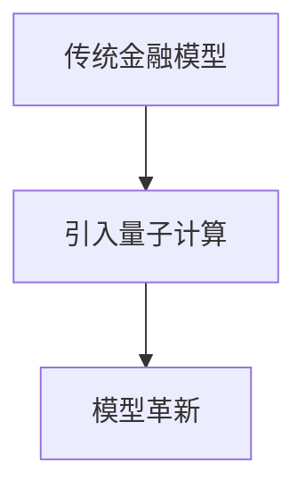
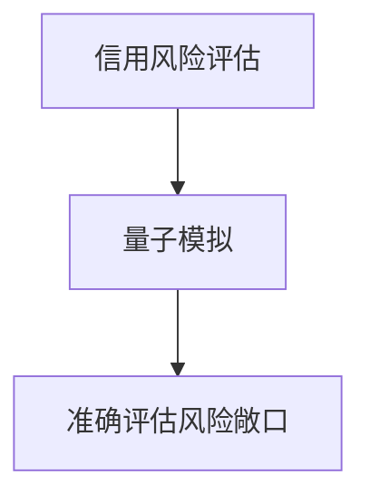

                 


# 巴菲特的宏观经济视角：量子计算对全球金融体系的影响

## 关键词
量子计算，巴菲特，宏观经济，金融体系，投资组合优化，风险管理，高频交易

## 摘要
量子计算作为一种革命性的技术，正在逐步改变全球金融体系的运作方式。本文从巴菲特的宏观经济视角出发，探讨量子计算如何影响金融市场的投资决策、风险管理、资产定价等关键领域。通过分析量子计算的基本原理、应用场景、系统架构和实际案例，本文揭示了量子计算在提升金融效率、优化投资策略方面的潜力和挑战。

---

## 第1章：引言

### 1.1 巴菲特的宏观经济视角
沃伦·巴菲特作为价值投资的倡导者，他的投资策略基于对宏观经济趋势的深刻理解。他强调长期投资、基本面分析和风险管理。在当前科技迅速发展的背景下，量子计算作为一项颠覆性技术，正在为金融体系带来根本性的变化。巴菲特的宏观经济视角为理解这些变化提供了独特的框架。

### 1.2 量子计算的基本概念
量子计算利用量子位（qubit）的叠加和纠缠特性，能够在某些情况下比经典计算机更高效地处理复杂问题。本文将介绍量子计算的基本原理，并探讨其在金融领域的潜在应用。

---

## 第2章：量子计算的基本原理

### 2.1 量子位与叠加原理
量子位是量子计算的核心单元，与经典计算机中的二进制位不同，量子位可以同时处于多个状态的叠加态。这种特性使得量子计算机在处理复杂问题时具有潜在的优势。

#### 图2-1：量子叠加原理
```mermaid
stateDiagram
    state |经典位> [0或1]
    state |量子位> [0, 1, 或者两者同时存在]
```

### 2.2 量子纠缠与通信
量子纠缠是指两个或多个量子位之间形成的一种特殊关联，使得其中一个量子位的状态能够瞬间影响另一个量子位的状态，无论它们相距多远。这种特性在量子通信和分布式计算中具有重要应用。

#### 图2-2：量子纠缠示意图
```mermaid
stateDiagram
    state Alice --[纠缠]--> state Bob
```

---

## 第3章：金融体系的现状与挑战

### 3.1 传统金融模型的局限性
传统的金融模型，如CAPM和VaR模型，依赖于大量的假设和简化，难以捕捉市场中的复杂动态。量子计算的出现为解决这些问题提供了新的可能性。

#### 图3-1：传统金融模型的局限性


### 3.2 风险管理的挑战
在风险管理方面，传统方法往往依赖于历史数据和假设分布，而量子计算可以通过模拟所有可能的状态来提供更精确的风险评估。

#### 图3-2：风险管理的传统方法


---

## 第4章：量子计算在金融中的应用

### 4.1 投资组合优化
量子计算可以通过优化算法，帮助投资者找到最优的投资组合，从而在风险和收益之间取得更好的平衡。

#### 图4-1：投资组合优化的量子算法


### 4.2 风险管理与预测
量子计算可以用于模拟复杂的金融系统，从而更准确地预测市场波动和潜在风险。

#### 图4-2：风险管理的量子模拟


### 4.3 高频交易
量子计算的高速处理能力可以显著提升高频交易的效率和精确度，从而在竞争激烈的市场中获得优势。

#### 图4-3：高频交易的量子优势


---

## 第5章：量子计算对金融体系的影响

### 5.1 提升市场效率
量子计算可以通过优化交易策略和风险管理，显著提升金融市场的整体效率。

#### 图5-1：市场效率的提升


### 5.2 变革传统金融模型
量子计算的出现迫使传统金融模型进行革新，以适应新的技术环境。

#### 图5-2：金融模型的革新


---

## 第6章：量子计算在金融中的实际案例

### 6.1 投资组合优化的量子算法实现
以下是使用量子退火算法优化投资组合的Python代码示例：

```python
from qiskit import QuantumCircuit, Aer, execute
from qiskit.optimization import QuadraticProgram

# 定义问题
qp = QuadraticProgram()
qp.binary_vars('x')
qp.minimize(linear=[1])
qp.add_constraint('x <= 0.5')

# 解决问题
backend = Aer.get_backend('qasm_simulator')
result = execute(QuadraticProgramToQiskit().convert(qp), backend).result()
optimal_solution = result.x

print(optimal_solution)
```

### 6.2 信用风险评估的量子模拟
通过量子计算模拟信用风险，可以更准确地评估投资组合的风险敞口。

#### 图6-1：信用风险评估的量子模拟


---

## 第7章：结论与展望

### 7.1 结论
量子计算正在深刻改变金融体系的运作方式，从投资组合优化到风险管理，量子计算的潜力巨大。然而，技术挑战、数据安全和监管问题仍需克服。

### 7.2 展望
未来，随着量子计算技术的成熟，金融市场的效率和精确度将进一步提升，投资者和金融机构需要积极拥抱这一变革。

---

## 作者
作者：AI天才研究院 & 禅与计算机程序设计艺术

