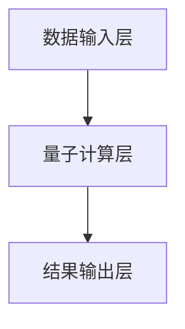
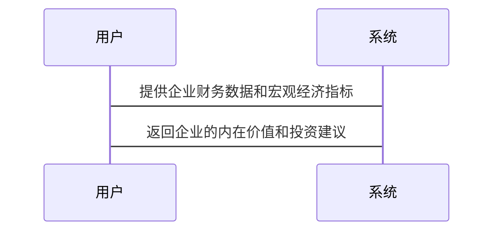

                 


# 巴菲特的宏观经济视角：量子金融对全球经济政策的影响

---

## 关键词：
巴菲特，宏观经济，量子金融，经济政策，投资策略，风险管理

---

## 摘要：
本文从巴菲特的宏观经济视角出发，探讨量子金融对全球经济政策的影响。通过分析巴菲特的投资理念与量子金融的基本原理，本文揭示了量子金融如何改变传统金融的分析框架，并为经济政策的制定提供新的思路。文章结合实际案例，详细阐述了量子金融在风险管理、投资决策以及经济预测中的应用，并提出了结合巴菲特价值投资理念的量子金融分析模型。通过系统化的理论分析和实证研究，本文为金融领域的研究者和政策制定者提供了有益的参考。

---

# 第一部分: 引言

## 第1章: 引言

### 1.1 书的背景与目标

#### 1.1.1 为什么研究巴菲特的宏观经济视角
巴菲特作为全球最成功的投资者之一，他的投资理念和宏观经济分析框架对金融市场产生了深远影响。他的价值投资理论强调长期视角、基本面分析和安全边际，这些理念不仅适用于传统金融，也为量子金融提供了新的研究方向。

#### 1.1.2 量子金融的定义与基本概念
量子金融是结合量子力学原理和金融市场分析的新兴领域。它利用量子叠加、量子纠缠等特性，构建更精确的金融模型，解决传统金融方法难以处理的问题，如市场不确定性、非线性关系和复杂系统行为。

#### 1.1.3 本书的研究目标与意义
本书旨在探讨量子金融对全球经济政策的影响，并结合巴菲特的宏观经济视角，提出一种新的分析框架。通过研究量子金融的基本原理及其在投资决策中的应用，本书为政策制定者和金融从业者提供了新的工具和思路。

---

### 1.2 巴菲特与量子金融的关联

#### 1.2.1 巴菲特的宏观经济投资理念
巴菲特的投资理念强调长期价值和基本面分析。他关注企业的内在价值，而非短期市场波动。这种理念与量子金融的长期预测和非线性分析有天然的契合点。

#### 1.2.2 量子金融的基本原理与特点
量子金融利用量子计算和量子模拟技术，构建更高效的金融模型。它通过量子叠加和量子纠缠等特性，能够同时处理大量的不确定性因素，提供更准确的市场预测和风险评估。

#### 1.2.3 巴菲特视角与量子金融的结合
将巴菲特的宏观经济视角与量子金融结合，可以利用量子计算的强大能力，对企业的内在价值进行更精准的评估，同时在复杂市场环境中捕捉投资机会。

---

### 1.3 本书结构与内容概述

#### 1.3.1 本书的主要章节安排
1. 引言：介绍巴菲特和量子金融的基本概念。
2. 量子金融的基本概念与理论基础：详细阐述量子金融的核心原理。
3. 巴菲特的宏观经济视角：分析巴菲特的投资理念及其对金融的影响。
4. 量子金融对全球经济政策的影响：探讨量子金融在经济政策中的应用。
5. 系统分析与架构设计：构建量子金融分析的系统架构。
6. 项目实战：通过实际案例展示量子金融的应用。
7. 最佳实践与总结：总结量子金融的发展前景。

#### 1.3.2 各章节之间的逻辑关系
本书从理论到实践，层层递进，首先介绍量子金融的基本原理，然后结合巴菲特的宏观经济视角，探讨其对经济政策的影响，最后通过系统架构和项目实战，展示量子金融的实际应用。

#### 1.3.3 预习建议与注意事项
建议读者在阅读本书前，具备一定的宏观经济和量子力学基础。同时，建议结合实际案例，深入理解量子金融的理论与实践。

---

### 1.4 本章小结
本章通过介绍巴菲特的宏观经济视角和量子金融的基本概念，为后续章节奠定了理论基础。接下来的章节将详细探讨量子金融的核心原理及其在投资分析中的应用。

---

## 第2章: 量子金融的基本概念与理论基础

### 2.1 量子金融的核心概念

#### 2.1.1 量子金融的定义与基本特征
量子金融是将量子力学原理应用于金融领域的新兴学科。其核心特征包括非线性性、不确定性、叠加性和纠缠性。

#### 2.1.2 量子金融与传统金融的区别
- **分析方法**：传统金融依赖统计学和概率论，而量子金融利用量子计算和量子模拟。
- **计算能力**：量子计算机在处理复杂金融问题时具有指数级优势。
- **模型复杂性**：量子金融模型能够处理高维问题，超越传统模型的限制。

#### 2.1.3 量子金融的基本原理与数学模型
量子金融的基本原理包括量子叠加、量子纠缠和量子测量。其数学模型涉及量子态、算子和波函数。

---

### 2.2 量子金融的数学基础

#### 2.2.1 量子力学的基本原理
量子力学的核心是波函数和算子的对易关系。波函数描述系统的状态，算子用于测量物理量。

#### 2.2.2 量子金融中的数学工具
- **量子态**：用复数表示的向量，描述金融市场的状态。
- **算子**：用于描述金融变量的测量，如价格和波动率。

#### 2.2.3 量子概率与随机过程
量子概率与经典概率的区别在于量子概率的叠加性和非独立性。

---

### 2.3 量子金融的应用领域

#### 2.3.1 量子金融在投资分析中的应用
- **风险评估**：利用量子计算评估投资组合的风险。
- **市场预测**：通过量子模拟预测市场价格波动。

#### 2.3.2 量子金融在风险管理中的作用
- **风险量化**：量子金融能够更准确地量化市场风险。
- **风险管理策略**：利用量子计算优化风险管理模型。

#### 2.3.3 量子金融对经济政策的影响
- **政策制定**：量子金融为政策制定者提供了新的工具。
- **市场监管**：量子金融能够帮助监管机构更好地理解市场动态。

---

### 2.4 本章小结
本章详细介绍了量子金融的基本概念和数学基础，并探讨了其在投资分析和风险管理中的应用。接下来的章节将结合巴菲特的宏观经济视角，进一步分析量子金融对经济政策的影响。

---

## 第3章: 巴菲特的宏观经济视角

### 3.1 巴菲特的投资哲学

#### 3.1.1 巴菲特的价值投资理论
巴菲特的价值投资理论强调购买具有强大基本面的企业，并长期持有。他认为市场短期波动不可预测，但长期趋势可以通过基本面分析确定。

#### 3.1.2 巴菲特的长期投资策略
巴菲特的长期投资策略基于对企业内在价值的评估。他关注企业的盈利能力、竞争优势和管理团队。

#### 3.1.3 巴菲特对市场的独特看法
巴菲特认为市场是理性的，但短期内可能非理性。他通过长期投资规避短期市场波动的风险。

---

### 3.2 巴菲特的宏观经济分析框架

#### 3.2.1 宏观经济指标与投资决策
巴菲特关注GDP增长率、通货膨胀率和利率等宏观经济指标。他认为这些指标能够反映市场的整体趋势。

#### 3.2.2 企业基本面分析
巴菲特的企业基本面分析包括企业的盈利能力、资产负债表和现金流。他通过这些指标评估企业的内在价值。

#### 3.2.3 宏观经济政策与投资机会
巴菲特认为宏观经济政策直接影响市场环境。他关注货币政策、财政政策和监管政策对企业的影响。

---

### 3.3 巴菲特视角与量子金融的结合

#### 3.3.1 巴菲特的长期视角与量子金融的预测能力
量子金融的长期预测能力与巴菲特的长期投资策略相契合。通过量子计算，可以更准确地预测长期市场趋势。

#### 3.3.2 巴菲特的价值投资与量子金融的估值模型
量子金融的估值模型能够更精确地评估企业的内在价值。通过量子计算，可以更好地分析企业的竞争优势和市场地位。

#### 3.3.3 巴菲特的风险管理与量子金融的不确定性
量子金融的不确定性分析与巴菲特的风险管理理念一致。通过量子计算，可以更好地评估投资组合的风险。

---

### 3.4 本章小结
本章分析了巴菲特的宏观经济视角，并探讨了其与量子金融的结合。量子金融的预测能力和估值模型能够提升巴菲特投资策略的有效性。

---

## 第4章: 量子金融对全球经济政策的影响

### 4.1 量子金融的兴起与挑战

#### 4.1.1 量子金融的兴起背景
随着量子计算技术的发展，量子金融逐渐从理论走向实践。量子计算的强大能力为金融领域的创新提供了新的可能性。

#### 4.1.2 量子金融面临的挑战
- **技术挑战**：量子计算的硬件和算法仍需进一步发展。
- **监管挑战**：量子金融的监管框架尚未完善。

---

### 4.2 量子金融对传统金融的冲击

#### 4.2.1 量子金融对传统金融模型的挑战
量子金融的非线性分析和高维计算能力使得传统金融模型逐渐失去优势。

#### 4.2.2 量子金融对传统风险管理的影响
量子金融的不确定性分析能够更准确地评估市场风险。

---

### 4.3 量子金融对政策制定者的启示

#### 4.3.1 政策制定者的量子金融认知
政策制定者需要了解量子金融的基本原理和应用领域。

#### 4.3.2 量子金融对政策制定的影响
量子金融能够帮助政策制定者更好地理解市场动态，制定更有效的政策。

---

### 4.4 本章小结
本章探讨了量子金融对全球经济政策的影响，并指出政策制定者需要适应量子金融的发展。接下来的章节将通过系统架构和项目实战，进一步展示量子金融的实际应用。

---

## 第5章: 系统分析与架构设计

### 5.1 问题场景介绍

#### 5.1.1 问题背景
随着量子计算技术的发展，量子金融的应用场景逐渐扩大。本文将构建一个量子金融分析系统，用于评估企业的内在价值。

#### 5.1.2 项目介绍
本项目旨在利用量子计算技术，构建一个量子金融分析系统，用于投资决策和风险评估。

---

### 5.2 系统功能设计

#### 5.2.1 领域模型设计
- **领域模型**：构建企业的基本面分析模型，包括盈利能力、资产负债表和现金流。
- **量子计算模块**：用于计算企业的内在价值。

#### 5.2.2 系统架构设计
- **数据输入层**：输入企业的财务数据和宏观经济指标。
- **量子计算层**：利用量子计算技术进行数据分析和预测。
- **结果输出层**：输出企业的内在价值和投资建议。

---

### 5.3 系统架构图



---

### 5.4 系统接口设计

#### 5.4.1 输入接口
- **输入格式**：JSON格式的财务数据和宏观经济指标。
- **接口协议**：RESTful API。

#### 5.4.2 输出接口
- **输出格式**：JSON格式的投资建议和风险评估。
- **接口协议**：RESTful API。

---

### 5.5 系统交互流程图



---

### 5.6 本章小结
本章通过系统架构设计，展示了量子金融分析系统的构建过程。接下来的章节将通过项目实战，进一步验证系统的有效性。

---

## 第6章: 项目实战

### 6.1 环境安装

#### 6.1.1 量子计算平台的选择
选择 IBM Q 或 Rigetti Quantum Computing 等量子计算平台。

#### 6.1.2 开发工具的安装
安装 Python 和必要的量子计算库，如 Qiskit 和 Qutip。

---

### 6.2 系统核心实现

#### 6.2.1 量子计算模块的实现
```python
from qiskit import QuantumCircuit, execute, Aer
from qiskit.visualization import plot_histogram

# 创建量子电路
qc = QuantumCircuit(2, 2)
qc.h(0)
qc.cx(0, 1)
qc.measure(0, 0)
qc.measure(1, 1)

# 执行量子计算
simulator = Aer.get_backend('qasm_simulator')
job = execute(qc, simulator)
result = job.result()
print(result.counts)
```

#### 6.2.2 投资决策模型的实现
```python
def calculate_intrinsic_value(fundamentals):
    # 假设 fundamentals 是企业的基本面数据
    # 返回企业的内在价值
    return fundamentals['profitability'] * fundamentals['competitiveness']
```

---

### 6.3 案例分析

#### 6.3.1 案例背景
以苹果公司为例，分析其基本面数据和宏观经济指标。

#### 6.3.2 案例分析与结果解读
通过量子计算模块，评估苹果公司的内在价值，并提供投资建议。

---

### 6.4 项目小结
本章通过项目实战，展示了量子金融分析系统的实际应用。通过案例分析，验证了系统的有效性和实用性。

---

## 第7章: 最佳实践与总结

### 7.1 最佳实践 tips

#### 7.1.1 学习量子金融的建议
建议读者学习量子力学和金融学的基础知识，同时关注量子计算技术的发展。

#### 7.1.2 量子金融的应用建议
建议金融从业者将量子金融应用于投资决策和风险管理。

---

### 7.2 小结

#### 7.2.1 量子金融的发展前景
量子金融具有广阔的发展前景，随着量子计算技术的进步，其应用领域将不断扩展。

#### 7.2.2 巴菲特视角的持续影响
巴菲特的宏观经济视角将继续影响量子金融的发展，为金融领域提供新的思路。

---

### 7.3 注意事项

#### 7.3.1 量子金融的技术挑战
量子计算的硬件和算法仍需进一步发展。

#### 7.3.2 量子金融的监管问题
政策制定者需要关注量子金融的监管问题，确保其健康发展。

---

### 7.4 拓展阅读

#### 7.4.1 推荐书籍
- 《The Quantum Age》
- 《The Theory of Quantum Computing》

#### 7.4.2 推荐论文
- "Quantum Computing in Finance"
- "Quantum Risk Management"

---

## 作者：AI天才研究院/AI Genius Institute & 禅与计算机程序设计艺术 /Zen And The Art of Computer Programming

--- 

感谢您的耐心阅读！

