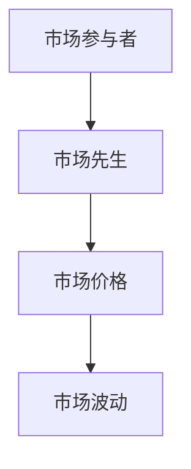
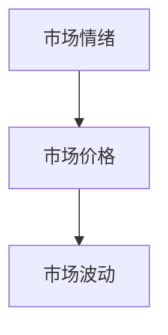
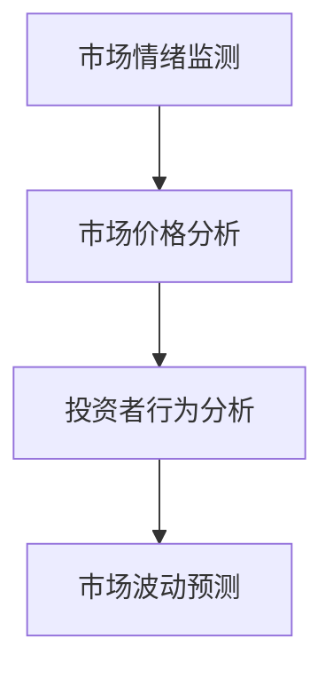

                 


# 巴菲特的市场先生比喻：理解市场的非理性

---

## 关键词：
- 巴菲特
- 市场先生比喻
- 市场非理性
- 投资者行为
- 理性决策

---

## 摘要：
巴菲特的市场先生比喻是一个强大的工具，用于理解市场的非理性行为。本文通过分析市场先生比喻的核心概念、理论基础、算法原理、数学模型、系统架构以及实际案例，揭示市场的非理性本质，并为投资者提供实用的策略和风险管理建议。

---

# 第1章: 市场先生比喻的背景与重要性

## 1.1 市场先生比喻的提出背景
### 1.1.1 巴菲特的投资理念与市场行为
巴菲特的投资理念基于价值投资，强调长期持有优质资产。他认为市场并非总是理性的，而是受情绪驱动的。市场先生比喻正是对这种情绪驱动的市场行为的生动描述。

### 1.1.2 市场先生比喻的核心思想
市场先生是巴菲特虚构的角色，代表市场情绪的变化。市场先生每天都会根据市场参与者的心理变化，决定当前市场的价格。这种比喻揭示了市场的波动性，以及投资者如何受情绪影响做出决策。

### 1.1.3 市场先生与理性市场的关系
市场先生的理性与非理性交替出现，理性市场是市场先生情绪稳定时的状态，而非理性市场则是市场先生情绪波动时的状态。通过市场先生比喻，巴菲特强调了市场波动的非理性本质。

---

## 1.2 市场先生比喻的现实意义
### 1.2.1 理解市场波动的关键工具
市场先生比喻帮助投资者理解市场的非理性波动，避免被短期市场情绪左右。

### 1.2.2 投资者行为的非理性分析
市场先生的非理性行为反映了投资者的群体心理，如贪婪和恐惧，这些情绪驱动了市场的短期波动。

### 1.2.3 市场情绪对企业价值的影响
市场先生的情绪波动会影响资产的定价，但长期来看，企业价值才是决定市场表现的关键因素。

---

## 1.3 本章小结
本章通过介绍市场先生比喻的背景和核心思想，揭示了市场波动的非理性本质，并强调了市场先生比喻在理解投资者行为和市场情绪中的重要作用。

---

# 第2章: 市场先生的定义与属性

## 2.1 市场先生的定义
### 2.1.1 市场先生的三重角色
市场先生既是市场情绪的体现者，也是市场波动的推动者，还是市场参与者的互动者。

### 2.1.2 市场先生的理性与非理性特征
市场先生在理性状态下会根据价值定价，但在非理性状态下会因情绪波动而偏离价值。

### 2.1.3 市场先生与市场参与者的互动关系
市场先生与市场参与者相互影响，市场的波动性来源于这种互动。

---

## 2.2 市场先生的核心属性
### 2.2.1 市场情绪的波动性
市场先生的情绪波动导致市场价格的短期波动。

### 2.2.2 市场价格的非理性波动
市场价格可能偏离其实际价值，反映市场先生的非理性行为。

### 2.2.3 市场参与者的心理偏差
市场参与者的行为受认知偏差影响，进一步加剧市场的非理性波动。

---

## 2.3 市场先生比喻的实体关系图


---

## 2.4 本章小结
本章详细定义了市场先生，并分析了其核心属性，通过实体关系图展示了市场先生与市场参与者、市场价格和市场波动之间的关系。

---

# 第3章: 市场先生比喻的理论基础

## 3.1 非理性市场的核心特征
### 3.1.1 市场情绪的传染性
市场情绪会迅速传播，导致市场参与者的行为趋同。

### 3.1.2 市场参与者的行为偏差
投资者的行为受认知偏差影响，如过度自信和从众心理。

### 3.1.3 市场波动的不可预测性
市场先生的非理性行为使得市场波动难以预测。

---

## 3.2 市场非理性的心理学解释
### 3.2.1 行为金融学的理论基础
行为金融学研究表明，投资者的决策受情绪和认知偏差影响。

### 3.2.2 认知偏差与市场波动
认知偏差导致投资者做出非理性决策，加剧市场波动。

---

## 3.3 本章小结
本章通过行为金融学的理论，分析了市场非理性波动的根源，并强调了认知偏差在市场波动中的作用。

---

# 第4章: 市场先生比喻的算法原理

## 4.1 市场先生比喻的算法实现
### 4.1.1 算法思路
通过模拟市场先生的情绪波动，计算市场价格的波动情况。



### 4.1.2 算法实现
以下是一个简单的Python代码示例，模拟市场先生的情绪波动：

```python
import random

def market_sentiment():
    # 随机选择市场情绪（1表示正面，0表示负面）
    return random.choice([1, 0])

def market_price(sentiment):
    # 根据市场情绪计算价格
    if sentiment == 1:
        return 100 + random.randint(-5, 5)
    else:
        return 100 + random.randint(5, -5)

# 模拟市场波动
sentiment = market_sentiment()
price = market_price(sentiment)
print(f"市场情绪：{sentiment}, 市场价格：{price}")
```

---

## 4.2 算法原理的数学模型
### 4.2.1 市场情绪与价格的关系
市场情绪可以通过概率分布来建模，如正态分布或均匀分布。

### 4.2.2 市场波动的数学公式
$$
P(t) = P(t-1) + \epsilon
$$
其中，$$P(t)$$ 是当前价格，$$P(t-1)$$ 是前一时刻的价格，$$\epsilon$$ 是随机波动项。

---

## 4.3 本章小结
本章通过算法实现和数学模型，模拟了市场先生的情绪波动对市场价格的影响，揭示了市场的非理性波动机制。

---

# 第5章: 市场先生比喻的数学模型

## 5.1 市场波动的数学分析
### 5.1.1 市场价格波动的方差
$$
\text{Var}(P) = \mathbb{E}[P^2] - (\mathbb{E}[P])^2
$$

### 5.1.2 市场情绪与价格的相关性
$$
\text{Corr}(S, P) = \frac{\text{Cov}(S, P)}{\sigma_S \sigma_P}
$$
其中，$$S$$ 是市场情绪，$$P$$ 是市场价格，$$\text{Cov}$$ 是协方差，$$\sigma$$ 是标准差。

---

## 5.2 市场波动的预测模型
### 5.2.1 时间序列分析
使用ARIMA模型预测市场波动。

### 5.2.2 情绪指标的构建
通过市场情绪指标（如恐慌指数）来预测市场波动。

---

## 5.3 本章小结
本章通过数学模型分析了市场波动的特征，并探讨了市场情绪对价格的影响。

---

# 第6章: 市场先生比喻的系统架构

## 6.1 系统功能设计
### 6.1.1 市场情绪监测模块
实时监测市场情绪的变化。

### 6.1.2 市场价格分析模块
分析市场价格的波动情况。

### 6.1.3 投资者行为分析模块
分析投资者行为对市场波动的影响。

---

## 6.2 系统架构设计


---

## 6.3 本章小结
本章通过系统架构设计，展示了如何利用市场先生比喻分析市场的非理性波动。

---

# 第7章: 市场先生比喻的项目实战

## 7.1 实际案例分析
### 7.1.1 案例背景
分析某次市场波动事件，如2020年新冠疫情对市场的冲击。

### 7.1.2 市场情绪分析
通过市场情绪指标，分析市场的非理性波动。

### 7.1.3 投资者行为分析
分析投资者在市场波动中的行为偏差。

---

## 7.2 项目小结
通过实际案例分析，验证了市场先生比喻的有效性，并提出了相应的投资策略。

---

# 第8章: 结论与启示

## 8.1 本章总结
市场先生比喻揭示了市场的非理性波动，帮助投资者理解市场行为。

## 8.2 投资者行为的启示
投资者应避免被市场情绪左右，坚持价值投资。

## 8.3 风险管理的最佳实践
通过分散投资和长期持有，降低市场波动的影响。

---

## 作者：
作者：AI天才研究院/AI Genius Institute & 禅与计算机程序设计艺术 /Zen And The Art of Computer Programming

