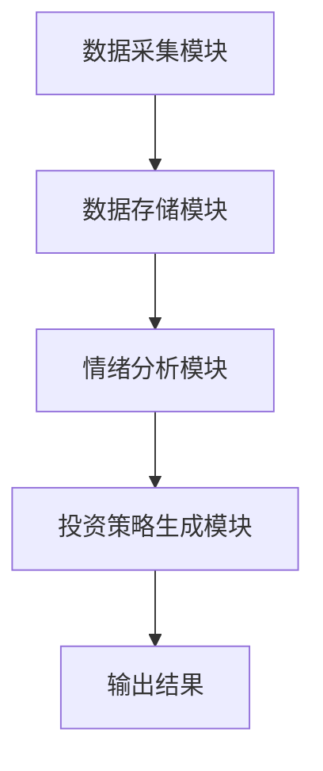

                 


# 巴菲特的市场情绪利用：在恐慌中寻找机会

## 关键词：
市场情绪，巴菲特，投资策略，恐慌，价值投资

## 摘要：
本文深入探讨了市场情绪对投资决策的影响，特别是巴菲特如何利用恐慌情绪寻找投资机会。通过分析市场情绪的量化方法、算法实现和系统设计，结合实际案例，本文展示了如何在市场恐慌中识别低估资产，制定有效的投资策略。文章还提供了详细的数学模型和系统架构，帮助读者理解和应用这些投资理念。

---

## 第一部分：市场情绪概述

### 第1章：市场情绪的定义与影响

#### 1.1 市场情绪的定义
- **1.1.1 市场情绪的内涵**  
  市场情绪是指投资者在特定市场环境下的心理状态和行为倾向，通常表现为乐观或悲观。

- **1.1.2 市场情绪的外延**  
  包括投资者的预期、信心和行为模式，这些因素共同影响市场价格波动。

- **1.1.3 市场情绪与投资决策的关系**  
  市场情绪是影响投资决策的重要因素，尤其是在市场波动加剧时。

#### 1.2 投资者心理分析
- **1.2.1 投资者心理的构成**  
  包括认知偏差、情绪波动和风险偏好等。

- **1.2.2 恐慌情绪的产生机制**  
  恐慌情绪通常由市场下跌、不确定性增加等因素引发。

- **1.2.3 投资者行为的非理性特征**  
  恐慌时投资者倾向于过度反应，可能导致非理性决策。

#### 1.3 恐慌情绪对市场的具体影响
- **1.3.1 恐慌情绪对股价波动的推动作用**  
  恐慌情绪加剧市场波动，可能导致股价短期偏离基本面。

- **1.3.2 恐慌情绪与市场底部的关系**  
  恐慌情绪往往出现在市场底部，为价值投资者提供机会。

- **1.3.3 恐慌情绪的周期性特征**  
  恐慌情绪具有周期性，通常在市场周期的低谷期出现。

#### 1.4 巴菲特的市场情绪利用策略
- **1.4.1 巴菲特的投资理念概述**  
  巴菲特强调长期投资和价值投资，关注内在价值。

- **1.4.2 巴菲特如何识别市场恐慌**  
  通过观察市场波动率和投资者行为识别恐慌情绪。

- **1.4.3 巴菲特在恐慌中的投资**  
  巴菲特在市场恐慌时寻找被低估的资产，长期持有。

---

## 第二部分：市场情绪的量化分析

### 第2章：恐慌指数及其计算方法

#### 2.1 恐慌指数的定义
- 恐慌指数是用来量化市场恐慌程度的指标，常见的是VIX指数。

#### 2.2 恐慌指数的计算公式
- 使用历史波动率计算VIX指数：
  $$VIX = \sqrt{\sum_{i=1}^{n} (R_i - \mu)^2 / n}$$
  其中，$R_i$是市场收益率，$\mu$是平均收益率，$n$是数据点数。

#### 2.3 恐慌指数与投资策略的关系
- 高恐慌指数表明市场情绪悲观，可能提供投资机会。

---

## 第三部分：市场情绪分析的算法实现

### 第3章：算法原理与实现

#### 3.1 数据预处理
- 数据清洗和标准化，确保数据质量。

#### 3.2 特征提取
- 提取市场波动率、交易量等特征。

#### 3.3 模型训练
- 使用机器学习算法训练情绪分类模型，如随机森林或神经网络。

#### 3.4 预测与策略生成
- 根据模型预测结果生成投资策略，如在恐慌情绪下增加仓位。

#### 3.5 代码实现
```python
import pandas as pd
import numpy as np

def calculate_vix(data):
    returns = data['return'].dropna()
    mu = returns.mean()
    variance = np.sum((returns - mu)**2) / len(returns)
    vix = np.sqrt(variance)
    return vix

# 示例数据
data = pd.DataFrame({
    'return': [0.01, -0.02, 0.03, -0.01, 0.00]
})
vix = calculate_vix(data)
print(f"VIX Index: {vix}")
```

---

## 第四部分：系统设计与实现

### 第4章：系统架构设计

#### 4.1 系统功能模块
- 数据采集模块：实时采集市场数据。
- 情绪分析模块：计算恐慌指数。
- 投资策略生成模块：根据分析结果生成投资策略。

#### 4.2 系统架构图


#### 4.3 接口设计
- 数据接口：提供实时数据获取接口。
- 策略接口：提供情绪分析结果调用接口。

#### 4.4 交互设计
- 用户界面展示恐慌指数和投资建议。

---

## 第五部分：项目实战

### 第5章：实际案例分析

#### 5.1 环境安装
- 安装必要的Python库，如Pandas、NumPy。

#### 5.2 数据获取
- 从Yahoo Finance获取历史数据。

#### 5.3 代码实现
```python
import pandas as pd
import numpy as np

def calculate_vix(data):
    returns = data['return'].dropna()
    mu = returns.mean()
    variance = np.sum((returns - mu)**2) / len(returns)
    vix = np.sqrt(variance)
    return vix

# 获取数据
data = pd.read_csv('market_data.csv')
vix = calculate_vix(data)
print(f"VIX Index: {vix}")
```

#### 5.4 案例分析
- 以2020年市场崩盘为例，展示如何利用恐慌指数制定投资策略。

---

## 第六部分：总结与展望

### 第6章：总结与展望

#### 6.1 全文总结
- 总结市场情绪对投资的影响，巴菲特的策略和算法实现。

#### 6.2 未来研究方向
- 探讨更复杂的情绪模型，结合更多市场数据进行分析。

#### 6.3 投资建议
- 建议投资者在市场恐慌时保持冷静，长期关注基本面。

#### 6.4 注意事项
- 提醒投资者注意市场风险，避免过度依赖单一指标。

#### 6.5 拓展阅读
- 推荐相关书籍和资源，进一步深入学习。

---

## 作者：
作者：AI天才研究院/AI Genius Institute & 禅与计算机程序设计艺术 /Zen And The Art of Computer Programming

