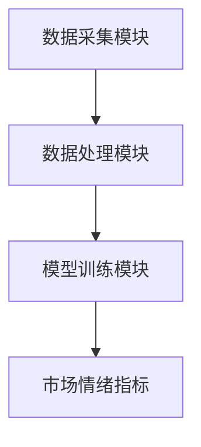

                 


# 巴菲特的市场情绪指标2.0：社交媒体时代的舆情分析

## 关键词：市场情绪指标，社交媒体，舆情分析，自然语言处理，机器学习，巴菲特投资策略

## 摘要：  
在社交媒体高度发达的今天，市场情绪分析成为了投资决策中的重要工具。本文深入探讨了如何利用社交媒体数据构建市场情绪指标，并通过自然语言处理和机器学习技术，结合巴菲特的投资策略，提出了一种创新的市场情绪指标2.0版本。文章详细分析了社交媒体数据的特点、情绪指标的构建过程、算法原理、系统架构，并通过实际案例展示了如何将这些理论应用于投资实战。最后，文章总结了社交媒体时代市场情绪分析的关键点和未来发展方向。

---

## 第1章: 背景与概念

### 1.1 市场情绪指标的演变  
#### 1.1.1 传统市场情绪指标的局限性  
传统的市场情绪指标主要依赖于市场交易数据和历史价格波动，难以捕捉投资者的实时情绪和市场参与者的主观态度。这种基于交易数据的指标在一定程度上可以反映市场的冷暖，但在社交媒体高度发达的今天，其局限性日益显现。

#### 1.1.2 巴菲特市场情绪指标的提出  
巴菲特作为投资大师，其成功的投资策略很大程度上依赖于对市场情绪的深刻理解。他强调长期投资和价值投资，而市场情绪指标的提出，正是为了更好地捕捉市场的短期波动和投资者情绪，为投资决策提供更全面的参考。

#### 1.1.3 社交媒体时代的市场情绪分析  
社交媒体的兴起，使得市场情绪分析进入了一个新的时代。社交媒体平台（如Twitter、Facebook、Reddit等）上的海量信息，为市场情绪分析提供了丰富的数据源。通过分析社交媒体上的文本、表情符号和互动数据，可以更及时、更准确地捕捉市场的实时情绪。

### 1.2 社交媒体与市场情绪分析  
#### 1.2.1 社交媒体数据的特征  
社交媒体数据具有实时性、多样性和海量性的特点。这些数据不仅包括文本、图片、视频，还包括用户的互动行为（如点赞、评论、分享等）。这些数据可以反映市场的热点话题、投资者的情绪倾向以及市场的舆论风向。

#### 1.2.2 市场情绪指标的核心概念  
市场情绪指标是一个综合性的指标，它通过分析社交媒体上的数据，量化市场的整体情绪状态。该指标可以分为积极、消极、中性三个等级，也可以进一步细化为多个维度（如乐观、悲观、怀疑等）。

---

## 第2章: 核心概念与联系

### 2.1 市场情绪指标的构建过程  
#### 2.1.1 数据预处理  
社交媒体数据通常具有噪声大、格式多样、语义复杂等特点。在构建市场情绪指标之前，需要对数据进行清洗和预处理，包括去除无效数据、分词、去除停用词等。

#### 2.1.2 特征提取  
特征提取是市场情绪指标构建的核心环节。常用的特征包括文本情感特征、关键词频率、用户行为特征等。通过这些特征，可以量化市场的整体情绪状态。

#### 2.1.3 模型训练  
通过机器学习算法（如支持向量机、随机森林、神经网络等），对提取的特征进行训练，得到市场情绪指标的预测模型。

### 2.2 市场情绪指标的数学模型  
#### 2.2.1 情感分类的数学公式  
$$ \text{情感倾向} = \text{sum}(w_i \times f_i) $$  
其中，\( w_i \) 是特征 \( f_i \) 的权重，sum表示求和。

#### 2.2.2 情绪强度的计算公式  
$$ \text{情绪强度} = \frac{\sum_{i=1}^{n} w_i \times f_i}{\sum_{i=1}^{n} w_i} $$  
其中，\( n \) 是特征的数量，\( w_i \) 是特征 \( f_i \) 的权重。

---

## 第3章: 算法原理与实现

### 3.1 情绪分析算法流程  
#### 3.1.1 数据预处理  
对社交媒体数据进行清洗和分词，去除停用词和标点符号。

#### 3.1.2 特征提取  
使用TF-IDF（Term Frequency-Inverse Document Frequency）算法提取文本特征。

#### 3.1.3 模型训练  
使用支持向量机（SVM）或长短期记忆网络（LSTM）对特征进行训练，得到情感分类模型。

### 3.2 算法实现与代码示例  
#### 3.2.1 环境安装与配置  
安装Python环境，安装Numpy、Scikit-learn、NLTK等依赖库。

#### 3.2.2 核心代码实现  
```python
from sklearn.feature_extraction.text import TfidfVectorizer
from sklearn.svm import SVC
from sklearn.metrics import accuracy_score

# 数据预处理
texts = ["This is a good news!", "This is bad news!"]
vectorizer = TfidfVectorizer()
X = vectorizer.fit_transform(texts)
y = [1, 0]  # 1表示积极，0表示消极

# 模型训练
model = SVC()
model.fit(X, y)

# 模型预测
test_text = ["This is a great news!"]
test_X = vectorizer.transform(test_text)
predicted = model.predict(test_X)
print("预测结果：", predicted)
```

---

## 第4章: 系统架构设计

### 4.1 系统功能设计  
#### 4.1.1 数据采集模块  
负责从社交媒体平台获取数据，包括文本、用户行为数据等。

#### 4.1.2 数据处理模块  
对采集的数据进行清洗、分词和特征提取。

#### 4.1.3 模型训练模块  
使用机器学习算法对特征进行训练，得到市场情绪指标的预测模型。

### 4.2 系统架构图  


---

## 第5章: 项目实战与案例分析

### 5.1 项目实战  
#### 5.1.1 环境安装与数据采集  
安装Python环境，使用Twitter API获取社交媒体数据。

#### 5.1.2 数据处理与特征提取  
使用NLTK库对文本进行分词和特征提取。

#### 5.1.3 模型训练与预测  
使用SVM或LSTM模型对数据进行训练，预测市场情绪指标。

### 5.2 案例分析  
以某次市场波动为例，分析社交媒体情绪指标对投资决策的实际影响。

---

## 第6章: 最佳实践与小结

### 6.1 最佳实践  
#### 6.1.1 数据来源的多样性  
建议结合多种社交媒体数据源，提高情绪分析的准确性。

#### 6.1.2 模型的可解释性  
在实际应用中，需要关注模型的可解释性，以便更好地理解市场情绪的变化。

### 6.2 小结  
社交媒体时代的市场情绪分析，为投资者提供了全新的工具和视角。通过结合自然语言处理和机器学习技术，我们可以更准确地捕捉市场的实时情绪，为投资决策提供有力支持。

---

## 作者：AI天才研究院/AI Genius Institute & 禅与计算机程序设计艺术 /Zen And The Art of Computer Programming

