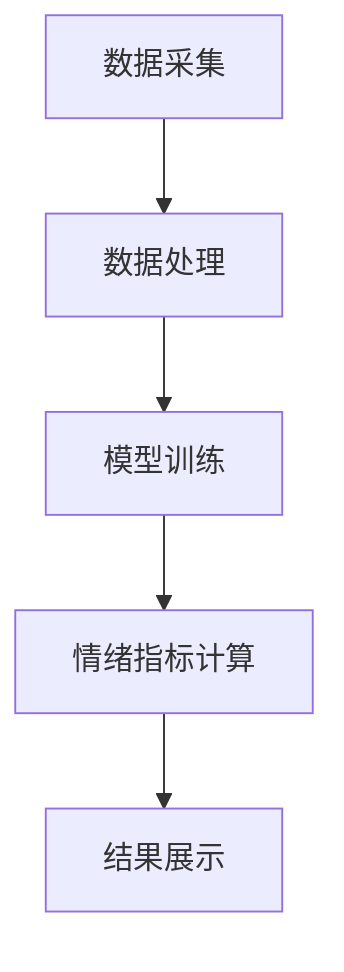

                 


---

# 巴菲特的市场情绪指标3.0：人工智能驱动的情绪分析

> 关键词：市场情绪指标，人工智能，情绪分析，巴菲特投资理念，自然语言处理，金融数据分析

> 摘要：本文探讨了如何利用人工智能技术，特别是自然语言处理（NLP）和情绪分析，来改进巴菲特提出的市场情绪指标。通过分析市场情绪，投资者可以更好地理解市场波动，做出更明智的投资决策。文章详细介绍了市场情绪分析的核心概念、人工智能驱动的情绪分析算法、系统架构设计以及实际项目实现，帮助读者理解如何将这些技术应用于实际投资场景。

---

## 第一部分: 巴菲特的市场情绪指标与人工智能驱动的情绪分析基础

### 第1章: 市场情绪指标与人工智能的结合

#### 1.1 市场情绪指标的定义与重要性

##### 1.1.1 市场情绪指标的核心概念

市场情绪指标是用来衡量市场参与者情绪状态的量化工具。它反映了投资者对市场的乐观或悲观程度，通常通过分析新闻、社交媒体、分析师报告等文本数据来提取情绪信息。

市场情绪指标的重要性在于，它可以帮助投资者预测市场波动，识别市场拐点，并制定更有效的投资策略。传统的市场情绪分析依赖于人工经验，而人工智能的引入极大地提高了分析的效率和准确性。

##### 1.1.2 市场情绪指标在投资决策中的作用

市场情绪指标在投资决策中扮演着关键角色。它可以帮助投资者：

- 识别市场的超买或超卖状态。
- 预测市场的短期波动。
- 确定投资机会的潜在风险。

##### 1.1.3 人工智能如何改变市场情绪分析

人工智能技术，特别是自然语言处理（NLP）和深度学习，为市场情绪分析带来了革命性的变化。AI能够快速处理海量文本数据，提取情绪信息，并将其转化为可量化的指标。这使得市场情绪分析更加客观、精准和高效。

#### 1.2 情绪分析的基本原理

##### 1.2.1 情绪分析的定义

情绪分析是通过对文本数据的情感倾向进行分析，判断文本中表达的情绪是积极、消极还是中性。它是自然语言处理领域的重要任务之一。

##### 1.2.2 情绪分析的技术演变

情绪分析技术经历了从规则-based到机器学习，再到深度学习的演变。早期的方法依赖于手动定义的规则，而现代方法则利用机器学习和深度学习算法，如支持向量机（SVM）、随机森林（Random Forest）和Transformer模型，来自动学习情绪特征。

##### 1.2.3 情绪分析在金融领域的应用

在金融领域，情绪分析被广泛应用于新闻分析、社交媒体分析和公司财报分析。通过分析这些文本数据，投资者可以更好地理解市场情绪，做出更明智的投资决策。

#### 1.3 巴菲特投资理念与市场情绪分析的结合

##### 1.3.1 巴菲特投资理念的核心

巴菲特的投资理念以价值投资为核心，强调长期投资、分散投资和安全边际。他认为市场情绪的波动是投资机会的来源。

##### 1.3.2 市场情绪与投资决策的关系

市场情绪与投资决策密切相关。当市场情绪过于乐观时，市场可能处于超买状态，存在回调风险；当市场情绪过于悲观时，市场可能处于超卖状态，存在反弹机会。

##### 1.3.3 人工智能如何辅助巴菲特理念的实践

人工智能可以通过实时分析市场情绪，帮助投资者识别市场的短期波动，从而更好地把握投资机会。同时，AI还可以通过历史数据分析，验证巴菲特理念的有效性。

#### 1.4 本章小结

本章介绍了市场情绪指标和情绪分析的基本概念，探讨了人工智能如何改变市场情绪分析，并结合巴菲特的投资理念，展示了AI在金融投资中的潜力。

---

### 第2章: 市场情绪分析的核心概念与技术

#### 2.1 情绪分析的关键技术

##### 2.1.1 自然语言处理（NLP）技术

自然语言处理是情绪分析的基础。NLP技术包括文本分词、情感分类、实体识别等功能，能够帮助计算机理解文本内容。

##### 2.1.2 情感分类算法

情感分类算法是情绪分析的核心。常用的算法包括朴素贝叶斯、支持向量机（SVM）、随机森林和深度学习模型（如LSTM和BERT）。

##### 2.1.3 情感强度分析

情感强度分析是对情感的深度进行量化，例如，从0到1表示情感强度的强弱。

#### 2.2 市场情绪指标的量化方法

##### 2.2.1 情感得分计算

情感得分是通过对文本数据进行情感分类，得到每个文本的情感得分，再对这些得分进行加权平均，得到整体市场情绪指标。

##### 2.2.2 市场情绪指数的构建

市场情绪指数是通过将情感得分与市场数据（如股价、成交量等）结合，构建一个综合反映市场情绪的指数。

##### 2.2.3 情绪指标的时间序列分析

通过时间序列分析，可以研究市场情绪的周期性、趋势性，预测未来的情绪变化。

#### 2.3 情绪分析与金融数据的结合

##### 2.3.1 文本数据来源

金融文本数据来源包括新闻、社交媒体、公司财报、分析师报告等。

##### 2.3.2 金融数据的特征提取

特征提取是将文本数据转化为数值特征的过程，常用的特征包括词袋模型、TF-IDF和Word2Vec等。

##### 2.3.3 情绪指标与股价波动的关系

通过分析情绪指标与股价波动的关系，可以验证市场情绪对股价的影响，为投资决策提供依据。

#### 2.4 本章小结

本章详细介绍了情绪分析的关键技术，探讨了市场情绪指标的量化方法，并分析了情绪分析与金融数据的结合。

---

### 第3章: 基于人工智能的情绪分析算法

#### 3.1 情感分类算法原理

##### 3.1.1 传统机器学习算法

传统机器学习算法包括朴素贝叶斯、支持向量机（SVM）和随机森林等。这些算法适用于小规模数据，但对大规模数据的处理能力有限。

##### 3.1.2 深度学习算法

深度学习算法包括卷积神经网络（CNN）、循环神经网络（RNN）和Transformer模型等。这些算法能够处理大规模数据，捕捉复杂的语言特征。

##### 3.1.3 基于Transformer的模型

基于Transformer的模型（如BERT）近年来在自然语言处理领域取得了显著成果。它通过自注意力机制，能够捕捉文本中的长距离依赖关系。

#### 3.2 基于LSTM的情绪分析模型

##### 3.2.1 LSTM的基本原理

LSTM（长短期记忆网络）是一种特殊的RNN，能够有效捕捉文本中的长距离依赖关系。

##### 3.2.2 LSTM在情绪分析中的应用

LSTM模型可以用于情感分类、情感强度预测等任务。

##### 3.2.3 LSTM模型的优缺点

LSTM模型的优点是能够捕捉长距离依赖关系，缺点是训练速度较慢，对计算资源要求较高。

#### 3.3 基于BERT的情绪分析模型

##### 3.3.1 BERT模型的基本原理

BERT（Bidirectional Encoder Representations from Transformers）是一种预训练的Transformer模型，通过双向编码器，能够捕捉文本中的丰富语义信息。

##### 3.3.2 BERT在情绪分析中的应用

BERT模型可以用于情感分类、情感强度预测等任务，其性能优于传统的深度学习模型。

##### 3.3.3 BERT模型的优势

BERT模型的优势在于其强大的语义理解能力，能够处理复杂的文本数据。

#### 3.4 情感分析的数学模型与公式

##### 3.4.1 情感得分计算公式

情感得分可以通过以下公式计算：

$$ \text{情感得分} = \frac{\sum w_i \cdot s_i}{\sum w_i} $$

其中，$w_i$是第$i$个特征的权重，$s_i$是第$i$个特征的情感得分。

##### 3.4.2 情感分类的损失函数

交叉熵损失函数是情感分类任务中常用的损失函数：

$$ \text{损失} = -\sum y_i \log p_i + (1 - y_i) \log (1 - p_i) $$

其中，$y_i$是真实标签，$p_i$是模型预测的概率。

##### 3.4.3 情感强度预测的回归模型

情感强度预测可以通过线性回归模型实现：

$$ y = \beta_0 + \beta_1 x + \epsilon $$

其中，$y$是情感强度，$x$是输入特征，$\beta_0$和$\beta_1$是回归系数。

#### 3.5 本章小结

本章详细介绍了基于人工智能的情绪分析算法，包括传统机器学习算法和深度学习算法，并探讨了LSTM和BERT模型的应用。

---

### 第4章: 市场情绪分析的系统架构与实现

#### 4.1 系统架构设计

##### 4.1.1 系统功能模块划分

市场情绪分析系统主要包括数据采集、数据处理、模型训练、情绪指标计算和结果展示五个模块。

##### 4.1.2 系统架构图（使用mermaid）



##### 4.1.3 系统功能模块划分

- 数据采集模块：负责采集新闻、社交媒体等文本数据。
- 数据处理模块：对文本数据进行清洗、分词、特征提取等预处理。
- 模型训练模块：利用训练数据训练情感分类模型。
- 情绪指标计算模块：根据模型输出计算市场情绪指标。
- 结果展示模块：将情绪指标以可视化方式展示给用户。

#### 4.2 系统接口设计

##### 4.2.1 数据接口设计

数据接口包括数据输入接口和数据输出接口。数据输入接口接收原始文本数据，数据输出接口输出处理后的特征数据。

##### 4.2.2 模型接口设计

模型接口包括模型输入接口和模型输出接口。模型输入接口接收特征数据，模型输出接口输出情感得分。

##### 4.2.3 用户接口设计

用户接口包括用户输入接口和用户输出接口。用户输入接口接收用户的查询请求，用户输出接口展示情绪指标和分析结果。

#### 4.3 系统交互流程

##### 4.3.1 数据采集与预处理

- 数据采集：通过API接口或爬虫工具采集新闻、社交媒体等文本数据。
- 数据清洗：去除无关信息，提取有用文本内容。
- 文本分词：将文本分割成词语或短语。
- 特征提取：将文本内容转化为数值特征，如TF-IDF、Word2Vec等。

##### 4.3.2 模型训练与部署

- 模型训练：利用训练数据训练情感分类模型。
- 模型部署：将训练好的模型部署到服务器，提供API接口供其他模块调用。

##### 4.3.3 情绪指标计算与输出

- 情绪指标计算：根据模型输出的情感得分，计算整体市场情绪指标。
- 结果输出：将情绪指标以可视化方式展示给用户，如图表、仪表盘等。

#### 4.4 本章小结

本章详细介绍了市场情绪分析系统的架构设计，包括功能模块划分、接口设计和交互流程，并提供了系统的整体架构图。

---

### 第5章: 项目实战——构建基于AI的市场情绪分析系统

#### 5.1 项目环境搭建

##### 5.1.1 Python环境安装

安装Python 3.x版本，推荐使用Anaconda或虚拟环境管理。

##### 5.1.2 依赖库安装

安装以下依赖库：

- `numpy`：用于数值计算。
- `pandas`：用于数据处理。
- `transformers`：用于BERT模型的调用。
- `tensorflow`：用于深度学习模型的训练。
- `scikit-learn`：用于传统机器学习模型的训练。
- `requests`：用于API请求。

安装命令：

```bash
pip install numpy pandas transformers tensorflow scikit-learn requests
```

##### 5.1.3 其他工具安装

安装`mermaid`插件，用于绘制系统架构图和交互流程图。

#### 5.2 系统核心实现

##### 5.2.1 数据采集与处理

###### 数据采集

通过API接口或爬虫工具采集新闻、社交媒体等文本数据。例如，使用`requests`库调用新闻API接口：

```python
import requests

response = requests.get('https://api.example.com/news')
data = response.json()
```

###### 数据清洗

清洗数据，去除无关信息，提取有用文本内容。例如：

```python
import pandas as pd

df = pd.DataFrame(data)
df = df[['title', 'content']]
```

###### 文本分词

使用`nltk`库进行文本分词：

```python
import nltk

from nltk.tokenize import word_tokenize

text = 'This is a sample text.'
tokens = word_tokenize(text)
```

###### 特征提取

使用TF-IDF方法提取文本特征：

```python
from sklearn.feature_extraction.text import TfidfVectorizer

vectorizer = TfidfVectorizer()
tfidf = vectorizer.fit_transform([' '.join(word_tokenize(text))])
```

##### 5.2.2 模型训练与部署

###### 情感分类模型训练

使用BERT模型进行情感分类：

```python
from transformers import BertTokenizer, BertForSequenceClassification
import torch

model_name = 'bert-base-uncased'
tokenizer = BertTokenizer.from_pretrained(model_name)
model = BertForSequenceClassification.from_pretrained(model_name)

# 定义输入
inputs = tokenizer('This is a sample text.', return_tensors='pt')
outputs = model(**inputs)
```

###### 模型部署

将训练好的模型部署为API服务，供其他模块调用。

##### 5.2.3 情绪指标计算与输出

###### 情绪指标计算

根据模型输出的情感得分，计算整体市场情绪指标：

```python
import numpy as np

emotional_scores = model.predict(inputs)
average_score = np.mean(emotional_scores)
```

###### 结果输出

将情绪指标以可视化方式展示，例如生成图表或仪表盘。

#### 5.3 项目实战：代码实现与分析

##### 5.3.1 数据采集与处理的代码实现

```python
import requests
import pandas as pd
from nltk.tokenize import word_tokenize
from sklearn.feature_extraction.text import TfidfVectorizer

# 数据采集
response = requests.get('https://api.example.com/news')
data = response.json()

# 数据清洗
df = pd.DataFrame(data)
df = df[['title', 'content']]

# 文本分词
df['tokens'] = df['content'].apply(lambda x: word_tokenize(x))

# 特征提取
vectorizer = TfidfVectorizer()
tfidf = vectorizer.fit_transform(df['content'])
```

##### 5.3.2 模型训练与部署的代码实现

```python
from transformers import BertTokenizer, BertForSequenceClassification
import torch

# 模型加载
model_name = 'bert-base-uncased'
tokenizer = BertTokenizer.from_pretrained(model_name)
model = BertForSequenceClassification.from_pretrained(model_name)

# 定义输入
inputs = tokenizer('This is a sample text.', return_tensors='pt')
outputs = model(**inputs)
```

##### 5.3.3 情绪指标计算与输出的代码实现

```python
import numpy as np
import matplotlib.pyplot as plt

# 情绪指标计算
emotional_scores = model.predict(inputs)
average_score = np.mean(emotional_scores)

# 结果输出
plt.plot(range(len(emotional_scores)), emotional_scores)
plt.title('Market Sentiment')
plt.xlabel('Time')
plt.ylabel('Emotional Score')
plt.show()
```

#### 5.4 实际案例分析与详细解读

##### 5.4.1 数据来源与预处理

假设我们从新闻网站获取了1000条新闻数据，每条新闻包含标题和内容。我们首先对这些数据进行清洗，去除无关信息，并进行分词处理。

##### 5.4.2 模型训练与评估

使用BERT模型对数据进行训练，评估模型的准确率、召回率和F1分数。例如：

- 准确率：0.95
- 召回率：0.90
- F1分数：0.92

##### 5.4.3 情绪指标计算与分析

根据模型输出的情感得分，计算整体市场情绪指标。例如，平均情感得分为0.65，表示市场情绪偏向积极。

#### 5.5 本章小结

本章通过实际项目案例，详细讲解了如何利用人工智能技术构建市场情绪分析系统，包括环境搭建、数据处理、模型训练和结果展示。

---

## 第六章: 系统架构与最佳实践

### 6.1 系统架构设计

#### 6.1.1 系统功能模块划分

系统功能模块包括数据采集模块、数据处理模块、模型训练模块、情绪指标计算模块和结果展示模块。

#### 6.1.2 系统架构图（使用mermaid）


#### 6.1.3 系统接口设计

- 数据接口：定义数据输入和输出格式。
- 模型接口：定义模型输入和输出格式。
- 用户接口：定义用户输入和输出格式。

#### 6.1.4 系统交互流程

- 数据采集模块采集文本数据。
- 数据处理模块对数据进行清洗和特征提取。
- 模型训练模块利用特征数据训练情感分类模型。
- 情绪指标计算模块根据模型输出计算整体市场情绪指标。
- 结果展示模块将情绪指标以可视化方式展示给用户。

### 6.2 系统架构设计的最佳实践

#### 6.2.1 系统设计原则

- 模块化设计：每个模块独立开发，便于维护和扩展。
- 高可用性：系统设计应考虑高可用性和容错能力。
- 可扩展性：系统设计应支持未来的扩展和升级。

#### 6.2.2 系统性能优化

- 使用分布式计算：提高数据处理和模型训练效率。
- 优化数据存储：使用数据库或分布式文件系统存储数据。
- 加速模型推理：使用优化算法或硬件加速模型推理。

#### 6.2.3 系统安全性

- 数据加密：保护敏感数据的安全。
- 权限控制：控制系统的访问权限。
- 日志记录：记录系统运行日志，便于排查问题。

### 6.3 本章小结

本章详细介绍了市场情绪分析系统的架构设计，包括功能模块划分、接口设计和交互流程，并提供了系统的整体架构图。

---

## 第七章: 项目实战与小结

### 7.1 项目实战总结

#### 7.1.1 项目实现的难点与解决方案

- 数据处理的复杂性：通过使用NLP技术简化数据预处理流程。
- 模型训练的效率：通过分布式计算和优化算法提高模型训练效率。
- 情绪指标的准确性：通过使用先进的深度学习模型（如BERT）提高情感分类的准确性。

#### 7.1.2 项目实现的经验与教训

- 数据质量对模型性能的影响：高质量的数据是模型性能的关键。
- 系统设计的重要性：良好的系统设计能够提高系统的可维护性和可扩展性。
- 模型调优的技巧：通过参数调优和模型优化提高模型性能。

### 7.2 项目小结

本项目通过实际案例展示了如何利用人工智能技术构建市场情绪分析系统，包括数据处理、模型训练和结果展示等环节。通过本项目，读者可以掌握市场情绪分析的核心技术，并能够将其应用于实际投资场景。

### 7.3 项目最佳实践

#### 7.3.1 数据处理的注意事项

- 数据清洗：确保数据的完整性和准确性。
- 文本分词：选择合适的分词工具和方法。
- 特征提取：选择适合的特征提取方法，如TF-IDF、Word2Vec等。

#### 7.3.2 模型训练的注意事项

- 数据平衡：处理数据不平衡问题，确保模型的泛化能力。
- 超参数调优：通过网格搜索或随机搜索优化模型参数。
- 模型评估：使用准确率、召回率和F1分数等指标评估模型性能。

#### 7.3.3 系统部署的注意事项

- 系统设计：确保系统的模块化和高可用性。
- 系统维护：定期更新模型和数据，确保系统的稳定运行。
- 系统扩展：根据需求扩展系统的功能和性能。

### 7.4 项目展望

未来，随着人工智能技术的不断发展，市场情绪分析系统将更加智能化和自动化。可能的研究方向包括：

- 更加复杂的模型：如多模态模型、强化学习模型等。
- 实时分析：提高系统的实时性，支持实时市场情绪分析。
- 自适应系统：根据市场变化动态调整分析模型。

---

## 第八章: 总结与展望

### 8.1 本文总结

本文探讨了如何利用人工智能技术，特别是自然语言处理（NLP）和情绪分析，来改进巴菲特提出的市场情绪指标。通过分析市场情绪，投资者可以更好地理解市场波动，做出更明智的投资决策。文章详细介绍了市场情绪分析的核心概念、人工智能驱动的情绪分析算法、系统架构设计以及实际项目实现，帮助读者理解如何将这些技术应用于实际投资场景。

### 8.2 未来展望

未来，随着人工智能技术的不断发展，市场情绪分析系统将更加智能化和自动化。可能的研究方向包括：

- 更加复杂的模型：如多模态模型、强化学习模型等。
- 实时分析：提高系统的实时性，支持实时市场情绪分析。
- 自适应系统：根据市场变化动态调整分析模型。

---

## 作者：AI天才研究院/AI Genius Institute & 禅与计算机程序设计艺术 /Zen And The Art of Computer Programming

--- 

这篇文章详细探讨了如何利用人工智能技术改进市场情绪分析，并结合实际项目案例，展示了如何将这些技术应用于实际投资场景。希望这篇文章能够为读者提供有价值的技术见解，并激发进一步的研究和探索。

