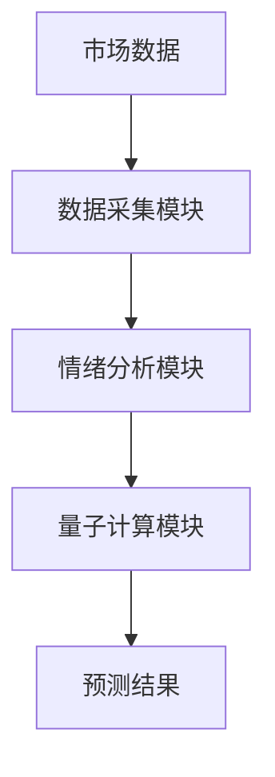

                 


# 巴菲特的市场情绪指标4.0：量子计算驱动的超级预测

> 关键词：市场情绪指标，巴菲特，量子计算，金融预测，情绪分析，量子算法，超级预测

> 摘要：本文深入探讨了如何利用量子计算技术提升市场情绪预测的准确性与效率，提出了巴菲特市场情绪指标的4.0版本。通过结合量子计算的核心原理与金融市场的数据特征，构建了一个基于量子计算的超级预测系统，为投资者提供了更精准的决策支持。

---

## 第一部分：市场情绪指标与量子计算的结合

### 第1章：市场情绪指标的背景与意义

#### 1.1 市场情绪指标的定义与作用
市场情绪指标是衡量市场参与者乐观或悲观情绪的量化工具，能够反映市场的整体情绪状态。情绪指标的波动往往与市场的涨跌密切相关，是投资者制定策略的重要参考。

#### 1.2 巴菲特市场情绪指标的历史发展
巴菲特作为投资界的传奇人物，其投资理念深刻影响了市场情绪指标的演变。从最初的简单情绪分析到结合经典计算的指标体系，市场情绪指标经历了多次升级。

#### 1.3 量子计算的崛起与潜力
量子计算作为一种革命性的计算技术，具有并行计算和超强处理能力，能够在复杂数据环境中快速提取有用信息，为市场情绪预测提供了新的可能性。

---

### 第2章：量子计算在市场情绪预测中的应用

#### 2.1 量子计算的核心优势
- 并行计算能力：能够在同一时间处理大量数据，显著提高计算效率。
- 处理复杂系统：适合处理金融市场中高度非线性的问题。

#### 2.2 市场情绪预测的量子算法实现
- 量子傅里叶变换：用于数据特征提取。
- 量子优化算法：用于构建预测模型。

---

## 第二部分：市场情绪指标4.0的数学模型与算法

### 第3章：经典计算与量子计算的对比分析

#### 3.1 经典计算的局限性
- 数据处理能力有限。
- 非线性问题处理效率低。

#### 3.2 量子计算的突破
- 能够高效处理复杂非线性问题。
- 提供更高的预测精度。

---

### 第4章：量子计算驱动的市场情绪指标模型

#### 4.1 模型构建的数学推导
$$ P(m) = \sum_{i=1}^{n} a_i \cdot q_i(m) $$
其中，$P(m)$ 是最终的市场情绪预测值，$a_i$ 是量子特征的权重，$q_i(m)$ 是量子计算的输出结果。

#### 4.2 量子计算在情绪预测中的具体应用
- 数据预处理：量子计算用于特征提取。
- 模型训练：量子算法优化预测模型。

---

## 第三部分：系统架构与项目实现

### 第5章：系统架构设计

#### 5.1 系统功能模块
- 数据采集模块：收集市场数据。
- 情绪分析模块：提取情绪特征。
- 量子计算模块：执行量子算法。

#### 5.2 系统架构图


### 第6章：量子计算驱动的超级预测算法实现

#### 6.1 量子算法的实现
- 量子傅里叶变换的实现：
```python
def quantum_FFT(circuit, qubits, clbits):
    # 实现量子傅里叶变换的具体步骤
```

#### 6.2 项目实战
- 环境配置：安装量子计算框架（如Qiskit）。
- 代码实现：编写量子计算驱动的情绪预测代码。
- 案例分析：分析实际市场数据，验证模型的准确性。

---

## 第四部分：总结与展望

### 第7章：总结与最佳实践

#### 7.1 总结
量子计算为市场情绪预测带来了革命性的变化，能够显著提高预测的准确性和效率。

#### 7.2 最佳实践
- 数据预处理：确保数据的高质量。
- 模型优化：结合经典算法优化量子模型。
- 实际应用：在实际投资中结合其他因素进行综合决策。

---

## 作者信息

作者：AI天才研究院/AI Genius Institute & 禅与计算机程序设计艺术 /Zen And The Art of Computer Programming

