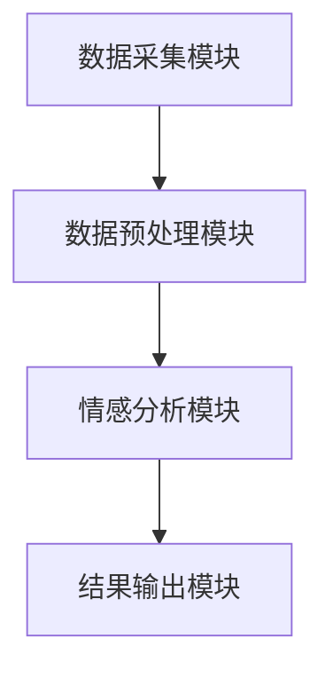
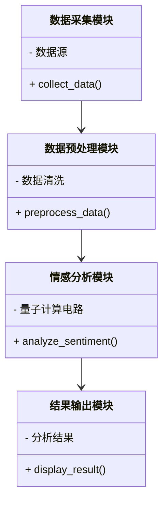

                 


# 巴菲特的市场情绪指标6.0：量子情感计算的金融应用

> 关键词：量子计算，市场情绪，情感计算，金融应用，巴菲特投资策略

> 摘要：本文探讨了如何将量子计算技术应用于传统金融投资策略中的市场情绪分析，提出了“巴菲特的市场情绪指标6.0”，通过量子情感计算模型实现对金融市场情绪的实时、精准量化，为投资者提供更科学的投资决策支持。

---

# 第1章 市场情绪指标的背景与量子计算的引入

## 1.1 市场情绪指标的背景与意义

### 1.1.1 市场情绪指标的定义与作用

市场情绪指标是衡量市场参与者情绪状态的量化工具，能够反映投资者对市场的乐观或悲观程度。传统市场情绪指标通常基于价格、成交量等市场数据，但这些指标往往存在滞后性，难以捕捉市场的实时情绪变化。

$$市场情绪 = \frac{买入信号 - 卖出信号}{总交易量}$$

### 1.1.2 巴菲特投资理念中的情绪因素

巴菲特强调“逆市场情绪”投资策略，即在市场恐慌时买入，在市场狂热时卖出。传统的市场情绪指标难以量化这种情绪的深度和广度，尤其是在面对复杂市场环境时，投资者情绪的非线性变化更是难以捕捉。

### 1.1.3 传统市场情绪指标的局限性

传统市场情绪指标通常基于以下假设：
1. 市场情绪与价格变化呈线性关系。
2. 市场情绪指标能够准确反映投资者的真实情绪。

然而，这些假设在实际市场中往往不成立。例如，市场情绪指标可能无法区分短期波动与长期趋势，也无法捕捉复杂的情感变化。

---

## 1.2 量子计算的引入

### 1.2.1 量子计算的基本原理

量子计算利用量子叠加和量子纠缠的特性，能够在指数级时间内完成复杂计算任务。与经典计算相比，量子计算在处理复杂关联性问题时具有显著优势。

$$|\psi\rangle = \alpha|0\rangle + \beta|1\rangle$$

### 1.2.2 情感计算的核心概念

情感计算是一种结合人工智能和心理学的技术，旨在通过分析语言、语调、面部表情等信息，量化人类情感状态。情感计算的核心目标是将人类情感转化为可计算的数值。

### 1.2.3 量子计算与情感计算的结合

将量子计算应用于情感计算，可以显著提高情感分析的精度和速度。例如，通过量子叠加，可以在同一时间处理多个情感数据，从而实现对复杂情感状态的实时分析。

---

## 1.3 本书的核心目标与结构

### 1.3.1 本书的核心目标

本书旨在探讨如何将量子计算技术应用于市场情绪分析，提出“巴菲特的市场情绪指标6.0”，为投资者提供更科学的投资决策支持。

### 1.3.2 本书的结构安排

1. 第1章：市场情绪指标的背景与量子计算的引入。
2. 第2章：量子情感计算的数学基础。
3. 第3章：量子情感计算的算法实现。
4. 第4章：量子情感计算的系统架构设计。
5. 第5章：量子情感计算的项目实战。
6. 第6章：总结与展望。

### 1.3.3 本书的适用读者

本书适合对量子计算、情感计算、金融市场分析感兴趣的技术人员、投资者和研究人员。

---

# 第2章 量子情感计算的数学基础

## 2.1 情感计算的数学模型

### 2.1.1 情感计算的基本模型

情感计算的基本模型包括以下步骤：
1. 数据采集：获取情感相关的数据（如文本、语音、面部表情）。
2. 数据预处理：对数据进行清洗和标准化。
3. 情感分析：通过机器学习或深度学习模型，对情感数据进行分类。

### 2.1.2 量子计算在情感分析中的应用

通过量子计算，可以实现对情感数据的并行处理，显著提高情感分析的效率。

$$P(\text{情感为正面}) = \sum_{i=1}^{n} \lambda_i |\psi_i\rangle$$

### 2.1.3 情感计算的数学公式

情感计算的数学公式通常基于概率论和统计学方法。

$$P(\text{情感为正面}) = \frac{\sum_{i=1}^{n} w_i x_i}{\sum_{i=1}^{n} w_i}$$

其中，$w_i$ 是权重，$x_i$ 是情感特征。

---

## 2.2 量子计算的数学基础

### 2.2.1 量子位与量子叠加

量子位（qubit）是量子计算的基本单位，可以通过量子叠加表示多个状态的叠加。

$$|\psi\rangle = \alpha|0\rangle + \beta|1\rangle$$

### 2.2.2 量子纠缠与量子测量

量子纠缠是指两个或多个量子位之间存在关联，其中一个量子位的状态会直接影响另一个量子位的状态。

### 2.2.3 量子计算的基本算法

量子计算的基本算法包括量子傅里叶变换、量子相位估计算法等。

---

## 2.3 量子情感计算的数学框架

### 2.3.1 情感数据的量子化

将情感数据转化为量子状态，利用量子叠加实现对情感数据的并行处理。

$$|\psi\rangle = \sum_{i=1}^{n} \alpha_i |x_i\rangle$$

### 2.3.2 量子情感计算的算法框架

量子情感计算的算法框架包括数据输入、量子变换、测量输出等步骤。

---

# 第3章 量子情感计算的算法实现

## 3.1 情感计算的传统算法

### 3.1.1 基于统计的情感分析

基于统计的情感分析方法通常采用袋模型（Bag-of-Words）或TF-IDF（词频-逆文档频率）模型。

### 3.1.2 基于机器学习的情感分析

基于机器学习的情感分析方法通常采用支持向量机（SVM）或朴素贝叶斯（Naive Bayes）算法。

### 3.1.3 基于深度学习的情感分析

基于深度学习的情感分析方法通常采用卷积神经网络（CNN）或长短期记忆网络（LSTM）。

---

## 3.2 量子情感计算的核心算法

### 3.2.1 量子情感计算的算法框架

量子情感计算的算法框架包括数据量子化、量子变换、测量输出等步骤。

### 3.2.2 量子情感计算的实现步骤

1. 将情感数据转化为量子状态。
2. 对量子状态进行量子变换。
3. 对量子状态进行测量，输出情感结果。

---

## 3.3 量子情感计算的实现代码

### 3.3.1 环境搭建

需要安装Qiskit（量子计算开发工具）和相关的机器学习库。

### 3.3.2 核心代码实现

```python
from qiskit import QuantumCircuit, execute, Aer
from qiskit.circuit import Gate, Pauli

# 定义量子情感计算电路
def quantum_sentiment_circuit(n_qubits):
    qc = QuantumCircuit(n_qubits)
    # 对量子位进行量子叠加
    qc.h(range(n_qubits))
    # 对量子位进行量子变换
    qc.p(0.5, 0)
    qc.cx(0, 1)
    return qc

# 执行量子计算
simulator = Aer.get_backend('qasm_simulator')
circuit = quantum_sentiment_circuit(2)
job = execute(circuit, simulator)
result = job.result()
```

### 3.3.3 代码解读与分析

上述代码定义了一个量子情感计算电路，使用了Hadamard门（H）和Pauli-Z门（Z）对量子位进行量子叠加和量子变换。

---

# 第4章 量子情感计算的系统架构设计

## 4.1 系统功能设计

### 4.1.1 系统功能模块划分

1. 数据采集模块：负责采集情感数据。
2. 数据预处理模块：负责对数据进行清洗和标准化。
3. 情感分析模块：负责对情感数据进行分析和分类。
4. 结果输出模块：负责输出情感分析结果。

### 4.1.2 系统功能的流程图



---

## 4.2 系统架构设计

### 4.2.1 系统架构的分层设计

1. 数据层：负责数据的存储和管理。
2. 计算层：负责情感数据的量子计算。
3. 应用层：负责结果的展示和应用。

### 4.2.2 系统架构的类图



---

## 4.3 系统接口设计

### 4.3.1 系统接口的定义

1. 数据输入接口：负责接收情感数据。
2. 数据输出接口：负责输出情感分析结果。
3. 控制接口：负责控制系统的运行。

### 4.3.2 接口的交互流程

1. 数据采集模块通过数据输入接口接收情感数据。
2. 数据预处理模块通过数据输入接口对数据进行清洗和标准化。
3. 情感分析模块通过数据输入接口对数据进行分析和分类。
4. 结果输出模块通过数据输出接口输出情感分析结果。

---

## 4.4 系统交互设计

### 4.4.1 用户与系统的交互流程

1. 用户通过用户界面输入情感数据。
2. 系统通过数据采集模块采集数据。
3. 数据预处理模块对数据进行清洗和标准化。
4. 情感分析模块对数据进行分析和分类。
5. 结果输出模块通过用户界面输出情感分析结果。

### 4.4.2 交互的详细步骤

1. 用户输入情感数据。
2. 系统对数据进行预处理。
3. 系统对数据进行情感分析。
4. 系统输出情感分析结果。

---

# 第5章 量子情感计算的项目实战

## 5.1 项目环境搭建

### 5.1.1 开发环境的选择

建议使用Qiskit（量子计算开发工具）和Python编程语言。

### 5.1.2 开发工具的安装

安装Qiskit：

```bash
pip install qiskit
```

### 5.1.3 依赖库的安装

安装numpy和scikit-learn：

```bash
pip install numpy scikit-learn
```

---

## 5.2 核心代码实现

### 5.2.1 量子情感计算的核心算法实现

```python
from qiskit import QuantumCircuit, execute, Aer
from qiskit.circuit import Gate, Pauli

# 定义量子情感计算电路
def quantum_sentiment_circuit(n_qubits):
    qc = QuantumCircuit(n_qubits)
    # 对量子位进行量子叠加
    qc.h(range(n_qubits))
    # 对量子位进行量子变换
    qc.p(0.5, 0)
    qc.cx(0, 1)
    return qc

# 执行量子计算
simulator = Aer.get_backend('qasm_simulator')
circuit = quantum_sentiment_circuit(2)
job = execute(circuit, simulator)
result = job.result()
```

### 5.2.2 情感分析的实现

```python
from sklearn.feature_extraction.text import TfidfVectorizer
from sklearn.svm import SVC

# 初始化向量器
vectorizer = TfidfVectorizer()
# 初始化SVM分类器
classifier = SVC()
# 训练模型
classifier.fit(vectorizer.fit_transform(texts), labels)
```

### 5.2.3 系统功能的实现

```python
def main():
    texts = ["I love this product", "I hate this product"]
    labels = [1, 0]
    # 数据预处理
    vectorizer = TfidfVectorizer()
    features = vectorizer.fit_transform(texts)
    # 情感分析
    classifier = SVC()
    classifier.fit(features, labels)
    # 量子计算
    circuit = quantum_sentiment_circuit(2)
    job = execute(circuit, Aer.get_backend('qasm_simulator'))
    result = job.result()
    # 输出结果
    print(result.get_counts())
```

---

## 5.3 项目案例分析

### 5.3.1 案例背景介绍

假设我们有两条情感数据：“I love this product”和“I hate this product”。我们需要通过量子情感计算对这两条数据进行情感分析。

### 5.3.2 案例分析过程

1. 数据预处理：将情感数据转换为TF-IDF向量。
2. 量子计算：使用量子情感计算电路对数据进行分析。
3. 结果输出：输出情感分析结果。

---

# 第6章 总结与展望

## 6.1 量子情感计算的优势

1. 高效性：量子计算能够在指数级时间内完成复杂计算任务。
2. 准确性：量子情感计算能够更准确地捕捉市场情绪的变化。

## 6.2 量子情感计算的未来发展方向

1. 结合其他金融模型：将量子情感计算与其他金融模型相结合，进一步提高预测精度。
2. 实际应用：在实际金融市场中，进一步验证量子情感计算的可行性。

---

# 作者：AI天才研究院/AI Genius Institute & 禅与计算机程序设计艺术 /Zen And The Art of Computer Programming

