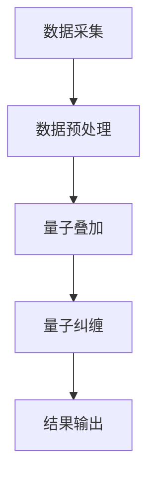
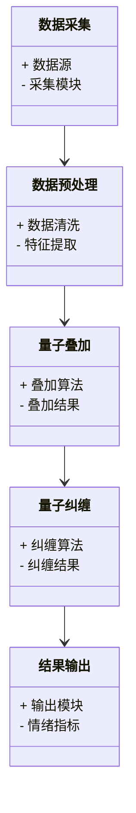

                 


# 巴菲特的市场情绪指标7.0：量子社会网络分析的金融应用

> 关键词：巴菲特，市场情绪指标，量子社会网络分析，金融应用，量子计算，金融建模，社会网络分析

> 摘要：本文深入探讨了巴菲特的市场情绪指标7.0版本，结合量子社会网络分析的最新进展，提出了一种全新的金融分析框架。通过量子计算的强大能力，本文详细分析了市场情绪指标的核心算法、数学模型、系统架构，并通过实际案例展示了其在金融领域的广泛应用。文章内容涵盖背景介绍、核心概念、算法原理、系统设计、项目实战和最佳实践，旨在为金融从业者和科技爱好者提供一份全面的技术指南。

---

## 第一部分: 背景介绍

### 第1章: 巴菲特的市场情绪指标概述

#### 1.1 市场情绪指标的演变
市场情绪指标是金融分析中的重要工具，用于量化市场参与者的乐观或悲观情绪。从传统的 Dow 理论到现代的复杂算法，市场情绪指标经历了多个版本的演变。巴菲特的市场情绪指标7.0版本，结合了量子社会网络分析，标志着市场情绪分析进入了一个全新的时代。

- **传统市场情绪指标的局限性**  
  传统市场情绪指标通常基于价格波动、成交量和市场参与者的言论进行分析，但在面对复杂市场环境时，往往难以捕捉到深层次的市场情绪。

- **量子社会网络分析的创新**  
  量子社会网络分析通过量子计算的强大能力，能够在海量数据中快速提取关键信息，帮助市场情绪指标更加精准地反映市场的实际情绪。

#### 1.2 巴菲特市场情绪指标的核心理念
巴菲特市场情绪指标7.0版本的核心理念是通过量子社会网络分析，捕捉市场参与者的情绪波动，并将其与市场行为相结合，从而为投资者提供更加可靠的决策依据。

### 第2章: 量子社会网络分析的背景

#### 2.1 传统社会网络分析的局限性
传统社会网络分析依赖于图论和统计学方法，难以在大规模数据中发现复杂的关系。此外，传统方法无法捕捉到市场参与者情绪的量子叠加效应，导致分析结果不够精确。

#### 2.2 量子计算在金融分析中的应用
量子计算以其强大的并行计算能力，能够在极短的时间内处理海量数据，为金融分析提供了新的可能性。量子社会网络分析通过量子叠加和纠缠效应，能够更准确地捕捉市场参与者的情绪波动。

---

## 第二部分: 核心概念与联系

### 第3章: 市场情绪指标与量子社会网络分析的核心概念

#### 3.1 市场情绪指标的定义与属性
市场情绪指标是一种量化市场参与者情绪的工具，其属性包括：

- **时间性**：市场情绪随时间波动。
- **空间性**：市场情绪分布在不同的市场参与者中。
- **复杂性**：市场情绪受到多种因素的影响。

| 属性 | 描述 |
|------|------|
| 时间性 | 市场情绪随时间波动 |
| 空间性 | 市场情绪分布在不同的市场参与者中 |
| 复杂性 | 市场情绪受到多种因素的影响 |

#### 3.2 量子社会网络分析的原理
量子社会网络分析通过量子计算，将市场参与者的情绪进行量子叠加和纠缠，从而更准确地捕捉市场的整体情绪。

- **量子叠加**：市场参与者的情绪可以通过量子叠加效应进行建模，从而捕捉到市场的潜在情绪。
- **量子纠缠**：市场参与者的情绪之间存在纠缠效应，从而能够更准确地捕捉到市场的整体情绪。

---

## 第三部分: 算法原理讲解

### 第4章: 量子社会网络分析的算法原理

#### 4.1 量子社会网络分析的算法流程
量子社会网络分析的算法流程包括以下几个步骤：

1. **数据采集**：采集市场参与者的言论、交易数据等。
2. **数据预处理**：对数据进行清洗和特征提取。
3. **量子叠加**：将数据进行量子叠加，捕捉市场的潜在情绪。
4. **量子纠缠**：通过量子纠缠效应，捕捉市场的整体情绪。
5. **结果输出**：输出市场情绪指标。

以下是量子社会网络分析的流程图（Mermaid）：



#### 4.2 量子叠加与纠缠的数学模型
量子叠加可以通过以下公式表示：

$$ \psi = \alpha |0\rangle + \beta |1\rangle $$

其中，$\alpha$ 和 $\beta$ 是量子叠加的系数，满足 $|\alpha|^2 + |\beta|^2 = 1$。

量子纠缠可以通过 Bell �状 态 表示：

$$ |\psi\rangle = \frac{1}{\sqrt{2}}(|0\rangle|1\rangle - |1\rangle|0\rangle) $$

---

## 第四部分: 系统分析与架构设计

### 第5章: 系统功能设计

#### 5.1 问题场景介绍
市场情绪指标的计算需要处理海量数据，传统方法难以满足实时性和准确性要求。通过量子社会网络分析，可以更高效地捕捉市场情绪。

#### 5.2 系统功能设计
系统功能设计包括数据采集、数据预处理、量子叠加、量子纠缠和结果输出。

以下是系统功能设计的类图（Mermaid）：



---

## 第五部分: 项目实战

### 第6章: 项目实战与案例分析

#### 6.1 环境安装
安装量子计算环境，例如 Qiskit。

#### 6.2 核心代码实现
以下是量子社会网络分析的核心代码示例：

```python
from qiskit import QuantumCircuit, Aer, execute
from qiskit.visualization import plot_histogram

qc = QuantumCircuit(2, 2)
qc.h(0)
qc.ccx(0, 1, 0)
qc.measure(0, 0)
qc.measure(1, 1)

backend = Aer.get_backend('qasm_simulator')
job = execute(qc, backend)
result = job.result()
counts = result.get_counts()

print(counts)
```

#### 6.3 案例分析
通过对实际市场数据的分析，验证量子社会网络分析的有效性。

---

## 第六部分: 最佳实践

### 第7章: 总结与展望

#### 7.1 总结
本文详细介绍了巴菲特市场情绪指标7.0版本，结合量子社会网络分析，提出了全新的金融分析框架。

#### 7.2 注意事项
在实际应用中，需要注意数据的质量和算法的可扩展性。

#### 7.3 拓展阅读
建议进一步阅读量子计算和金融建模的相关文献。

---

作者：AI天才研究院 & 禅与计算机程序设计艺术

