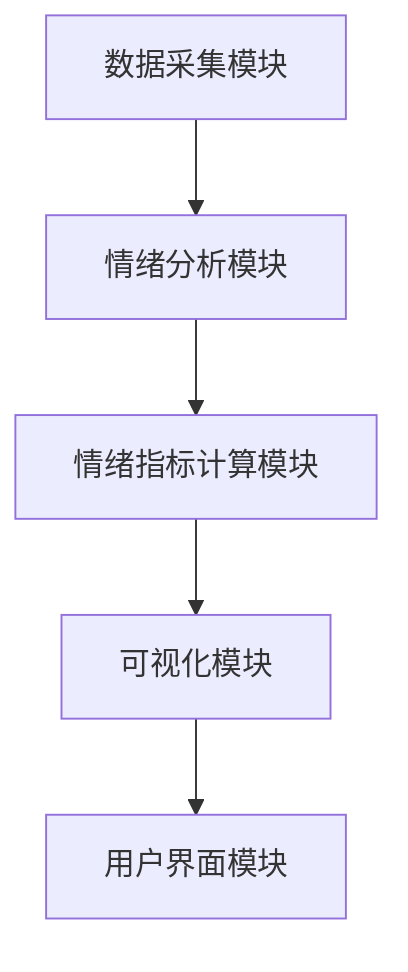

                 


# 巴菲特的市场情绪指标：利用大众心理做出明智决策

> 关键词：巴菲特，市场情绪，价值投资，恐慌指数，投资者心理，情绪分析

> 摘要：本文探讨了巴菲特如何利用市场情绪指标做出投资决策，分析了投资者心理周期，介绍了恐慌指数VIX等情绪指标的计算方法，并通过案例展示了如何在实际投资中应用这些指标。

---

## 目录

1. 引言
2. 市场情绪指标的背景与概念
3. 投资者心理分析
4. 市场情绪指标的量化方法
5. 市场情绪分析的算法原理
6. 系统设计与实现
7. 项目实战：利用市场情绪指标做出投资决策
8. 最佳实践与小结
9. 参考文献
10. 作者信息

---

## 第一部分：引言

### 1. 巴菲特的投资理念与市场情绪

#### 1.1 价值投资的核心原则

价值投资是一种投资策略，强调购买那些市场价格低于其内在价值的股票。巴菲特是这一策略的代表人物，他主张长期投资，关注企业的基本面，而不是市场的短期波动。

#### 1.2 市场情绪的重要性

市场情绪是指投资者在市场中的整体情绪状态，通常分为乐观、怀疑、恐慌和贪婪。市场情绪会影响股票价格，尤其是在市场波动较大的时候。巴菲特认为，市场情绪可以帮助投资者找到被低估的投资机会。

#### 1.3 巴菲特的市场情绪指标

巴菲特并没有公开具体的市场情绪指标，但他通过观察市场的恐慌和贪婪程度来判断投资机会。例如，在市场恐慌时，优质股票可能被抛售，提供买入机会；在市场乐观时，股票可能被高估，提示卖出信号。

---

## 第二部分：市场情绪指标的背景与概念

### 2.1 市场情绪指标的定义

市场情绪指标是用于量化市场参与者情绪的工具。常见的市场情绪指标包括恐慌指数（VIX）、投资者情绪指数（AAII）和市场广度指标等。

#### 2.1.1 恐慌指数（VIX）

VIX指数是芝加哥期权交易所波动率指数，反映市场对风险的预期。VIX越高，市场情绪越恐慌；VIX越低，市场情绪越乐观。

#### 2.1.2 投资者情绪指数（AAII）

AAII指数通过每周对投资者情绪进行调查，分为乐观、中性和悲观三类，反映市场的整体情绪状态。

### 2.2 投资者心理周期

投资者心理周期通常分为四个阶段：乐观、怀疑、恐慌和贪婪。

- **乐观阶段**：投资者情绪高涨，大量买入股票，推高股价。
- **怀疑阶段**：投资者开始质疑市场的上涨逻辑，交易量下降。
- **恐慌阶段**：市场下跌，投资者恐慌性抛售，股价大幅波动。
- **贪婪阶段**：市场反弹，投资者重新买入，寻找收益。

### 2.3 价值投资与市场情绪的关系

价值投资者关注的是企业的内在价值，而非市场的短期波动。然而，市场情绪可以帮助价值投资者识别被低估的投资机会。例如，在市场恐慌时，优质股票可能被抛售，提供买入机会。

---

## 第三部分：投资者心理分析

### 3.1 投资者心理阶段

投资者在不同市场阶段的心理状态不同，这影响其决策行为。以下是常见的投资者心理阶段及其表现：

- **乐观阶段**：投资者信心满满，愿意以高价格买入股票。
- **怀疑阶段**：投资者开始质疑市场走势，交易量下降。
- **恐慌阶段**：市场下跌，投资者恐慌性抛售，股价大幅波动。
- **贪婪阶段**：市场反弹，投资者重新买入，寻找收益。

### 3.2 群体心理与市场情绪

群体心理是指投资者在市场中的集体行为。当大部分投资者情绪乐观时，市场可能被高估；当大部分投资者情绪恐慌时，市场可能被低估。

### 3.3 投资者心理偏差

投资者心理偏差是指投资者在决策过程中常见的认知错误，如过度自信、从众心理和损失厌恶。这些偏差会影响市场情绪，进而影响股票价格。

---

## 第四部分：市场情绪指标的量化方法

### 4.1 恐慌指数（VIX）的计算

恐慌指数（VIX）是通过标普500指数的期权波动率计算得出的。以下是VIX的计算公式：

$$ VIX = \sqrt{\frac{1}{N} \sum_{i=1}^{N} (R_i - \mu)^2} $$

其中，$R_i$ 是第$i$个期权的收益率，$\mu$ 是平均收益率，$N$ 是期权数量。

### 4.2 投资者情绪指数（AAII）的计算

AAII指数通过每周对投资者情绪进行调查，分为乐观、中性和悲观三类。以下是AAII指数的计算步骤：

1. 收集投资者情绪调查数据。
2. 统计乐观、中性和悲观投资者的比例。
3. 计算AAII指数：乐观比例 - 悲观比例。

### 4.3 市场广度指标的计算

市场广度指标反映市场中上涨和下跌股票的数量比例。以下是市场广度指标的计算公式：

$$ \text{市场广度} = \frac{\text{上涨股票数量} - \text{下跌股票数量}}{\text{总股票数量}} $$

---

## 第五部分：市场情绪分析的算法原理

### 5.1 基于NLP的市场情绪分析

自然语言处理（NLP）技术可以用于分析新闻标题的情绪。以下是基于NLP的市场情绪分析算法步骤：

1. 收集新闻标题数据。
2. 对新闻标题进行分词和情感分析。
3. 统计正面、负面和中性情绪的比例。
4. 计算市场情绪指数：正面比例 - 负面比例。

### 5.2 基于统计学的市场情绪分析

统计学方法可以通过分析历史数据来预测市场情绪。以下是基于统计学的市场情绪分析算法步骤：

1. 收集历史市场数据。
2. 计算市场情绪指标（如VIX）。
3. 分析市场情绪指标的变化趋势。
4. 预测未来市场情绪。

### 5.3 基于机器学习的市场情绪分析

机器学习可以通过训练模型来预测市场情绪。以下是基于机器学习的市场情绪分析算法步骤：

1. 收集历史市场数据和情绪指标。
2. 数据预处理和特征提取。
3. 训练机器学习模型（如随机森林或神经网络）。
4. 使用模型预测未来市场情绪。

---

## 第六部分：系统设计与实现

### 6.1 系统架构设计

以下是市场情绪监控系统的架构图：



### 6.2 数据采集模块

数据采集模块负责收集市场数据，包括股票价格、新闻标题等。

### 6.3 情绪分析模块

情绪分析模块使用NLP技术分析新闻标题的情绪，计算市场情绪指数。

### 6.4 情绪指标计算模块

情绪指标计算模块基于历史数据计算市场情绪指标，如VIX和AAII指数。

### 6.5 可视化模块

可视化模块将市场情绪指标以图表形式展示，帮助用户直观理解市场情绪。

---

## 第七部分：项目实战：利用市场情绪指标做出投资决策

### 7.1 环境安装

需要安装以下工具和库：

- Python
- Pandas
- NumPy
- Matplotlib
- Scikit-learn

### 7.2 核心实现代码

以下是计算恐慌指数的Python代码示例：

```python
import pandas as pd
import numpy as np
import matplotlib.pyplot as plt

# 假设我们有一个包含股票价格和波动率的数据框
data = pd.DataFrame({'price': [100, 98, 102, 105, 100], 'volatility': [0.2, 0.3, 0.1, 0.4, 0.2]})

# 计算恐慌指数
vix = np.sqrt(np.mean((data['price'] - data['price'].mean())**2))

print(f"VIX指数为: {vix}")
```

### 7.3 案例分析

以2008年金融危机为例，分析巴菲特如何利用市场情绪指标做出投资决策。在市场恐慌时，巴菲特大量买入优质股票，如 Goldman Sachs 和 BP。

---

## 第八部分：最佳实践与小结

### 8.1 总结

市场情绪指标是投资者做出明智决策的重要工具。通过分析市场情绪，投资者可以识别被低估的投资机会，避免情绪化决策的陷阱。

### 8.2 小结

本文介绍了巴菲特的市场情绪指标，分析了投资者心理周期，讲解了恐慌指数VIX等情绪指标的计算方法，并通过案例展示了如何在实际投资中应用这些指标。

### 8.3 注意事项

- 市场情绪指标仅供参考，需结合基本面分析。
- 避免情绪化决策，保持理性。
- 定期更新市场情绪指标，适应市场变化。

### 8.4 拓展阅读

- 《巴菲特的智慧》
- 《投资心理学》
- 《市场情绪分析》

---

## 作者信息

作者：AI天才研究院/AI Genius Institute & 禅与计算机程序设计艺术 /Zen And The Art of Computer Programming

