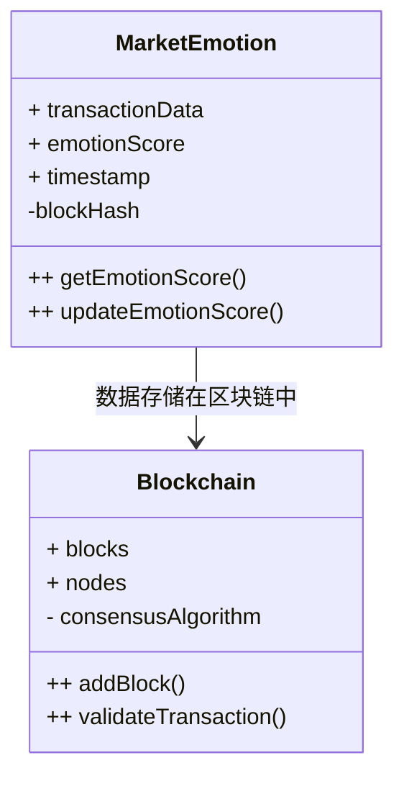
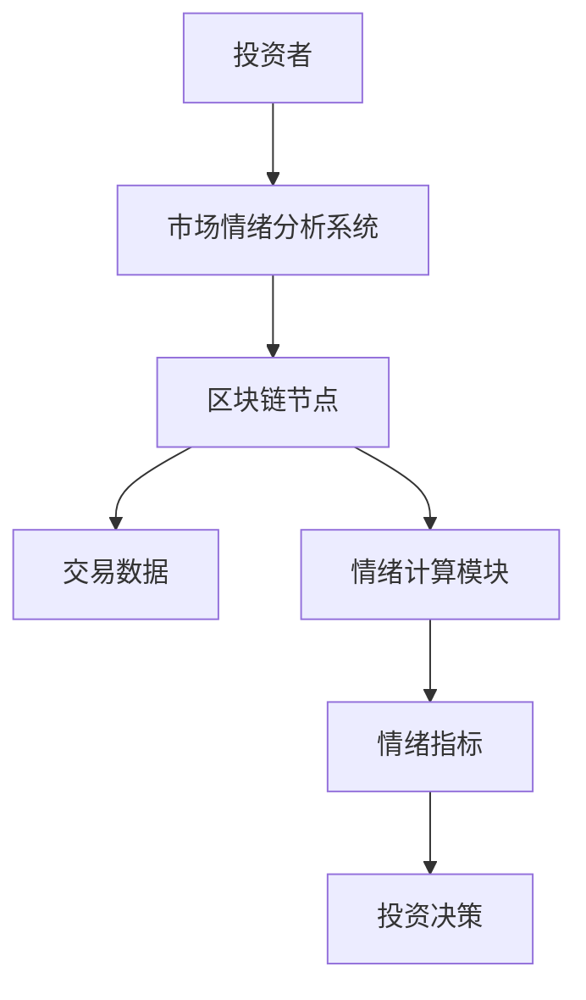

                 


```markdown
# 巴菲特的市场情绪指标：区块链技术在金融市场的应用

> 关键词：区块链技术、市场情绪指标、金融市场、巴菲特投资理念、智能合约

> 摘要：本文探讨了区块链技术如何增强市场情绪指标在金融投资中的应用。通过分析巴菲特的投资理念，结合区块链技术的特点，详细阐述了市场情绪指标的计算方法、区块链技术的核心原理，以及两者结合的实际应用场景。文章还通过系统架构设计、项目实战和最佳实践，展示了区块链技术在金融市场中的潜力和优势。

---

## 第一部分：区块链技术与市场情绪指标的背景

### 第1章：区块链技术概述

#### 1.1 区块链的基本概念

##### 1.1.1 区块链的定义
区块链是一种去中心化的分布式账本技术，通过加密算法和共识机制确保数据的安全性和一致性。它记录了所有交易的详细信息，并通过多个节点的验证来防止数据篡改。

##### 1.1.2 区块链的核心特点
- 去中心化：数据不依赖于单一中心，而是分布在网络的各个节点上。
- 透明性：所有交易记录公开透明，参与者可以实时查看。
- 不可篡改性：一旦数据被记录在区块链上，几乎无法被修改或删除。
- 可追溯性：每笔交易都可以追溯到源头，便于追踪和审计。

##### 1.1.3 区块链的演进历程
区块链起源于比特币的底层技术，经历了从1.0到2.0的演变，逐渐扩展到智能合约和去中心化金融（DeFi）的应用。

---

#### 1.2 市场情绪指标的定义与重要性

##### 1.2.1 市场情绪指标的定义
市场情绪指标是反映市场参与者心理状态的量化指标，通常通过市场行为数据（如交易量、价格波动）和自然语言处理（NLP）技术分析新闻、社交媒体等文本数据来计算。

##### 1.2.2 市场情绪指标在投资中的作用
- 辅助投资决策：市场情绪指标可以帮助投资者判断市场的乐观或悲观情绪，从而做出更明智的投资决策。
- 风险管理：通过监测市场情绪变化，投资者可以更好地管理投资组合的风险。
- 价格预测：市场情绪指标是价格预测的重要因素之一，尤其是在高频交易中。

##### 1.2.3 市场情绪指标的分类
- **交易量指标**：如成交量、成交额等。
- **价格波动指标**：如波动率、标准差等。
- **情绪文本指标**：通过分析新闻、社交媒体等文本数据提取情绪信息。

---

#### 1.3 区块链技术在金融市场的应用背景

##### 1.3.1 传统金融市场中的信息不对称问题
信息不对称是指市场参与者之间掌握的信息不一致，导致交易不公平。传统金融市场中，机构投资者往往拥有更多的信息优势，而普通投资者难以获得对称的信息。

##### 1.3.2 区块链技术如何解决金融市场的痛点
- 提高透明度：区块链技术可以实时记录所有交易数据，消除信息不对称。
- 降低交易成本：通过智能合约自动执行交易，减少中介环节，降低成本。
- 提升交易效率：区块链技术可以实现秒级交易确认，提高交易效率。

##### 1.3.3 巴菲特市场情绪指标与区块链技术的结合
巴菲特的投资理念强调长期价值投资，而市场情绪指标可以帮助投资者更好地理解市场的短期波动。区块链技术通过提供实时、透明的市场数据，增强了市场情绪指标的准确性和可靠性。

---

## 第二部分：市场情绪指标与区块链技术的核心概念

### 第2章：市场情绪指标的核心概念

#### 2.1 市场情绪指标的构成要素

##### 2.1.1 市场参与者的心理因素
市场参与者的心理状态直接影响市场的交易行为，如贪婪、恐惧等情绪会导致市场的波动。

##### 2.1.2 市场行为数据
市场行为数据包括交易量、价格波动、订单簿等，反映了市场的实际交易情况。

##### 2.1.3 市场情绪的时间序列分析
通过对市场情绪指标的时间序列分析，可以发现市场的周期性波动，为投资决策提供依据。

---

#### 2.2 区块链技术的核心原理

##### 2.2.1 区块链的分布式账本
区块链的分布式账本将数据分散存储在网络的各个节点上，确保数据的安全性和一致性。

##### 2.2.2 区块链的共识机制
共识机制（如PoW、PoS）确保所有节点达成一致，确认交易的有效性。

##### 2.2.3 区块链的智能合约
智能合约是区块链上的自动执行程序，可以在满足特定条件时自动执行交易，减少人为干预。

---

## 第三部分：区块链技术在市场情绪指标中的应用

### 第3章：市场情绪指标的区块链实现

#### 3.1 市场情绪指标的区块链存储

##### 3.1.1 基于区块链的市场情绪数据存储
市场情绪指标的数据可以存储在区块链的每个区块中，确保数据的不可篡改性。

##### 3.1.2 数据的实时更新与传播
通过区块链的分布式网络，市场情绪数据可以实时更新并传播到各个节点，确保数据的同步性和一致性。

##### 3.1.3 数据的可追溯性
区块链的可追溯性使得市场情绪数据的来源和修改历史可以被追踪，增强数据的可信度。

---

#### 3.2 区块链技术对市场情绪指标的增强作用

##### 3.2.1 提高数据透明度
区块链技术通过公开透明的数据存储，使得市场情绪指标的计算更加可信。

##### 3.2.2 增强数据的不可篡改性
区块链的不可篡改性确保了市场情绪指标的数据不会被恶意修改，提高了数据的准确性。

##### 3.2.3 实现数据的高效共享
区块链技术通过智能合约和分布式网络，实现了市场情绪数据的高效共享和实时分析。

---

### 第4章：市场情绪指标与区块链技术的对比分析

#### 4.1 市场情绪指标的传统实现方式

##### 4.1.1 传统市场情绪指标的计算方法
传统的市场情绪指标通常基于历史数据和统计分析，缺乏实时性和动态性。

##### 4.1.2 传统市场情绪指标的局限性
- 数据来源单一，容易受到信息不对称的影响。
- 计算过程复杂，难以实时更新。

---

#### 4.2 区块链技术对市场情绪指标的改进

##### 4.2.1 提高数据的实时性
区块链技术可以实时更新市场情绪数据，使得投资者能够快速响应市场变化。

##### 4.2.2 增强数据的可信度
通过区块链技术，市场情绪指标的数据来源和计算过程更加透明，增强了数据的可信度。

##### 4.2.3 实现数据的高效共享
区块链技术通过分布式网络和智能合约，实现了市场情绪数据的高效共享和自动化分析。

---

## 第四部分：系统架构与项目实战

### 第5章：系统架构设计

#### 5.1 项目介绍
本项目旨在开发一个基于区块链的市场情绪分析系统，利用区块链技术实时记录和分析市场情绪指标，帮助投资者做出更明智的投资决策。

#### 5.2 系统功能设计

##### 5.2.1 领域模型设计


##### 5.2.2 系统架构设计


##### 5.2.3 接口设计
- **API接口**：提供给投资者调用市场情绪指标的接口，返回实时的情绪数据。
- **智能合约接口**：通过智能合约实现交易数据的自动记录和情绪指标的自动计算。

##### 5.2.4 交互设计
- **用户界面**：投资者可以通过网页或移动应用查看实时的市场情绪指标，辅助投资决策。
- **数据输入**：系统通过API接口实时获取交易数据和文本数据，计算市场情绪指标。
- **数据输出**：系统将计算出的市场情绪指标返回给用户，并通过智能合约自动执行交易。

---

### 第6章：项目实战

#### 6.1 环境安装
- **区块链平台**：建议使用Ethereum或Hyperledger Fabric搭建区块链环境。
- **开发工具**：安装Node.js、Solidity编译器、以及相关的区块链开发框架。

#### 6.2 系统核心实现

##### 6.2.1 智能合约开发
```solidity
// 市场情绪指标智能合约
contract MarketEmotion {
    struct EmotionData {
        uint timestamp;
        uint emotionScore;
        bytes32 transactionHash;
    }

    mapping(address => EmotionData) public emotionMap;

    function updateEmotion(address _address, uint _score) public {
        emotionMap[_address] = EmotionData(block.timestamp, _score, tx.hash);
    }

    function getEmotion(address _address) public view returns (uint, uint, bytes32) {
        EmotionData memory data = emotionMap[_address];
        return (data.timestamp, data.emotionScore, data.transactionHash);
    }
}
```

##### 6.2.2 后端开发
```python
# 市场情绪分析模块
from web3 import Web3
import requests
import json

# 初始化区块链实例
web3 = Web3(Web3.HTTPProvider("http://localhost:8545"))

# 获取市场情绪数据
def get_market_emotion(address):
    contract = web3.eth.contract(address, abi=ABI)
    emotion_data = contract.functions.getEmotion(address).call()
    return emotion_data

# 分析市场情绪
def analyze_emotion(emotion_data):
    # 实现市场情绪分析算法
    pass

# 更新市场情绪数据
def update_emotion(address, score):
    contract = web3.eth.contract(address, abi=ABI)
    contract.functions.updateEmotion(address, score).transact()
```

##### 6.2.3 前端开发
```html
<!DOCTYPE html>
<html>
<head>
    <title>市场情绪指标</title>
</head>
<body>
    <h1>实时市场情绪</h1>
    <div id="emotionDisplay">
        <!-- 显示情绪指标 -->
    </div>
    <script>
        // 获取市场情绪数据
        function getEmotion() {
            fetch('/api/emotion')
                .then(response => response.json())
                .then(data => {
                    document.getElementById('emotionDisplay').innerHTML = `情绪得分：${data.score}`;
                });
        }
        // 定时获取数据
        setInterval(getEmotion, 1000);
    </script>
</body>
</html>
```

---

## 第五部分：最佳实践与总结

### 第7章：最佳实践

#### 7.1 小结
区块链技术通过提供实时、透明的市场情绪数据，增强了市场情绪指标的准确性和可靠性。这种技术的应用不仅提高了投资决策的效率，还降低了信息不对称带来的风险。

#### 7.2 注意事项
- **数据隐私**：在区块链上存储市场情绪数据时，需要注意数据的隐私保护，防止敏感信息泄露。
- **性能优化**：区块链技术在处理大量数据时可能会面临性能瓶颈，需要通过优化共识机制和数据结构来提高效率。
- **法律法规**：区块链技术的应用需要遵守相关法律法规，尤其是在金融领域，合规性尤为重要。

#### 7.3 拓展阅读
- 推荐阅读《区块链：技术与应用》、《智能合约开发指南》等书籍，深入了解区块链技术的更多应用场景和开发细节。

---

## 作者信息

作者：AI天才研究院/AI Genius Institute & 禅与计算机程序设计艺术/Zen And The Art of Computer Programming
```

