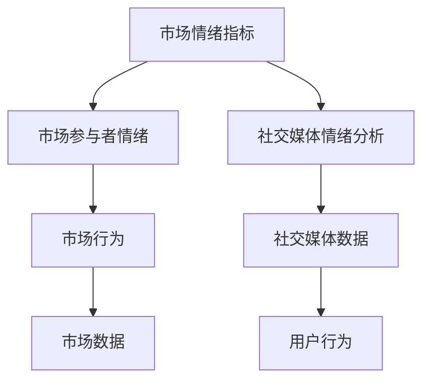
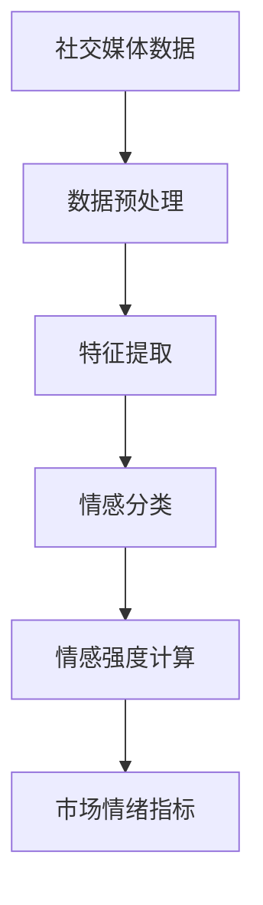

                 


---

# 巴菲特的市场情绪指标：社交媒体情绪分析的新维度

> 关键词：市场情绪指标，巴菲特，社交媒体，情绪分析，自然语言处理，投资决策，数据驱动

> 摘要：本文探讨如何将巴菲特的市场情绪指标与社交媒体情绪分析结合，提出一种新的市场情绪分析维度。通过分析社交媒体数据，提取市场情绪特征，并结合巴菲特的市场情绪指标，构建一个高效的情绪分析模型。本文从背景介绍、核心概念、算法原理、数学模型、系统架构、项目实战到最佳实践，全面阐述这一创新性方法。

---

## 第1章 背景介绍

### 1.1 市场情绪指标的核心概念

#### 1.1.1 市场情绪指标的定义与作用

市场情绪指标是衡量市场参与者情绪状态的量化工具，能够反映市场的乐观或悲观程度。巴菲特作为投资大师，其市场情绪指标通常基于市场参与者的心理行为和市场数据进行分析。这些指标可以帮助投资者预测市场走势，优化投资策略。

#### 1.1.2 巴菲特市场情绪指标的独特性

巴菲特的市场情绪指标注重长期投资价值，而非短期市场波动。他强调市场情绪的非理性因素，认为市场情绪的过度乐观或悲观是投资机会的来源。这一指标的独特性在于其对市场情绪的深度分析和长期预测能力。

#### 1.1.3 社交媒体情绪分析的背景与现状

社交媒体作为信息传播的主要渠道，海量的用户评论、帖子和互动数据为情绪分析提供了丰富的数据源。通过分析社交媒体数据，可以实时捕捉市场参与者的心理变化，为市场情绪分析提供新的维度。

### 1.2 问题背景与描述

#### 1.2.1 投资者情绪对市场的影响

投资者情绪是影响市场波动的重要因素。过度乐观的情绪可能导致市场泡沫，而过度悲观的情绪可能导致市场恐慌。因此，准确捕捉和分析市场情绪对投资决策至关重要。

#### 1.2.2 社交媒体数据的可获取性与实时性

社交媒体数据具有实时性和海量性，能够快速反映市场参与者的最新情绪变化。这种实时性使得社交媒体情绪分析成为传统市场情绪分析的重要补充。

#### 1.2.3 当前市场情绪分析的局限性

传统市场情绪分析依赖于历史数据和市场指标，难以捕捉实时情绪变化。社交媒体情绪分析虽然具有实时性，但缺乏系统化的指标体系和深度分析方法。

### 1.3 问题解决与边界

#### 1.3.1 利用社交媒体数据改进市场情绪分析

通过分析社交媒体数据，提取市场情绪特征，构建新的市场情绪指标，弥补传统市场情绪分析的不足。

#### 1.3.2 新维度的引入及其边界

引入社交媒体情绪分析作为新的市场情绪分析维度，需明确数据来源、分析范围和应用场景。

#### 1.3.3 核心概念的结构与要素

社交媒体情绪分析与巴菲特市场情绪指标的结合，形成了一个完整的市场情绪分析框架，包括数据采集、特征提取、模型构建和结果分析等环节。

---

## 第2章 核心概念与联系

### 2.1 市场情绪指标的原理

#### 2.1.1 巴菲特市场情绪指标的计算方法

巴菲特市场情绪指标通常基于市场参与者的心理行为和市场数据进行分析，包括市场成交量、市场波动率和市场参与者情绪等指标。

#### 2.1.2 情绪指标的量化与标准化

情绪指标的量化通常采用归一化方法，将情绪强度表示为0到1之间的值，便于后续分析和比较。

### 2.2 社交媒体情绪分析的特征

#### 2.2.1 文本数据的特征提取

社交媒体文本数据具有情感色彩丰富、语义复杂等特点。特征提取通常包括关键词提取、情感倾向分析和情感强度计算。

#### 2.2.2 情感强度与情绪类型分析

情感强度分析通过计算文本中的情感极性，量化情绪的强度。情绪类型分析则通过分类算法，识别文本中表达的情绪类型，如乐观、悲观、中性等。

#### 2.2.3 用户行为数据的关联性

用户行为数据，如点赞、评论和分享量，能够反映用户对内容的认同程度，进一步辅助情绪分析。

### 2.3 核心概念的对比与联系

#### 2.3.1 情绪指标与市场表现的关系

情绪指标与市场表现具有一定的相关性。当市场情绪过于乐观时，市场可能面临回调风险；当市场情绪过于悲观时，市场可能迎来反弹。

#### 2.3.2 社交媒体情绪与传统情绪指标的对比

社交媒体情绪分析具有实时性和丰富性，但缺乏长期数据积累和稳定性。传统市场情绪分析具有系统性和稳定性，但缺乏实时性和灵活性。

#### 2.3.3 实体关系图（ER图）展示



---

## 第3章 算法原理与实现

### 3.1 情感分析算法的原理

#### 3.1.1 基于词袋模型的文本特征提取

词袋模型通过统计文本中的关键词频率，提取文本特征。例如，对于文本“市场情绪乐观”，关键词包括“市场”、“情绪”、“乐观”。

#### 3.1.2 情感分类算法的选择与优化

常用的情感分类算法包括朴素贝叶斯、支持向量机（SVM）和深度学习模型（如LSTM）。根据数据规模和复杂度选择合适的算法，并通过交叉验证优化模型参数。

#### 3.1.3 情感强度的计算方法

情感强度通常通过情感分类结果的加权平均计算。例如，对于多个文本样本，计算每个样本的情感强度，然后求平均值。

### 3.2 社交媒体数据的预处理

#### 3.2.1 数据清洗与标注

社交媒体数据通常包含噪声，如表情符号、缩写和特殊字符。数据清洗需要去除这些干扰项，并标注情感倾向。

#### 3.2.2 数据转换与特征提取

将清洗后的文本数据转换为数值形式，通常使用词袋模型或TF-IDF方法提取特征。

#### 3.2.3 数据归一化与标准化

通过归一化和标准化处理，将数据缩放到统一的范围内，便于后续模型训练。

### 3.3 情感分类模型的训练与优化

#### 3.3.1 基于TF-IDF的特征向量化

TF-IDF（Term Frequency-Inverse Document Frequency）是一种常用的文本特征提取方法，能够有效捕捉关键词的重要性。

#### 3.3.2 情感分类模型的训练

使用训练数据训练情感分类模型，通常采用监督学习方法。例如，使用SVM或随机森林模型。

#### 3.3.3 模型优化与调参

通过交叉验证和网格搜索优化模型参数，选择最佳模型。

### 3.4 情感强度计算与指标构建

#### 3.4.1 情感强度的加权计算

根据情感分类结果，计算每个文本的情感强度，并通过加权方法计算整体市场情绪指标。

#### 3.4.2 情感指标的动态更新

根据实时数据更新市场情绪指标，反映市场的最新情绪变化。

---

## 第4章 数学模型与公式推导

### 4.1 情感强度计算公式

市场情绪指标可以通过以下公式计算：

$$
\text{市场情绪指标} = \sum_{i=1}^{n} w_i \times s_i
$$

其中，$w_i$ 是第$i$个特征的权重，$s_i$ 是第$i$个特征的情感强度。

### 4.2 情感分类模型的数学表达

常用的情感分类模型包括逻辑回归和SVM。逻辑回归的数学表达式为：

$$
P(y=1|x) = \frac{e^{\beta x}}{1 + e^{\beta x}}
$$

其中，$\beta$ 是模型参数，$x$ 是输入特征。

### 4.3 情感强度的加权平均公式

$$
\text{情感强度} = \frac{\sum_{i=1}^{n} w_i \times s_i}{\sum_{i=1}^{n} w_i}
$$

---

## 第5章 系统分析与架构设计

### 5.1 系统架构设计



### 5.2 系统功能设计

#### 5.2.1 数据采集模块

负责采集社交媒体数据，包括文本和用户行为数据。

#### 5.2.2 数据预处理模块

对采集的数据进行清洗和标注，去除噪声和干扰项。

#### 5.2.3 特征提取模块

提取文本特征，如关键词和情感倾向。

#### 5.2.4 情感分类模块

基于特征向量进行情感分类，输出情感强度。

#### 5.2.5 指标计算模块

根据情感强度计算市场情绪指标，并动态更新。

---

## 第6章 项目实战

### 6.1 环境安装与配置

安装必要的Python库，如自然语言处理库（Gensim、NLTK）和机器学习库（scikit-learn）。

### 6.2 系统核心实现

#### 6.2.1 数据预处理代码

```python
import pandas as pd
import numpy as np

def preprocess(data):
    # 去除特殊字符
    data['text'] = data['text'].apply(lambda x: re.sub(r'[^\w\s]', '', x))
    # 转换为小写
    data['text'] = data['text'].apply(lambda x: x.lower())
    return data
```

#### 6.2.2 特征提取代码

```python
from sklearn.feature_extraction.text import TfidfVectorizer

vectorizer = TfidfVectorizer(max_features=1000)
X = vectorizer.fit_transform(data['text'])
```

#### 6.2.3 情感分类代码

```python
from sklearn.svm import SVC

model = SVC()
model.fit(X, data['label'])
```

#### 6.2.4 情感强度计算代码

```python
import numpy as np

def calculate_emotion_strength(model, vectorizer, text):
    X = vectorizer.transform([text])
    y = model.predict(X)
    # 计算情感强度，假设y为情感类别
    # 这里简化为二分类问题，实际可能需要更复杂的计算
    return np.mean(y == 1)
```

### 6.3 实例分析与结果解读

通过具体案例分析，展示如何利用社交媒体数据计算市场情绪指标，并结合巴菲特的市场情绪指标进行投资决策。

---

## 第7章 最佳实践与总结

### 7.1 最佳实践

- 数据清洗和特征提取是关键步骤，需谨慎处理。
- 模型选择和参数调优直接影响结果，需反复实验。
- 情感强度计算需结合实际业务需求，合理调整权重。

### 7.2 小结

本文提出了一种结合巴菲特市场情绪指标与社交媒体情绪分析的新方法，通过社交媒体数据实时捕捉市场情绪变化，为投资决策提供了新的维度。

### 7.3 注意事项

- 数据隐私和合规性需注意，确保符合相关法律法规。
- 情感分类模型需定期更新，保持其准确性。

### 7.4 拓展阅读

- 《自然语言处理实战》
- 《机器学习实战》
- 《投资学原理》

---

## 作者

作者：AI天才研究院/AI Genius Institute & 禅与计算机程序设计艺术 /Zen And The Art of Computer Programming

