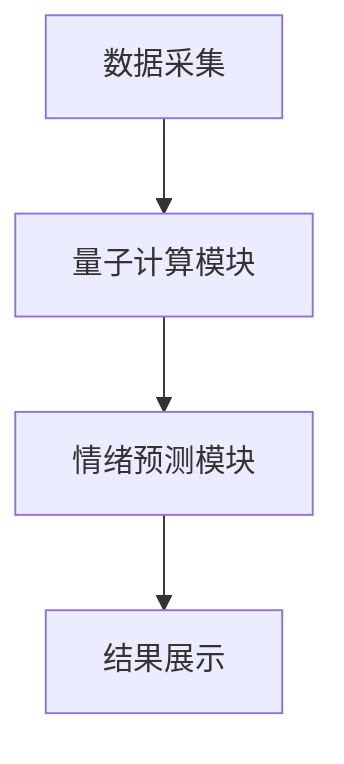
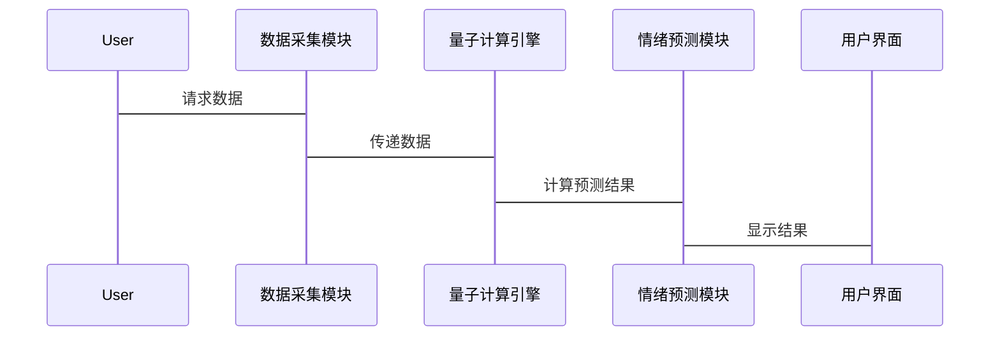

                 


# 巴菲特的市场情绪指标：量子计算驱动的情绪预测模型

> 关键词：巴菲特，市场情绪指标，量子计算，情绪预测模型，金融投资，人工智能

> 摘要：本文探讨了如何利用量子计算技术构建市场情绪预测模型，特别是在巴菲特市场情绪指标分析中的应用。通过量子计算的独特优势，我们能够更精确地捕捉和预测市场情绪，为投资决策提供科学依据。文章从理论基础到实际应用，详细阐述了量子计算驱动的情绪预测模型的构建过程、算法设计、系统架构以及项目实战。

---

## 第一章：巴菲特的市场情绪指标

### 1.1 市场情绪指标的定义与作用

#### 1.1.1 市场情绪指标的基本概念
市场情绪指标是衡量投资者情绪的重要工具，它反映了市场参与者对当前市场状况的心理状态。巴菲特作为投资大师，他提出的市场情绪指标为投资者提供了独特的视角，帮助他们在市场波动中做出更明智的决策。

#### 1.1.2 市场情绪指标在投资决策中的作用
市场情绪指标能够帮助投资者识别市场的乐观或悲观情绪，从而预测市场的短期波动。通过分析这些指标，投资者可以更好地把握市场的买卖信号，优化投资组合。

#### 1.1.3 巴菲特市场情绪指标的独特性
巴菲特的市场情绪指标不仅关注市场的整体情绪，还特别强调投资者的心理偏差和行为模式。这种独特性使得他的指标在实践中具有更强的实用性和指导意义。

### 1.2 巴菲特市场情绪指标的核心要素

#### 1.2.1 投资者情绪的量化方法
市场情绪可以通过多种方式量化，包括投资者的交易行为、市场成交量、股价波动等。巴菲特的指标则更注重投资者的心理预期和市场参与度。

#### 1.2.2 市场情绪周期性波动的特征
市场情绪通常呈现周期性波动，从乐观到悲观，再到乐观，如此循环。了解这些周期性特征可以帮助投资者更好地预测市场走势。

#### 1.2.3 巴菲特市场情绪指标的数学模型
巴菲特的市场情绪指标可以通过数学模型进行量化，例如使用情绪指数（Mood Index）来衡量市场的乐观程度。该指数通常基于市场参与者的交易行为数据进行计算。

---

## 第二章：量子计算的基本原理

### 2.1 量子计算的核心概念

#### 2.1.1 量子位与经典位的区别
量子位（qubit）与经典位（bit）的根本区别在于，qubit可以同时处于多个状态的叠加态，而bit只能是0或1。这种叠加态使得量子计算在处理复杂问题时具有显著优势。

#### 2.1.2 量子叠加与量子纠缠的原理
量子叠加允许量子系统同时处于多个状态，而量子纠缠则描述了两个或多个量子系统之间的强关联性。这些特性使得量子计算在处理复杂金融模型时更具效率。

#### 2.1.3 量子计算的优势与挑战
量子计算的优势在于其强大的并行计算能力，能够快速处理大量数据。然而，量子计算的实现仍面临技术难题，例如量子噪声和纠错问题。

### 2.2 量子计算在金融领域的应用前景

#### 2.2.1 量子计算在金融建模中的潜力
量子计算可以用于构建更复杂的金融模型，例如风险管理模型和资产定价模型。这些模型能够帮助投资者更好地预测市场风险和收益。

#### 2.2.2 量子计算在风险管理中的应用
通过量子计算，投资者可以更精确地计算市场风险，优化投资组合，降低潜在损失。

#### 2.2.3 量子计算在市场情绪预测中的可能性
量子计算的强大计算能力使得市场情绪预测变得更加高效和准确。通过量子算法，我们可以快速分析大量市场数据，捕捉市场情绪的变化趋势。

---

## 第三章：市场情绪指标与量子计算的结合

### 3.1 市场情绪指标的量子化表示

#### 3.1.1 市场情绪指标的量子编码方法
将市场情绪指标转化为量子态，例如将情绪强度表示为量子叠加态。这种方法可以利用量子计算的并行性，快速分析市场情绪。

#### 3.1.2 量子叠加在市场情绪分析中的应用
通过量子叠加，我们可以同时分析多个市场情绪指标，从而快速识别市场的整体情绪状态。

#### 3.1.3 量子纠缠与市场情绪相关性的建模
量子纠缠可以帮助我们建模市场情绪之间的相关性，例如不同投资者之间的情绪互动。

### 3.2 量子计算在情绪预测中的算法设计

#### 3.2.1 量子算法的基本框架
量子算法的核心在于利用量子叠加和量子纠缠的特性，设计高效的计算步骤。例如，使用量子傅里叶变换对市场情绪数据进行处理。

#### 3.2.2 量子计算在情绪预测中的具体实现
通过量子算法，我们可以对市场情绪数据进行快速分析，预测市场的未来走势。

#### 3.2.3 量子算法的优化与改进
为了提高预测的准确性，我们需要不断优化量子算法，例如通过量子退火技术减少计算误差。

---

## 第四章：量子计算驱动的情绪预测模型的数学基础

### 4.1 量子计算的数学模型

#### 4.1.1 量子态的数学表示
量子态可以用复数向量表示，例如 $|\psi\rangle = a|0\rangle + b|1\rangle$，其中 $a$ 和 $b$ 是复数，满足 $|a|^2 + |b|^2 = 1$。

#### 4.1.2 量子门的操作矩阵
常见的量子门操作，例如Hadamard门的矩阵表示为：
$$
H = \frac{1}{\sqrt{2}} \begin{pmatrix}
1 & 1 \\
1 & -1
\end{pmatrix}
$$

#### 4.1.3 量子计算的数学基础与应用
通过线性代数和量子力学的基本原理，我们可以构建量子计算的数学模型，并将其应用于市场情绪预测。

### 4.2 情绪预测模型的数学公式

#### 4.2.1 市场情绪指标的量化公式
市场情绪指数（Mood Index）可以通过以下公式计算：
$$
M = \frac{V_{\text{buy}} - V_{\text{sell}}}{V_{\text{total}}}
$$
其中，$V_{\text{buy}}$ 和 $V_{\text{sell}}$ 分别表示买入和卖出的成交量，$V_{\text{total}}$ 表示总成交量。

#### 4.2.2 量子计算在情绪预测中的数学推导
通过量子算法，我们可以对市场情绪数据进行量子叠加和纠缠处理，最终得到市场情绪的预测结果。

#### 4.2.3 情绪预测模型的优化算法
为了提高预测的准确性，我们需要不断优化量子算法，例如通过量子遗传算法对模型参数进行优化。

---

## 第五章：系统分析与架构设计

### 5.1 系统功能设计

#### 5.1.1 系统需求分析
系统需要实现市场情绪数据的采集、处理和预测功能，支持量子计算的高效运算。

#### 5.1.2 系统功能模块划分
系统主要包括数据采集模块、量子计算模块、情绪预测模块和结果展示模块。

#### 5.1.3 系统功能流程图


### 5.2 系统架构设计

#### 5.2.1 系统架构图


#### 5.2.2 系统接口设计
系统需要与数据源、量子计算引擎以及用户界面进行交互，接口设计需要考虑数据格式和通信协议。

#### 5.2.3 系统交互序列图


---

## 第六章：项目实战

### 6.1 环境安装与配置

#### 6.1.1 安装量子计算开发环境
安装量子计算开发框架，例如Qiskit或Cirq。

#### 6.1.2 数据采集工具的安装
安装金融数据采集工具，例如Yahoo Finance API。

### 6.2 系统核心实现源代码

#### 6.2.1 数据预处理代码
```python
import pandas as pd
import numpy as np

def preprocess_data(data):
    # 数据清洗和特征提取
    data = data.dropna()
    data['情绪强度'] = np.abs(data['收盘价'].diff() / data['收盘价'].std())
    return data
```

#### 6.2.2 量子计算代码
```python
from qiskit import QuantumCircuit, Aer, execute

def quantum_emotion_prediction(bit_count=2):
    qc = QuantumCircuit(bit_count)
    # 量子叠加操作
    qc.h(range(bit_count))
    # 量子测量
    qc.measure(range(bit_count), range(bit_count))
    # 量子模拟
    simulator = Aer.get_backend('qasm_simulator')
    job = execute(qc, simulator)
    result = job.result()
    return result.get_counts(qc)
```

### 6.3 实际案例分析

#### 6.3.1 案例背景
假设我们有某段时间内的股票价格数据，目标是预测市场的未来情绪。

#### 6.3.2 数据分析与结果展示
通过量子计算模块，我们对市场情绪数据进行处理，得到情绪预测结果，并将其可视化展示。

### 6.4 项目小结

#### 6.4.1 项目总结
通过量子计算技术，我们可以更高效地预测市场情绪，为投资决策提供科学依据。

#### 6.4.2 项目优化建议
未来可以通过优化量子算法和增加数据源来进一步提高预测的准确性。

---

## 第七章：总结与展望

### 7.1 全文总结

#### 7.1.1 核心内容回顾
本文详细介绍了巴菲特的市场情绪指标，并探讨了量子计算在情绪预测中的应用。通过量子计算的强大能力，我们可以更精确地预测市场情绪，优化投资决策。

### 7.2 未来展望

#### 7.2.1 量子计算在金融领域的潜力
随着量子计算技术的不断发展，其在金融领域的应用前景广阔，特别是在市场情绪预测和风险管理方面。

#### 7.2.2 情绪预测模型的未来发展方向
未来，可以通过结合人工智能和大数据技术，进一步提升情绪预测模型的准确性和实用性。

### 7.3 最佳实践 tips

#### 7.3.1 投资者建议
投资者可以通过学习量子计算和人工智能技术，提升自己的市场分析能力。

#### 7.3.2 技术人员建议
技术人员可以深入研究量子计算在金融领域的应用，开发更多创新性的金融工具。

---

## 作者：AI天才研究院 & 禅与计算机程序设计艺术

