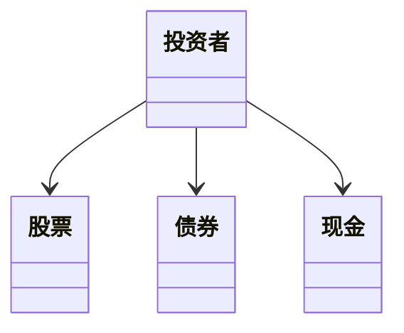
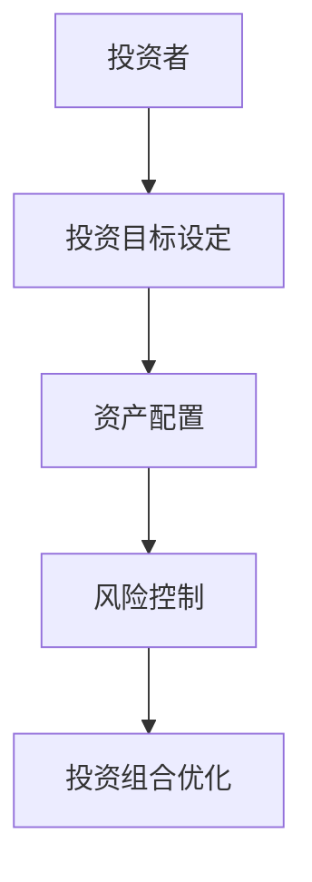

                 


# 巴菲特的市场择时观点更新：长期主义在当代的应用

> 关键词：巴菲特，长期主义，投资策略，市场择时，复利效应，风险管理

> 摘要：本文深入探讨了巴菲特的长期主义投资理念在当代市场环境中的应用与更新。通过分析巴菲特的投资理念演变、长期主义的核心概念、数学模型、现代市场环境对长期主义的挑战以及投资组合管理的优化，本文为读者提供了从理论到实践的全面解析。文章结合实际案例和系统设计，展示了如何在现代市场中应用长期主义策略，并通过具体代码实现和数据分析，验证了长期主义的有效性。

---

## 第1章: 巴菲特投资理念的演变

### 1.1 巴菲特投资理念的核心要素

#### 1.1.1 从格雷厄姆学到的价值投资

巴菲特的投资理念深受 Benjamin Graham 的影响。Graham 提出的“价值投资”强调以低于内在价值的价格购买股票，并关注公司的基本面分析。巴菲特继承了这一理念，但对其进行了创新和发展。例如，巴菲特提出的“安全边际”概念，即以显著低于内在价值的价格买入，以降低投资风险。

#### 1.1.2 巴菲特对投资理念的创新

巴菲特在继承价值投资的基础上，提出了自己的独特见解：

1. **企业内在价值**：巴菲特强调投资于具有持续竞争优势的企业，关注企业的长期盈利能力。
2. **复利效应**：巴菲特深刻理解复利的力量，认为长期持有优质资产是实现财富增长的最佳方式。
3. **长期主义**：巴菲特的投资策略以长期为导向，注重企业基本面的稳定性，而非短期市场波动。

#### 1.1.3 长期主义在投资中的重要性

长期主义是巴菲特投资理念的核心。他相信，通过长期持有优质资产，投资者可以最大化复利效应，同时降低短期市场波动对投资组合的影响。

---

### 1.2 巴菲特市场择时观点的背景分析

#### 1.2.1 20世纪末至21世纪初的市场变化

20世纪末至21世纪初，全球金融市场经历了深刻的变革。互联网泡沫、2008年金融危机以及近年来的量化宽松政策，都对市场产生了深远影响。这些事件使得市场的波动性显著增加，传统的市场择时策略面临新的挑战。

#### 1.2.2 互联网泡沫与巴菲特的投资策略

互联网泡沫期间，许多科技公司股价被高估，巴菲特因其坚持长期主义策略而避免了重大损失。他拒绝参与高风险的短期投资，而是选择投资于具有稳定基本面的公司。

#### 1.2.3 2008年金融危机对巴菲特投资理念的影响

2008年金融危机暴露了短期投资和杠杆交易的风险。巴菲特的投资理念再次证明了其稳健性。他强调，长期持有优质资产是抵御市场危机的有效方法。

---

### 1.3 长期主义与巴菲特的投资策略

#### 1.3.1 长期主义的定义与核心要素

长期主义是一种以长期为导向的投资策略，强调通过持续投资优质资产，实现财富的稳步增长。其核心要素包括：

1. **复利效应**：通过时间的积累，实现财富的指数级增长。
2. **企业基本面分析**：关注企业的盈利能力、竞争优势和管理能力。
3. **风险管理**：通过分散投资和长期持有，降低短期市场波动的风险。

#### 1.3.2 巴菲特对长期主义的诠释

巴菲特认为，长期主义不仅仅是投资策略，更是一种哲学。他强调，投资者应关注企业的长期价值，而非短期市场波动。

#### 1.3.3 长期主义与短期市场的冲突与调和

尽管长期主义强调长期持有，但在实际操作中，投资者需要在长期与短期之间找到平衡。例如，在市场出现极端波动时，投资者可能需要调整投资组合以规避风险。

---

## 第2章: 长期主义的核心概念与数学模型

### 2.1 长期主义的核心概念

#### 2.1.1 投资的复利效应

复利效应是长期主义的核心概念之一。通过复利，投资者可以实现财富的指数级增长。复利公式为：

$$ A = P(1 + r)^n $$

其中，\( A \) 是终值，\( P \) 是本金，\( r \) 是年化收益率，\( n \) 是投资年数。

#### 2.1.2 时间价值在投资中的作用

时间价值是指资金在时间推移中的增值能力。长期投资通过时间的积累，可以最大化复利效应，从而实现财富的稳步增长。

#### 2.1.3 风险与收益的长期均衡

在长期投资中，风险与收益之间存在均衡关系。通过分散投资和长期持有，投资者可以在承受一定风险的同时，实现较高的收益。

---

### 2.2 长期主义的数学模型

#### 2.2.1 复利计算公式

复利计算公式是长期主义的核心工具之一：

$$ A = P(1 + r)^n $$

例如，如果投资者以 10% 的年化收益率投资 10 年，初始投资 1 万元将增长到：

$$ A = 10000 \times (1 + 0.10)^{10} = 25937.42 $$

---

#### 2.2.2 投资组合的期望收益计算

投资组合的期望收益可以通过以下公式计算：

$$ E(r) = \sum p_i r_i $$

其中，\( p_i \) 是投资比例，\( r_i \) 是各资产的预期收益率。

---

#### 2.2.3 风险管理的数学模型

马科维茨投资组合理论是风险管理的重要工具。其优化目标为：

$$ \text{Minimize } \sigma^2 \text{ subject to } \mu \geq \text{target return} $$

其中，\( \sigma^2 \) 是投资组合的方差（风险），\( \mu \) 是预期收益率。

---

## 第3章: 长期主义在现代市场中的应用

### 3.1 现代市场环境对长期主义的挑战

#### 3.1.1 短期市场波动的加剧

现代市场的波动性显著增加，短期市场波动对长期投资策略提出了新的挑战。例如，2020年新冠疫情爆发期间，全球市场经历了剧烈波动，许多投资者被迫调整投资策略。

#### 3.1.2 全球化与金融创新的影响

全球化和金融创新使得市场更加复杂。投资者需要面对更多种类的资产和更频繁的市场波动。例如，量化交易和算法交易的兴起，使得市场的短期波动更加剧烈。

#### 3.1.3 技术进步对投资策略的改变

技术进步为投资者提供了更多工具和数据支持。例如，大数据分析和人工智能技术可以帮助投资者更好地识别长期投资机会。

---

### 3.2 巴菲特长期主义策略的现代优化

#### 3.2.1 价值投资的现代诠释

现代价值投资强调对企业的深入分析，关注企业的竞争优势和长期盈利能力。例如，巴菲特投资苹果公司，正是因为苹果在科技领域的持续创新和竞争优势。

#### 3.2.2 长期持有策略的调整与优化

在现代市场中，长期持有策略需要根据市场环境进行适当调整。例如，在市场出现系统性风险时，投资者可能需要暂时减少风险资产的配置。

#### 3.2.3 风险控制的现代方法

现代风险控制方法包括：

1. **分散投资**：通过投资不同资产和行业，降低投资组合的风险。
2. **动态调整**：根据市场环境变化，动态调整投资组合。
3. **风险管理模型**：使用数学模型对投资组合进行风险评估和优化。

---

## 第4章: 长期主义与投资组合管理

### 4.1 投资组合的构建与优化

#### 4.1.1 投资组合的领域模型



---

#### 4.1.2 投资组合的系统架构



---

#### 4.1.3 投资组合的动态调整

动态调整投资组合是长期主义的重要组成部分。例如，投资者可以根据市场环境变化，定期重新平衡投资组合。

---

### 4.2 投资组合的系统分析与架构设计方案

#### 4.2.1 系统功能设计

领域模型：


系统架构：


---

### 4.3 投资组合的动态调整

#### 4.3.1 定期评估与再平衡

定期评估投资组合的表现，并根据市场环境变化进行再平衡。例如，每年评估一次投资组合，并根据企业的基本面变化进行调整。

#### 4.3.2 长期策略与短期市场的结合

在长期策略的基础上，适当考虑短期市场波动。例如，在市场出现极端波动时，投资者可以暂时减少风险资产的配置。

#### 4.3.3 投资组合的实时监控与反馈

通过实时监控投资组合的表现，及时发现潜在风险，并进行必要的调整。

---

## 第5章: 巴菲特长期主义的实战案例

### 5.1 实战环境与工具

#### 5.1.1 投资分析工具的安装与配置

常用的工具包括：

- **Excel**：用于基本的数据分析和财务模型构建。
- **Python**：用于高级数据分析和算法交易。
- **投资组合管理系统**：用于投资组合的实时监控和管理。

#### 5.1.2 数据获取与处理

通过金融数据服务提供商（如Yahoo Finance、Quandl）获取数据，并使用Python进行数据清洗和预处理。

---

#### 5.1.3 投资组合管理系统的搭建

使用Python的**Pandas**和**NumPy**库进行数据处理，使用**Matplotlib**和**Plotly**进行数据可视化，使用**Pymc**进行风险管理模型的构建。

---

### 5.2 核心算法实现

#### 5.2.1 长期投资策略的代码实现

```python
def compound_interest(principal, rate, time):
    return principal * (1 + rate) ** time

# 示例：以10%的年化收益率投资10年
principal = 10000
rate = 0.10
time = 10
print(compound_interest(principal, rate, time))  # 输出：25937.42
```

---

#### 5.2.2 风险管理算法的实现

```python
import numpy as np

def portfolio_variance(weights, covariance_matrix):
    return np.dot(weights.T, np.dot(covariance_matrix, weights))
```

---

### 5.3 实战案例分析

#### 5.3.1 案例背景

假设投资者有100万元的资金，目标是通过长期投资实现财富的稳步增长。

---

#### 5.3.2 投资组合构建

根据长期主义策略，投资者选择具有持续竞争优势的企业进行投资。例如，投资于苹果、可口可乐等优质企业。

---

#### 5.3.3 投资组合优化

使用马科维茨投资组合理论，优化投资组合的风险和收益。例如，通过分散投资和动态调整，降低投资组合的波动性。

---

## 作者：AI天才研究院/AI Genius Institute & 禅与计算机程序设计艺术 /Zen And The Art of Computer Programming

---

通过以上分析，我们可以看到，巴菲特的长期主义策略在当代市场中依然具有重要的指导意义。通过结合现代投资工具和数学模型，投资者可以更好地实现长期财富增长的目标。

