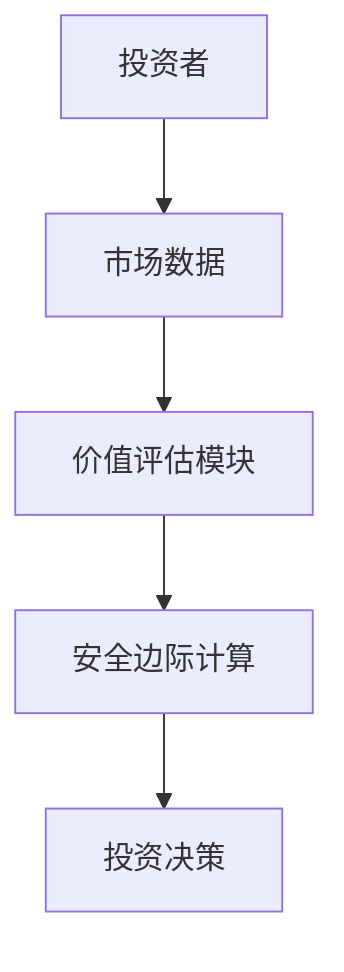

                 


# 巴菲特的市场效率理论批判：为什么市场并非总是有效

---

## 关键词：市场效率，有效市场假说，巴菲特，价值投资，内在价值，安全边际

---

## 摘要

本文深入探讨了巴菲特对市场效率理论的批判，特别是为什么市场并非总是有效。通过分析有效市场假说的核心观点、巴菲特的价值投资理念，以及两者之间的矛盾，文章揭示了市场无效性的表现形式及其对投资者的实际意义。结合数学模型和实际案例，本文提出了一种超越传统市场效率理论的投资策略，并总结了在当前市场环境下的实践启示。

---

## 第1章：背景介绍与核心概念

### 1.1 有效市场假说的定义与假设

#### 1.1.1 有效市场假说的核心概念

有效市场假说（Efficient Market Hypothesis，EMH）是金融经济学中的一个基本理论，认为在有效市场中，资产价格反映了所有可获得的信息。市场参与者无法通过分析公开信息来持续获得超额收益。

- **假设条件**：
  1. 市场参与者理性。
  2. 信息传播即时且充分。
  3. 市场结构完美竞争。

#### 1.1.2 市场效率的衡量标准

- 价格与内在价值的偏差程度。
- 投资者能否持续战胜市场。

#### 1.1.3 有效市场假说的理论基础

- 理性预期理论：市场参与者能够根据所有信息做出最优决策。
- 马科维茨的现代投资组合理论。

### 1.2 巴菲特与市场效率理论的矛盾

#### 1.2.1 巴菲特的价值投资理念

巴菲特的价值投资理念与有效市场假说的核心观点存在根本矛盾。他坚信市场并非总是有效，认为价格经常偏离内在价值。

- **核心观点**：
  1. 市场波动反映非理性。
  2. 投资者可以通过深入分析发现市场错误定价。

#### 1.2.2 市场效率与价值发现的冲突

- 有效市场假说认为价格反映所有信息，而价值投资则强调价格与价值的分离。

#### 1.2.3 巴菲特对市场无效性的批判

- 市场无效性是投资机会的来源。
- 市场波动为价值投资者提供了套利机会。

---

## 第2章：有效市场假说的缺陷与现实挑战

### 2.1 有效市场假说的假设条件

#### 2.1.1 市场参与者理性假设

现实中，投资者情绪波动和非理性决策普遍存在，导致市场无效。

#### 2.1.2 信息传播的即时性假设

信息不对称和传播延迟现象在现实中广泛存在。

#### 2.1.3 市场结构的完美竞争假设

现实中存在交易成本、税收等障碍，限制了市场的有效性。

### 2.2 市场无效性的表现形式

#### 2.2.1 短期市场波动与长期价值偏离

- 市场短期波动由投资者情绪驱动，长期趋势反映基本面。

#### 2.2.2 信息不对称与市场失灵

- 内幕信息和非对称信息导致市场定价偏差。

#### 2.2.3 市场参与者的非理性行为

- 投资者行为受心理因素影响，产生 herd behavior（羊群效应）。

### 2.3 有效市场假说的数学模型

#### 2.3.1 有效市场假说的数学表达

$$ P = V $$

其中，$P$ 是市场价格，$V$ 是内在价值。

#### 2.3.2 市场无效性的数学表达

$$ P \neq V $$

---

## 第3章：巴菲特投资理念的核心要素

### 3.1 价值投资的定义与特征

#### 3.1.1 价值投资的三要素

- **内在价值**：资产的未来现金流的现值。
- **安全边际**：价格低于内在价值的部分。
- **市场价格波动**：市场波动为价值投资者提供了机会。

### 3.2 巴菲特的选股标准

#### 3.2.1 行业选择的逻辑

- 避免复杂和变化快的行业。
- 选择具有稳定现金流和竞争优势的行业。

#### 3.2.2 财务指标的分析

- 重点关注ROE（净资产收益率）和ROA（资产回报率）。
- 避免高负债和低利润率的公司。

#### 3.2.3 管理层的信任与能力评估

- 管理层应具备诚信和卓越能力。
- 长期稳定的管理层更受信任。

### 3.3 巴菲特投资策略的数学模型

#### 3.3.1 内在价值公式

$$ V = \frac{E}{k} $$

其中，$E$ 是未来现金流的现值，$k$ 是折现率。

#### 3.3.2 安全边际计算

$$ \text{安全边际} = V - P $$

---

## 第4章：有效市场假说与巴菲特理念的冲突

### 4.1 有效市场假说的核心观点

#### 4.1.1 市场价格反映所有信息

$$ P = V $$

#### 4.1.2 投资者无法持续战胜市场

$$ \text{超额收益} = 0 $$

#### 4.1.3 市场的自我调节机制

$$ P \rightarrow V $$

### 4.2 巴菲特对有效市场假说的批判

#### 4.2.1 市场无效性的存在性证明

$$ \exists P \neq V $$

#### 4.2.2 市场波动为投资机会

$$ \text{市场波动} \Rightarrow \text{投资机会} $$

---

## 第5章：市场无效性的表现形式

### 5.1 短期市场波动与长期价值偏离

- 市场短期波动由投资者情绪驱动，长期趋势反映基本面。

### 5.2 信息不对称与市场失灵

- 内幕信息和非对称信息导致市场定价偏差。

### 5.3 市场参与者的非理性行为

- 投资者行为受心理因素影响，产生 herd behavior（羊群效应）。

---

## 第6章：巴菲特理念的局限性与扩展

### 6.1 巴菲特理念的局限性

- **行业选择的局限**：难以适应新兴行业。
- **安全边际的局限**：在市场剧烈波动时可能失效。

### 6.2 市场效率与巴菲特理念的结合

- 有效市场假说与价值投资的结合点在于弱有效市场。

---

## 第7章：系统分析与架构设计方案

### 7.1 问题场景介绍

- 市场效率与价值投资的矛盾。
- 投资者如何在市场无效中发现机会。

### 7.2 系统功能设计

- 价值发现模块：计算内在价值，识别安全边际。
- 市场监控模块：实时追踪市场价格波动，发现定价错误。

### 7.3 系统架构设计

- **系统架构图**：使用 Mermaid 绘制系统架构图。



### 7.4 系统接口设计

- 数据接口：获取公司财务数据和市场数据。
- 决策接口：输出投资建议。

### 7.5 系统交互设计

- **交互序列图**：使用 Mermaid 绘制系统交互图。

```mermaid
sequenceDiagram
    participant 投资者
    participant 系统
    participant 市场数据
   投资者 -> 系统：请求市场数据
    系统 -> 市场数据：获取数据
    市场数据 --> 系统：返回数据
    系统 -> 投资者：输出价值评估结果
```

---

## 第8章：项目实战

### 8.1 环境安装

- 安装Python和必要的金融分析库（如pandas、numpy）。

### 8.2 系统核心实现源代码

```python
import pandas as pd
import numpy as np

def calculate_intrinsic_value(earnings, discount_rate):
    return earnings / discount_rate

def calculate_margin_of_safety(intrinsic_value, price):
    return intrinsic_value - price

# 示例数据
earnings = 100
discount_rate = 0.1
price = 80

V = calculate_intrinsic_value(earnings, discount_rate)
mos = calculate_margin_of_safety(V, price)

print(f"内在价值: {V}")
print(f"安全边际: {mos}")
```

### 8.3 代码应用解读与分析

- **内在价值计算**：通过公式 $V = E / k$ 计算。
- **安全边际计算**：通过公式 $ MOS = V - P $ 计算。

---

## 第9章：总结与展望

### 9.1 本文总结

- 巴菲特的市场效率批判揭示了市场并非总是有效。
- 价值投资通过发现市场错误定价提供了一种超越有效市场假说的投资策略。

### 9.2 未来研究方向

- 结合行为金融学进一步解释市场无效性。
- 研究技术进步对市场效率的影响。

### 9.3 投资建议

- 保持对市场无效性的敏感性。
- 在市场波动中寻找安全边际。

---

## 作者：AI天才研究院/AI Genius Institute & 禅与计算机程序设计艺术 /Zen And The Art of Computer Programming

---

**摘要**：本文通过分析有效市场假说和巴菲特的价值投资理念，揭示了市场无效性的表现形式及其对投资者的实际意义。结合数学模型和实际案例，本文提出了一种超越传统市场效率理论的投资策略，并总结了在当前市场环境下的实践启示。

