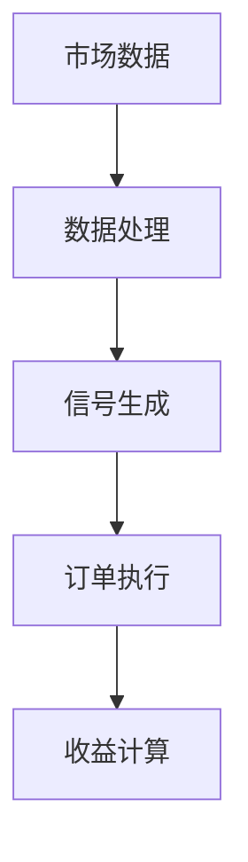
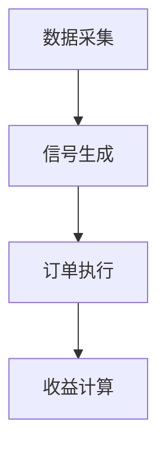

                 


# 巴菲特的市场效率理论批判：量子套利和市场微观结构

> 关键词：巴菲特，市场效率理论，量子套利，市场微观结构，高频交易，算法交易，套利机会

> 摘要：本文通过对巴菲特市场效率理论的批判性分析，探讨量子套利在现代金融市场中的应用及其对市场微观结构的影响。文章详细阐述了量子套利的算法原理、数学模型和系统架构，并结合实际案例进行深入分析，最后总结了量子套利对市场效率理论的改进方向和未来展望。

---

## 第1章：巴菲特的市场效率理论概述

### 1.1 市场效率理论的起源与核心观点

#### 1.1.1 巴菲特的价值投资理念
巴菲特的价值投资理念强调以低于内在价值的价格买入优质股票，长期持有，赚取企业成长的收益。他认为市场并非总是有效，存在价值被低估的投资机会。

#### 1.1.2 市场效率的定义与分类
市场效率理论认为市场价格反映所有相关信息，分为弱有效、强有效和半强有效市场。巴菲特认为市场并非完全有效，尤其在短期市场波动中存在套利机会。

#### 1.1.3 巴菲特对市场效率的批判
巴菲特批判市场效率理论过于简化市场行为，忽视了市场的不完全信息、交易成本和市场微观结构的影响。

### 1.2 巴菲特理论的背景与应用

#### 1.2.1 传统市场效率理论的局限性
传统市场效率理论假设市场参与者理性、信息对称，忽视了交易成本和信息不对称对市场的影响。

#### 1.2.2 巴菲特投资策略的核心要素
- 长期投资：关注企业的内在价值，而非短期价格波动。
- 价值发现：寻找市场低估的股票，通过基本面分析挖掘投资机会。
- 安全边际：以低于内在价值的价格买入，降低投资风险。

#### 1.2.3 巴菲特理论的实际应用案例
通过具体案例分析，巴菲特理论在实际投资中的成功应用，如购买 Coca-Cola 和可口可乐的股票。

### 1.3 巴菲特理论的批判与争议

#### 1.3.1 市场效率与套利机会的矛盾
市场效率理论假设市场不存在套利机会，而巴菲特认为套利机会依然存在，尤其是在市场微观结构中。

#### 1.3.2 巴菲特理论的适用范围与限制
巴菲特理论主要适用于长期投资，但在短期高频交易中表现有限。

#### 1.3.3 学术界对巴菲特理论的评价
学术界对巴菲特理论既有支持也有批判，认为其在实践中的有效性依赖于特定市场条件。

---

## 第2章：市场微观结构与量子套利的关联

### 2.1 市场微观结构的基本概念

#### 2.1.1 市场微观结构的定义
市场微观结构研究市场中的交易行为、价格形成机制和流动性等微观因素。

#### 2.1.2 市场微观结构的核心要素
- 交易成本：包括佣金、买卖价差等。
- 信息不对称：买方和卖方掌握的信息不一致。
- 市场深度：市场参与者数量和交易量影响价格波动。

#### 2.1.3 市场微观结构与市场效率的关系
市场微观结构影响市场效率，交易成本和信息不对称降低了市场效率。

### 2.2 量子套利的定义与特点

#### 2.2.1 量子套利的定义
量子套利是一种利用市场微观结构中的不完全效率，通过高频交易和算法交易获利的策略。

#### 2.2.2 量子套利的核心原理
利用市场的不完全信息、交易成本和时间延迟，通过高频交易捕捉短期套利机会。

#### 2.2.3 量子套利与传统套利的对比
| 对比维度 | 传统套利 | 量子套利 |
|----------|----------|----------|
| 交易频率 | 低频     | 高频     |
| 技术依赖 | 低       | 高       |
| 套利机会 | 较少     | 较多     |

### 2.3 量子套利在市场微观结构中的应用

#### 2.3.1 量子套利的基本流程


#### 2.3.2 量子套利在高频交易中的应用
高频交易通过算法快速捕捉市场价差，利用微小的价格波动获利。

#### 2.3.3 量子套利对市场微观结构的影响
量子套利加剧了市场的流动性，但也可能导致市场波动性增加。

---

## 第3章：巴菲特市场效率理论的批判性分析

### 3.1 市场效率理论的批判视角

#### 3.1.1 市场效率的假设前提
市场效率理论假设市场参与者理性、信息对称，忽视了交易成本和信息不对称。

#### 3.1.2 市场效率与实际市场的矛盾
实际市场中存在套利机会，说明市场并非完全有效。

#### 3.1.3 巴菲特对市场效率的质疑
巴菲特认为市场效率理论过于简化，忽视了市场的不完全信息和交易成本。

### 3.2 量子套利与市场效率的关系

#### 3.2.1 量子套利如何影响市场效率
量子套利通过高频交易减少了市场中的套利机会，提高了市场效率。

#### 3.2.2 量子套利对市场微观结构的优化
量子套利通过高频交易优化了市场流动性，降低了交易成本。

#### 3.2.3 量子套利与市场效率的平衡点
量子套利在提高市场效率的同时，也需要注意其可能引发的市场波动。

### 3.3 市场效率理论的局限性与改进方向

#### 3.3.1 市场效率理论的主要缺陷
- 忽视交易成本和信息不对称。
- 未考虑市场微观结构的影响。

#### 3.3.2 量子套利对市场效率理论的补充
量子套利提供了新的视角，通过高频交易优化市场效率。

#### 3.3.3 市场效率理论的未来发展方向
结合量子套利和市场微观结构，提出更加全面的市场效率理论。

---

## 第4章：量子套利的算法原理与数学模型

### 4.1 量子套利的基本算法

#### 4.1.1 量子套利的算法框架


#### 4.1.2 量子套利的实现步骤
1. 数据收集：从多个数据源获取实时市场数据。
2. 信号生成：通过算法分析数据，生成交易信号。
3. 订单执行：自动执行交易指令，捕捉套利机会。

### 4.2 量子套利的数学模型

#### 4.2.1 套利机会的衡量公式
套利机会的衡量公式为：
$$ \text{套利空间} = \text{买入价} - \text{卖出价} $$

#### 4.2.2 交易成本的计算公式
交易成本包括佣金和买卖价差，公式为：
$$ \text{交易成本} = \text{佣金} + (\text{买入价} - \text{卖出价}) $$

#### 4.2.3 量子套利的收益模型
收益模型为：
$$ \text{收益} = (\text{卖出价} - \text{买入价}) \times \text{交易量} - \text{交易成本} $$

---

## 第5章：量子套利的系统架构与实现

### 5.1 量子套利系统的架构设计

#### 5.1.1 系统功能模块
- 数据采集模块：实时采集市场数据。
- 信号生成模块：通过算法生成交易信号。
- 订单执行模块：自动执行交易指令。
- 收益计算模块：计算套利收益。

#### 5.1.2 系统架构图


### 5.2 系统接口设计

#### 5.2.1 数据接口
数据接口负责与数据源（如交易所API）通信，获取实时市场数据。

#### 5.2.2 交易接口
交易接口负责与交易系统通信，执行交易指令。

### 5.3 系统交互流程

#### 5.3.1 交易流程图


---

## 第6章：量子套利的项目实战

### 6.1 环境安装与配置

#### 6.1.1 环境要求
- Python 3.8+
- 数据采集工具（如Yahoo Finance API）
- 交易执行工具（如Interactive Brokers API）

#### 6.1.2 安装依赖
```bash
pip install pandas numpy requests
```

### 6.2 核心代码实现

#### 6.2.1 数据采集代码
```python
import pandas as pd
import requests

def get_market_data(ticker):
    url = f"https://api.example.com/stock/{ticker}"
    response = requests.get(url)
    data = response.json()
    return pd.DataFrame(data)
```

#### 6.2.2 信号生成代码
```python
import numpy as np

def generate_signal(data):
    # 计算均值回归信号
    mean = np.mean(data['price'])
    if data['current_price'] < mean:
        return '买入'
    else:
        return '卖出'
```

#### 6.2.3 订单执行代码
```python
import ibapi

def execute_order(ticker, quantity, signal):
    if signal == '买入':
        ibapi.buy(ticker, quantity)
    else:
        ibapi.sell(ticker, quantity)
```

### 6.3 代码解读与分析

#### 6.3.1 代码功能分析
- 数据采集代码从API获取市场数据。
- 信号生成代码基于均值回归策略生成交易信号。
- 订单执行代码根据信号执行买卖指令。

#### 6.3.2 代码优化建议
- 使用更复杂的算法模型，如机器学习算法，提高信号生成的准确性。
- 优化交易执行策略，降低交易成本。

### 6.4 实际案例分析

#### 6.4.1 案例背景
假设我们选择一只股票，通过均值回归策略进行套利。

#### 6.4.2 操作步骤
1. 采集股票的历史数据。
2. 计算股票的均值。
3. 根据当前价格与均值的关系生成交易信号。
4. 执行交易指令。

#### 6.4.3 案例结果
通过实际操作，验证套利策略的有效性。

### 6.5 项目小结

#### 6.5.1 项目总结
量子套利通过高频交易捕捉套利机会，优化了市场效率。

#### 6.5.2 项目启示
套利策略的有效性依赖于算法模型和市场环境。

---

## 第7章：量子套利的未来展望与最佳实践

### 7.1 量子套利的未来展望

#### 7.1.1 市场发展的趋势
随着技术进步，量子套利将在高频交易中发挥更大作用。

#### 7.1.2 量子套利的挑战
- 技术挑战：算法复杂性增加。
- 市场挑战：监管政策变化。

### 7.2 最佳实践 tips

#### 7.2.1 系统优化建议
- 提高算法效率，降低交易成本。
- 加强风险管理，避免市场波动带来的损失。

#### 7.2.2 学习与实践
- 深入学习市场微观结构，掌握高频交易技术。
- 结合实际情况，优化套利策略。

---

## 作者：AI天才研究院/AI Genius Institute & 禅与计算机程序设计艺术/Zen And The Art of Computer Programming

