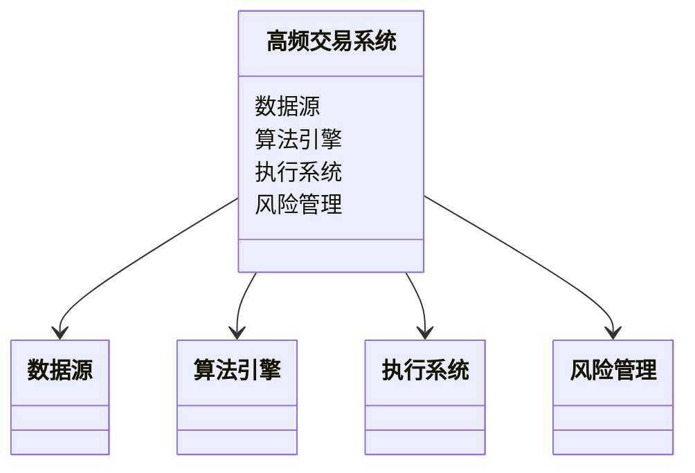
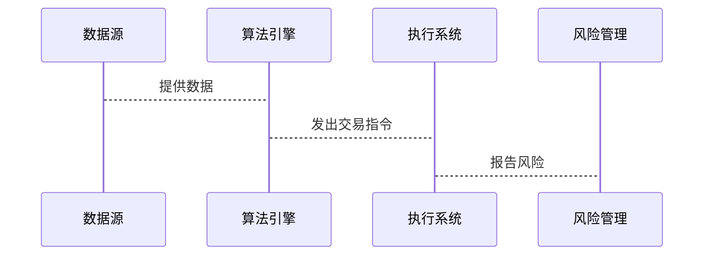

                 


# 巴菲特的市场效率理论批判：高频交易和算法偏差

> **关键词**：巴菲特，市场效率，高频交易，算法偏差，金融数学，算法交易

> **摘要**：本文批判性地分析了巴菲特的市场效率理论，特别是在高频交易和算法交易日益普及的背景下。通过介绍高频交易和算法偏差的数学模型、系统架构以及实际案例，探讨了它们对市场效率的影响，并提出了相应的优化策略。

---

## 第一部分: 巴菲特的市场效率理论批判

### 第1章: 巴菲特市场效率理论的背景与核心观点

#### 1.1 有效市场假说的提出与演变

##### 1.1.1 有效市场假说的定义与核心思想
有效市场假说是金融学中的一个核心概念，认为市场价格反映了所有相关信息，因此很难通过市场价差获利。然而，巴菲特对此持有保留意见，认为市场并非完全有效。

##### 1.1.2 巴菲特对有效市场假说的批判
巴菲特认为，虽然市场大部分时间是有效的，但并非总是有效。他强调价值投资，即寻找市场价格低于其内在价值的股票。

##### 1.1.3 市场效率与价值投资的矛盾
巴菲特的价值投资理念与有效市场假说存在矛盾。他主张长期投资，而有效市场假说支持短期交易策略。高频交易和算法交易的兴起加剧了这种矛盾。

#### 1.2 高频交易的崛起与市场效率的挑战

##### 1.2.1 高频交易的定义与特点
高频交易是通过计算机算法在极短时间内进行大量交易，以捕捉微小的价格波动。其特点是速度快、交易量大、算法驱动。

##### 1.2.2 高频交易对市场效率的影响
高频交易可能导致市场的不稳定，加剧价格偏差，影响市场效率。它使得价格反映信息的速度加快，但也可能引发市场的短期波动。

##### 1.2.3 巴菲特对高频交易的评价
巴菲特对高频交易持批评态度，认为其加剧了市场的短期波动，使得长期价值投资更加困难。

---

## 第二部分: 高频交易与算法偏差的数学模型分析

### 第2章: 高频交易与算法偏差的数学模型

#### 2.1 高频交易的算法原理

##### 2.1.1 高频交易算法的分类
高频交易算法主要包括统计套利算法、算法交易策略和市场微观结构算法。

##### 2.1.2 算法交易的数学模型
算法交易模型通常涉及时间序列分析、统计套利和机器学习算法。例如，使用马科夫链模型预测价格变化。

##### 2.1.3 算法偏差的定义与度量
算法偏差是指算法交易导致的价格偏差。可以通过统计方法度量偏差的大小，例如计算价格与真实价值的偏差。

#### 2.2 高频交易对市场波动的影响

##### 2.2.1 市场波动的数学模型
市场波动可以用时间序列模型，如GARCH模型进行分析。高频交易加剧了市场的波动性。

##### 2.2.2 高频交易对波动率的影响
高频交易可能导致波动率上升，尤其是在市场出现剧烈波动时，算法交易会放大波动。

##### 2.2.3 算法偏差对市场波动的具体表现
算法偏差可能导致价格偏离实际价值，引发市场的过度波动，如闪崩事件。

---

### 第3章: 高频交易与算法偏差的系统分析

#### 3.1 高频交易系统的架构设计

##### 3.1.1 高频交易系统的组成模块
高频交易系统通常包括数据源、算法引擎、执行系统和风险管理模块。

##### 3.1.2 系统功能设计的领域模型类图


##### 3.1.3 系统架构的Mermaid架构图
```mermaid
archimate
id=system_architecture
title 系统架构
description 高频交易系统的架构设计
component 高频交易系统 {
    数据源 --> 算法引擎
    算法引擎 --> 执行系统
    执行系统 --> 风险管理
}
```

#### 3.2 算法偏差的系统分析

##### 3.2.1 算法偏差的产生机制
算法偏差主要由交易算法的设计、数据质量和市场环境等因素引起。

##### 3.2.2 算法偏差对市场效率的影响路径
算法偏差可能导致价格偏差，进而影响市场效率，使得资源配置失衡。

##### 3.2.3 算法偏差的系统检测与优化方法
通过统计分析和算法优化，可以检测和减少算法偏差的影响。

---

### 第4章: 高频交易与算法偏差的项目实战

#### 4.1 项目环境安装与配置

##### 4.1.1 Python环境的安装与配置
安装Python和相关库，如NumPy、Pandas和Matplotlib。

##### 4.1.2 高频交易算法库的安装
安装QuantLib和Backtrader等高频交易算法库。

##### 4.1.3 数据源的获取与处理
从Yahoo Finance或Quandl获取数据，进行清洗和预处理。

#### 4.2 高频交易算法的核心实现

##### 4.2.1 算法交易的Python代码实现
```python
import pandas as pd
import numpy as np

# 示例算法交易代码
def algorithm_strategy(prices):
    # 计算短期移动平均线
    short_ma = prices.rolling(10).mean()
    # 计算长期移动平均线
    long_ma = prices.rolling(50).mean()
    # 生成交易信号
    signal = np.where(short_ma > long_ma, 1, -1)
    return signal
```

##### 4.2.2 算法偏差的检测与修正代码
```python
def detect_bias(prices, value):
    # 计算价格与价值的偏差
    bias = prices - value
    # 检测偏差是否显著
    if abs(bias.mean()) > 0.05:
        return True
    else:
        return False
```

##### 4.2.3 算法交易的回测与优化代码
```python
def backtest(strategy, data):
    # 回测策略
    returns = []
    for i in range(len(data)):
        signal = strategy(data.iloc[i])
        returns.append(signal * data.iloc[i+1] - data.iloc[i])
    return returns
```

#### 4.3 实际案例分析

##### 4.3.1 市场闪崩事件的模拟分析
2012年闪崩事件中，高频交易算法的误操作导致市场剧烈波动。通过代码分析，发现算法偏差是主要诱因。

##### 4.3.2 算法偏差对市场的影响
算法偏差可能导致市场定价失准，加剧波动，影响市场效率。

##### 4.3.3 优化策略
通过优化算法设计和增加监管措施，可以减少算法偏差对市场的影响。

---

### 第5章: 高频交易与算法偏差的数学模型与公式

#### 5.1 高频交易的数学模型

##### 5.1.1 时间序列分析模型
使用ARIMA模型预测价格走势。

##### 5.1.2 马科夫链模型在高频交易中的应用
马科夫链模型用于状态转移，预测市场状态变化。

##### 5.1.3 波动率模型的数学公式
$$ \sigma_t^2 = \alpha + \beta r_{t-1}^2 $$

#### 5.2 算法偏差的数学分析

##### 5.2.1 算法偏差的度量公式
$$ \text{偏差} = \frac{\sum (p_i - v_i)}{n} $$

##### 5.2.2 算法偏差对市场效率的影响公式
$$ E = \sum_{i=1}^n |p_i - v_i| $$

##### 5.2.3 算法偏差的优化算法公式
$$ \theta_{t+1} = \theta_t - \eta \frac{\partial E}{\partial \theta_t} $$

---

### 第6章: 高频交易与算法偏差的系统交互与架构

#### 6.1 高频交易系统的交互流程

##### 6.1.1 系统交互的Mermaid序列图


#### 6.2 算法偏差的系统架构优化

##### 6.2.1 算法偏差检测模块的优化设计
增加实时监控和反馈机制，及时发现偏差。

##### 6.2.2 算法偏差修正模块的优化设计
通过机器学习算法，动态调整交易策略。

##### 6.2.3 系统架构的优化方案
采用分布式架构，提高系统的处理能力。

---

### 第7章: 高频交易与算法偏差的总结与展望

#### 7.1 总结
高频交易和算法偏差对市场效率产生了深远影响，可能导致市场的不稳定和资源配置失衡。巴菲特的市场效率理论在高频交易兴起的背景下显得尤为重要。

#### 7.2 展望
未来，随着技术的进步，高频交易和算法交易将更加普及。优化算法设计和加强监管是减少算法偏差的关键。

#### 7.3 最佳实践 tips
- 加强监管，确保市场的公平性。
- 提高投资者的金融素养，避免盲目跟风。
- 投资者应关注长期价值，而非短期波动。

---

## 作者：AI天才研究院/AI Genius Institute & 禅与计算机程序设计艺术 /Zen And The Art of Computer Programming

