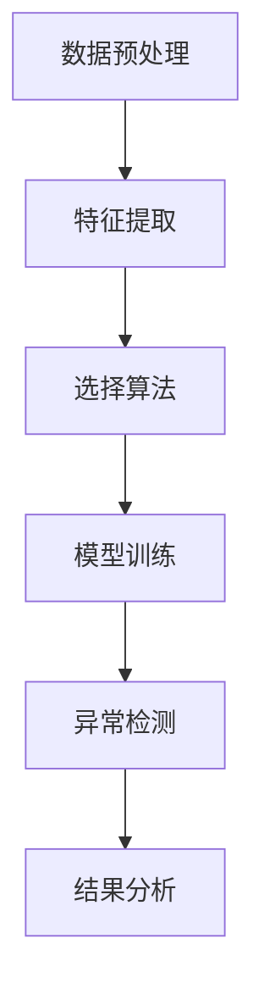
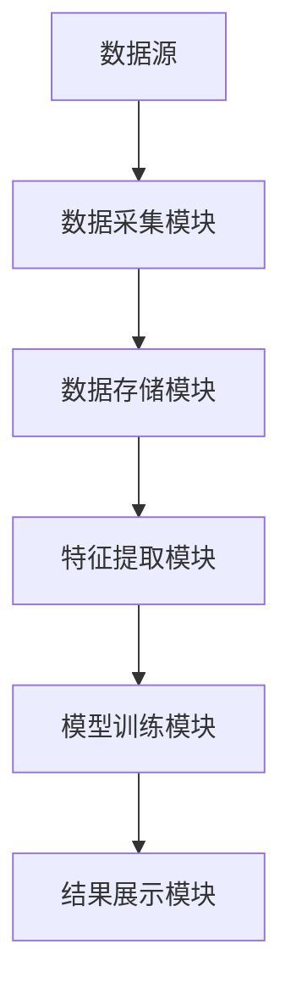
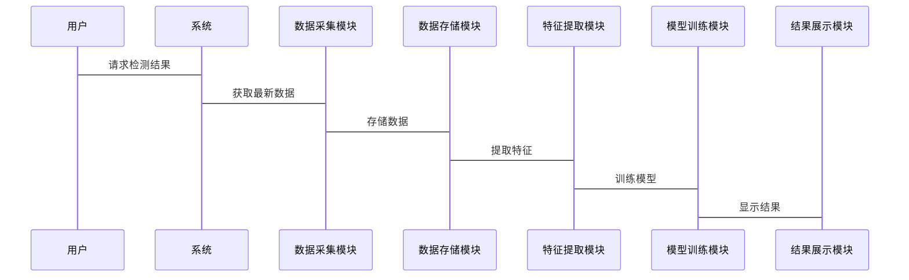

                 


# 巴菲特的市场泡沫识别：人工智能驱动的市场异常检测

> 关键词：市场异常检测，人工智能，巴菲特投资策略，金融数据分析，时间序列分析，自然语言处理

> 摘要：本文将深入探讨如何利用人工智能技术辅助巴菲特的市场泡沫识别策略，通过市场异常检测的方法，结合时间序列分析和自然语言处理等技术，分析市场波动和投资者行为，帮助投资者在复杂多变的金融市场中做出更明智的投资决策。

---

## 第一部分: 巴菲特的市场泡沫识别与人工智能驱动的市场异常检测概述

### 第1章: 背景介绍

#### 1.1 市场异常检测的重要性
##### 1.1.1 什么是市场异常？
市场异常是指在金融市场中，价格、成交量或其他市场指标出现显著偏离正常波动范围的情况。这种异常可能是由于市场参与者的行为、突发事件或市场结构的变化引起的。

##### 1.1.2 市场异常对投资者的影响
市场异常通常伴随着高风险和高回报的机会。投资者如果能够及时识别市场异常，可以做出更明智的投资决策，避免重大损失或抓住潜在的利润机会。

##### 1.1.3 巴菲特的价值投资理念与市场异常检测的结合
巴菲特的价值投资理念强调长期投资和基本面分析。通过结合市场异常检测，可以帮助投资者识别市场的短期波动，避免被市场情绪左右，从而更好地践行价值投资策略。

#### 1.2 巴菲特的投资策略
##### 1.2.1 巴菲特的价值投资理念
巴菲特强调投资于具有长期竞争优势和良好管理的公司，关注公司的内在价值，而非市场的短期波动。

##### 1.2.2 巴菲特如何识别市场泡沫
巴菲特通过分析公司的财务数据、行业地位和市场情绪来判断是否存在市场泡沫。他认为，市场泡沫通常出现在市场参与者过于乐观、估值偏离基本面的时候。

##### 1.2.3 巴菲特策略与现代金融市场的结合
随着金融市场的复杂化，单纯依靠基本面分析已不足以应对市场的短期波动。结合人工智能技术，可以更高效地识别市场异常，辅助巴菲特策略的实施。

#### 1.3 人工智能在金融分析中的应用
##### 1.3.1 人工智能在金融数据分析中的优势
人工智能能够处理海量数据，发现复杂模式，并实时监控市场动态，为投资者提供及时的决策支持。

##### 1.3.2 人工智能如何辅助市场异常检测
通过机器学习算法，人工智能可以自动识别市场数据中的异常模式，并发出预警信号，帮助投资者及时应对市场变化。

##### 1.3.3 人工智能驱动的市场分析现状与未来趋势
当前，人工智能在金融市场的应用已经取得了显著进展，但仍有提升空间。未来，随着技术的进步，人工智能将在市场异常检测中发挥更大的作用。

### 1.4 本章小结
市场异常检测是金融市场中的重要问题，巴菲特的价值投资理念为市场异常检测提供了独特的视角。人工智能技术的引入，为市场异常检测提供了新的解决方案。本章为后续内容奠定了基础。

---

## 第2章: 市场异常检测的核心概念与联系

### 2.1 市场异常检测的定义与分类
#### 2.1.1 时间序列数据分析
市场数据通常以时间序列为基础，分析这些数据的模式和异常是市场异常检测的核心。

#### 2.1.2 异常检测的分类与应用场景
市场异常检测可以分为单变量和多变量分析、基于规则的检测、统计方法和机器学习方法等。每种方法都有其优缺点和适用场景。

#### 2.1.3 市场异常检测的核心问题
市场异常检测的核心问题是如何在噪声中识别出真正的异常信号，同时避免误报和漏报。

### 2.2 巴菲特市场泡沫识别的核心要素
#### 2.2.1 价值与价格的偏离
巴菲特关注的是公司的内在价值与市场价格之间的偏离，这种偏离可能是市场泡沫的信号。

#### 2.2.2 市场情绪与投资者行为分析
市场情绪和投资者行为是市场异常的重要驱动因素。通过分析社交媒体、新闻和交易数据，可以捕捉市场情绪的变化。

#### 2.2.3 财务指标与市场表现的关联
财务指标如市盈率、市净率等是衡量市场估值的重要指标。通过分析这些指标的变化，可以识别市场泡沫。

### 2.3 人工智能算法与市场异常检测的结合
#### 2.3.1 常见的人工智能算法概述
常用的算法包括支持向量机（SVM）、随机森林（Random Forest）、k近邻（k-NN）和深度学习模型如LSTM等。

#### 2.3.2 算法选择与市场异常检测目标的匹配
不同算法适用于不同的市场异常检测场景。选择合适的算法需要考虑数据类型、异常模式和计算资源等因素。

#### 2.3.3 算法优缺点对比表格
| 算法       | 优点                           | 缺点                           |
|------------|--------------------------------|--------------------------------|
| Isolation Forest | 计算速度快，适合大数据集   | 对异常点数量较少时效果不佳     |
| Autoencoder   | 能够捕捉数据的复杂模式       | 需要大量的训练数据             |
| LSTM         | 能够捕捉时间序列中的模式     | 计算复杂度高，训练时间长       |

### 2.4 本章小结
市场异常检测的核心是识别市场数据中的异常模式，结合巴菲特的价值投资理念，可以更有效地识别市场泡沫。人工智能算法的选择需要根据具体场景和数据特点进行。

---

## 第3章: 市场异常检测的算法原理

### 3.1 时间序列分析
#### 3.1.1 ARIMA模型原理
ARIMA（自回归积分滑动平均模型）是一种广泛应用于时间序列预测的模型。它通过自回归和滑动平均部分来捕捉数据的趋势和季节性。

#### 3.1.2 LSTM网络在时间序列预测中的应用
LSTM（长短期记忆网络）是一种特殊的循环神经网络，能够有效地捕捉时间序列中的长期依赖关系，适用于复杂的时间序列预测。

#### 3.1.3 时间序列异常检测的数学模型
时间序列异常检测可以通过统计方法（如Z-score）或机器学习方法（如Isolation Forest）实现。数学模型的选择取决于数据特性和异常检测目标。

### 3.2 异常检测算法
#### 3.2.1 Isolation Forest算法原理
Isolation Forest是一种基于树结构的异常检测算法，通过构建随机树将数据点隔离出来，从而判断是否为异常点。

#### 3.2.2 Autoencoder算法在异常检测中的应用
Autoencoder是一种无监督学习算法，通过构建自编码器来学习数据的低维表示，从而识别异常点。

#### 3.2.3 算法流程图（使用mermaid）


### 3.3 自然语言处理
#### 3.3.1 市场情绪分析
通过自然语言处理技术，可以分析新闻、社交媒体和投资者评论，捕捉市场情绪的变化。

#### 3.3.2 事件驱动的市场异常检测
某些市场异常可能是由突发事件（如政策变化、公司公告）引起的。自然语言处理可以帮助快速分析这些事件对市场的影响。

### 3.4 本章小结
时间序列分析、异常检测算法和自然语言处理是市场异常检测的重要工具。选择合适的算法和方法，可以显著提高异常检测的准确性和效率。

---

## 第4章: 系统分析与架构设计方案

### 4.1 问题场景介绍
市场异常检测系统需要实时监控市场数据，分析市场波动，识别异常信号，并提供预警。

### 4.2 系统功能设计
#### 4.2.1 数据采集模块
负责采集股票价格、成交量、新闻等市场数据。

#### 4.2.2 特征提取模块
提取有用的特征，如价格波动率、市盈率等。

#### 4.2.3 模型训练模块
训练异常检测模型，如ARIMA、LSTM等。

#### 4.2.4 结果展示模块
将检测结果以可视化的方式展示给用户。

### 4.3 系统架构设计（使用mermaid）


### 4.4 系统接口设计
系统需要与数据源、数据库和用户界面进行交互，设计合理的接口可以提高系统的可扩展性和维护性。

### 4.5 系统交互设计（使用mermaid）


### 4.6 本章小结
系统设计是市场异常检测的重要环节。合理的架构设计和接口设计可以提高系统的效率和可维护性。

---

## 第5章: 项目实战

### 5.1 环境安装
需要安装Python、NumPy、Pandas、Scikit-learn、Keras和TensorFlow等库。

### 5.2 核心代码实现
#### 5.2.1 数据预处理
```python
import pandas as pd
import numpy as np

# 读取数据
data = pd.read_csv('market_data.csv')

# 删除缺失值
data = data.dropna()

# 标准化处理
from sklearn.preprocessing import StandardScaler
scaler = StandardScaler()
data_scaled = scaler.fit_transform(data)
```

#### 5.2.2 模型训练
```python
from sklearn.ensemble import IsolationForest

model = IsolationForest(random_state=42)
model.fit(data_scaled)
```

#### 5.2.3 结果分析
```python
import matplotlib.pyplot as plt

outliers = model.predict(data_scaled)
plt.scatter(range(len(outliers)), outliers)
plt.show()
```

### 5.3 案例分析
以某股票为例，分析其价格波动，识别异常点，并解释结果。

### 5.4 项目总结
通过项目实战，验证了人工智能技术在市场异常检测中的有效性，同时也发现了需要改进的地方，如数据质量、模型调优等。

### 5.5 本章小结
项目实战是理论知识的应用，通过实际操作，可以更好地理解市场异常检测的流程和方法。

---

## 第6章: 最佳实践与小结

### 6.1 最佳实践
#### 6.1.1 数据质量的重要性
高质量的数据是市场异常检测的基础，需要确保数据的完整性和准确性。

#### 6.1.2 模型调优的必要性
不同的市场环境可能需要不同的模型参数，定期调优可以提高检测的准确率。

#### 6.1.3 持续学习的重要性
市场环境不断变化，需要持续学习新的技术和方法，保持对市场的敏感性。

### 6.2 小结
通过结合巴菲特的价值投资理念和人工智能技术，可以更有效地识别市场异常。本文从理论到实践，详细讲解了市场异常检测的方法和步骤。

### 6.3 注意事项
市场异常检测是一种辅助工具，投资者需要结合其他信息进行综合判断，避免单一依赖模型的结果。

### 6.4 拓展阅读
推荐阅读《Python机器学习实战》、《时间序列分析》等相关书籍，深入理解人工智能技术在金融领域的应用。

---

## 作者：AI天才研究院/AI Genius Institute & 禅与计算机程序设计艺术 /Zen And The Art of Computer Programming

