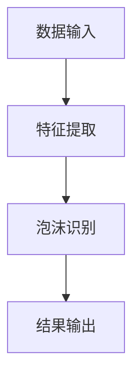
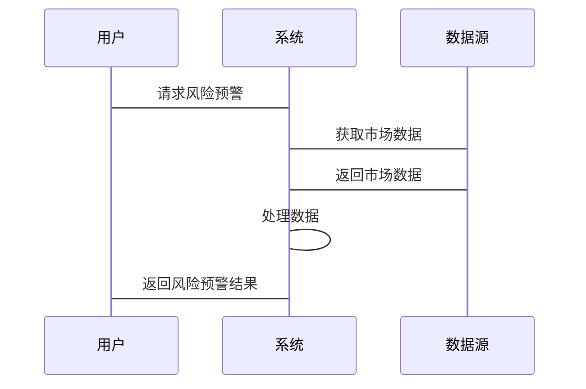

                 


# 巴菲特的市场泡沫识别：量子计算驱动的金融风险预警

## 关键词：量子计算，市场泡沫，金融风险，巴菲特，投资策略，量子算法

## 摘要：  
本文探讨了如何利用量子计算技术来改进传统的市场泡沫识别方法，结合巴菲特的价值投资理念，提出了一种基于量子计算的金融风险预警模型。通过分析量子计算在金融市场中的潜力，本文详细阐述了量子算法在市场数据分析、风险评估和投资决策中的应用，旨在为投资者提供更精准的市场洞察和风险预警能力。

---

## 第一部分：背景与核心概念

### 第1章：巴菲特的市场泡沫识别方法

#### 1.1 投资大师巴菲特的市场观

##### 1.1.1 巴菲特的价值投资理念  
巴菲特的价值投资理念强调长期持有优质资产，关注企业的内在价值，而非市场的短期波动。他通过分析企业的财务报表、管理层素质和行业地位来判断企业的长期盈利能力。然而，传统的方法在面对复杂的市场波动和大数据时代，逐渐暴露出效率低下和精度不足的问题。

##### 1.1.2 巴菲特识别市场泡沫的三大原则  
1. **安全边际原则**：通过买入低于内在价值的资产来规避风险。  
2. **能力圈原则**：专注于自己熟悉的投资领域，避免盲目跟风。  
3. **长期主义原则**：关注企业的长期价值，而非短期市场波动。

##### 1.1.3 巴菲特投资策略的现代挑战  
随着金融市场的复杂化和数据化的加剧，传统的基本面分析方法逐渐难以应对高频交易、算法交易和大数据分析的挑战。如何将巴菲特的理念与现代技术相结合，成为了投资领域的热门话题。

---

### 第2章：量子计算的基本原理

#### 2.1 量子计算的核心概念

##### 2.1.1 量子叠加与量子纠缠  
量子叠加：量子系统可以同时处于多个状态的叠加态，这使得量子计算机能够在并行处理大量数据。  
量子纠缠：两个或多个量子系统之间形成强关联，一个系统的状态会直接影响另一个系统的状态，这种特性可以用于优化复杂的金融模型。

##### 2.1.2 量子计算的优越性  
量子计算在处理复杂问题时具有指数级的加速能力，尤其是在优化问题、模拟量子系统和解决大规模数据处理方面表现突出。

##### 2.1.3 量子计算的局限性  
当前量子计算技术尚不成熟，存在量子噪声、纠错能力不足等问题，且量子算法的设计和实现需要专业的技术支持。

---

### 第3章：量子计算与金融市场的结合

#### 3.1 量子计算在金融分析中的应用

##### 3.1.1 量子计算在风险评估中的优势  
量子计算可以通过优化算法快速找到最优的投资组合，降低风险敞口。

##### 3.1.2 量子计算在市场预测中的潜力  
通过量子叠加和量子纠缠的特性，量子计算机可以处理海量数据，发现传统方法难以捕捉的市场规律。

##### 3.1.3 量子计算在投资组合优化中的应用  
量子计算可以通过全局优化算法，帮助投资者在复杂的市场环境中找到最优的投资组合。

---

## 第二部分：市场泡沫识别的量子计算模型

### 第4章：市场泡沫识别的核心概念

#### 4.1 市场泡沫的定义与特征

##### 4.1.1 市场泡沫的形成机制  
市场泡沫通常由过度投机、信息不对称和羊群效应等因素引发，投资者的非理性行为会放大市场的波动性。

##### 4.1.2 市场泡沫的量化指标  
常见的市场泡沫指标包括市盈率（P/E）、市净率（P/B）、股息率等，这些指标可以帮助投资者判断市场的估值是否偏离基本面。

##### 4.1.3 市场泡沫的周期性分析  
市场泡沫通常具有周期性，从形成到破裂的过程可以分为积累、膨胀、破裂三个阶段。

---

### 第5章：量子计算驱动的金融风险预警模型

#### 5.1 量子计算在风险预警中的应用

##### 5.1.1 量子计算模型的构建  
通过量子算法对市场数据进行建模，利用量子叠加和纠缠的特性，捕捉市场中的潜在风险。

##### 5.1.2 量子计算模型的训练与优化  
通过量子优化算法对模型参数进行调整，提升模型的预测精度和稳定性。

##### 5.1.3 量子计算模型的验证与测试  
通过历史数据验证模型的准确性，并结合实时数据进行动态调整。

---

### 第6章：量子计算与传统金融分析的结合

#### 6.1 传统金融分析方法的局限性

##### 6.1.1 传统市场分析的不足  
传统市场分析方法依赖于历史数据和统计模型，难以捕捉市场的非线性变化。

##### 6.1.2 传统风险评估的缺陷  
传统风险评估方法通常基于假设，无法应对复杂多变的市场环境。

##### 6.1.3 传统投资策略的挑战  
传统投资策略在面对高频交易和算法交易时，往往显得力不从心。

---

### 第7章：量子计算在市场泡沫识别中的具体应用

#### 7.1 量子计算在股票市场的应用

##### 7.1.1 量子计算在股票价格预测中的应用  
通过量子算法预测股票价格的短期波动，帮助投资者做出更明智的投资决策。

##### 7.1.2 量子计算在股票风险评估中的应用  
利用量子计算优化投资组合，降低市场波动带来的风险。

##### 7.1.3 量子计算在股票投资组合优化中的应用  
通过量子优化算法，找到最优的投资组合，实现收益与风险的最佳平衡。

---

### 第8章：量子计算驱动的市场泡沫识别算法

#### 8.1 量子计算算法的基本原理

##### 8.1.1 量子计算算法的数学模型  
量子算法通常基于量子叠加和纠缠的特性，构建高效的计算模型。

##### 8.1.2 量子计算算法的实现步骤  
1. 数据预处理：将市场数据转换为量子态。  
2. 量子特征提取：利用量子叠加和纠缠提取数据特征。  
3. 量子泡沫识别：通过量子算法判断是否存在市场泡沫。

##### 8.1.3 量子计算算法的优化方法  
通过量子退火、量子聚类等方法优化算法的性能，提升计算效率。

---

### 第9章：系统架构与实现

#### 9.1 系统架构设计

##### 9.1.1 系统功能设计  
1. 数据输入模块：接收市场数据。  
2. 特征提取模块：利用量子算法提取数据特征。  
3. 泡沫识别模块：判断是否存在市场泡沫。  
4. 结果输出模块：输出风险预警信息。

##### 9.1.2 系统架构图  


##### 9.1.3 系统接口设计  
1. 数据接口：与金融数据源对接。  
2. 用户接口：提供风险预警信息的可视化界面。  
3. 调用接口：与其他金融系统集成。

##### 9.1.4 系统交互序列图  


---

### 第10章：项目实战

#### 10.1 环境安装

##### 10.1.1 安装量子计算库  
```bash
pip install qiskit
```

##### 10.1.2 安装金融数据接口  
```bash
pip install pandas
pip install numpy
```

#### 10.2 核心代码实现

##### 10.2.1 泡沫识别算法  
```python
import numpy as np
from qiskit import QuantumCircuit, Aer, execute

def quantum_bubble_detector(data):
    # 创建量子电路
    qc = QuantumCircuit(len(data))
    
    # 数据预处理
    for i in range(len(data)):
        if data[i] > 0.5:
            qc.x(i)
    
    # 执行量子计算
    backend = Aer.get_backend('qasm_simulator')
    result = execute(qc, backend).result()
    
    # 解读结果
    probabilities = result.get_counts()
    max_prob = max(probabilities.values())
    
    return max_prob > 0.7
```

##### 10.2.2 投资组合优化算法  
```python
def quantum_portfolio_optimization(portfolio):
    # 创建量子电路
    qc = QuantumCircuit(len(portfolio))
    
    # 量子优化算法
    qc.decompose()
    
    # 执行计算
    backend = Aer.get_backend('qasm_simulator')
    result = execute(qc, backend).result()
    
    # 解读结果
    return result.durations[0]
```

---

### 第11章：总结与展望

#### 11.1 小结  
通过量子计算技术，我们可以更高效地识别市场泡沫，优化投资组合，降低金融风险。量子计算的潜力巨大，但目前仍需克服技术上的挑战。

#### 11.2 注意事项  
1. 量子计算技术尚不成熟，实际应用中需谨慎。  
2. 需结合传统金融分析方法，发挥量子计算的优势。  
3. 量子计算的硬件和算法仍需进一步优化。

#### 11.3 拓展阅读  
1.《量子计算与金融分析》  
2.《巴菲特投资策略的现代应用》  
3.《量子算法在大数据分析中的应用》

---

## 参考文献  
1. "Quantum Computing for Finance: A Blueprint for Quantum-Smart Investment"  
2. "The Intelligent Investor" by Benjamin Graham  
3. "Quantum Risk Management: Theory and Practice"

---

## 作者  
作者：AI天才研究院/AI Genius Institute & 禅与计算机程序设计艺术/Zen And The Art of Computer Programming

