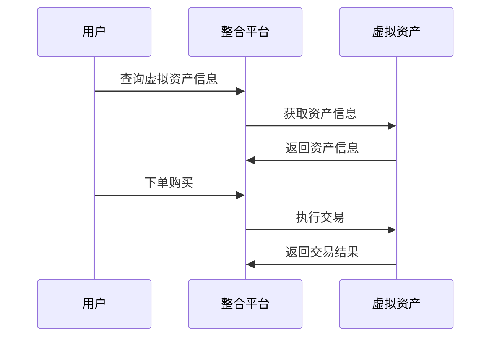

                 


# 巴菲特的并购策略在元宇宙虚拟资产整合中的创新

## 关键词：巴菲特并购策略，元宇宙，虚拟资产，价值评估，数字资产，虚拟经济，投资策略

## 摘要：本文探讨了巴菲特的并购策略在元宇宙虚拟资产整合中的创新应用。通过分析虚拟资产的价值评估、整合策略和风险管理，结合实际案例，展示了如何将巴菲特的经典投资理念与元宇宙的数字资产特性相结合，为虚拟资产的整合与投资提供了新的思路。

---

# 第1章 巴菲特并购策略的核心理念

## 1.1 巴菲特并购策略的起源与演变

### 1.1.1 巴菲特并购策略的起源
沃伦·巴菲特的并购策略起源于20世纪中期，其核心理念是“以合理的价格买入优秀的公司”。巴菲特注重企业的内在价值，而非市场波动，强调长期投资和安全边际。

### 1.1.2 巴菲特并购策略的核心理念
- **价值投资**：寻找市场价格低于内在价值的企业。
- **安全边际**：在价格与价值之间留有安全空间，降低投资风险。
- **长期视角**：关注企业的长期盈利能力，而非短期市场波动。

### 1.1.3 巴菲特并购策略在现代金融中的地位
巴菲特的并购策略已成为价值投资的典范，广泛应用于传统金融领域，但其在新兴领域的应用仍有巨大潜力。

## 1.2 元宇宙虚拟资产的基本概念

### 1.2.1 元宇宙的定义与特征
- 元宇宙是一个虚拟的、去中心化的数字世界，用户可以通过虚拟现实技术进行互动。
- 元宇宙具有开放性、去中心化和持续性等特点。

### 1.2.2 虚拟资产的类型与价值评估
- **虚拟土地**：如Decentraland、The Sandbox中的虚拟地块。
- **数字资产**：如NFTs（非同质化代币）、虚拟商品等。
- **虚拟货币**：如比特币、以太坊等。

### 1.2.3 元宇宙虚拟资产整合的背景与意义
随着元宇宙的兴起，虚拟资产的整合需求日益增长，但其价值评估和整合策略仍面临挑战。

## 1.3 巴菲特并购策略与元宇宙虚拟资产整合的联系

### 1.3.1 巴菲特并购策略的核心要素
- **内在价值**：企业或资产的真实价值。
- **安全边际**：价格与价值之间的差异。
- **长期视角**：关注资产的长期收益。

### 1.3.2 元宇宙虚拟资产整合的核心挑战
- 虚拟资产的流动性问题。
- 虚拟资产的价值评估难度。
- 整合过程中的协同效应。

### 1.3.3 两者的结合与创新点
通过将巴菲特的并购策略应用于虚拟资产整合，可以实现：
- 更精准的虚拟资产价值评估。
- 更有效的整合策略。
- 更强的风险控制。

---

# 第2章 巴菲特并购策略在元宇宙虚拟资产整合中的创新应用

## 2.1 巴菲特并购策略的创新点

### 2.1.1 巴菲特并购策略的灵活性与适应性
巴菲特的策略最初适用于传统企业并购，但在元宇宙中，其灵活性得以展现。

### 2.1.2 巴菲特并购策略的长期价值导向
虚拟资产的长期价值取决于其在元宇宙中的应用场景和需求。

### 2.1.3 巴菲特并购策略的风险控制机制
通过安全边际和长期视角，降低虚拟资产整合的风险。

## 2.2 元宇宙虚拟资产整合的核心问题

### 2.2.1 虚拟资产的流动性问题
虚拟资产的流动性直接影响其价值评估和交易效率。

### 2.2.2 虚拟资产的价值评估问题
虚拟资产的价值受多种因素影响，包括市场需求、技术实现等。

### 2.2.3 虚拟资产的整合与协同效应
整合虚拟资产需要考虑其协同效应，以实现最大化的价值。

## 2.3 巴菲特并购策略在元宇宙虚拟资产整合中的创新应用

### 2.3.1 巴菲特并购策略在虚拟资产价值评估中的应用
通过分析虚拟资产的内在价值，确定其合理价格。

### 2.3.2 巴菲特并购策略在虚拟资产整合中的应用
通过长期视角和安全边际，选择具有潜力的虚拟资产进行整合。

### 2.3.3 巴菲特并购策略在虚拟资产风险管理中的应用
通过风险控制机制，降低虚拟资产整合中的不确定性。

---

# 第3章 元宇宙虚拟资产整合的系统分析与架构设计

## 3.1 系统功能设计

### 3.1.1 领域模型
```mermaid
classDiagram
    class 虚拟资产 {
        id
        类型
        价值
        所有者
    }
    class 整合平台 {
        用户
        资产列表
        交易记录
    }
    virtualAsset -->> 整合平台
```

### 3.1.2 系统架构
```mermaid
container 元宇宙虚拟资产整合系统 {
    class 虚拟资产 {
        id
        类型
        价值
        所有者
    }
    class 整合平台 {
        用户
        资产列表
        交易记录
    }
    virtualAsset -->> 整合平台
}
```

### 3.1.3 接口设计
- 资产信息查询接口。
- 资产交易接口。
- 资产整合接口。

### 3.1.4 交互流程


## 3.2 系统架构设计

### 3.2.1 系统架构图
```mermaid
container 元宇宙虚拟资产整合系统 {
    class 虚拟资产 {
        id
        类型
        价值
        所有者
    }
    class 整合平台 {
        用户
        资产列表
        交易记录
    }
    virtualAsset -->> 整合平台
}
```

### 3.2.2 系统交互流程


## 3.3 项目实战

### 3.3.1 环境安装
安装必要的开发工具和虚拟资产平台接口。

### 3.3.2 核心代码实现
```python
def calculate_intrinsic_value(asset):
    # 计算虚拟资产的内在价值
    return asset.value * (1 + 0.1)  # 假设安全边际为10%
```

### 3.3.3 案例分析
以Decentraland中的虚拟土地为例，分析其价值评估和整合策略。

## 3.4 项目小结
总结项目经验，提出改进建议。

---

# 第4章 最佳实践与总结

## 4.1 最佳实践 tips
- 重视虚拟资产的内在价值评估。
- 确保整合过程中的风险管理。

## 4.2 小结
巴菲特并购策略在元宇宙虚拟资产整合中的应用前景广阔，但仍需进一步探索。

## 4.3 注意事项
- 避免盲目跟风，注重长期价值。
- 重视技术实现与法律合规。

## 4.4 拓展阅读
推荐相关书籍和文章，进一步深入学习。

---

# 作者：AI天才研究院/AI Genius Institute & 禅与计算机程序设计艺术 /Zen And The Art of Computer Programming

