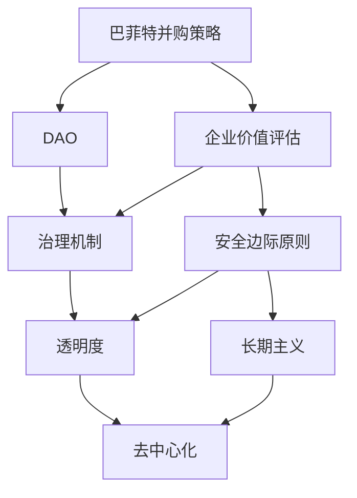
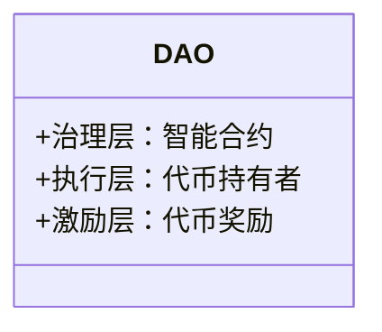
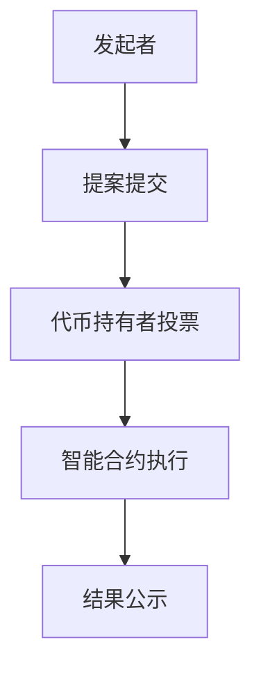

                 


# 巴菲特的并购策略在去中心化自治组织(DAO)中的新思路

---

## 关键词：
- 巴菲特
- 并购策略
- 去中心化自治组织
- DAO
- 价值投资
- 安全边际
- 区块链

---

## 摘要：
本文探讨了巴菲特的并购策略在去中心化自治组织（DAO）中的新思路。通过分析DAO的治理机制和价值评估方法，结合巴菲特的长期主义和安全边际原则，提出了一种创新的并购策略。文章从背景介绍、核心概念、算法原理、系统分析、项目实战等多个维度展开，详细阐述了如何将巴菲特的并购策略与DAO的去中心化特点相结合，为未来的DAO并购提供了理论和实践指导。

---

# 第一部分：背景介绍

## 1.1 巴菲特并购策略的核心思想
- 巴菲特的并购策略以价值投资为核心，注重企业的内在价值和长期股东利益。
- 强调安全边际和管理层质量，避免高风险和短期主义。
- 通过对企业基本面的深入分析，寻找具有持续竞争优势的企业。

## 1.2 去中心化自治组织（DAO）的基本概念
- DAO是基于区块链技术的去中心化组织，通过智能合约实现自治治理。
- DAO的决策过程公开透明，所有决策由代币持有者投票决定。
- DAO的治理结构强调去中心化和集体决策，避免单点控制风险。

## 1.3 巴菲特并购策略与DAO结合的意义
- DAO的透明性和去中心化特点为巴菲特的并购策略提供了新的应用场景。
- 通过DAO的治理机制，可以实现企业并购后的长期价值最大化。
- 结合巴菲特的安全边际原则，DAO可以在并购过程中降低风险，提升决策透明度。

---

# 第二部分：核心概念与联系

## 2.1 巴菲特并购策略的核心要素
| 核心要素 | 描述 |
|----------|------|
| 价值评估 | 基于企业基本面分析，寻找低估的企业 |
| 安全边际 | 确保并购价格低于企业内在价值 |
| 长期主义 | 注重企业的长期竞争优势和股东价值 |

## 2.2 DAO的核心机制
| 核心机制 | 描述 |
|----------|------|
| 治理结构 | 基于代币的投票机制 |
| 透明度 | 智能合约实现公开透明的决策过程 |
| 去中心化 | 避免单点控制风险，实现集体决策 |

## 2.3 巴菲特并购策略与DAO的映射关系


---

# 第三部分：算法原理与数学模型

## 3.1 巴菲特的估值方法在DAO中的应用
- 巴菲特的估值方法主要包括DCF模型和相对估值法。
- 在DAO中，DCF模型可以用于评估项目的未来现金流。

### DCF模型的数学表达
$$
\text{企业价值} = \sum_{t=1}^{n} \frac{\text{现金流}_t}{(1 + r)^t} + \frac{\text{残值}}{(1 + r)^n}
$$
其中，$r$是折现率，$n$是项目周期。

## 3.2 DAO并购中的风险控制
- 通过智能合约实现风险控制，确保并购过程的透明和可追溯。
- 使用博弈论模型优化决策过程。

### 博弈论模型
$$
\text{收益} = \max_{i} \min_{j} (a_{ij})
$$
其中，$a_{ij}$是参与者$i$和$j$的收益矩阵。

---

# 第四部分：系统分析与架构设计

## 4.1 DAO的治理结构


## 4.2 DAO的决策流程


## 4.3 DAO的系统架构


---

# 第五部分：项目实战

## 5.1 项目背景
- 某DAO组织计划并购一家区块链开发公司，评估其价值和风险。

## 5.2 项目核心实现
- 使用Python编写智能合约，实现DAO的治理机制。
- 应用巴菲特的估值模型进行企业价值评估。

### 核心代码
```python
def calculate_value(free_cash_flow, discount_rate, years):
    total_value = 0
    for i in range(years):
        cash_flow = free_cash_flow / (1 + discount_rate) ** i
        total_value += cash_flow
    return total_value
```

## 5.3 项目小结
- 通过DAO的治理机制，确保并购过程的透明和公平。
- 结合巴菲特的估值模型，降低并购风险，实现长期价值最大化。

---

# 第六部分：总结与展望

## 6.1 本文的核心观点
- 巴菲特的并购策略与DAO的去中心化特点可以有机结合。
- 通过DAO的治理机制，实现企业并购的长期价值最大化。

## 6.2 对未来的发展展望
- DAO的治理机制将进一步优化，提升并购效率。
- 区块链技术的发展将推动更多创新的并购策略。

---

# 结语

通过本文的探讨，我们看到了巴菲特并购策略在去中心化自治组织中的巨大潜力。未来的并购将更加注重透明度和长期价值，DAO的治理机制为这一目标提供了新的可能性。我们期待更多创新的应用，推动区块链技术和并购策略的深度融合。

---

## 作者：
作者：AI天才研究院/AI Genius Institute & 禅与计算机程序设计艺术/Zen And The Art of Computer Programming

