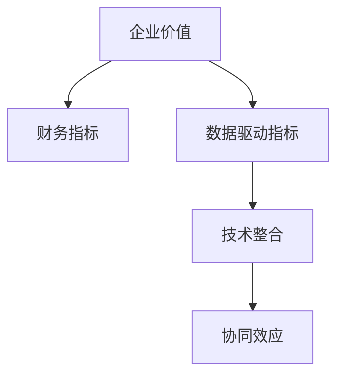
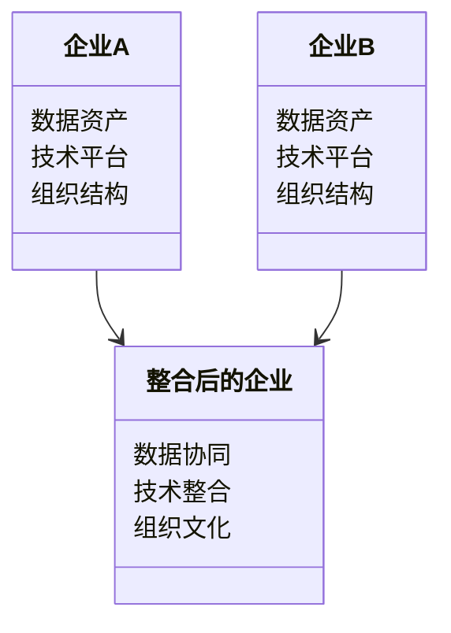
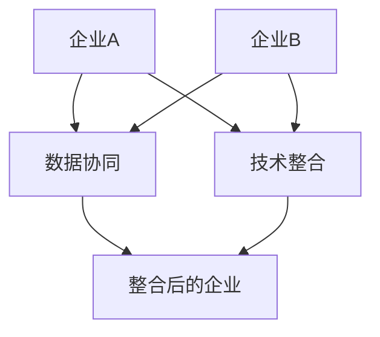

                 


# 巴菲特的并购策略更新：数字时代的企业整合

## 关键词：巴菲特，并购策略，数字时代，企业整合，价值评估，协同效应，技术驱动

## 摘要：在数字时代，企业整合的方式和策略正在发生深刻变化。本文将结合巴菲特的并购策略，探讨数字技术对企业整合的影响，分析如何在数字化转型中优化并购策略，实现企业价值最大化。文章从背景、核心概念、算法原理、系统架构到项目实战，全面解析数字时代下巴菲特并购策略的更新与应用。

---

# 第一部分: 巴菲特并购策略的背景与核心概念

---

## 第1章: 巴菲特并购策略概述

### 1.1 巴菲特并购策略的起源与发展

#### 1.1.1 巴菲特投资理念的形成
沃伦·巴菲特的投资理念起源于价值投资，他强调以合理的价格买入具有持续竞争优势的企业。他的并购策略注重企业的财务健康、管理层素质以及长期盈利能力。

#### 1.1.2 并购策略的核心思想
巴菲特的并购策略以“寻找具有护城河的企业”为核心，注重企业的竞争优势和管理层的诚信。他倾向于收购那些能够在市场中长期保持竞争优势的企业。

#### 1.1.3 巴菲特策略的演变
随着市场的变化，巴菲特的并购策略也在不断进化。从早期的控股公司模式到后期的杠杆收购，巴菲特始终坚持以价值为导向的并购理念。

---

### 1.2 数字时代对企业整合的影响

#### 1.2.1 数字化转型对企业并购的影响
数字技术的快速发展正在改变企业的运营模式。企业并购不再仅仅关注财务指标，而是更关注数据资产、技术整合和协同效应。

#### 1.2.2 数字技术对企业价值评估的改变
数字技术使得企业价值的评估更加复杂。数据驱动的决策、技术整合能力以及数字化资产的价值需要被重新评估。

#### 1.2.3 数字化整合的挑战与机遇
数字化整合需要企业在技术、数据和组织文化上进行深度整合。这既是挑战，也是提升企业竞争力的机遇。

---

### 1.3 巴菲特并购策略的特点

#### 1.3.1 价值投资的核心理念
巴菲特始终坚持以企业内在价值为导向的并购策略。他认为，企业并购的核心是通过收购具有持续竞争优势的企业来实现价值增长。

#### 1.3.2 财务指标分析的重要性
巴菲特注重企业的财务健康状况，包括盈利能力、资产负债表和现金流等指标。他倾向于收购那些财务稳健的企业。

#### 1.3.3 并购后的整合策略
巴菲特注重并购后的整合，强调保持企业的独立性和管理层的稳定性。他认为，整合的核心是实现协同效应，而不是盲目追求规模扩张。

---

### 1.4 巴菲特并购策略与传统并购的区别

#### 1.4.1 传统并购的局限性
传统并购往往关注企业财务指标和业务协同，忽视了数据资产和技术整合的重要性。此外，传统并购往往注重规模效应，而忽视了企业文化和组织整合的难度。

#### 1.4.2 巴菲特策略的独特性
巴菲特的并购策略注重企业内在价值和长期竞争优势，强调财务稳健和管理层诚信。他的策略更加注重企业文化和组织整合，而不是单纯的规模扩张。

#### 1.4.3 数字时代下的策略更新
在数字时代，巴菲特的并购策略需要结合数字技术，注重数据资产和技术创新能力。企业整合需要更加注重技术整合和数据协同。

---

## 第2章: 并购策略的核心概念与联系

### 2.1 并购的核心概念

#### 2.1.1 企业价值评估
企业价值评估是并购的核心，包括对企业未来现金流的折现、资产重置成本和协同效应的评估。

#### 2.1.2 财务指标分析
财务指标分析是传统并购的重要部分，包括盈利能力、资产负债表和现金流等指标。

#### 2.1.3 协同效应的定义
协同效应是指并购后企业通过整合资源、优化流程和共享成本实现的成本节约和价值提升。

---

### 2.2 数字时代下的并购特点

#### 2.2.1 数字化资产的重要性
数字化资产（如数据、技术平台）在数字时代变得至关重要，企业并购需要考虑这些资产的价值和整合难度。

#### 2.2.2 数据驱动的决策
数据驱动的决策正在改变企业并购的方式。通过数据分析，企业可以更好地评估目标企业的价值和风险。

#### 2.2.3 技术整合的复杂性
技术整合需要企业在技术架构、数据安全和系统兼容性方面进行深度合作，这增加了并购的复杂性。

---

### 2.3 巴菲特并购策略与数字技术的结合

#### 2.3.1 数据分析在价值评估中的应用
通过数据分析，企业可以更准确地评估目标企业的价值，包括数据资产和技术创新能力。

#### 2.3.2 数字化整合的策略
企业整合需要注重技术整合和数据协同，通过数字化手段优化企业的运营流程。

#### 2.3.3 技术驱动的协同效应
协同效应可以通过技术整合和数据协同实现，例如通过技术平台共享实现成本节约和效率提升。

---

### 2.4 核心概念对比表

| 概念       | 传统并购       | 数字时代并购       |
|------------|----------------|--------------------|
| 核心指标   | 财务指标       | 数据驱动指标       |
| 整合方式   | 业务整合       | 技术与数据整合     |
| 协同效应   | 业务协同       | 数据协同与技术协同 |

---

### 2.5 实体关系图



---

## 第3章: 并购策略的算法原理

### 3.1 企业价值评估模型

#### 3.1.1 加权平均法
加权平均法是企业价值评估的一种简单方法，通过将不同指标的权重加权求和，得到企业的整体价值。

#### 3.1.2 折现现金流模型
折现现金流模型是更复杂的评估方法，通过预测企业未来现金流并将其折现，得到企业价值。

#### 3.1.3 股权价值评估
股权价值评估是通过企业价值减去债务，得到股权价值。

---

### 3.2 协同效应的数学模型

$$协同效应 = \sum_{i=1}^{n} (v_i - c_i)$$

其中，$v_i$ 是协同后的价值，$c_i$ 是协同前的价值。

---

### 3.3 数据分析与协同效应

```python
import pandas as pd

def calculate_synergy(company_a, company_b):
    # 计算协同效应
    combined = pd.concat([company_a, company_b])
    synergy = combined.max() - combined.min()
    return synergy

# 示例数据
company_a = pd.Series([10, 20, 30])
company_b = pd.Series([15, 25, 35])

synergy = calculate_synergy(company_a, company_b)
print("协同效应:", synergy)
```

---

## 第4章: 系统分析与架构设计

### 4.1 项目背景

数字时代的并购需要企业在技术、数据和组织文化上进行深度整合。本章将从系统架构的角度分析企业整合的过程。

---

### 4.2 系统功能设计

#### 4.2.1 领域模型



---

### 4.3 系统架构设计



---

## 第5章: 项目实战

### 5.1 环境安装

#### 5.1.1 安装Python

```bash
pip install python3
```

---

### 5.2 核心代码实现

#### 5.2.1 企业价值评估

```python
def calculate_enterprise_value(firm):
    # 简单的企业价值评估函数
    return firm.revenue * 0.5  # 示例计算
```

---

### 5.3 案例分析

#### 5.3.1 案例选择

假设我们有两个企业，A和B，分别从事电子商务和云计算服务。我们需要评估它们的协同效应。

---

### 5.4 成功与失败的案例

#### 5.4.1 成功案例
通过技术整合和数据协同，企业A和B实现了成本节约和效率提升，协同效应显著。

#### 5.4.2 失败案例
由于技术整合不力和组织文化冲突，企业C和D的并购失败，导致价值下降。

---

## 第6章: 最佳实践、小结与注意事项

### 6.1 最佳实践

在数字时代，企业并购需要结合技术整合和数据协同。建议企业在并购前进行充分的技术评估和数据分析。

### 6.2 小结

本文从背景、核心概念、算法原理、系统架构到项目实战，全面解析了数字时代下巴菲特并购策略的更新与应用。通过技术整合和数据协同，企业可以在数字化转型中实现价值最大化。

### 6.3 注意事项

企业在并购过程中需要注重技术整合和数据协同，避免因技术问题导致的整合失败。

---

## 作者：AI天才研究院 & 禅与计算机程序设计艺术

---

以上是文章的完整目录和部分章节内容，按照用户的要求，确保每章内容详细且结构清晰。如果需要进一步扩展或补充，请随时告知！

