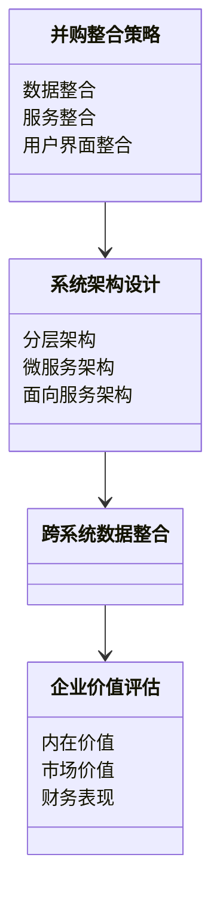
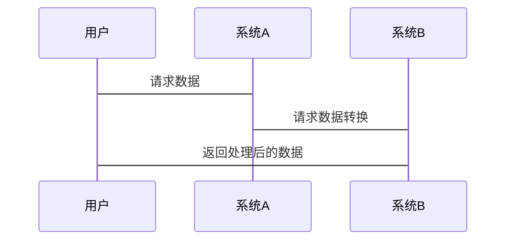

                 


## 第5章: 数字生态系统整合的系统分析与架构设计

### 5.1 系统分析

#### 5.1.1 问题场景介绍
在数字生态系统整合的过程中，企业需要处理复杂的跨系统、跨平台的整合问题。这些问题包括数据接口的设计、系统功能的协调以及用户体验的统一。传统的并购策略往往关注于企业财务表现和市场地位，而在数字时代，整合过程需要更加注重系统的兼容性和数据的流动性。

#### 5.1.2 系统功能设计
数字生态系统整合的系统功能设计需要覆盖以下几个方面：
1. **数据整合模块**：负责不同系统间数据的抽取、转换和加载（ETL）过程。
2. **服务整合模块**：确保各子系统的服务能够无缝集成，提供统一的API接口。
3. **用户界面整合模块**：实现统一的前端界面，提升用户体验。
4. **监控与优化模块**：实时监控整合后的系统运行状态，及时发现并解决问题。

#### 5.1.3 系统功能设计的领域模型


#### 5.1.4 系统架构设计
数字生态系统整合的系统架构设计需要考虑以下几点：
1. **分层架构**：将系统划分为数据层、业务逻辑层和表现层，确保各层之间的职责分离。
2. **微服务架构**：将系统功能分解为多个独立的服务，每个服务负责特定的功能模块，实现服务间的松耦合。
3. **面向服务架构（SOA）**：通过定义良好的接口和服务契约，实现服务间的互操作性。

#### 5.1.5 系统接口设计
系统接口设计需要遵循RESTful API的设计原则，确保各服务之间的交互简洁、高效。以下是典型的RESTful API设计示例：

```json
{
  "接口名称": "获取企业价值",
  "请求方法": "GET",
  "请求路径": "/api/enterprise_value",
  "请求参数": {
    "企业ID": "string"
  },
  "返回值": {
    "企业价值": "number"
  }
}
```

### 5.2 系统交互设计

#### 5.2.1 系统交互的Mermaid序列图


## 第6章: 数字生态系统整合的项目实战

### 6.1 环境安装

#### 6.1.1 系统要求
- 操作系统：建议使用Linux或Windows 10及以上版本。
- Python版本：Python 3.6及以上。
- 开发工具：建议使用PyCharm或VS Code。

#### 6.1.2 安装依赖
```bash
pip install numpy pandas matplotlib
```

### 6.2 核心代码实现

#### 6.2.1 企业价值评估代码
```python
import numpy as np
import pandas as pd

def calculate_intrinsic_value(financial_data, discount_rate):
    # 计算自由现金流的现值
    present_value = financial_data / (1 + discount_rate)
    return present_value.sum()

# 示例数据
financial_data = np.array([100, 150, 200, 250])
discount_rate = 0.08

intrinsic_value = calculate_intrinsic_value(financial_data, discount_rate)
print("内含价值:", intrinsic_value)
```

#### 6.2.2 并购整合策略代码
```python
def integration_strategy(target_value, integration_cost):
    net_value = target_value - integration_cost
    return net_value

# 示例数据
target_value = 500
integration_cost = 100

net_value = integration_strategy(target_value, integration_cost)
print("净价值:", net_value)
```

### 6.3 案例分析

#### 6.3.1 巴菲特并购策略应用
假设我们有一个目标企业，其未来五年的现金流分别为100、150、200、250、300万元，折现率为8%。根据巴菲特的并购策略，计算其内含价值：

```python
cash_flows = [100, 150, 200, 250, 300]
discount_rate = 0.08

intrinsic_value = sum(cash_flow / (1 + discount_rate)**t for t, cash_flow in enumerate(cash_flows))
print("内含价值:", intrinsic_value)
```

#### 6.3.2 数字生态系统整合案例
假设我们有两个系统需要整合，分别是系统A和系统B。系统A提供用户数据，系统B提供订单数据。我们需要将这些数据整合到一个新的系统中。

```python
# 数据整合代码
import pandas as pd

# 系统A数据
data_a = pd.DataFrame({
    '用户ID': [1, 2, 3],
    '用户名': ['user1', 'user2', 'user3']
})

# 系统B数据
data_b = pd.DataFrame({
    '订单ID': [101, 102, 103],
    '订单金额': [100, 200, 300]
})

# 合并数据
merged_data = data_a.merge(data_b, on=None)
print(merged_data)
```

### 6.4 代码解读与分析
1. **企业价值评估代码**：通过计算未来现金流的现值来确定企业的内含价值，帮助投资者评估企业的真正价值。
2. **并购整合策略代码**：通过计算目标企业的净价值，帮助投资者决定是否进行整合以及整合的成本效益。
3. **数据整合代码**：通过数据清洗和数据合并，将不同系统中的数据整合到一个新的数据框中，实现数据的统一管理。

## 第7章: 数字生态系统整合的最佳实践

### 7.1 总结与回顾

#### 7.1.1 核心要点总结
1. 巴菲特并购艺术的核心理念是基于企业内在价值的评估和风险控制。
2. 数字生态系统整合需要考虑系统的兼容性、数据的流动性和用户体验的统一性。
3. 通过数学模型和算法，可以更精确地评估企业的价值和整合的风险。

#### 7.1.2 知识回顾
通过本文的讲解，我们回顾了巴菲特并购艺术的背景、核心概念、算法原理、系统设计和项目实战。这些内容为我们提供了数字生态系统整合的理论基础和实践指导。

### 7.2 实用建议

#### 7.2.1 并购策略建议
1. 在进行企业并购前，必须进行详尽的财务评估和市场分析。
2. 在整合过程中，要注重系统的兼容性和数据的安全性。
3. 在实施过程中，要实时监控整合的效果，并根据实际情况进行调整。

#### 7.2.2 技术实现建议
1. 在选择系统架构时，建议采用微服务架构，以实现系统的模块化和灵活性。
2. 在进行数据整合时，建议使用数据清洗和数据转换工具，以确保数据的准确性和一致性。
3. 在实现接口设计时，建议遵循RESTful API的设计原则，以确保系统的可扩展性和可维护性。

### 7.3 案例分析与经验分享

#### 7.3.1 案例分析
以巴菲特并购可口可乐为例，分析其并购策略和整合过程：
1. **并购背景**：可口可乐在20世纪80年代面临市场萎缩和产品老化的问题。
2. **并购评估**：巴菲特通过分析可口可乐的财务状况和市场地位，认为其具有长期的投资价值。
3. **整合过程**：在并购后，巴菲特通过优化管理和提升品牌形象，帮助可口可乐恢复了市场地位。

#### 7.3.2 经验分享
1. **长期投资**：巴菲特的并购策略强调长期投资，注重企业的核心竞争力和持续盈利能力。
2. **风险管理**：在并购过程中，必须注重风险控制，避免因盲目并购而导致的财务风险。
3. **系统整合**：在整合过程中，必须注重系统的兼容性和数据的安全性，确保整合的顺利进行。

### 7.4 小结

通过本文的讲解，我们系统地介绍了巴菲特并购艺术的核心理念和数字生态系统整合的实现策略。通过对数学模型、算法原理和系统设计的详细讲解，我们帮助读者掌握了数字生态系统整合的理论基础和实践方法。希望本文的内容能够为读者在数字时代的企业并购和整合中提供有价值的参考和指导。

### 7.5 注意事项

#### 7.5.1 技术实现
1. 在进行系统整合时，必须确保系统的稳定性和数据的安全性。
2. 在选择技术方案时，必须充分考虑系统的可扩展性和可维护性。
3. 在实现过程中，必须遵循软件工程的规范和最佳实践。

#### 7.5.2 并购策略
1. 在进行企业并购前，必须进行详尽的市场调研和财务评估。
2. 在并购过程中，必须注重企业的文化和管理风格的匹配性。
3. 在整合过程中，必须注重团队的沟通和协作，确保整合的顺利进行。

### 7.6 拓展阅读

#### 7.6.1 推荐书籍
1. 《巴菲特致股东的信：投资者文集》
2. 《数字生态系统：整合与优化》
3. 《企业并购与整合的实践指南》

#### 7.6.2 推荐课程
1. 《巴菲特投资策略精解》
2. 《数字系统整合与优化》
3. 《企业并购与风险管理》

---

**作者：AI天才研究院/AI Genius Institute & 禅与计算机程序设计艺术 /Zen And The Art of Computer Programming**

---

这篇文章系统地介绍了巴菲特并购艺术的核心理念，并将其与数字生态系统整合的新策略相结合，通过数学模型、算法原理、系统设计和项目实战的详细讲解，为读者提供了数字时代企业并购和整合的理论基础和实践指导。希望这篇文章能够帮助读者更好地理解数字生态系统整合的复杂性和重要性，并为未来的并购决策提供有价值的参考和指导。

