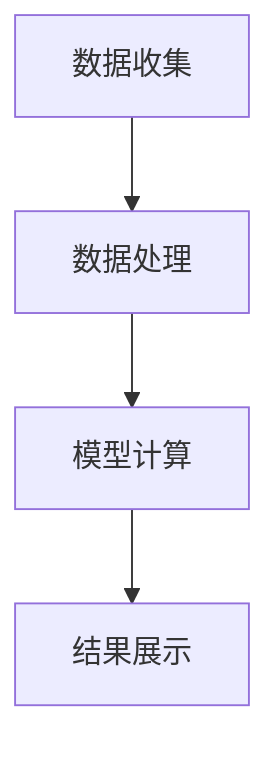

                 


# 《巴菲特的并购艺术：科技巨头垄断环境下的策略》

## 关键词：巴菲特、并购策略、科技巨头、垄断环境、投资哲学、价值评估、长期投资

## 摘要：  
本文深入分析了巴菲特的并购投资哲学及其在科技巨头垄断环境下的应用策略。通过探讨巴菲特的核心并购标准、经典案例以及应对垄断挑战的策略，结合科技行业的特点，为投资者和企业管理者提供了实用的并购策略和数学模型。文章还结合系统架构设计和算法实现，展示了如何在科技垄断环境下运用巴菲特的并购理念。

---

# 巴菲特的并购艺术：科技巨头垄断环境下的策略

## 引言

并购是企业战略发展的重要手段，而巴菲特的并购哲学以其独特性著称。在科技巨头垄断日益加剧的今天，巴菲特的投资策略仍然具有重要的现实意义。本文将从巴菲特的并购理念出发，结合科技行业的特点，探讨在垄断环境下如何运用并购策略实现长期价值。

---

## 第一章：巴菲特的并购理念与策略

### 1.1 巴菲特的并购标准

#### 1.1.1 安全边际
- **定义**：安全边际是指企业实际价值与其市场价格之间的差额。
- **公式**：$ \text{安全边际} = \text{内在价值} - \text{市场价格} $
- **案例分析**：以可口可乐为例，巴菲特在1985年投资可口可乐时，计算其内在价值远高于市场价格，从而确保了安全边际的存在。

#### 1.1.2 核心竞争优势
- **定义**：核心竞争优势是指企业在市场上独特的竞争力，如品牌、技术、成本优势等。
- **分析工具**：使用SWOT分析法评估企业的竞争优势。
- **案例分析**：以苹果公司为例，巴菲特通过投资苹果，看中其在技术与品牌上的竞争优势。

#### 1.1.3 财务健康状况
- **关键指标**：关注企业的净利润、现金流、资产负债率等。
- **公式**：$$ \text{净现金流} = \text{净利润} + \text{非现金支出} - \text{折旧} $$
- **案例分析**：以富国银行为例，巴菲特投资前分析了其稳健的财务状况。

#### 1.1.4 管理层质量
- **评估维度**：管理层的经验、诚信和决策能力。
- **案例分析**：巴菲特选择投资苹果公司，很大程度上得益于库克的优秀管理能力。

#### 1.1.5 长期投资视角
- **理念**：巴菲特强调长期持有优质资产，避免短期波动。
- **案例分析**：以亚马逊为例，巴菲特虽然未直接投资，但贝索斯的长期愿景值得学习。

### 1.2 巴菲特并购的经典案例

#### 1.2.1 可口可乐的并购策略
- **背景**：1985年，可口可乐因债务问题出售瓶装业务，巴菲特投资其股票。
- **分析**：通过DCF模型评估其内在价值，确保安全边际。
- **公式**：$$ \text{DCF} = \sum_{t=1}^{n} \frac{\text{现金流}}{(1+r)^t} + \text{残值} $$

#### 1.2.2 苹果公司的投资启示
- **背景**：2011年，巴菲特通过美国运通间接投资苹果。
- **分析**：苹果的高ROE和强大的品牌竞争力是巴菲特看中其的原因。

---

## 第二章：科技巨头的垄断与并购挑战

### 2.1 科技行业的垄断现状

#### 2.1.1 科技巨头的市场地位
- **公司分析**：谷歌、苹果、亚马逊、微软和Meta的市场占有率。
- **垄断影响**：高市场占有率可能导致创新停滞和消费者选择受限。

#### 2.1.2 并购对技术创新的影响
- **正面影响**：并购可以整合技术资源，加速创新。
- **负面影响**：垄断可能导致技术封锁和市场竞争减少。

### 2.2 巴菲特并购策略在科技行业的应用

#### 2.2.1 投资具有长期竞争优势的企业
- **策略**：寻找具有持续创新能力的企业。
- **案例分析**：以微软为例，其云服务Azure具有强大的竞争优势。

#### 2.2.2 避免短期波动，注重长期价值
- **策略**：在科技行业的并购中，避免被短期市场波动影响判断。
- **案例分析**：以亚马逊为例，其长期投资价值显著。

---

## 第三章：数学模型与算法实现

### 3.1 并购评估的数学模型

#### 3.1.1 DCF模型
- **公式**：$$ \text{DCF} = \sum_{t=1}^{n} \frac{\text{现金流}}{(1+r)^t} + \text{残值} $$
- **实现步骤**：收集企业未来现金流，计算贴现率，求和并加残值。

#### 3.1.2 内部收益率（IRR）
- **公式**：$$ \text{IRR} = r \text{ 使得 } \sum_{t=1}^{n} \frac{\text{现金流}}{(1+r)^t} = 0 $$
- **Python代码示例**：
  ```python
  import numpy as np
  cash_flows = [-100, 30, 30, 30]
  irr = np.irr(cash_flows)
  print(irr)
  ```

#### 3.1.3 净现值（NPV）
- **公式**：$$ \text{NPV} = \sum_{t=1}^{n} \frac{\text{现金流}}{(1+r)^t} $$
- **Python代码示例**：
  ```python
  def npv(r, cash_flows):
      return sum(c / (1 + r) ** t for t, c in enumerate(cash_flows))
  ```

---

## 第四章：系统架构与实现

### 4.1 系统架构设计

#### 4.1.1 系统功能模块
- **模块1**：数据收集模块。
- **模块2**：模型计算模块。
- **模块3**：结果展示模块。

#### 4.1.2 系统架构图


### 4.2 实际案例分析

#### 4.2.1 环境安装
- **工具**：Python、NumPy、Matplotlib。

#### 4.2.2 核心实现代码
```python
import numpy as np
import matplotlib.pyplot as plt

# 示例数据
companies = ['Apple', 'Google', 'Amazon', 'Microsoft']
market_share = [30, 25, 20, 15]

# 绘制柱状图
plt.figure(figsize=(10, 6))
plt.bar(companies, market_share)
plt.title('Market Share of Tech Giants')
plt.xlabel('Companies')
plt.ylabel('Market Share (%)')
plt.show()
```

---

## 结论

在科技巨头垄断加剧的背景下，巴菲特的并购策略依然具有重要的指导意义。通过安全边际、竞争优势和长期投资视角，投资者可以在复杂的市场环境中找到优质标的。本文通过数学模型和系统架构设计，展示了如何将巴菲特的并购理念与科技行业的特点相结合，为投资者提供了实用的策略和工具。

---

## 作者：AI天才研究院 & 禅与计算机程序设计艺术

---

**参考文献**  
1. 《巴菲特的投资思想》  
2. 《科技巨头的垄断与反垄断》  
3. 《企业并购的数学模型与算法》  

---

