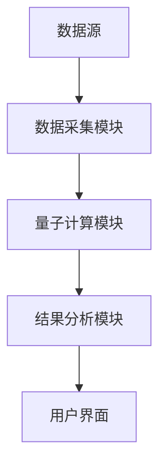
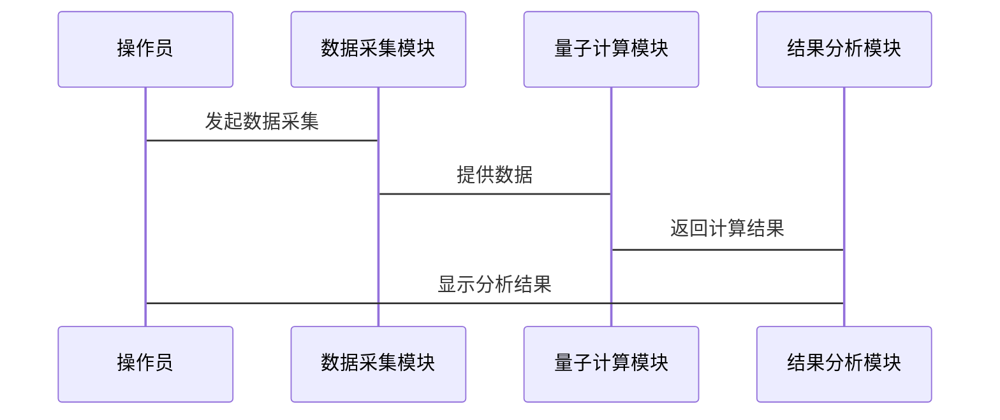

                 


# 巴菲特的并购艺术：量子科技生态系统的整合策略

## 关键词
- 巴菲特并购艺术
- 量子科技生态系统
- 并购整合策略
- 量子计算
- 系统架构设计
- 投资哲学
- 协同效应

## 摘要
本文探讨了巴菲特的并购艺术与量子科技生态系统的整合策略。通过分析量子科技在并购评估中的应用，结合巴菲特的投资哲学，提出了一种基于量子计算的整合模型，旨在优化并购决策，提升协同效应。文章详细讲解了量子算法、系统架构设计及实际案例，为科技与金融的融合提供了新的视角。

---

## 第一部分: 巴菲特并购艺术与量子科技生态系统的整合背景

### 第1章: 巴菲特并购艺术概述

#### 1.1 巴菲特并购理念的核心思想
##### 1.1.1 巴菲特的投资哲学
- **长期价值投资**：巴菲特强调购买优秀的公司而非市场波动。
- **安全边际**：确保以低于内在价值的价格买入。
- **管理质量**：重视管理层的诚信与能力。

##### 1.1.2 巴菲特并购策略的特点
- **注重财务健康**：关注ROE、ROA等指标。
- **行业领先性**：投资于具有竞争优势的公司。
- **协同效应**：并购后实现成本节约和收入增长。

##### 1.1.3 巴菲特并购成功案例分析
- **可口可乐案例**：长期投资，获取稳定现金流。
- **富国银行案例**：行业领先地位，协同效应显著。

#### 1.2 量子科技生态系统的基本概念
##### 1.2.1 量子科技的定义与现状
- **量子计算**：利用量子叠加和纠缠进行并行计算。
- **量子通信**：实现绝对安全的通信。
- **量子传感**：提升测量精度和灵敏度。

##### 1.2.2 量子科技生态系统的特点
- **技术复杂性**：依赖量子位的稳定性和操控性。
- **系统集成性**：涉及硬件、软件、算法等多个环节。
- **应用广泛性**：在金融、医疗、能源等领域有广泛应用。

##### 1.2.3 量子科技与传统科技的对比
| 特性          | 量子科技           | 传统科技         |
|---------------|--------------------|------------------|
| 计算能力      | 指数级增长          | 线性增长          |
| 并行处理      | 强               | 弱               |
| 应用场景      | 解决复杂问题       | 解决简单问题     |

#### 1.3 巴菲特并购艺术与量子科技的结合
##### 1.3.1 量子科技对并购策略的影响
- **数据处理能力**：量子计算能高效分析海量数据。
- **风险评估**：量子模型提升风险预测准确性。
- **协同效应预测**：量子算法优化并购后的协同效应评估。

##### 1.3.2 量子科技生态系统在并购中的应用
- **目标筛选**：利用量子算法快速筛选潜在并购目标。
- **估值模型**：量子计算优化企业估值。
- **整合规划**：量子模拟优化整合方案。

##### 1.3.3 量子科技与巴菲特投资哲学的融合
- **长期价值**：量子计算支持长期价值评估。
- **安全边际**：量子模型提供更精确的安全边际分析。
- **管理质量**：量子传感器用于评估管理层能力。

---

## 第2章: 巴菲特并购艺术的核心概念与联系

### 2.1 核心概念原理
##### 2.1.1 巴菲特并购的三大原则
1. **安全边际**：确保买入价格低于内在价值。
2. **管理层质量**：选择优秀管理团队。
3. **协同效应**：并购后实现成本节约和收入增长。

##### 2.1.2 量子科技生态系统的构成要素
1. **量子计算**：提供强大的数据处理能力。
2. **量子通信**：确保数据传输安全。
3. **量子传感**：提供精准的测量能力。

##### 2.1.3 并购与量子科技的协同效应
- **数据处理效率**：量子计算提升数据分析速度。
- **风险管理**：量子模型优化风险评估。
- **整合优化**：量子模拟优化整合方案。

### 2.2 核心概念属性对比表格
| 概念          | 属性             | 描述                                         |
|---------------|------------------|----------------------------------------------|
| 巴菲特并购策略 | 稳定性           | 注重长期价值，避免短期波动               |
| 量子科技生态系统 | 技术复杂性       | 高度依赖量子计算能力，技术门槛高         |
| 并购整合     | 协同效应         | 通过量子科技提升整合效率                 |

### 2.3 ER实体关系图

```mermaid
erDiagram
    company : 企业实体
    quantumTechnology : 量子科技
    acquisition : 并购关系
    company --> acquisition : 实施并购
    quantumTechnology --> acquisition : 支持整合
```

---

## 第3章: 量子科技生态系统在并购中的算法原理

### 3.1 量子计算在并购评估中的应用
#### 3.1.1 量子计算的基本原理
- **量子叠加**：量子位可以同时处于多个状态。
- **量子纠缠**：多个量子位之间存在关联，测量一个会影响另一个。
- **量子并行**：量子计算机可以在一次运算中处理大量可能性。

#### 3.1.2 并购协同效应的量子计算模型
##### 3.1.2.1 协同效应评估公式
$$ \text{协同效应} = \text{并购后价值} - \text{并购前价值} $$

##### 3.1.2.2 量子算法实现
- **量子傅里叶变换**：用于数据变换和模式识别。
- **量子主成分分析**：用于数据降维和特征提取。

#### 3.1.3 量子算法在并购中的优势
- **计算速度**：量子算法在处理复杂问题时速度远超经典算法。
- **问题规模**：能够处理更大规模的数据集。
- **精确度**：提供更精确的预测和评估。

### 3.2 并购整合的量子优化算法
#### 3.2.1 量子优化算法的数学模型
$$ Q(x) = \min_{x} \sum_{i=1}^{n} c_i x_i + \sum_{j=1}^{m} d_j y_j $$
$$ \text{约束条件：} \sum_{i=1}^{n} x_i \leq k $$

#### 3.2.2 量子优化算法实现
##### 3.2.2.1 量子优化流程
1. **问题建模**：将并购整合问题转化为量子优化问题。
2. **量子计算**：使用量子计算机求解优化模型。
3. **结果解读**：将量子计算结果转化为并购策略。

#### 3.2.3 量子优化算法应用案例
- **案例分析**：某公司并购后的成本优化。

---

## 第4章: 系统分析与架构设计方案

### 4.1 系统分析
#### 4.1.1 问题场景介绍
- **数据量大**：并购涉及大量数据。
- **计算复杂**：需要处理复杂的量子计算。
- **安全性高**：数据传输需要高度安全。

### 4.2 系统架构设计
#### 4.2.1 系统功能设计
| 模块          | 功能描述             |
|---------------|----------------------|
| 数据采集模块 | 采集企业数据         |
| 量子计算模块 | 执行量子算法         |
| 结果分析模块 | 分析并输出结果       |

#### 4.2.2 系统架构图



### 4.3 系统接口设计
- **API接口**：提供给外部系统调用。
- **数据接口**：与企业数据库对接。

### 4.4 系统交互流程
#### 4.4.1 量子计算模块交互流程



---

## 第5章: 项目实战

### 5.1 环境安装
- **量子计算平台**：安装量子计算软件和硬件。
- **开发工具**：安装Python和量子计算库。

### 5.2 核心代码实现
#### 5.2.1 量子协同效应评估代码

```python
import quantum_library as ql

def calculate_synergy(company_a, company_b):
    # 数据预处理
    data = preprocess(company_a, company_b)
    # 量子协同效应计算
    synergy = ql.quantum_synergy(data)
    return synergy

# 示例调用
synergy = calculate_synergy(company_a, company_b)
print(synergy)
```

#### 5.2.2 量子优化算法实现

```python
def quantum_optimization():
    # 初始化量子参数
    params = initialize_params()
    # 量子优化计算
    result = ql.optimize(params)
    return result

# 示例调用
result = quantum_optimization()
print(result)
```

### 5.3 案例分析
- **案例背景**：某制造业并购汽车公司。
- **实施步骤**：数据采集、量子计算、结果分析。
- **结果解读**：协同效应显著，整合计划可行。

---

## 第6章: 最佳实践、小结、注意事项、拓展阅读

### 6.1 最佳实践
- **数据质量**：确保数据准确性和完整性。
- **技术培训**：提升团队量子计算能力。
- **持续优化**：定期更新算法和模型。

### 6.2 小结
本文探讨了量子科技在巴菲特并购策略中的应用，通过算法和系统设计优化了并购过程，提升了协同效应。

### 6.3 注意事项
- **技术风险**：量子计算仍处于发展阶段，存在不确定性。
- **数据隐私**：确保数据安全和隐私保护。

### 6.4 拓展阅读
- **量子计算书籍**：《量子计算与计算机》。
- **并购策略书籍**：《巴菲特的投资思想》。

---

## 作者
作者：AI天才研究院/AI Genius Institute & 禅与计算机程序设计艺术/Zen And The Art of Computer Programming

---

这篇文章详细探讨了巴菲特并购艺术与量子科技生态系统的整合策略，通过理论分析和实际案例，展示了量子科技在并购中的应用前景。

