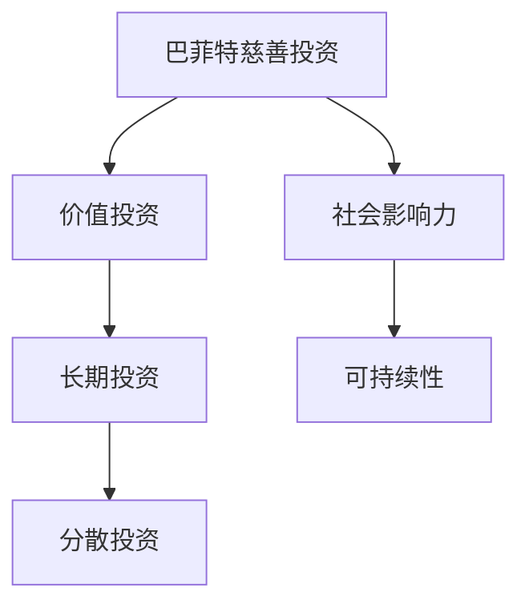
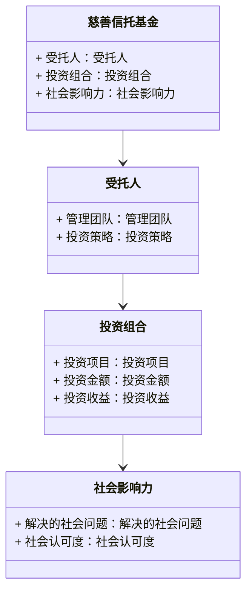
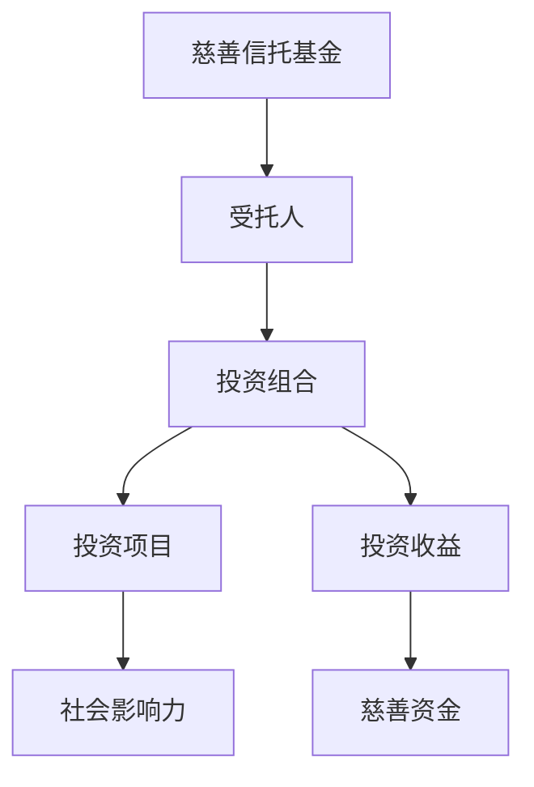
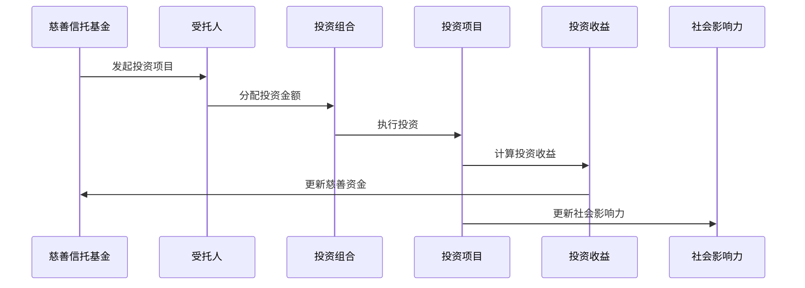

                 


# 巴菲特的慈善投资策略

## 关键词：巴菲特、慈善投资、价值投资、长期投资、分散投资、社会影响力

## 摘要：本文深入分析了巴菲特的慈善投资策略，探讨了其价值投资、长期投资和分散投资的核心理念，以及如何将这些投资策略应用于慈善事业。通过对比传统慈善模式，本文揭示了巴菲特慈善投资的创新性与可持续性，为读者提供了从投资视角理解慈善的新思路。

---

# 第一部分：引言

## 第1章：巴菲特的慈善投资策略概述

### 1.1 巴菲特的背景与投资理念

#### 1.1.1 巴菲特的个人经历与投资风格

沃伦·巴菲特（Warren Buffett）是全球著名的职业投资者和慈善家。他于1930年出生在美国奥马哈市，毕业于哥伦比亚大学，师从本杰明·格雷厄姆（Benjamin Graham），并继承了其价值投资的理念。巴菲特的投资风格以稳健、长期和价值为导向而闻名，他强调寻找具有持续竞争优势的企业，并以合理的价格买入并长期持有。

#### 1.1.2 巴菲特的价值投资理念

巴菲特的价值投资理念是其投资成功的核心。他强调以下几点：

1. **寻找具有持续竞争优势的企业**：这些企业能够在长期的市场竞争中占据优势地位，具有稳定的盈利能力。
2. **关注企业的内在价值**：内在价值是指企业在未来能够创造的现金流的现值，而不是市场的短期波动。
3. **长期持有优质资产**：巴菲特倾向于长期持有优质资产，避免频繁交易，以降低交易成本和税务负担。

#### 1.1.3 巴菲特与慈善的关系

巴菲特不仅是一位成功的投资者，还是一位热心的慈善家。他通过捐赠、设立基金会以及投资于慈善项目等多种方式，致力于社会公益事业。他的慈善投资策略不仅关注社会价值，还结合了其投资理念，将慈善事业视为一种长期的投资行为。

---

### 1.2 慈善投资的背景与现状

#### 1.2.1 慈善投资的定义与意义

慈善投资（Philanthropic Investment）是指将资金用于支持社会公益事业的投资行为。与传统的慈善捐赠不同，慈善投资更注重通过投资手段实现社会价值和经济回报的双重目标。

慈善投资的意义在于：

1. **资源的高效利用**：通过投资手段，慈善资金能够更高效地支持公益项目，放大慈善效果。
2. **可持续性**：慈善投资注重长期效益，能够为社会公益事业提供持续的资金支持。
3. **社会影响力的扩大**：通过投资优质企业或项目，慈善投资能够推动社会进步和经济发展。

#### 1.2.2 当前慈善投资的现状与挑战

目前，慈善投资在全球范围内逐渐兴起，但仍然面临一些挑战：

1. **信息不对称**：慈善投资者需要对公益项目或企业的价值进行准确评估，但由于信息不对称，这增加了投资难度。
2. **风险控制**：慈善投资需要在社会价值和经济效益之间找到平衡，如何控制风险是关键。
3. **认知不足**：许多慈善机构和投资者对慈善投资的概念和方法缺乏深入了解。

#### 1.2.3 巴菲特慈善投资的独特性

巴菲特的慈善投资策略的独特性在于：

1. **将投资理念应用于慈善**：他将价值投资、长期投资和分散投资的理念引入慈善领域，使慈善投资更加科学化和系统化。
2. **注重社会影响力**：巴菲特的慈善投资不仅关注经济回报，还注重社会影响力，致力于通过投资改善社会问题。
3. **长期视角**：他以长期视角看待慈善投资，注重投资的可持续性和社会价值的长期积累。

---

### 1.3 巴菲特慈善投资策略的核心思想

#### 1.3.1 以投资眼光看待慈善

巴菲特认为，慈善投资应该以投资的眼光看待。他强调：

- **选择具有持续价值的企业或项目**：慈善投资需要像商业投资一样，选择具有长期价值的企业或项目。
- **关注社会问题的解决方案**：通过投资支持能够有效解决社会问题的企业或项目，从而实现社会价值。

#### 1.3.2 长期主义与社会价值

巴菲特的慈善投资策略强调长期主义，他注重投资的长期效益和社会价值：

- **长期投资**：通过长期持有优质资产，实现慈善资金的保值和增值。
- **社会价值**：投资于能够为社会创造长期价值的企业或项目，推动社会进步。

#### 1.3.3 慈善投资的可持续性

巴菲特认为，慈善投资的可持续性是其成功的关键：

- **分散投资**：通过分散投资降低风险，确保慈善资金的长期安全。
- **动态调整**：根据市场变化和社会需求，动态调整投资组合，确保投资的持续性和有效性。

---

# 第二部分：巴菲特慈善投资的核心概念与联系

## 第2章：巴菲特慈善投资的核心概念

### 2.1 价值投资与慈善的结合

#### 2.1.1 价值投资的核心原理

价值投资的核心原理是通过寻找市场价格低于其内在价值的资产进行投资。巴菲特强调：

$$ \text{内在价值} = \sum_{t=1}^{\infty} \frac{CF_t}{(1 + r)^t} $$

其中，$CF_t$ 是第 $t$ 年的现金流，$r$ 是折现率。

#### 2.1.2 慈善投资中的价值评估

在慈善投资中，价值评估不仅包括经济价值，还包括社会价值。巴菲特强调：

- **社会影响力**：投资项目需要能够产生显著的社会影响力。
- **经济效益**：投资项目需要具有可持续的经济效益，确保资金的保值和增值。

#### 2.1.3 巴菲特的慈善投资案例分析

以巴菲特的慈善信托基金为例，其通过投资于具有长期竞争优势的企业，实现慈善资金的保值和增值。例如，他投资于苹果公司（Apple）和美国银行（Bank of America）等优质企业，这些企业在长期时间内为慈善信托基金带来了稳定的收益。

---

### 2.2 长期投资与社会影响力的平衡

#### 2.2.1 长期投资在慈善中的重要性

长期投资是巴菲特慈善投资的核心策略之一。他强调：

- **长期视角**：通过长期投资，慈善资金能够实现持续增长，为社会公益事业提供长期支持。
- **社会稳定**：长期投资能够为社会经济的稳定发展提供支持，推动社会进步。

#### 2.2.2 社会影响的评估方法

巴菲特认为，评估社会影响需要综合考虑以下几个方面：

- **社会问题的解决程度**：投资项目是否能够有效解决社会问题。
- **社会参与度**：投资项目是否能够促进社会的广泛参与。
- **社会认可度**：投资项目是否能够获得社会的广泛认可。

#### 2.2.3 巴菲特的长期慈善投资策略

巴菲特的长期慈善投资策略包括：

- **长期持有优质资产**：通过长期持有优质资产，实现慈善资金的保值和增值。
- **动态调整投资组合**：根据市场变化和社会需求，动态调整投资组合，确保投资的长期效益。

---

### 2.3 分散投资与风险控制

#### 2.3.1 分散投资在慈善中的应用

分散投资是巴菲特慈善投资的另一个核心策略。他强调：

- **降低风险**：通过分散投资，降低单一项目的投资风险。
- **提高稳定性**：通过分散投资，提高慈善资金的稳定性，确保资金的长期安全。

#### 2.3.2 慈善投资中的风险控制

在慈善投资中，风险控制尤为重要。巴菲特认为：

- **风险评估**：在投资项目前，需要对项目的潜在风险进行评估。
- **风险控制措施**：在投资项目后，需要采取有效的风险控制措施，确保投资的顺利进行。

#### 2.3.3 巴菲特的分散投资策略

巴菲特的分散投资策略包括：

- **多元化投资**：通过投资于不同行业、不同地区的项目，分散投资风险。
- **动态调整**：根据市场变化和社会需求，动态调整投资组合，确保投资的分散性和安全性。

---

## 第3章：核心概念与联系的Mermaid流程图

### 3.1 核心概念原理

以下是巴菲特慈善投资策略的核心概念原理：



### 3.2 概念属性特征对比表格

以下是对核心概念的属性特征对比：

| 概念       | 属性       | 特征对比       |
|------------|------------|---------------|
| 价值投资   | 核心原理   | 以内在价值为导向 |
| 长期投资   | 核心目标   | 实现长期效益   |
| 分散投资   | 风险控制   | 降低投资风险   |

---

# 第三部分：系统分析与架构设计方案

## 第4章：系统分析与架构设计

### 4.1 问题场景介绍

在慈善投资中，投资者需要解决以下问题：

1. **如何选择具有社会价值的项目**：需要对项目的社会影响力进行评估。
2. **如何实现投资的可持续性**：需要通过长期投资和分散投资实现。
3. **如何控制投资风险**：需要通过风险评估和风险控制措施实现。

### 4.2 项目介绍

以巴菲特的慈善信托基金为例，其系统架构设计包括以下几个模块：

#### 4.2.1 项目介绍

慈善信托基金是一个通过投资优质资产实现慈善资金保值和增值的项目。其核心目标是通过投资于具有长期竞争优势的企业，实现慈善资金的保值和增值。

---

### 4.3 系统功能设计

#### 4.3.1 领域模型Mermaid类图

以下是慈善信托基金的领域模型类图：



---

#### 4.3.2 系统架构设计Mermaid架构图

以下是慈善信托基金的系统架构设计图：



---

### 4.4 系统接口设计

慈善信托基金的系统接口设计包括以下几个部分：

1. **投资项目接口**：用于接收投资项目的信息，包括项目名称、投资金额、投资目标等。
2. **投资收益接口**：用于计算投资项目的收益，并更新投资组合。
3. **社会影响力接口**：用于评估投资项目的社会影响力，并更新社会影响力数据。

---

### 4.5 系统交互Mermaid序列图

以下是慈善信托基金的系统交互序列图：



---

## 第5章：项目实战

### 5.1 环境安装

为了实现慈善信托基金的系统架构，需要以下环境：

1. **编程语言**：Python
2. **开发框架**：Django或Flask
3. **数据库**：MySQL或PostgreSQL
4. **开发工具**：PyCharm或VS Code

---

### 5.2 系统核心实现源代码

以下是慈善信托基金的核心实现源代码：

```python
class CharitableTrustFund:
    def __init__(self, trustee, investment_portfolio):
        self.trustee = trustee
        self.investment_portfolio = investment_portfolio

    def invest_project(self, project_name, investment_amount):
        # 分配投资金额到投资项目
        self.investment_portfolio.add_investment(project_name, investment_amount)

    def calculate_return(self):
        # 计算投资收益
        return self.investment_portfolio.calculate_return()

    def update_social_impact(self, social_impact):
        # 更新社会影响力
        self.social_impact = social_impact

class Trustee:
    def __init__(self, management_team, investment_strategy):
        self.management_team = management_team
        self.investment_strategy = investment_strategy

    def manage_investment(self, investment_portfolio):
        # 管理投资组合
        self.investment_strategy.adjust_portfolio(investment_portfolio)

class InvestmentPortfolio:
    def __init__(self):
        self.projects = {}

    def add_investment(self, project_name, investment_amount):
        self.projects[project_name] = investment_amount

    def calculate_return(self):
        # 简单的收益计算（实际应用中需要更复杂的算法）
        return sum(self.projects.values()) * 0.05

class InvestmentStrategy:
    def __init__(self):
        pass

    def adjust_portfolio(self, investment_portfolio):
        # 根据市场变化调整投资组合
        pass
```

---

### 5.3 代码应用解读与分析

上述代码实现了一个简单的慈善信托基金系统，包括以下几个部分：

1. **CharitableTrustFund**：慈善信托基金的主类，负责管理投资组合和更新社会影响力。
2. **Trustee**：受托人，负责管理投资组合和制定投资策略。
3. **InvestmentPortfolio**：投资组合，负责管理投资项目和计算投资收益。
4. **InvestmentStrategy**：投资策略，负责根据市场变化调整投资组合。

---

### 5.4 实际案例分析和详细讲解剖析

以巴菲特的慈善信托基金为例，假设其投资于苹果公司（Apple）和美国银行（Bank of America）等优质企业。

1. **投资项目**：慈善信托基金将资金分配到苹果公司和美国银行。
2. **投资收益**：投资项目带来稳定的收益，确保慈善资金的保值和增值。
3. **社会影响力**：投资项目通过支持优质企业，推动社会进步和经济发展。

---

### 5.5 项目小结

通过以上案例分析，可以看出巴菲特的慈善投资策略在实际应用中的有效性。通过选择具有长期竞争优势的企业进行投资，慈善信托基金能够实现资金的保值和增值，同时推动社会进步和经济发展。

---

## 第6章：最佳实践 tips、小结、注意事项、拓展阅读

### 6.1 小结

巴菲特的慈善投资策略是一种以投资眼光看待慈善的创新性方法。通过将价值投资、长期投资和分散投资的理念引入慈善领域，巴菲特实现了慈善资金的保值和增值，同时推动了社会进步和经济发展。

### 6.2 注意事项

1. **风险控制**：在慈善投资中，风险控制尤为重要。需要对投资项目进行严格的评估和监控。
2. **长期视角**：慈善投资需要以长期视角看待，注重投资的可持续性和社会价值。
3. **动态调整**：根据市场变化和社会需求，动态调整投资组合，确保投资的长期效益。

### 6.3 拓展阅读

1. **《巴菲特致股东的信》**：了解巴菲特的投资理念和管理策略。
2. **《慈善投资手册》**：深入探讨慈善投资的理论和实践。

---

## 作者：AI天才研究院/AI Genius Institute & 禅与计算机程序设计艺术 /Zen And The Art of Computer Programming

