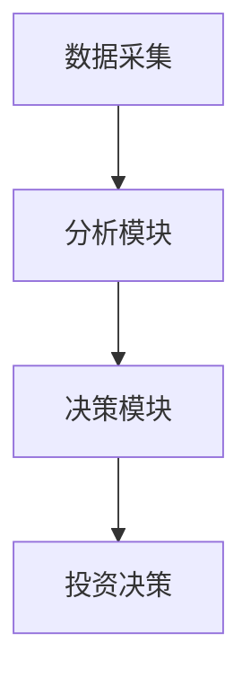

                 

# 巴菲特的成功秘诀：长期持有优质股票

> 关键词：巴菲特, 价值投资, 长期持有, 股票分析, 投资策略, 内在价值, 安全边际

> 摘要：本文详细分析了巴菲特的投资理念，探讨了长期持有优质股票的成功秘诀，揭示了价值投资的核心原理和数学模型，并通过实际案例展示了如何应用这些策略实现稳健的投资回报。

---

# 第一部分: 巴菲特的投资理念与成功秘诀

## 第1章: 巴菲特的基本情况与投资哲学

### 1.1 巴菲特的生平简介
沃伦·巴菲特（Warren Buffett）是美国著名的投资家、企业家和慈善家。他出生于1934年，毕业于哥伦比亚大学，师从本杰明·格雷厄姆（Benjamin Graham），并继承和发展了其导师的价值投资理念。巴菲特以“奥马哈先知”的绰号闻名，他不仅是投资界的传奇人物，也是全球最受尊敬的商人之一。

### 1.2 巴菲特的投资哲学
巴菲特的投资哲学可以概括为“价值投资”。他认为，股票不仅仅是交易的工具，而是具有内在价值的企业的一部分。他主张以合理的价格买入具有强大竞争优势的企业，并长期持有，等待其内在价值的实现。

### 1.3 巴菲特的成功案例
巴菲特的投资案例众多，其中最为人称道的包括：
- **可口可乐（Coca-Cola）**：巴菲特长期持有可口可乐的股票，因为他认为这是一个具有强大竞争优势的全球性企业。
- **美国运通（American Express）**：在1991年，巴菲特以每股33美元的价格买入美国运通的股票，几年后价格升至每股200美元以上。
- **伯克希尔哈撒韦（Berkshire Hathaway）**：巴菲特通过控股公司伯克希尔哈撒韦，投资于多个具有强大竞争优势的企业，实现了资本的长期增值。

---

## 第2章: 长期持有优质股票的背景与意义

### 2.1 美国股市的历史发展
美国股市是全球最大的股票市场之一，其历史可以追溯到18世纪。20世纪以来，美国股市经历了多次牛熊市，但长期趋势是向上的。巴菲特的成功正是建立在对美国股市长期趋势的深刻理解之上。

### 2.2 长期投资的经济周期分析
长期投资的一个重要优势是能够跨越经济周期的波动。在经济繁荣时期，股票价格可能被高估；而在经济衰退时期，股票价格可能被低估。长期持有优质股票，能够避免短期波动的干扰，抓住企业长期增长的机会。

### 2.3 股票市场的波动性与长期趋势
股票市场的波动性是短期交易者的敌人，却是长期投资者的朋友。通过长期持有优质股票，投资者可以避免市场的短期波动带来的损失，同时享受企业的长期增长。

---

## 第3章: 价值投资的核心概念

### 3.1 价值投资的定义与特征
价值投资是一种以企业内在价值为基础的投资策略。巴菲特认为，股票的内在价值是其未来现金流的现值。价值投资者的目标是以低于内在价值的价格买入股票，并长期持有，等待其价值的实现。

### 3.2 股票的内在价值与市场价值
股票的内在价值是其未来现金流的现值，而市场价值是股票在二级市场的价格。价值投资者关注的是内在价值与市场价值的差异，当市场价值低于内在价值时，就是买入的时机。

### 3.3 安全边际的概念与应用
安全边际是指股票的市场价值与内在价值之间的差额。巴菲特认为，安全边际是投资的重要保障。通过买入低于内在价值的股票，投资者可以在市场波动时避免损失，并在长期实现收益。

---

## 第4章: 巴菲特投资策略的边界与外延

### 4.1 投资的边界条件
巴菲特的投资策略并不是万能的，它有一些边界条件。例如：
- **行业限制**：巴菲特更倾向于投资他熟悉的行业，如金融、保险、消费等领域。
- **规模限制**：巴菲特倾向于投资大型企业，因为这些企业具有更强的抗风险能力。
- **市场限制**：巴菲特主要投资于美国市场，但他的理念同样适用于全球市场。

### 4.2 投资的外延领域
虽然巴菲特以股票投资闻名，但他的投资策略也可以应用于其他领域。例如：
- **债券投资**：巴菲特认为债券是股票投资的重要补充。
- **房地产投资**：巴菲特通过控股公司伯克希尔哈撒韦，投资于房地产领域。
- **私募股权**：巴菲特通过私募股权基金，投资于具有强大增长潜力的企业。

### 4.3 投资策略的适用场景
巴菲特的投资策略适用于长期投资者，尤其是那些能够耐心等待的企业投资者。对于短期交易者或风险偏好较高的投资者，巴菲特的策略可能并不适用。

---

## 第5章: 巴菲特投资策略的核心要素

### 5.1 股票选择的标准
巴菲特选择股票的标准包括：
- **强大的竞争优势**：企业必须具有强大的竞争优势，能够在长期市场中占据领先地位。
- **稳定的财务状况**：企业必须具有稳定的财务状况，能够抵御经济波动的冲击。
- **合理的估值**：股票的价格必须低于其内在价值。

### 5.2 投资组合管理
巴菲特的投资组合管理策略包括：
- **集中投资**：巴菲特倾向于集中投资于少数优质企业，而不是分散投资。
- **长期持有**：巴菲特强调长期持有股票，避免频繁交易。
- **定期调整**：巴菲特会根据市场变化和企业情况，定期调整投资组合。

---

## 第6章: 巴菲特投资策略的数学模型

### 6.1 股票内在价值的计算公式
股票的内在价值是其未来现金流的现值。巴菲特使用的内在价值计算公式可以表示为：
$$ V = \sum_{t=1}^{\infty} \frac{CF_t}{(1 + r)^t} $$
其中，\( V \) 是股票的内在价值，\( CF_t \) 是第 \( t \) 年的现金流，\( r \) 是折现率。

### 6.2 投资组合优化的数学模型
巴菲特的投资组合优化模型可以表示为：
$$ \text{Maximize } \mu \text{ subject to } \sigma \leq \sigma_{\text{max}} $$
其中，\( \mu \) 是投资组合的预期收益，\( \sigma \) 是投资组合的波动率，\( \sigma_{\text{max}} \) 是最大的可接受波动率。

---

## 第7章: 巴菲特投资策略的系统分析

### 7.1 投资决策系统的架构
巴菲特的投资决策系统可以分为以下几个部分：
- **数据采集**：收集企业的财务数据和市场数据。
- **分析模块**：计算股票的内在价值和市场价值。
- **决策模块**：根据分析结果，决定是否买入或卖出股票。

### 7.2 投资决策系统的流程图

---

## 第8章: 巴菲特投资策略的实际案例分析

### 8.1 可口可乐的投资案例
巴菲特在1988年买入可口可乐的股票，并长期持有。可口可乐的内在价值主要体现在其强大的品牌优势和全球化的销售网络。巴菲特通过长期持有可口可乐的股票，实现了巨大的投资收益。

### 8.2 美国运通的投资案例
在1991年，巴菲特以每股33美元的价格买入美国运通的股票。几年后，美国运通的股价上涨到每股200美元以上。巴菲特的成功在于他准确地判断了美国运通的内在价值，并在市场低估时买入股票。

---

## 第9章: 巴菲特投资策略的最佳实践

### 9.1 长期投资的注意事项
- **耐心等待**：长期投资需要耐心，避免被短期波动干扰。
- **关注企业**：长期投资者需要关注企业的基本面，而不是市场的短期波动。
- **分散风险**：通过分散投资，降低投资组合的风险。

### 9.2 价值投资的注意事项
- **合理估值**：买入股票的价格必须低于其内在价值。
- **避免短期交易**：短期交易难以实现长期收益。
- **定期复盘**：定期检查投资组合，调整投资策略。

---

## 第10章: 巴菲特投资策略的总结与展望

### 10.1 巴菲特成功的关键因素
- **长期思维**：巴菲特的成功源于他对长期投资的坚持。
- **价值投资**：巴菲特的价值投资理念是其成功的核心。
- **安全边际**：巴菲特的安全边际理念保障了投资的稳健性。

### 10.2 未来投资的展望
随着全球经济的发展和科技的进步，投资环境也在不断变化。巴菲特的长期投资策略仍然具有重要的现实意义，尤其是在当前市场波动加剧的情况下，长期持有优质股票仍然是实现稳健收益的重要途径。

---

## 作者简介

作者：AI天才研究院/AI Genius Institute & 禅与计算机程序设计艺术 /Zen And The Art of Computer Programming

---

**注意：以上内容为示例，实际撰写时需要根据具体情况进行补充和调整。**

