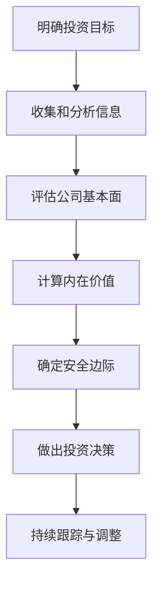

                 

# 巴菲特的投资哲学：简单但不容易

> **关键词**：巴菲特、投资哲学、价值投资、长期投资、安全边际  
> **摘要**：本文深入探讨了巴菲特的投资哲学，分析了其核心理念、价值投资的定义与方法、投资心态与决策框架，以及风险管理与投资组合管理。通过经典案例分析和系统性分析，揭示了巴菲特投资哲学的简单性与实践难度。

---

## 引言

巴菲特的投资哲学以简单著称，但实践起来却并非易事。本文将从价值投资的核心理念出发，逐步分析巴菲特的投资方法、心态、风险管理策略，并结合实际案例，探讨其投资哲学的系统性架构。

---

## 第一部分：巴菲特投资哲学的背景与基础

### 第1章：巴菲特投资哲学概述

#### 1.1 巴菲特的生平与投资理念

- **1.1.1 巴菲特的早期经历与投资启蒙**
  - 巴菲特在青少年时期就开始接触投资，阅读格雷厄姆的《证券分析》。
  - 早期的投资经历让他明白：投资的本质是寻找企业的内在价值。

- **1.1.2 巴菲特的价值投资理念核心**
  - 价值投资的核心：以合理的价格买入优秀的公司。
  - 巴菲特的理念：长期持有优质股票，获得复利增长。

- **1.1.3 巴菲特投资哲学的演变与影响**
  - 从格雷厄姆的“烟屁股”投资到芒格的影响：巴菲特的投资理念不断完善。
  - 巴菲特哲学的影响：全球投资者的价值投资热潮。

### 第2章：价值投资的定义与核心要素

#### 2.1 价值投资的基本概念

- **2.1.1 价值投资的定义**
  - 价值投资：以低于内在价值的价格买入优质股票，长期持有。
  - 价值投资与成长投资的区别：价值投资注重安全边际，成长投资注重未来增长潜力。

- **2.1.2 价值投资的核心要素对比表**

| 核心要素       | 价值投资                | 成长投资                |
|----------------|-------------------------|-------------------------|
| 投资目标       | 寻找被市场低估的公司     | 寻找未来高增长的公司     |
| 投资策略       | 买入并长期持有           | 买入并耐心等待增长      |
| 风险控制       | 依赖安全边际             | 依赖成长空间             |

- **2.1.3 价值投资与其它投资策略的对比分析**
  - 技术分析：价值投资不关注短期价格波动，而关注长期价值。
  - 预测市场走势：价值投资者认为市场不可预测，应关注企业本身。

#### 2.2 内在价值与安全边际

- **2.2.1 内在价值的计算方法**
  - 内在价值公式：$$内在价值 = \text{未来现金流的现值}$$
  - 具体计算步骤：预测未来现金流，贴现回当前价值。

- **2.2.2 安全边际的概念与作用**
  - 安全边际 = 内在价值 - 市场价格。
  - 安全边际的重要性：确保在市场波动中不被套牢。

- **2.2.3 内在价值与市场价的动态关系**
  - 市场价格围绕内在价值波动。
  - 投资者应耐心等待价格回归内在价值。

### 第3章：巴菲特投资哲学的核心理念

#### 3.1 长期投资与复利效应

- **3.1.1 长期投资的重要性**
  - 长期投资的优势：复利效应最大化收益。
  - 短期投资的风险：频繁交易增加成本。

- **3.1.2 复利效应的数学模型**
  - 复利计算公式：$$A = P(1 + r)^t$$
  - 案例分析：长期投资的复利效应如何带来指数增长。

- **3.1.3 复利效应的实际案例分析**
  - 巴菲特的例子：长期持有优质股票，复利效应显著。

#### 3.2 安全边际与风险控制

- **3.2.1 安全边际的计算方法**
  - 计算公式：$$安全边际 = 内在价值 - 市场价格$$
  - 案例分析：如何通过安全边际选择投资标的。

- **3.2.2 风险控制的策略**
  - 分散投资：降低单一投资的风险。
  - 优质公司：选择具有竞争优势的企业。

- **3.2.3 风险与收益的平衡点**
  - 风险与收益的权衡：寻找安全边际与收益的最佳结合点。

### 第4章：巴菲特的投资心态与决策框架

#### 4.1 投资心态的塑造

- **4.1.1 谨慎与耐心的重要性**
  - 谨慎：避免盲目跟风，注重基本面分析。
  - 耐心：长期持有优质股票，不因短期波动而改变策略。

- **4.1.2 避免情绪化决策的方法**
  - 分析驱动：基于数据和逻辑，而非情绪。
  - 逆向思考：市场恐慌时买入，市场狂热时卖出。

- **4.1.3 知识积累与能力提升**
  - 持续学习：阅读经典投资书籍，研究优秀企业。
  - 实践总结：通过实际操作积累经验。

#### 4.2 决策框架的构建

- **4.2.1 信息收集与分析**
  - 信息来源：公司财报、行业报告、新闻资讯。
  - 分析方法：财务指标分析、竞争优势评估。

- **4.2.2 投资决策的流程图**

- **4.2.3 决策执行与反馈机制**
  - 决策执行：根据决策框架买入或卖出。
  - 反馈机制：定期评估投资结果，调整决策框架。

### 第5章：巴菲特的经典投资案例分析

#### 5.1 可口可乐的投资案例

- **5.1.1 投资背景与决策过程**
  - 1985年买入可口可乐，看重其强大的品牌和分销网络。
  - 决策过程：评估公司基本面，计算内在价值。

- **5.1.2 投资回报与经验总结**
  - 投资回报：长期持有带来巨大收益。
  - 经验总结：选择具有竞争优势的企业。

- **5.1.3 案例分析的启示**
  - 强调安全边际和长期投资的重要性。

#### 5.2 苹果公司的投资案例

- **5.2.1 投资背景与决策过程**
  - 2016年买入苹果，看重其创新能力和生态系统。
  - 决策过程：评估苹果的财务状况和市场地位。

- **5.2.2 投资回报与经验总结**
  - 投资回报：苹果股价持续增长，分红增加。
  - 经验总结：选择具有长期增长潜力的企业。

- **5.2.3 案例分析的启示**
  - 强调长期投资和选择优质公司的策略。

### 第6章：巴菲特投资哲学的系统性分析

#### 6.1 投资体系的构建

- **6.1.1 投资目标的设定**
  - 长期目标：财富增长，通过复利效应实现。
  - 短期目标：每月或每季度调整投资组合。

- **6.1.2 投资策略的制定**
  - 价值投资策略：寻找低估的优质公司。
  - 定期审视策略：根据市场变化调整。

- **6.1.3 投资组合的管理**
  - 股票分配：将资金分配到不同行业和公司。
  - 定期调整：根据市场变化和公司基本面调整比例。

#### 6.2 投资策略的优化

- **6.2.1 投资组合的调整方法**
  - 调整依据：市场变化、公司基本面变化。
  - 调整步骤：评估组合表现，决定增持或减持。

- **6.2.2 风险管理的优化策略**
  - 风险分散：投资不同行业和公司，降低风险。
  - 安全边际：确保投资标的具有足够的安全边际。

- **6.2.3 风险与收益的平衡点**
  - 通过安全边际和分散投资实现平衡。
  - 根据市场环境动态调整风险承受能力。

---

## 结论

巴菲特的投资哲学看似简单，但要真正理解和实践并不容易。从价值投资的核心理念到长期投资的复利效应，再到风险管理与投资组合管理，每一步都需要深入思考和实践。通过经典案例分析和系统性分析，我们可以更好地理解巴菲特的投资哲学，并尝试将其应用到实际投资中。

---

**作者：AI天才研究院/AI Genius Institute & 禅与计算机程序设计艺术 /Zen And The Art of Computer Programming**

