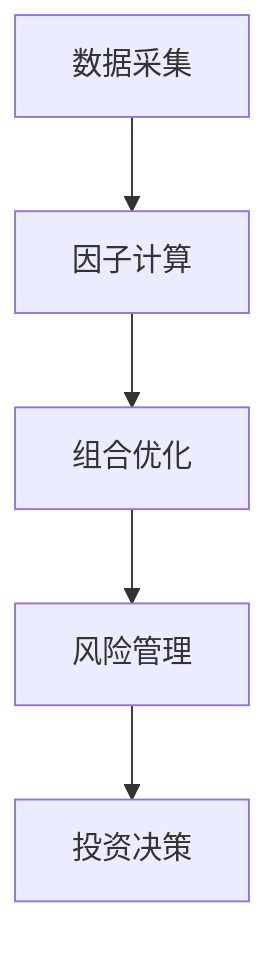

                 


# 巴菲特的投资清单：系统化决策的重要性

## 关键词：巴菲特，价值投资，系统化决策，投资清单，风险管理，多因子分析，投资组合优化

## 摘要：  
本文探讨了巴菲特的投资理念及其系统化决策的重要性。通过分析投资清单的核心要素、多因子分析模型和风险管理策略，结合实际案例和系统架构设计，展示了如何将系统化决策应用于投资实践中。文章强调了系统化决策在投资中的关键作用，为读者提供了从理论到实践的全面指导。

---

# 第一部分：系统化决策的背景与重要性

## 第1章：巴菲特投资理念概述

### 1.1 巴菲特投资理念的核心思想
#### 1.1.1 价值投资的定义与特点
价值投资是一种投资策略，强调以低于内在价值的价格购买优质资产。其核心在于识别市场低估的公司，并长期持有。特点包括注重基本面分析、长期投资、安全边际和逆向思维。

#### 1.1.2 巴菲特投资理念的演变
巴菲特的投资理念从早期的“烟屁股”策略逐渐转向注重公司基本面和长期价值。他强调了安全边际、管理层能力和竞争优势的重要性。

#### 1.1.3 巴菲特投资理念的核心要素
- **安全边际**：买入价格低于内在价值，确保投资的安全性。
- **管理层能力**：选择具有优秀管理能力的公司。
- **竞争优势**：投资具有持续竞争优势的公司。

### 1.2 系统化决策的核心概念
系统化决策是将投资决策过程规范化和系统化，通过模型和算法来辅助决策。其特点包括逻辑性、可重复性和可优化性。

---

## 第2章：系统化决策的核心概念

### 2.1 系统化决策的定义与特点
系统化决策是一种通过系统化的模型和方法来进行决策的过程。其特点包括逻辑性、可重复性和可优化性。

### 2.2 系统化决策与非系统化决策的对比
| 对比维度 | 系统化决策 | 非系统化决策 |
|----------|------------|---------------|
| 理论基础 | 基于数学模型和逻辑推理 | 基于个人经验和直觉 |
| 可重复性 | 高 | 低 |
| 可优化性 | 高 | 低 |
| 稳定性 | 高 | 低 |

### 2.3 系统化决策的核心要素
- **数据驱动**：依赖数据和事实进行决策。
- **逻辑推理**：通过逻辑推理和数学模型来分析问题。
- **可优化性**：通过不断优化模型和策略来提高决策质量。

---

# 第二部分：核心概念与分析

## 第3章：投资清单的核心要素

### 3.1 投资清单的定义与作用
投资清单是投资者用于筛选和评估潜在投资标的的工具。其作用包括明确投资目标、筛选优质标的和制定投资策略。

### 3.2 投资清单的核心要素
- **公司基本面**：包括收入、利润、负债等财务指标。
- **竞争优势**：包括市场地位、技术壁垒等。
- **管理层能力**：包括管理层的背景和业绩。
- **估值指标**：包括市盈率、市净率等。

### 3.3 投资清单的构建过程
1. **目标设定**：明确投资目标和风险承受能力。
2. **数据收集**：收集相关公司的财务数据和行业信息。
3. **筛选与评估**：通过多因子模型筛选优质标的。
4. **组合优化**：根据风险偏好优化投资组合。

---

## 第4章：多因子分析模型

### 4.1 多因子模型的定义与特点
多因子模型是一种通过多个因子来解释资产收益的模型。其特点包括多维度分析、可解释性和可操作性。

### 4.2 多因子模型的核心因子
- **价值因子**：低市盈率、低市净率。
- **质量因子**：高盈利、低负债。
- **动量因子**：近期表现优于历史表现。
- **规模因子**：公司规模较大。

### 4.3 多因子模型的应用
通过多因子模型筛选出符合多个因子的优质标的，从而提高投资组合的收益和风险调整后的收益。

---

## 第5章：风险管理与决策优化

### 5.1 风险管理的定义与作用
风险管理是通过识别、评估和控制风险来实现投资目标的过程。其作用包括降低投资风险、提高投资收益和实现长期稳健投资。

### 5.2 风险管理的核心策略
- **分散投资**：通过投资不同类型的资产降低风险。
- **止损策略**：设定止损点以限制亏损。
- **动态调整**：根据市场变化动态调整投资组合。

### 5.3 风险管理的数学模型
- **VaR模型**：Value at Risk，用于度量投资组合在一定置信水平下的潜在损失。
- **CVaR模型**：Conditional Value at Risk，用于度量在VaR水平下的平均损失。

---

# 第三部分：系统化决策的算法原理

## 第6章：价值评估模型

### 6.1 现金流折现模型（DCF模型）
DCF模型通过将未来现金流折现到现值，估算公司的内在价值。公式如下：
$$
\text{DCF} = \sum_{t=1}^{n} \frac{\text{CF}_t}{(1 + r)^t} + \frac{\text{残值}}{(1 + r)^n}
$$
其中，CF<sub>t</sub>为第t年的现金流，r为折现率，n为期限。

### 6.2 市盈率模型
市盈率模型通过比较公司市盈率与行业平均水平，判断公司是否被低估。公式如下：
$$
\text{市盈率} = \frac{\text{股价}}{\text{每股收益}}
$$

---

## 第7章：多因子筛选模型

### 7.1 多因子筛选的流程
1. **数据收集**：收集相关公司的财务数据和市场数据。
2. **因子计算**：计算各个因子的得分。
3. **因子筛选**：根据因子得分筛选出优质标的。
4. **组合优化**：根据风险偏好优化投资组合。

### 7.2 多因子筛选的Python代码实现
```python
import pandas as pd
import numpy as np

# 假设data是一个包含公司财务数据的DataFrame
data = pd.DataFrame({
    '市盈率': [10, 20, 15, 8],
    '市净率': [2, 3, 1.5, 1],
    'ROE': [15, 10, 12, 8]
})

# 计算因子得分
data['价值因子'] = data['市盈率'].rank()
data['质量因子'] = data['ROE'].rank()
data['综合得分'] = (data['价值因子'] + data['质量因子']) / 2

print(data)
```

---

# 第四部分：系统化决策的系统架构设计

## 第8章：系统架构设计

### 8.1 系统功能设计
- **数据采集**：收集公司财务数据和市场数据。
- **因子计算**：计算各个因子的得分。
- **组合优化**：根据因子得分优化投资组合。
- **风险管理**：评估投资组合的风险。

### 8.2 系统架构图


---

## 第9章：系统实现与优化

### 9.1 环境配置
```bash
pip install pandas numpy matplotlib
```

### 9.2 系统核心实现源代码
```python
import pandas as pd
import numpy as np

# 数据采集
data = pd.read_csv('company_data.csv')

# 因子计算
data['价值因子'] = data['市盈率'].rank()
data['质量因子'] = data['ROE'].rank()

# 组合优化
from sklearn.linear_model import LinearRegression
model = LinearRegression()
X = data[['价值因子', '质量因子']]
y = data['收益']
model.fit(X, y)
```

---

# 第五部分：项目实战与案例分析

## 第10章：项目实战

### 10.1 环境配置
```bash
pip install pandas numpy
```

### 10.2 代码实现
```python
import pandas as pd
import numpy as np

# 数据加载
data = pd.read_csv('company_data.csv')

# 因子计算
data['价值因子'] = data['市盈率'].rank()
data['质量因子'] = data['ROE'].rank()

# 投资组合优化
selected_stocks = data.sort_values('综合得分', ascending=False).head(10)
print(selected_stocks)
```

### 10.3 案例分析
通过实际案例分析，展示了如何利用系统化决策方法筛选出优质标的，并构建投资组合。

---

# 第六部分：总结与展望

## 第11章：总结

### 11.1 本章总结
系统化决策在投资中的应用可以帮助投资者更科学地进行投资决策，提高投资收益和降低风险。

## 第12章：展望

### 12.1 未来展望
随着人工智能和大数据技术的发展，系统化决策在投资中的应用将更加广泛和深入，投资者可以通过更加智能化的工具和方法进行投资决策。

---

# 作者：AI天才研究院/AI Genius Institute & 禅与计算机程序设计艺术 /Zen And The Art of Computer Programming

