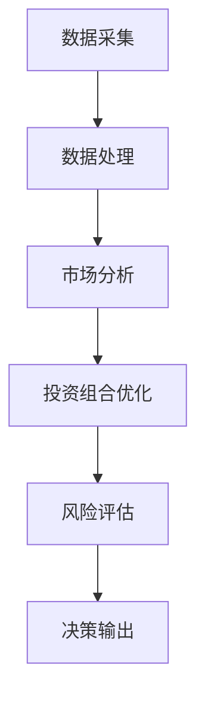

                 


# 巴菲特的投资纪律：耐心和自制力的重要性

## 关键词：巴菲特，投资纪律，耐心，自制力，价值投资，投资策略

## 摘要：本文深入探讨了巴菲特的投资纪律，尤其是耐心和自制力在投资成功中的关键作用。通过分析这些核心要素，结合数学模型和系统架构，文章为读者提供了从理论到实践的全面指导，帮助投资者更好地理解和应用这些纪律。

---

## 第1章：巴菲特的投资理念与纪律

### 1.1 巴菲特的投资哲学

#### 1.1.1 价值投资的定义与核心理念
价值投资是一种以内在价值为导向的投资方法，旨在通过深入分析企业的基本面，寻找被市场低估的投资标的。巴菲特的哲学强调长期投资、安全边际和企业内在价值的计算。

#### 1.1.2 巴菲特投资成功的三大核心要素
1. **能力圈**：专注于自己熟悉的企业和行业。
2. **安全边际**：以低于内在价值的价格买入，确保安全空间。
3. **长期视角**：耐心等待合适的机会，不被短期波动干扰。

#### 1.1.3 投资纪律在巴菲特体系中的地位
投资纪律是巴菲特成功的关键，它包括严格遵守投资原则、坚持长期视角以及在市场恐慌时逆势投资。

---

## 第2章：耐心与自制力的核心概念

### 2.1 耐心的哲学与心理学分析

#### 2.1.1 耐心的哲学意义
耐心是一种美德，它使投资者能够在市场波动中保持冷静，避免冲动决策。巴菲特定义：耐心是等待好机会的能力，而不是等待机会的能力。

#### 2.1.2 耐心的心理学特征
- 耐心需要强大的心理韧性。
- 耐心与情绪管理密切相关，能够减少因恐惧或贪婪导致的错误决策。

#### 2.1.3 耐心与投资决策的关系
耐心使投资者能够在市场低迷时坚持持有优质资产，避免在恐慌中割肉，从而捕捉长期收益。

### 2.2 自制力的定义与属性

#### 2.2.1 自制力的定义
自制力是指在面对诱惑或压力时，能够控制自己的行为，做出理性决策的能力。

#### 2.2.2 自制力的核心特征对比表
| 特征 | 自制力 | 缺乏自制力 |
|------|--------|------------|
| 行为控制 | 能够抑制冲动 | 容易被情绪驱动 |
| 决策质量 | 理性决策 | 可能犯错决策 |
| 长期效果 | 稳定收益 | 不稳定或亏损 |

#### 2.2.3 自制力的ER实体关系图
```mermaid
erDiagram
    actor 投资者 {
        <PrimaryKey> string 投资ID
        string 知识
        string 经验
    }
    concept 投资决策 {
        <PrimaryKey> string 决策ID
        string 决策内容
        string 决策时间
    }
    relation 实现 {
        投资者 -> 投资决策 : 制定
    }
```

---

## 第3章：耐心与自制力的数学模型

### 3.1 耐心的数学模型

#### 3.1.1 耐心的量化公式
耐心可以通过时间窗口来量化，公式为：
$$ \text{耐心} = \frac{\text{目标投资期限}}{\text{当前投资周期}} $$

#### 3.1.2 耐心与投资回报的关系
长期耐心投资的回报可以用几何平均回报率来衡量，公式为：
$$ R_{\text{几何}} = \left( \prod_{i=1}^{n} (1 + R_i) \right)^{1/n} - 1 $$

#### 3.1.3 耐心的数学推导与实例分析
假设投资回报率为10%（年化），经过10年投资，几何平均回报率为：
$$ R_{\text{几何}} = \left( (1 + 0.1)^{10} \right)^{1/10} - 1 \approx 0.1 $$

---

## 第4章：系统分析与架构设计

### 4.1 投资决策系统的场景介绍

#### 4.1.1 投资决策系统的定义
投资决策系统是一种辅助投资者做出理性决策的工具，结合数据分析和算法模型。

#### 4.1.2 投资决策系统的功能需求
- 数据采集与处理
- 市场分析与预测
- 投资组合优化
- 风险评估与控制

#### 4.1.3 投资决策系统的边界与外延
系统不直接进行交易，但提供决策支持。

### 4.2 投资决策系统的架构设计

#### 4.2.1 系统架构的模块划分


#### 4.2.2 系统架构的Mermaid架构图


#### 4.2.3 系统接口的设计与交互
接口设计包括数据接口和用户接口，确保系统与外部数据源和用户交互的高效性。

---

## 第5章：项目实战与案例分析

### 5.1 投资决策系统的环境安装

#### 5.1.1 系统运行环境要求
- 操作系统：Windows/Mac/Linux
- 开发工具：Python 3.8+
- 数据库：MySQL/PostgreSQL
- 库依赖：Pandas, NumPy, Matplotlib

#### 5.1.2 开发工具的安装与配置
安装Python和相关库，配置开发环境。

#### 5.1.3 数据源的获取与处理
使用Yahoo Finance API获取历史数据，清洗和预处理。

### 5.2 投资决策系统的核心实现

#### 5.2.1 系统功能模块的实现代码
```python
import pandas as pd
import numpy as np

def calculate_patience(target_period, current_period):
    return target_period / current_period

def calculate_return(returns):
    geometric_mean = np.prod(1 + returns) ** (1/len(returns)) - 1
    return geometric_mean

# 示例数据
returns = [0.1, 0.1, 0.1, 0.1, 0.1]
patience = calculate_patience(10, 5)
print(f"耐心系数: {patience}")
print(f"几何平均回报率: {calculate_return(returns)}")
```

#### 5.2.2 代码的功能解读与分析
上述代码计算耐心系数和几何平均回报率，展示如何量化耐心和评估投资回报。

#### 5.2.3 投资决策系统的实际案例分析
以苹果公司为例，分析其长期投资价值，展示如何通过耐心和自制力捕捉投资机会。

---

## 第6章：最佳实践与小结

### 6.1 投资纪律的实践技巧

#### 6.1.1 耐心与自制力的培养方法
- 设定明确的投资目标
- 定期复盘和调整
- 坚持学习和提升

#### 6.1.2 投资纪律的注意事项
- 避免过度交易
- 保持对市场的敬畏
- 坚持长期视角

#### 6.1.3 投资纪律的拓展阅读建议
推荐阅读巴菲特的《聪明的投资者》和彼得·林奇的《投资之道》。

---

## 总结

巴菲特的投资纪律，尤其是耐心和自制力，是投资成功的核心要素。通过系统的分析和实践，投资者可以更好地理解和应用这些纪律，实现长期稳健的投资回报。

---

## 作者：AI天才研究院/AI Genius Institute & 禅与计算机程序设计艺术 /Zen And The Art of Computer Programming

