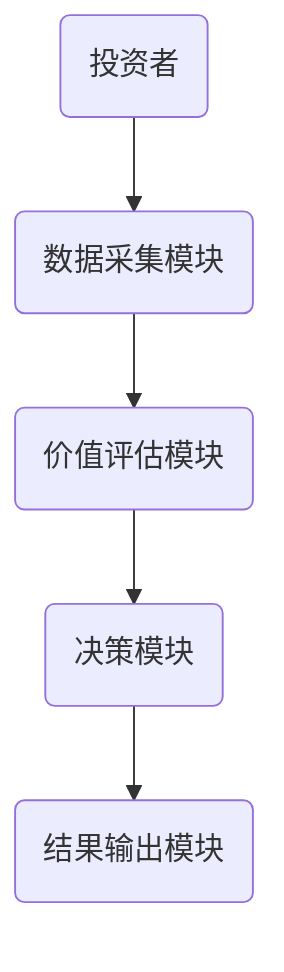

                 


# 巴菲特的投资纪律：耐心和自制的重要性

## 关键词：巴菲特，投资纪律，耐心，自制，价值投资，长期思维

## 摘要：本文深入分析了巴菲特的投资纪律，特别是耐心和自制的重要性。通过技术化的分析和图表，展示了价值投资的核心要素、数学模型和系统架构，结合实际案例，总结了投资中的最佳实践和注意事项。

---

## 第一部分：引言

### 第1章：投资的基本概念

#### 1.1 投资的定义与分类
- **投资的定义**：投资是将资源（如资金）投入到某个项目或资产中，以期在未来获得收益的行为。
- **投资的类型**：包括股票、债券、房地产等多种形式。
- **投资的基本原则**：分散投资、长期持有、价值评估。

#### 1.2 巴菲特的背景与投资哲学
- **生平简介**：沃伦·巴菲特，生于1930年，美国著名投资者，伯克希尔·哈撒韦公司董事长。
- **投资理念**：价值投资，寻找具有持续竞争优势的企业，长期持有。
- **成功案例**：投资可口可乐、IBM、苹果等企业，长期持有，获得稳定收益。

---

## 第二部分：巴菲特的投资纪律

### 第2章：耐心的重要性

#### 2.1 耐心在投资中的作用
- **长期投资的价值**：耐心使投资者能够在市场波动中坚持，避免短期亏损。
- **耐心与市场波动的关系**：市场短期波动，但长期趋势由企业价值决定。
- **长期视角的策略**：选择优秀企业，等待合适价格买入，长期持有。

### 第3章：自制的实践

#### 3.1 自制在投资决策中的作用
- **避免情绪化决策**：市场恐慌时保持冷静，避免抛售。
- **理性分析的重要性**：基于数据和逻辑，而非市场情绪做出决策。
- **培养长期思维**：抵制短期诱惑，专注于长期目标。

---

## 第三部分：投资策略与决策模型

### 第4章：价值投资的核心要素

#### 4.1 价值投资的定义与特征
- **定义**：购买低于其内在价值的股票，长期持有，获得收益。
- **核心要素**：企业财务状况、竞争优势、管理团队、行业地位。
- **与成长投资的对比**：
  | 方面 | 价值投资 | 成长投资 |
  |------|----------|----------|
  | 目标 | 低估企业 | 高增长企业 |
  | 风险 | 较低 | 较高 |

### 第5章：投资决策的数学模型

#### 5.1 内在价值的计算
- **公式**：内在价值 = 未来现金流的现值
- **计算步骤**：
  1. 预测未来现金流。
  2. 确定合适的折现率。
  3. 计算现值。
- **案例分析**：假设一家企业未来5年的现金流分别为100、120、140、160、180万元，折现率为10%。计算其内在价值。

#### 5.2 投资决策的数学模型
- **公式**：
  内在价值 = Σ(现金流 / (1 + r)^t)
  其中，r为折现率，t为时间。

---

## 第四部分：系统分析与架构设计

### 第6章：系统分析

#### 6.1 问题场景介绍
- **目标**：建立一个投资决策支持系统，帮助投资者做出基于价值投资的决策。

#### 6.2 系统功能设计
- **模块划分**：
  - 数据采集模块：收集企业财务数据。
  - 价值评估模块：计算内在价值。
  - 投资决策模块：基于评估结果做出决策。

#### 6.3 系统架构设计


---

## 第五部分：项目实战

### 第7章：项目实战

#### 7.1 环境设置
- **工具**：Excel、Python（用于数据处理和建模）。
- **数据来源**：公开企业财报、行业报告。

#### 7.2 核心实现
- **Python代码**：
  ```python
  def calculate_intrinsic_value(cash_flows, discount_rate):
      present_value = 0
      for t, cash_flow in enumerate(cash_flows):
          present_value += cash_flow / (1 + discount_rate) ** t
      return present_value
  
  cash_flows = [100, 120, 140, 160, 180]
  discount_rate = 0.10
  iv = calculate_intrinsic_value(cash_flows, discount_rate)
  print(f"内在价值为：{iv}")
  ```

#### 7.3 案例分析
- **案例**：评估一家企业的内在价值。
- **结果解读**：比较内在价值与当前股价，决定是否投资。

---

## 第六部分：最佳实践与总结

### 第8章：最佳实践

#### 8.1 总结
- **耐心**：长期持有优质资产，避免短期波动影响决策。
- **自制**：理性分析，避免情绪化决策。

#### 8.2 注意事项
- **心态管理**：保持耐心，避免贪婪和恐惧。
- **分散投资**：降低风险，避免过度集中。
- **持续学习**：更新知识，适应市场变化。

#### 8.3 拓展阅读
- 书籍推荐：《巴菲特传》、《价值投资实战》。
- 资源推荐：巴菲特股东大会演讲、投资分析工具。

---

## 作者：AI天才研究院/AI Genius Institute & 禅与计算机程序设计艺术 /Zen And The Art of Computer Programming

---

这篇文章通过技术化的分析和图表，深入探讨了巴菲特的投资纪律，特别是耐心和自制的重要性。通过数学模型和系统架构设计，展示了投资决策的科学性。结合实际案例和最佳实践，帮助读者在投资中应用这些原则，实现长期稳定的收益。

