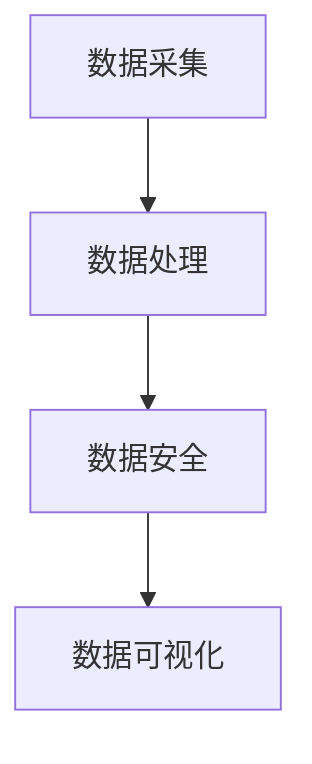

                 


# 巴菲特的护城河理论5.0：数据主权时代的竞争优势

> 关键词：护城河理论、数据主权、竞争优势、企业价值、巴菲特投资策略、数据资产

> 摘要：本文将巴菲特的护城河理论升级到5.0版本，结合数据主权时代的新背景，分析数据资产对企业竞争优势的核心影响。通过详细的技术分析和实际案例，探讨如何在数据主权时代构建企业的持久竞争优势。

---

## 第一部分：背景介绍

### 第1章：护城河理论的历史演变

#### 1.1 护城河理论的起源与核心思想
巴菲特在投资理论中提出了“护城河”概念，认为企业通过构建持久的竞争优势，可以在市场中长期保持领先地位。护城河的四大核心要素包括：
1. **成本优势**：企业通过规模经济或技术创新降低成本。
2. **品牌优势**：强大的品牌影响力吸引客户。
3. **网络效应**：用户越多，企业价值越高。
4. **专利与法律保护**：通过知识产权保护竞争优势。

#### 1.2 理论的迭代与升级
护城河理论从1.0版本到5.0版本，逐步从单一的经济视角扩展到数据驱动的多维度分析：
- **护城河2.0**：引入了技术和创新作为核心竞争力。
- **护城河3.0**：将品牌影响力和客户忠诚度纳入护城河的构建。
- **护城河4.0**：开始关注数据资产对企业价值的影响。
- **护城河5.0**：在数据主权时代，将数据资产的控制权和安全性作为护城河的核心要素。

#### 1.3 数据主权时代的护城河5.0
数据主权是指数据的所有权、使用权和控制权归属于数据的拥有者。在数据主权时代，数据资产成为企业的核心竞争力，护城河理论需要重新定义竞争优势。

---

## 第二部分：数据主权与护城河理论5.0的核心概念

### 第2章：数据主权的定义与特征

#### 2.1 数据主权的多维度分析
数据主权涉及法律、技术和经济三个维度：
1. **法律维度**：数据的法律归属和合规性。
2. **技术维度**：数据的存储、处理和传输的安全性。
3. **经济维度**：数据的商业价值和盈利能力。

#### 2.2 数据主权与护城河的关系
数据主权是护城河5.0的核心要素，数据资产的控制权直接决定了企业的竞争优势。企业需要通过数据主权的保护，构建持久的竞争壁垒。

### 第3章：护城河5.0的核心要素

#### 3.1 核心要素的识别与分析
护城河5.0的核心要素包括：
1. **数据资产**：数据的规模、质量和可用性。
2. **数据主权**：数据的控制权和安全性。
3. **技术优势**：数据处理和分析的技术能力。
4. **用户粘性**：通过数据驱动的用户体验提升客户忠诚度。

#### 3.2 核心概念的联系
通过以下表格展示核心概念的属性对比：

| 要素       | 属性               | 描述                                   |
|------------|--------------------|----------------------------------------|
| 数据资产   | 规模               | 数据量越大，竞争优势越强             |
|            | 质量               | 数据准确性越高，商业价值越大           |
| 数据主权   | 控制权             | 数据所有权和使用权                     |
|            | 安全性             | 数据保护能力                         |
| 技术优势   | 处理能力           | 数据分析和处理的技术能力               |
|            | 创新能力           | 数据驱动的技术创新能力                 |
| 用户粘性   | 体验               | 数据驱动的用户体验提升                 |
|            | 忠诚度             | 用户对企业的依赖性                     |

---

## 第三部分：算法原理

### 第4章：护城河5.0的评估模型

#### 4.1 护城河指数的计算公式
护城河指数（H-Ratio）用于评估企业的竞争优势，公式如下：

$$
H = \frac{D \times S}{C}
$$

其中：
- \( D \) 是数据资产的规模。
- \( S \) 是数据主权的保护能力。
- \( C \) 是竞争对手的护城河指数。

#### 4.2 数据资产的评估算法
通过以下步骤评估数据资产的价值：
1. 数据清洗：去除无效数据。
2. 数据分析：计算数据的准确性和完整性。
3. 数据评分：根据数据的质量和价值进行评分。

---

## 第四部分：系统分析与架构设计

### 第5章：数据主权时代的系统架构

#### 5.1 系统功能设计
系统功能模块包括：
1. 数据采集模块：收集企业数据。
2. 数据处理模块：清洗和分析数据。
3. 数据安全模块：保护数据主权。
4. 数据可视化模块：展示数据价值。

#### 5.2 系统架构图
使用Mermaid绘制系统架构图：



---

## 第五部分：项目实战

### 第6章：护城河5.0的项目实现

#### 6.1 环境安装
安装必要的工具和库：
1. Python 3.8+
2. 数据处理库：Pandas、NumPy
3. 数据可视化库：Matplotlib、Seaborn

#### 6.2 核心代码实现
以下是护城河指数计算的Python代码：

```python
import pandas as pd
import numpy as np

def calculate_h_ratio(data, competitor_ratio):
    D = len(data)
    S = data['quality'].mean()
    H = (D * S) / competitor_ratio
    return H

# 示例数据
data = pd.DataFrame({
    'quality': [0.9, 0.8, 0.7, 0.6]
})
competitor_ratio = 0.8

h_ratio = calculate_h_ratio(data, competitor_ratio)
print(f"护城河指数：{h_ratio}")
```

---

## 第六部分：最佳实践

### 第7章：护城河5.0的实施策略

#### 7.1 关键成功因素
1. 数据资产的保护。
2. 技术能力的提升。
3. 用户体验的优化。

#### 7.2 注意事项
- 数据主权的保护需要法律和技术的双重保障。
- 数据资产的评估需要结合企业的实际业务需求。

#### 7.3 拓展阅读
建议阅读相关书籍：
- 《巴菲特的护城河》
- 《数据主权与企业竞争优势》

---

## 第七部分：小结

护城河5.0在数据主权时代为企业提供了新的竞争优势构建方式。通过数据资产的保护、技术能力的提升和用户体验的优化，企业可以在激烈的市场竞争中立于不败之地。

---

作者：AI天才研究院 & 禅与计算机程序设计艺术

